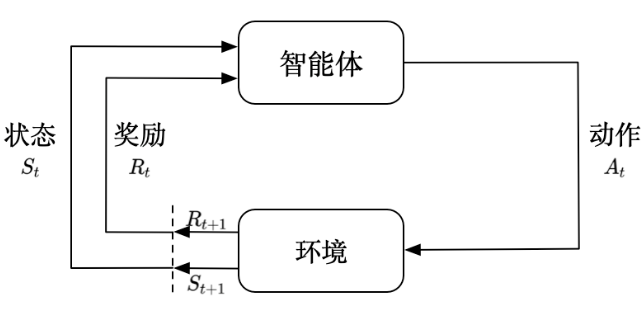

# 强化学习

## 强化学习概述

**强化学习(reinforcement learning，RL)** 讨论的问题是智能体(agent)怎么在复杂、不确定的环境(environment)中最大化它能获得的奖励。

强化学习由两部分组成：智能体和环境。

在强化学习过程中，智能体与环境一直在交互。智能体在环境中获取某个状态后，它会利用该状态输出一个动作(action)，这个动作也称为决策(decision)。然后这个动作会在环境中被执行，环境会根据智能体采取的动作，输出下一个状态以及当前这个动作带来的奖励。

智能体的目的就是尽可能多地从环境中获取奖励。 

## 强化学习与监督学习

### 监督学习

**监督学习(supervised learning)** 假设有大量被标注的数据，比如汽车、飞机、椅子这些被标注的图片，这些图片都要满足独立同分布，即它们之间是没有关联关系的。

假设训练一个分类器，比如神经网络。为了分辨输入的图片中是汽车还是飞机，在训练过程中，需要把正确的标签信息传递给神经网络。 当神经网络做出错误的预测时，比如输入汽车的图片，它预测出来是飞机，就会直接告诉它，该预测是错误的，正确的标签应该是汽车。

最后根据类似错误写出一个损失函数(loss function)，通过反向传播(back propagation)来训练神经网络。 

监督学习过程中，由两个假设：

- 输入的数据(标注的数据)都应是没有关联的。因为如果输入的数据有关联，学习器(learner)是不好学习的。
- 需要告诉学习器正确的标签是什么，这样它可以通过正确的标签来修正自己的预测。

通常假设样本空间中全体样本服从一个未知分布，获得的每个样本都是独立地从这个分布上采样获得的。

即独立同分布(independent and identically distributed，简称 i.i.d.)。 

**强化学习之所以困难，是因为智能体不能得到即时的反馈，然而依然希望智能体在这个环境中学习**

强化学习的训练数据就是一个玩游戏的过程。

1、第 1 步开始，采取一个动作，比如把木板往右移，接到球。

2、第 2 步又做出动作，得到的训练数据是一个玩游戏的序列。

3、第 3 步把这个序列放进网络，希望网络可以输出一个动作，即在当前的状态应该输出往右移或往左移。

这里有个问题，没有标签来说明现在这个动作是正确还是错误的，必须等到游戏结束才可能知道，这个游戏可能 10s 后才结束。现在这个动作到底对最后游戏是否能赢有无帮助，其实是不清楚的。

这里就面临 **延迟奖励(delayed reward)** 的问题，延迟奖励使得训练网络非常困难。 

## 强化学习与监督学习的区别

1、强化学习输入的样本是 **序列数据** ，而不像监督学习里面样本都是独立的。

2、学习器并没有告诉每一步正确的动作应该是什么，学习器需要自己去发现哪些动作可以带来最多的奖励，只能通过不停地尝试来发现最有利的动作。

3、智能体获得自己能力的过程，其实是不断地试错探索(trial-and-error exploration)的过程。**探索(exploration)** 和 **利用(exploitation)**是强化学习里面非常核心的问题。

探索指尝试一些新的动作， 这些新的动作有可能会使得到更多的奖励，也有可能使我们“一无所有”；利用指采取已知的可以获得最多奖励的动作，重复执行这个动作，因为我们知道这样做可以获得一定的奖励。

因此，需要在探索和利用之间进行权衡，这也是在监督学习里面没有的情况。

4、在 **强化学习** 过程中，没有非常强的 **监督者(supervisor)** ，只有 **奖励信号(reward signal)**，并且奖励信号是延迟的，即环境会在很久以后告诉之前采取的动作到底是不是有效的。因为没有得到即时反馈，所以智能体使用强化学习来学习就非常困难。

当采取一个动作后，如果使用监督学习，就可以立刻获得一个指导，比如，现在采取了一个错误的动作，正确的动作应该是什么。

而在强化学习里面，环境可能会告诉这个动作是错误的，但是它并没有告诉正确的动作是什么。而且更困难的是，它可能是在一两分钟过后告诉这个动作是错误的。所以这也是强化学习和监督学习不同的地方。

## 强化学习特征

1、强化学习会试错探索，它通过探索环境来获取对环境的理解。

2、强化学习智能体会从环境里面获得延迟的奖励。

3、在强化学习的训练过程中，时间非常重要。因为得到的是 **有时间关联的数据(sequential data)** ， 而不是独立同分布的数据。在 **机器学习** 中，如果观测数据有非常强的关联，会使得训练非常不稳定。这也是为什么在监督学习中，希望数据尽量满足独立同分布，这样就可以消除数据之间的相关性。

4、智能体的动作会影响它随后得到的数据，这一点是非常重要的。在训练智能体的过程中，很多时候也是通过正在学习的智能体与环境交互来得到数据的。所以如果在训练过程中，智能体不能保持稳定，就会使采集到的数据非常糟糕。通过数据来训练智能体，如果数据有问题，整个训练过程就会失败。所以在强化学习里面一个非常重要的问题就是，怎么让智能体的动作一直稳定地提升。

## 强化学习案例

强化学习得到的模型可以有超人类的表现。 监督学习获取的监督数据，其实是人来标注的，比如 ImageNet 的图片的标签都是人类标注的。因此可以确定监督学习算法的上限（upper bound）就是人类的表现，标注结果决定了它的表现永远不可能超越人类。  **对于强化学习，它在环境里面自己探索，有非常大的潜力，它可以获得超越人类的能力的表现。** 比如 DeepMind 的 AlphaGo 这样一个强化学习的算法可以把人类顶尖的棋手打败。 

现实生活中的案例：

1、在自然界中，羚羊其实也在做强化学习。它刚刚出生的时候，可能都不知道怎么站立，然后它通 过试错，一段时间后就可以跑得很快，可以适应环境。

2、把股票交易看成强化学习的过程。可以不断地买卖股票，然后根据市场给出的反馈来学会怎么去买卖可以让奖励最大化。

3、玩雅达利游戏或者其他电脑游戏，也是一个强化学习的过程，可通过不断试错知道怎么玩才可以通关。

强化学习的一个经典例子，即雅达利的 Pong 游戏。游戏中右边的选手把球拍到左边， 然后左边的选手需要把球拍到右边。训练好的强化学习智能体和正常的选手有区别：强化学习的智能体会一直做无意义的振动，而正常的选手不会做出这样的动作。 

在 Pong 游戏里面，其实只有两个动作：往上或者往下。如果强化学习通过学习一个策略网络来进行分类，那么策略网络会输入当前帧的图片，输出所有决策的可能性，比如往上移动的概率。 

对于监督学习，可以直接告诉智能体正确动作的标签是什么。但在 Pong 游戏中， 并不知道它的正确动作的标签是什么。 

在强化学习里面，让智能体尝试玩 Pong 游戏，对动作进行采样，直到游戏结束，然后对每个动作进行惩罚。预演(rollout)的一个过程。

预演是指从当前帧对动作进行采样，生成很多局游戏。将当前的智能体与环境交互，会得到一系列观测。每一个观测可看成一个轨迹(trajectory)。 轨迹就是当前帧以及它采取的策略，即状态和动作的序列： 

最后结束时，会知道到底有没有把这个球拍到对方区域，对方有没有接住，是赢了还是输了。可以通过观测序列以及最终奖励(eventual reward)来训练智能体，使它尽可能地采取可以获得最终奖励的动作。一场游戏称为一个 **回合(episode)** 或者 **试验(trial)** 。 

## 强化学习历史

强化学习是有一定历史的，早期的强化学习称为“标准强化学习”，业界将强化学习与深度学习结合起来，形成了深度强化学习(deep reinforcement learning)。

深度强化学习= 深度学习 + 强化学习

可将标准强化学习和深度强化学习类比与传统的计算机视觉和深度计算机视觉。

## 传统计算机视觉

传统计算机视觉由两个过程组成：

1、给定一张图片，先要提取它的特征，使用一些设计好的特征，比如方向梯度直方图(histogram of oriental gradient，HOG)、可变现的组件模型(deformable part model，DPM)。

2、提取这些特征后，再单独训练一个分类器。这个分类器可以是支持向量机(support vector machine，SVM)或 Boosting，然后就可以辨别这张图片是狗还是猫。

## 神经网络-> 强化学习

1、标准强化学习：

比如 TD-Gammon 玩 Backgammon 游戏的过程，其实就是设计特征，然后训练价值函数的过程。标准强化学习先设计很多特征，这些特征可以描述现在整个状态。 得到这些特征后，可通过训练一个分类网络或者分别训练一个价值估计函数来采取动作。

2、深度强化学习：

自从有了深度学习，有了神经网络，就可以把智能体玩游戏的过程改进成一个端到端训练(end-to-end training)的过程。不需要设计特征，直接输入状 态就可以输出动作。可以用一个神经网络来拟合价值函数或策略网络，省去特征工程(feature engineering)的过程。

## 强化学习应用

为什么强化学习在这几年有很多的应用，比如玩游戏以及机器人的一些应用，并且可以击败人类的顶 尖棋手呢？这有如下几点原因。

1、首先有了更多的算力(computation power)，有了更多的 GPU，可 以更快地做更多的试错尝试。

2、其次，通过不同尝试，智能体在环境里面获得了很多信息，然后可以在环境里面取得很大的奖励。

3、最后，通过端到端训练把特征提取和价值估计或者决策一起优化，可得到一个更强的决策网络。 

###  强化学习应用案例

1、[DeepMind 研发的走路的智能体](https://www.youtube.com/watch?v=gn4nRCC9TwQ)。这个智能体往前走一步，就会得到一个奖励。这个智能体有不 同的形态，可以学到很多有意思的功能。比如，像人一样的智能体学习怎么在曲折的道路上往前走。结 非常有意思，这个智能体会把手举得非常高，因为举手可以让它的身体保持平衡，它就可以更快地在环境 里面往前走。而且我们也可以增加环境的难度，加入一些扰动，智能体就会变得更鲁棒。

2、[机械臂抓取](https://ai.googleblog.com/2016/03/deep-learning-for-robots-learning-from.html)。因为我们把强化学习应用到机械臂自动抓取需要大量的预演，所以我们可以使用多 个机械臂进行训练。分布式系统可以让机械臂尝试抓取不同的物体，盘子里面物体的形状是不同的，这样 就可以让机械臂学到一个统一的动作，然后针对不同的抓取物都可以使用最优的抓取算法。因为抓取的物 体形状的差别很大，所以使用一些传统的抓取算法不能把所有物体都抓起来。传统的抓取算法对每一个物 体都需要建模，这样是非常费时的。但通过强化学习，我们可以学到一个统一的抓取算法，其适用于不同 的物体。

3、[OpenAI 的机械臂翻魔方](https://www.youtube.com/watch?v=jwSbzNHGflM)。OpenAI 在 2018 年的时候设计了一款带有“手指”的机械臂，它可以 通过翻动手指使得手中的木块达到预期的设定。人的手指其实非常灵活，怎么使得机械臂的手指也具有这 样灵活的能力一直是个问题。OpenAI 先在一个虚拟环境里面使用强化学习对智能体进行训练，再把它应 用到真实的机械臂上。这在强化学习里面是一种比较常用的做法，即我们先在虚拟环境里面得到一个很好 的智能体，然后把它应用到真实的机器人中。这是因为真实的机械臂通常非常容易坏，而且非常贵，一般 情况下没办法大批量地购买。OpenAI 在 2019 年对其机械臂进行了进一步的改进，这个机械臂在改进后 可以玩魔方了。

4、[穿衣服的智能体](https://www.youtube.com/watch?v=ixmE5nt2o88)。很多时候我们要在电影或者一些动画中实现人穿衣服的场景，通过手写执行命 令让机器人穿衣服非常困难，穿衣服也是一种非常精细的操作。我们可以训练强化学习智能体来实现穿衣 服功能。我们还可以在里面加入一些扰动，智能体可以抵抗扰动。可能会有失败的情况（failure case）出 现，这样智能体就穿不进去衣服。

## 序列决策

### 智能体与环境

强化学习研究的问题是智能体与环 境交互的问题，左边的智能体一直在与右边的环境进行交互。

智能体把它的动作输出给环境，环境取得这个动作后会进行下一步，把下一步的观测与这个动作带来的奖励返还给智能体。这样的交互会产生很多观测，智能体的目的是从这些观测之中学到能最大化奖励的策略。 

### 奖励

奖励是由环境给的一种标量的反馈信号(scalar feedback signal)，该信号显示智能体在某一布采取某个策略的表现如何。**而强化学习的目的就是最大化智能体可以获得的奖励，智能体在环境里面存在的目的就是最大化它的期望和累计奖励(expcted cumulative reward)**

### 序列决策

在一个强化学习环境里面，智能体的 **目的** 就是选取一系列的动作来最大化奖励，所以这些选取的动作必须有长期的影响。但在这个过程里面，智能体的奖励其实是被延迟了的，就是现在选取的某一步动作，可能要等到很久后才知道这一步到底产生了什么样的影响。 

### 状态与观测

状态：状态是对世界的完整描述，不会隐藏世界的信息。

观测：观测是对状态的部分描述，可能会遗漏一些信息。

在深度强化学习中，总是用实值的向量、矩阵或者更高阶的张量来表示状态和观测。例如， 可以用 RGB 像素值的矩阵来表示一个视觉的观测，可以用机器人关节的角度和速度来表示一个机器 人的状态。 

环境有自己的函数*s**t**e*=*f* *e*(*H* *t*) 来更新状态，在智能体的内部也有一个函数  *s* *t* *a* =*f* *a*(*H* *t*)来更新状 态。当智能体的状态与环境的状态等价的时候，即当智能体能够观察到环境的所有状态时，称这个环 境是完全可观测的(fully observed)。

在这种情况下面，强化学习通常被建模成一个马尔可夫决策过程(Markov decision process，MDP)的问题。在马尔可夫决策过程中，*o* *t*=*s* *t* *e* = *s* *t* *a*。 

有一种情况是智能体得到的观测并不能包含环境运作的所有状态，因为在强化学习的设定里面， 环境的状态才是真正的所有状态。

比如智能体在玩 black jack 游戏，它能看到的其实是牌面上的牌。或者在玩雅达利游戏的时候，观测到的只是当前电视上面这一帧的信息，并没有得到游戏内部里面所有的运作状态。也就是当智能体只能看到部分的观测，就称这个环境是 **部分可观测的(partially observed)** 。 

在这种情况下，强化学习通常被建模成部分可观测马尔可夫决策过程（partially observable Markov decision process, POMDP）的问题。部分可观测马尔可夫决策过程是马尔可夫决策过程的一种泛化。 部分可观测马尔可夫决策过程依然具有马尔可夫性质，但是假设智能体无法感知环境的状态，只能知道 部分观测值。比如在自动驾驶中，智能体只能感知传感器采集的有限的环境信息。部分可观测马尔可夫决策过程可以用一个七元组描述：(*S*,*A*,*T*,*R*,Ω,*O*,*γ*)。其中 S*S* 表示状态空间，为隐变量，A*A* 为动作空间，(*s*′∣*s*,*a*) 为状态转移概率，*R* 为奖励函数，Ω(*o*∣*s*,*a*) 为观测概率，*O* 为观测，**γ** 为折扣系数。 

### 动作空间

动作空间：在给定的环境中，有效集合称为动作空间(action space)

像雅达利游戏和围棋（Go）这样的环境有离散动作空间（discrete action space），在这个动作 空间里，智能体的动作数量是有限的。在其他环境，比如在物理世界中控制一个智能体，在这个环境中就有连续动作空间（continuous action space）。在连续动作空间中， **动作是实值的向量** 。

例如，走迷宫机器人如果只有往东、往南、往西、往北这 4 种移动方式，则其动作空间为离散动作空间；如果机器人可以向 360 ◦ 中的任意角度进行移动，则其动作空间为连续动作空间。

## 智能体成分和类型

强化学习智能体的组成成分和类型：

**部分可观测马尔可夫决策过程(Partially Observable Markov Decision Processes, POMDP)** 是一个马尔可夫决策过程的泛化。

POMDP 依然具对于一个强化学习 agent，它可能有一个或多个如下的组成成分：对于一个强化学习智能体，它可能有一个或多个如下的组成成分。

### 策略

策略(policy): 智能体会用策略来选取下一步动作。

### 价值函数

价值函数(value function): 用价值函数来对当前状态进行评估，价值函数用于评估某个智能体进入某个状态后，可对之后的奖励带来多大的影响。

**价值函数值越大，说明智能体进入这个状态越有利。**

### 模型

模型(model): 模型表示智能体对环境的状态进行理解，它决定了环境中世界的运行方式。

## 策略

策略是智能体的动作模型，它决定了智能体的动作。它其实就是一个函数，用于将输入的状态变成动作。

策略分为两种：

1、随机性策略

2、确定性策略

### 随机性策略

随机性策略(stochastic policy): 

就是Π函数， 即*π*(*a*∣*s*)=*p*(*a* *t*=*a*∣*s* *t*=*s*)。输入一个状态 *s*，输出一个概率。 概率是智能体所有动作的概率，然后对这个概率分布进行采样，可得到智能体将采取的动作。

比如可能是有 0.7 的概率往左，0.3 的概率往右，那么通过采样就可以得到智能体将采取的动作。 

### 确定性策略

确定性策略(deterministic policy):

智能体直接采取最有可能的动作，即  *a*∗=*a*argmax*π*(*a*∣*s*)。 

 从雅达利游戏来看，策略函数的输入就是游戏的一帧，它的输出决定智能体向左移动或者向右移动。 

通常情况下，强化学习一般使用随机性策略，随机性策略有很多优点。比如，在学习时可以通过引入一定的随机性来更好地探索环境； 随机性策略的动作具有多样性，这一点在多个智能体博弈时非常重要。采用确定性策略的智能体总是对同样的状态采取相同的动作，这会导致它的策略很容易被对手预测。 

### 价值函数

价值函数: 价值函数的值用于对未来奖励进行预测，根据它来对评估状态的好坏。

价值函数里有一个**折扣因子(discount factor)**

希望在尽可能短的时间里面得到尽可能多的奖励。

比如现在给两个选择：

1、10天后给100块钱或者现在给我们100块钱。

2、肯定更希望现在就给我们00 块钱，因为可以把这 100 块钱存在银行里面，这样就会有一些利息。

因此，可以把折扣因子放到价值函数的定义里面，价值函数的定义为 

期望E*π* 的下标是 *π* 函数，*π* 函数的值可反映在我们使用策略 *π* 的时候，到底可以得到多少奖励。

还有一种价值函数：Q 函数。Q 函数里面包含两个变量：状态和动作。其定义为

所以未来可以获得奖励的期望取决于当前的状态和当前的动作。Q 函数是强化学习算法里面要学习的一个函数。因为当得到 Q 函数后，进入某个状态要采取的最优动作可以通过 Q 函数得到。 

### 模型

模型: 模型决定了下一步的状态。下一步的状态取决于当前的状态以及当前采取的动作。

它由状态转移概率和奖励函数两个部分组成:

1、状态转移概率

2、奖励函数

奖励函数：指在当前状态采取了某个动作，可得到最大的奖励

策略、价值函数和模型3个组成部分后，就形成了一个**马尔可夫决策过程（Markov decision process）**。这个决策过程可视化了状态之间的转移以及采取的动作。 

**走迷宫**

要求智能体从起点（start）开始，然后到达终点（goal）的位置。每走一步，就会得到 -−1 的奖励。可以采取的动作是往上、下、左、右走。用现在智能体所在的位置来描述当前状态。 

用不同的强化学习方法来解这个环境。 如果采取基于策略的强化学习（policy-based RL）方法，当学习好了这个环境后，在每一个状态，都会得到一个最佳的动作。比如现在在起点位置，知道最佳动作是往右走；在第二格的时候，得到的最佳动作是往上走；第三格是往右走......通过最佳的策略，可以最快地到达终点。

如果换成基于价值的强化学习（value-based RL）方法，利用价值函数作为导向，就会得到另外一种表征，每一个状态会返回一个价值。比如在起点位置的时候，价值是 -−16，因为最快可以 16 步到达终点。因为每走一步会减1，所以这里的价值是 -−16。 当快接近终点的时候，这个数字变得越来越大。在拐角的时候，比如现在在第二格，价值是-−15，智能体会看上、下两格，它看到上面格子的价值变大了，变成 -−14 了，下面格子的价值是 -−16，那么智能体就会采取一个往上走的动作。

所以通过学习的价值的不同，可以抽取出现在最佳的策略。 

### 智能体类型

强化学习智能体的类型：

1、基于价值的智能体与基于策略的智能体

根据智能体学习的事物不同，可把智能体进行归类:

(1) 基于价值的智能体(value-based agent)

显式的学习价值函数，隐式的学习它的策略，策略是其从学到的价值函数推算出来的

(2) 基于策略的智能体(policy-base agent)

直接学习，给它一个状态，它就会输出对应动作的概率

**基于策略的智能体并没有学习函数，把基于价值的智能体和基于策略的智能体集合起来，就有了演员-评论员智能体(actor-critic agent)**。这一类智能体将策略和价值函数都学习了，然后通过两者的交互得到最佳的动作。

Q: 基于策略和基于价值的强化学习方法存在什么区别？

 A: 对于一个状态转移概率已知的马尔可夫决策过程，可以使用动态规划算法来求解。

从决策方式来看，强化学习又可以划分为基于策略的方法和基于价值的方法。决策方式是智能体在给定状态下从动作集合中选择一个动作的依据，它是静态的，不随状态变化而变化。 在

基于策略的强化学习方法中，智能体会制定一套动作策略（确定在给定状态下需要采取何种动作），并根据这个策略进行操作。强化学习算法直接对策略进行优化，使制定的策略能够获得最大的奖励。 而在基于价值的强化学习方法中，智能体不需要制定显式的策略，它维护一个价值表格或价值函数，并通过这个价值表格或价值函数来选取价值最大的动作。

基于价值迭代的方法只能应用在不连续的、离散的环境下（如围棋或某些游戏领域），对于动作集合规模庞大、动作连续的场景（如机器人控制领域），其很难学习到较好的结果（此时基于策略迭代的方法能够根据设定的策略来选择连续的动作）。 

基于价值的强化学习算法有Q学习（Q-learning）、 Sarsa 等，而基于策略的强化学习算法有策略梯度（Policy Gradient，PG）算法等。此外，演员-评论员算法同时使用策略和价值评估来做出决策。

其中，智能体会根据策略做出动作，而价值函数会对做出的动作给出价值，这样可以在原有的策略梯度算法的基础上加速学习过程，取得更好的效果。 

2、有模型强化学习智能体与免模型强化学习智能体

通过智能体到底有没有学习环境模型来对智能体进行分类

(1) 有模型(model-based)

强化学习智能体通过学习专改的转移来采取动作

(2) 免模型(model-free)

强化学习智能体没有去直接评估状态的转移，也没有得到环境的具体转移变量，它通过学习价值函数和策略函数进行决策。免模型强化学习智能体的模型里面没有环境转移的模型。

可以用马尔可夫决策过程来定义强化学习任务，并将其表示为四元组<*S*,*A*,*P*,*R*>，即状态集合、动作集合、状态转移函数和奖励函数。如果这个四元组中所有元素均已知，且状态集合和动作集合在有限步数内是有限集，则智能体可以对真实环境进行建模，构建一个虚拟世界来模拟真实环境中的状态和交互反应。 

具体来说，当智能体知道状态转移函数P( *s* *t*+1∣*s* *t*,*a* *t*) 和奖励函数R(*s* *t*,*a* *t*) 后，它就能知道在某一状态下执行某一动作后能带来的奖励和环境的下一状态，这样智能体就不需要在真实环境中采取动作，直接在虚拟世界中学习和规划策略即可。这种学习方法称为**有模型强化学习**。  

在实际应用中，智能体并不是那么容易就能知晓马尔可夫决策过程中的所有元素的。通常情况下，状态转移函数和奖励函数很难估计，甚至连环境中的状态都可能是未知的，这时就需要采用免模型强化学习。

免模型强化学习没有对真实环境进行建模，智能体只能在真实环境中通过一定的策略来执行动作，等待奖励和状态迁移，然后根据这些反馈信息来更新动作策略，这样反复迭代直到学习到最优策略 

 Q：有模型强化学习和免模型强化学习有什么区别？ 

A：针对是否需要对真实环境建模，**强化学习可以分为有模型强化学习和免模型强化学习**。**有模型强化学习是指根据环境中的经验，构建一个虚拟世界，同时在真实环境和虚拟世界中学习；免模型强化学习是指不对环境进行建模，直接与真实环境进行交互来学习到最优策略。**

**总之，有模型强化学习相比免模型强化学习仅仅多出一个步骤，即对真实环境进行建模**。因此，一些有模型的强化学习方法，也可以在免模型的强化学习方法中使用。在实际应用中，如果不清楚该用有模型强化学习还是免模型强化学习，可以先思考在智能体执行动作前，是否能对下一步的状态和奖励进行预测，如果能，就能够对环境进行建模，从而采用有模型学习。

**免模型强化学习通常属于数据驱动型方法，需要大量的采样来估计状态、动作及奖励函数，从而优化动作策略**。例如，在雅达利平台上的《太空侵略者》游戏中，免模型的深度强化学习需要大约两亿帧游戏画面才能学到比较理想的效果。相比之下，有模型的深度强化学习可以在一定程度上缓解训练数据匮乏的问题，因为智能体可以在虚拟世界中进行训练。 免模型学习的泛化性要优于有模型强化学习，原因是有模型强化学习算需要对真实环境进行建模，并且虚拟世界与真实环境之间可能还有差异，这限制了有模型强化学习算法的泛化性。 有模型的强化学习方法可以对环境建模，使得该类方法具有独特魅力，即“想象能力”。在免模型强化学习中，智能体只能一步一步地采取策略，等待真实环境的反馈；有模型强化学习可以在虚拟世界中预测出将要发生的事，并采取对自己最有利的策略。

**目前，大部分深度强化学习方法都采用了免模型强化学习，这是因为：免模型强化学习更为简单、直观且有丰富的开源资料**，如 AlphaGo 系列都采用免模型强化学习；在目前的强化学习研究中，大部分情况下环境都是静态的、可描述的，智能体的状态是离散的、可观察的（如雅达利游戏平台），这种相对简单、确定的问题并不需要评估状态转移函数和奖励函数，可直接采用免模型强化学习，使用大量的样本进行训练就能获得较好的效果。

把几类模型放到同一个图里面。有3个组成成分：价值函数、策略和模型。按一个智能体具有三者中的三者、两者或一者的情况可以把它分成很多类。 

## 学习与规划

学习(learning)与规划(planning)是序列决策的两个基本问题。

在强化学习中，环境初始时是未知的，智能体不知道环境如何进行工作，它通过不断与环境进行交互，并改进策略。

在规划中，环境是已知的，智能体被告知了整个环境的运作规则的详细信息。智能体能够计算出一个完美的模型，并且在不需要与环境进行任何交互的时候进行计算。智能体不需要实时地与环境交互就能知道未来环境，只需要知道当前的状态，就能够开始思考，来寻找最优解。 

规则是确定的，知道选择左之后环境将会产生什么变化。完全可以通过已知的规则，来在内部模拟整个决策过程，无需与环境交互。 一个常用的强化学习问题解决思路是，先学习环境如何工作，也就是了解环境工作的方式，即学习得到一个模型，然后利用这个模型进行规划。 

## 探索和利用

在强化学习中，探索和利用是两个核心的问题。

### 探索

探索: 去探索环境，通过尝试不同的动作来得到最佳的策略(到来最大奖励的策略)。利用即不去尝试的新动作，而采取已知道的，可以带来很大奖励的动作。

在刚开始的时候，强化学习智能体不知道它采取了某个动作后会发生什么，所以它**只能通过试错去探索，所以探索就是通过试错来理解采取的动作到底可不可以带来好的奖励**。利用是指直接采取已知的可以带来很好奖励的动作。所以这里就面临一个权衡问题，即怎么通过牺牲一些短期的奖励来理解动作，从而学习到更好的策略。 

探索和利用的例子：

1、以选择餐馆为例，利用是指直接去我们最喜欢的餐馆，因为去过这个餐馆很多次了，所以知道这里面的菜都非常可口。 探索是指我们用手机搜索一个新的餐馆，然后去尝试它的菜到底好不好吃。有可能对这个新的餐馆感到非常不满意，这样钱就浪费了。 

2、以做广告为例，利用是指直接采取最优的广告策略。探索是指换一种广告策略，看看这个新的广告策略可不可以得到更好的效果。 以挖油为例，利用是指直接在已知的地方挖油，这样可以确保挖到油。 探索是指我们在一个新的地方挖油，这样就有很大的概率可能不能发现油田，但也可能有比较小的概率可以发现一个非常大的油田。 

3、以玩游戏为例，利用是指总是采取某一种策略。比如，玩《街头霸王》游戏的时候，采取的策略可能是蹲在角落，然后一直出脚。这个策略很可能可以奏效，但可能遇到特定的对手就会失效。 探索是指可能尝试一些新的招式，有可能我们会放出“大招”来，这样就可能“一招毙命”。 

与监督学习任务不同，强化学习任务的最终奖励在多步动作之后才能观察到。先考虑比较简单的情形：最大化单步奖励，即仅考虑一步动作。需注意的是，即便在这样的简单情形下，强化学习仍与监督学习有显著不同，因为智能体需通过试错来发现各个动作产生的结果，而没有训练数据告诉智能体应当采取哪个动作。 

 想要最大化单步奖励需考虑两个方面：

1、是需知道每个动作带来的奖励，

2、是要执行奖励最大的动作。

若每个动作对应的奖励是一个确定值，那么尝试遍所有的动作便能找出奖励最大的动作。然而，更一般的情形是，一个动作的奖励值是来自一个概率分布，仅通过一次尝试并不能确切地获得平均奖励值。 

实际上，单步强化学习任务对应于一个理论模型，即*K\-臂赌博机（K\-armed bandit）。 K-臂赌博机也被称为多臂赌博机（multi-armed bandit） 。*

K-臂赌博机有 K 个摇臂，赌徒在投入一个硬币后可选择按下其中一个摇臂，每个摇臂以一定的概率吐出硬币，但这个概率赌徒并不知道。

赌徒的目标是通过一定的策略最大化自己的奖励，即获得最多的硬币。 若仅为获知每个摇臂的期望奖励，则可采用**仅探索（exploration-only）法**：将所有的尝试机会平均分配给每个摇臂（即轮流按下每个摇臂），最后以每个摇臂各自的平均吐币概率作为其奖励期望的近似估计。

若仅为执行奖励最大的动作，则可采用**仅利用（exploitation-only）法**：按下目前最优的（即到目前为止平均奖励最大的）摇臂，若有多个摇臂同为最优，则从中随机选取一个。

显然，仅探索法能很好地估计每个摇臂的奖励，却会失去很多选择最优摇臂的机会；仅利用法则相反，它没有很好地估计摇臂期望奖励，很可能经常选不到最优摇臂。因此，这两种方法都难以使最终的累积奖励最大化。

事实上，探索（估计摇臂的优劣）和利用（选择当前最优摇臂)这两者是矛盾的，因为尝试次数（总投币数）有限，加强了一方则自然会削弱另一方，这就是强化学习所面临的**探索-利用窘境（exploration-exploitation dilemma）**。显然，想要累积奖励最大，则必须在探索与利用之间达成较好的折中。

## 强化学习基础总结

### 1. Keywords

1、强化学习(Reinforcement Learning)

Agent(智能体)可以在复杂且不确定的Evenironment(环境)进行交互，尝试使获得的Reward最大化的计算算法。

2、动作(Action)

Environment接受到的Agent当前状态的输出

3、状态(State)

Agent从Environment中获取到的状态

4、奖励(Reward)

Agent从Environment中获取反馈信号，这个信号指定了Agent在某一步采取了某个策略以后是否会得到奖励。

5、探索(Exploration)

在当前的情况下，继续尝试新的action，其有可能会使得到更高的奖励，也可能什么都不没有。

6、利用(Exploitation)

在当前的情况下，继续尝试已知的，可以获得最大Reward的过程，即重复执行这个action即可。

7、深度强化学习(Deep Reinforcement Learning)

不需要手工设计特征，仅需要输入State让系统直接输出action的一个end-to-end的强化学习方法。通常使用神经网络来拟合value function(价值函数)或者policy network(策略)

8、**Full observability、fully observed和partially observed**

当Agent的状态跟Environment的状态等价的时候，就说现在Environment是full observability（全部可观测），当Agent能够观察到Environment的所有状态时，称这个环境是fully observed（完全可观测）。一般的Agent不能观察到Environment的所有状态时，称这个环境是partially observed（部分可观测）。

9、**POMDP（Partially Observable Markov Decision Processes）**：部分可观测马尔可夫决策过程，即马尔可夫决策过程的泛化。POMDP 依然具有马尔可夫性质，但是假设智能体无法感知环境的状态 *s*，只能知道部分观测值 *o*。

10、动作空间(**Action space** )

在给定的Environment中，有效动作的集合经常被称为动作空间（Action space），Agent的动作数量是有限的动作空间为离散动作空间（discrete action spaces），反之，称为连续动作空间（continuous action spaces）。 

11、基于策略(policy-network)

Agent会制定一套动作策略(确定在给定状态下需要采取任何动作)，并根据这个策略进行操作。强化血虚算法直接对策略进行优化，使指定的策略能够获得最大的奖励。

12、基于价值(valued-base)

Agent不需要制定显式的策略，它维护一个价值表格或价值函数，并通过这个价值表格或价值函数来选取最大的动作。

13、有模型结构(model-based)

Agent通过学习状态的转移来操起措施

14、无模型结构(model-free)

Agent没有直接估计状态的转移，也没有得到Environment的具体转移变量。它通过学习value function(价值函数)和policy function(策略函数)来进行策略。

### 2.Questions

1、强化学习的基本结构

强化学习本质上是智能体(Agent)和环境(Environment)间进行交互，当智能体(Agent)在环境中得到当前时刻的状态(State)，智能体会基于此状态(State)输出一个动作，然后这个动作会加入到Environment中并输出下一个状态和当前这个动作得到的奖励。智能体在环境里面存在的目的就是为了极大提升它的期望积累的奖励。

2、强化学习对于监督学习困难的原因(强化学习特征)

答：

1.强化学习处理的多是序列数据，其实很难像监督学习的样本一样满足IID(独立同分布)条件

2.强化学习有奖励的延迟(Delay Reward)，即在Agent的Action作用在环境中时，环境对Agent的奖励延迟得不到及时反馈。

3.相比于监督血虚有正确的label可以通过其修正自己的预测，强化学习相当于一个“试错”的过程，其完全根据环境的“反馈”跟新对自己最有利的Action。

3、强化学习的基本特质

答：

1.有trial-and-error exploration的过程，即需要通过探索环境来获取对这个环境的理解

2.强化学习的Agent扈从环境里面获得延迟的Reward

3.强化学习的训练过程中时间非常重要，因为数据都是有时间关联的，而不是像监督学习一样时IID分布的。

4.强化学习中的Agent的Action会影响它随后得到的反馈

4、近几年强化学习发展迅速的原因

答：

1.算力(gpu、cpu)的提升，可以更快的做更对的trial-and-error的尝试来使得Agent在环境里面获得更多信息，取得更大的奖励。

2.创造了深度强化学习的一个端到端的训练方法，可以把特征提取和价值估计或者决策一起优化，这样可得到更强大的决策网络。

5、状态与预测什么关系

答：

状态(State)是对世界的完整描述，不会隐藏世界的信息。

预测(observation)是对状态的部分描述，可能会遗漏一些信息。

在深度强化中，几乎总是用到一个实值向量、矩阵或者更高阶的张量来表示状态和预测。

6、对于一个强化学习(Agent)，它的组成

答：

1.策略函数(policy function)

Agent会用到这个函数来获取它下一步的动作，包括随机性策略(stochastic policy)和确定性策略(deterministic policy)。

2.价值函数(value function)

用价值函数来对当前状态进行评估，即进入现在的状态，到底可以后面的收益带来多大的影响。当价值函数越大时，说明进入状态越有利。

3.模型(model)

表示了Agent对环境的状态进行了理解，它决定了这个系统运行的规则。

7、强化学习Agent分类

答：

1.基于价值函数的Agent

显式学习的就是价值函数，隐式学习了它的策略，因为策略是从学到的价值函数里推算出来的。

2.基于策略的Agent

直接学习策略(policy)，直接给它一个状态(state)，就会输出这个动作的概率，然后在这个policy based agent中并没有去学习它的价值函数。

3、两者结合(价值与策略)

把 value-based 和 policy-based 结合起来就有了 **Actor-Critic agent**。这一类 Agent 就把它的策略函数和价值函数都学习了，然后通过两者的交互得到一个更佳的状态。 

8、基于策略迭代和基于价值迭代的强化学习方法区别

答：

1.基于策略迭代的强化学习方法

Agent会制定一套动作策略(确定在给定状态下需要采取任何动作)，并根据这个策略进行操作。强化学习算法直接对策略进行优化。使制定的策略能够获得最大的奖励。

2.基于价值迭代的强化学习方法

Agent不需要制定显式的策略，它维护一个价值表格或价值函数，并通过这个价值表格或价值函数来全区价值最大的动作。

3.基于价值迭代的方法只能应用在不连续的、离散的环境下(如为其或某系游戏领域)，对于行为集合规模庞大、动作练习的场景(如机器人控制领域)，其很难学习到较好的结果(此时基于策略迭代的方法能够根据设定的策略啦选择连续的动作)。

4.基于价值迭代的强化学习算法有Q-Learning、Sarsa等，而基于策略迭代的强化学习算法有策略梯度算法等。

5.此外，Actor-Critic算法同时使用策略和价值来做决策，其中，智能体会根据策略做出动作，而价值函数会对做出的动作给出价值，可在原有的策略梯度算法的基础上加速学习的过程，取得良好的效果。

9、有模型(model-based)学习和免模型(model-free)学习区别

答：

1.根据怎对是否需要对真实环境建模，强化学习分为有模型学习和免模型学习

2.有模型学习(model-based)

有模型学习：指根据环境中的经验，构建一个虚拟世界，同时在真实环境和虚拟世界中学习。

3.免模型学习(model-free)

免模型学习：指不对环境进行建模，直接于真实环境进行交互学习到最优策略。

4.有模型学习相比于免模型学习仅仅多出一个步骤

此步骤为：即对真实环境进行建模。

5.免模型学习通常属于数据驱动型方法，需要大量的采样来评估状态、动作及将i函数，从而优化动作策略。

6.免模型学习的泛化性要优于有模型学习，因为有模型学习需要对真实环境进行建模，并对虚拟世界于真实环境之间存在一些差异，这限制了有模型学习算法的泛化性。

10、强化学习的通俗理解

答：

1.Environment(环境)跟Reward function(奖励函数)不是可控制的。Environment跟Reward function在开始学习之前，就已经实现给定的。唯一能做的事情就是调整actor(动作)中policy(策略)，使得actor可以得到最大的reward。Actor中有一个policy，这个policy决定了actor的行为。policy就是一个外界的输入，然后输出actor现在应该要执行的行为。

### 3.S About Interview

1、高冷的面试官：对于RL有一定的了解？能否用一句话谈一下对强化学习的认识？

答：

1.强化学习包括，环境、动作和奖励。

2.其本质是Agent通过于环境的交互，使得其做出Action所得到的决策的总的奖励达到最大或期望最大。

2、高冷的面试官：你认为强化学习与监督学习和无监督学习有什么区别

答：

1.首先强化学习和无监督学习是不需要标签的，而监督学习需要许多标签的样本来进行模型的构建。

2.对于强化学习与无监督学习，无监督学习是直接对于给定的数据进行建模，寻找数据(特征)隐藏的结构。

3.一般对应的聚类问题，而强化学习需要通过延迟奖励学习策略得到“模型”，对于正确目标的远近(通过奖励惩罚进行判断)，可将奖励惩罚函数视为正确目标的一个稀疏、u爱吃形式。

4.强化学习处理的多是序列数据，样本之间通常具有强相关性，但很难像监督学习的样本一样满足IID条件。

3、高冷的面试官：根据上面接受的内容，你认为强化学习的使用场景有哪些？

答：

1.多序列决策问题。

或者说是对应的模型位置，需要通过学习逐渐逼近真实模型的问题，并且当前的动作会影响环境的状态。即马尔可夫性的问题。同时应满足索引状态时可重复达到(满足可学型的)。

4、高冷的面试官：强化学习中所谓的损失函数与DL中的损失函数有什么区别

答：

1.DL中的loss function 目的时预测值与真实值之间的差距最小。

2.RL中的loss function是奖励和期望最大。

5、高冷的面试官：你了解model-free和model-based？有什么区别

答：

1.两者区别主要在于是否需要对于真实环境进行建模。

2.免模型(model-free)不需要对环境进行建模，直接与真实环境进行交互即可。其通常需要较大的数据或者采样工作来优化策略，也帮助了model-free对于真实环境具有更嗨的繁华性能。

3.有模型(model-based)需要对环境进行建模，同时在真实环境与虚拟环境中进行学习。如果建模的环境与真实环境的差异较大，那么会限制其泛化性能。通常使用免模型(model-free)进行模型的构建工作。

# 马尔可夫过程

马尔可夫过程(Marjov Process, MP)以及马尔可夫奖励过程(Markdov Rewaed Process, MRP)，通过与这两种过程的比较，可以更容易理解马尔可夫决策过程的 **策略评估(Policy Evaluation)**，就是当给定决策后，桌面去计算它的价值函数。

在马尔可夫决策过程的控制，具体 **策略迭代(Value Iteration)** 和 **价值迭代(Value Iteration)** 两种算法，在马尔可夫决策过程中，它的环境时全部可以预测的，但很多时候环境里面有些量是不可预测的，这部分预测问题也可以转换为马尔可夫决策的过程。

## 马尔可夫过程

### 马尔可夫性质

在随机过程中，马尔可夫性质(Markov Property)指一个随机过程在给定现在状态及所有过去状态情况下，其未来状态的条件概率分布仅依赖当前状态。

以离散随机过程为列：

假设随机变量 *X*0,*X*1,⋯,*X* *T*构成一个随机过程。这些随机变量的所有可能取值的集合被称为状态空间（state space）。如果 X*t*+1 对于过去状态的条件概率分布仅是X*t* 的一个函数，则 

其中，X*0:*t 表示变量集合，x*0:*t 为在状态空间中的状态序列*x*0,*x*1,⋯,*x* *t*。马尔可夫性质也可以描述为给定当前状态时，将来的状态与过去状态是条件独立的。

如果某一个过程满足**马尔可夫性质**，那么未来的转移与过去的是独立的，它只取决于现在。

**马尔可夫性质是所有马尔可夫过程的基础。** 

### 马尔可夫链

马尔可夫链是一组具有马尔可夫性质的随机变量序列s*1,⋯,* *s* *t*， 其中下一个时刻的状态*s* *t* +1只取决于当前状态 *s* *t*。设状态的历史为*h* *t*={*s*1,*s*2,*s*3,…,*s* *t*}（*h* *t* 包含了之前的所有状态），则马尔可夫过程满足条件： 

从当前St转移到St，它是直接就等于之前所有的状态转移到St+1.

离散时间的马尔可夫过程也称为 **马尔可夫链(Markov Chain)**.马尔可夫链是最简单的么人客服过程，其状态是有限的。

例如，里面有4个状态，这4个状态在s*1,*s*2,*s*3,*s*4 之间互相转移。比如从s*1 开始，s*1 有 0.1 的概率继续存留在s*1 状态，有 0.2 的概率转移到s*2，有 0.7 的概率转移到 s*4 。如果s*4*是当前状态，它有 0.3 的概率转移到 *s*2，有 0.2 的概率转移到 s*3*，有0.5 的概率留在当前状态。 

用状态转移矩阵(State Transition Maxtrix) P 来描述状态转移P*(St+1 = S` | St = S)*

**状态转移矩阵类似条件概率(Conditional Probability)，其表示当前状态St时，到达下面所有状态的概率。它的每一行描述是从节点到达所有其他节点的概率。**

### 马尔可夫过程例子

所示为一个马尔可夫过程的例子，这里有七个状态。

比如从s*1* 开始，它有0.4的概率到 s*2* ，有 0.6 的概率留在当前的状态。

 *s*2 有 0.4 的概率到s*1，有 0.4 的概率到s*3 ，另外有 0.2 的概率留在当前状态。

所以给定状态转移的马尔可夫链后，可以对这个链进行采样，这样就会得到一串轨迹。

例如，假设从状态 s_3*s*3 开始，可以得到3个轨迹：

- *s*3,*s*4,*s*5,*s*6,*s*6；
- *s*3,*s*2,*s*3,*s*2,*s*1；
- *s*3,*s*4,*s*4,*s*5,*s*5。

通过对状态的采样，生成轨迹

## 马尔可夫奖励过程

**马尔可夫奖励过程(Markov Reward Process, MRP)** 是马尔可夫链上奖励函数。在马尔可夫奖励过程中，状态转移矩阵都与马尔·可夫链一样，多了 **奖励函数(Reward Function)**. **奖励函数R** 是一个 **期望** ，表示到达某一状态的时候，可获得多大的奖励。另外 定义了折扣因子*γ* 。如果状态数是有限的，那么*R* 可以是一个向量。 

### 回报与价值函数

**范围(Horizon)** : 指回合的长度(每个回合最大的时间步数)，它由有限个步数决定。

**回报(Return)**: 定义为奖励的逐步叠加，假设时刻t后的奖励序列为 *r* *t* +1,*r* *t* +2,*r* *t*+3,⋯，则回报为 

*T*为最终时刻，*γ* 为折扣因子，越往后得到的奖励，折扣越多。

这说明更希望得到现有的奖励，对未来的奖励要打折扣。当有了回报之后，就可以定义状态的价值了，就是**状态价值函数(state-value function)**。对于马尔可夫奖励过程，状态价值函数被定义成回报的期望，即 

*G* *t* 是之前定义的**折扣回报(discounted return)**。对*G* *t*取了一个期望，期望就是从这个状态开始，可能获得多大的价值。所以期望也可以看成未来可能获得奖励的当前价值的表现，就是当进入某一个状态后，现在有多大的价值。 

###  使用折扣因子的原因 

1、第一，有些马尔可夫过程是带环的，它并不会终结，想避免无穷的奖励。

2、第二，不能建立完美的模拟环境的模型，对未来的评估不一定是准确的，不一定完全信任模型，因为这种不确定性，所以对未来的评估增加一个折扣。想把这个不确定性表示出来，希望尽可能快地得到奖励，而不是在未来某一个点得到奖励。

3、第三，如果奖励是有实际价值的，可能更希望立刻就得到奖励，而不是后面再得到奖励（现在的钱比以后的钱更有价值）。最后，也更想得到即时奖励。有些时候可以把折扣因子设为 0(γ*=0)，*就只关注当前的奖励。

4、也可以把折扣因子设为 1(γ*=1)*，对未来的奖励并没有打折扣，未来获得的奖励与当前获得的奖励是一样的。折扣因子可以作为强化学习智能体的一个超参数(hyperparameter)来进行调整，通过调整折扣因子，可得到不同动作的智能体。 

### 如何计算马尔可夫奖励过程中价值

马尔可夫奖励过程依旧是状态转移，其奖励函数可以定义为：

智能体进入第一个状态s*1 的时候会得到 5 的奖励，进入第七个状态s*7 的时候会得到 10 的奖励，进入其他状态都没有奖励。可用向量来表示奖励函数，即 

对 4 步的回合（γ*=0.5）来采样回报*G：

（1）回报:0+0.5×0+0.25×0+0.125×10=1.25

（2）回报:0+0.5×0+0.25×0+0.125×5=0.625

（3）回报:0+0.5×0+0.25×0+0.125×0=0

可以计算每一个轨迹得到的奖励，比如对轨迹s*4,*s*5,*s*6,*s*7 的奖励进行计算，这里折扣因子是 0.5。*在 s*4 的时候，奖励为0。下一个状态s*5 的时候，因为已经到了下一步，所以要把*s*5 进行折扣，s*5 的奖励也是0。然后是s*6，奖励也是0，折扣因子应该是0.25。到达 s*7 后，获得了一个奖励，但是因为状态s*7 的奖励是未来才获得的奖励，所以要对之进行3次折扣。最终这个轨迹的回报就是 1.25。类似地，可以得到其他轨迹的回报。

引出问题：

当有了一些轨迹的实际回报时，怎么计算它的价值函数呢？比如想知道s*4 的价值，即当我们进入*s*4 后，它的价值到底如何？*

*一个可行的做法就是可以生成很多轨迹，然后把轨迹都叠加起来。比如可以从*s*4 开始，采样生成很多轨迹，把这些轨迹的回报都计算出来，然后将其取平均值作为进入*s*4* 的价值。这其实是一种计算价值函数的办法，也就是通过蒙特卡洛（Monte Carlo，MC）采样的方法计算 *s*4 的价值。

## 贝尔曼方程

从价值函数里面推到出贝尔曼方程(Bellman Equation)

- *s*′ 可以看成未来的所有状态，
- *p*(*s*′∣*s*) 是指从当前状态转移到未来状态的概率。
- *V*(*s*′) 代表的是未来某一个状态的价值。我们从当前状态开始，有一定的概率去到未来的所有状态，所以要把p*(*s*′∣*s*) 写上去。得到了未来状态后，乘一个* *γ*，这样就可以把未来的奖励打折扣。
- *γ*∑*s*′∈*S* *p*(*s*′∣*s*)*V*(*s*′) 可以看成未来奖励的折扣总和(Discounted Sum Of Future Reward)

**贝尔曼方程定义了当前状态与未来状态之间的关系。未来奖励的折扣总和加上即时奖励，组成贝尔曼方程**

### 全期望公式

1、全期望公式(Law Of Total Exectation)

全期望公式也被称为叠期望公式(Law Of Total Exectation，LIE)，如果Ai是样本空间的有限或可数的划分(partition)，则全期望公式可定义为:

证明： 为了符号简洁并且易读，去掉下标，令  *s*=*s* *t*，*g*′=*G* *t*+1，s*′=*s *t*+1，可以根据条件期望的定义来重写回报的期望为 

如果x和y时离散随机变量，则条件期望(Conditional Expectation)  E[*X*∣*Y*=*y*] 定义为 

 令 *s* *t*=*s*，求期望可得 

2、贝尔曼方程求导

贝尔曼方程求导过程如下

**贝尔曼方程就是当前状态与未来状态的迭代关系，表示当前状态的价值函数可通过下个状态的价值函数来计算。贝尔曼方程因其提出者，动态规划创始人 理查德·贝尔曼 (Rechard Bellman) 而得名，也叫作 “动态规划方程”**

贝尔曼方程定义了状态之间的迭代关系：

假设有一个马尔可夫链，贝尔曼方程描述的就是(a)当前状态到未来状态的一个转移。(b)假设当前在*s*1， 那么它只可能去到3个未来的状态：

- 有 0.1 的概率留在它当前位置，

- 有 0.2 的概率去到*s*2 状态，有 0.7 的概率去到*s*4 状态。

所以把状态转移概率乘它未来的状态的价值，再加上它的即时奖励（immediate reward），就会得到它当前状态的价值。贝尔曼方程定义的就是当前状态与未来状态的迭代关系。 

将贝尔曼方程写成矩阵形式：

当前的状态是向量[*V*(*s*1),*V*(*s*2),⋯,*V*(*s* *N*)]T。每一行来看，向量*V*乘状态转移矩阵里面的某一行，再加上它当前可以得到的奖励，就会得到它当前的价值。

把贝尔曼方程写成矩阵形式后，可以直接求解：

直接得到**解析解(Analytic Solution)** 

通过矩阵求逆把*V* 的价值直接求出来。但是一个问题是这个矩阵求逆的过程的复杂度是 O*(*N*3*)。所以当状态非常多的时候，比如从10个状态到1000个状态，或者到100万个状态，当有100万个状态的时候，状态转移矩阵就会是一个100万乘100万的矩阵，对这样一个大矩阵求逆是非常困难的。所以这种通过解析解去求解的方法只适用于很小量的马尔可夫奖励过程。 

###  计算马尔可夫奖励过程价值的迭代算法

将迭代的方法应用于状态非常多的马尔可夫奖励过程(large MRP)。

比如：动态规划的方法，蒙特卡洛的方法(通过采样的办法计算它)，**时序差分学习(temporal-difference learning，TD learning)**的方法(时序差分学习是动态规划和蒙特卡洛方法的一个结合)。 

**计算价值**

1、首先用蒙特卡洛方法来计算价值。蒙特卡洛方法就是当得到一个马尔可夫奖励过程后，可以从某个状态开始，把小船放到状态转移矩阵里面，让它“随波逐流”，这样就会产生一个轨迹。

2、产生一个轨迹之后，就会得到一个奖励，那么直接把折扣的奖励即回报 *g* 算出来。算出来之后将它积累起来，得到回报*G* *t*。 

3、当积累了一定数量的轨迹之后，直接用 *G* *t* 除以轨迹数量，就会得到某个状态的价值。 

比如要计算*s*4 状态的价值，可以从*s*4 状态开始，随机产生很多轨迹。把小船放到状态转移矩阵里面，然后它就会“随波逐流”，产生轨迹。每个轨迹都会得到一个回报，得到大量的回报，比如100个、1000个回报，然后直接取平均值，就可以等价于现在s*4 的价值，因为 s*4 的价值*V*(*s*4) 定义了未来可能得到多少的奖励。这就是蒙特卡洛采样的方法。

也可以用动态规划的方法，一直迭代贝尔曼方程，直到价值函数收敛，就可以得到某个状态的价值。通过**自举(bootstrapping)** 的方法不停地迭代贝尔曼方程，当最后更新的状态与上一个状态的区别并不大的时候，更新就可以停止，就可以输出最新的 V'(s)*V*′(*s*) 作为它当前的状态的价值。

这里就是把贝尔曼方程变成一个贝尔曼更新(Bellman update)，这样就可以得到状态的价值。动态规划的方法基于后继状态价值的估计来更新现在状态价值的估计(所示算法中的第 3 行用 '*V*′ 来更新 *V* )。根据其他估算值来更新估算值的思想，称其为自举。

**bootstrap 的本意是“解靴带”。这里使用了德国文学作品《吹牛大王历险记》中解靴带自助（拔靴自助）的典故，因此将其译为“自举”**

