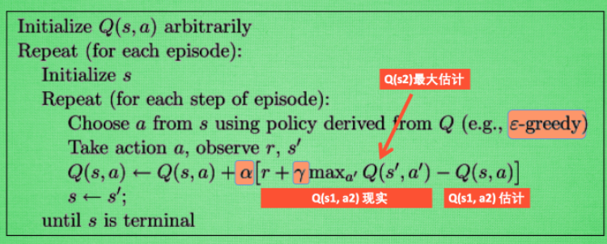
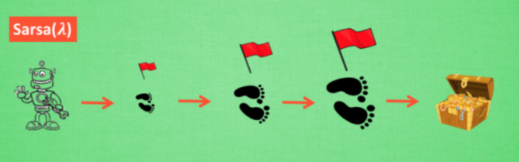
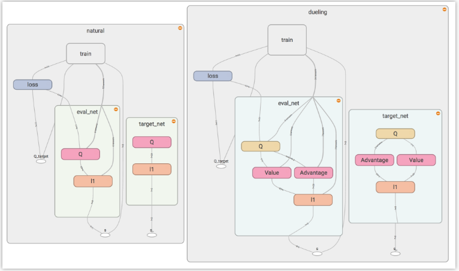
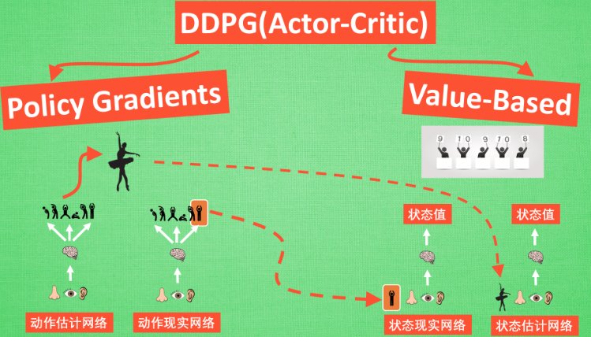
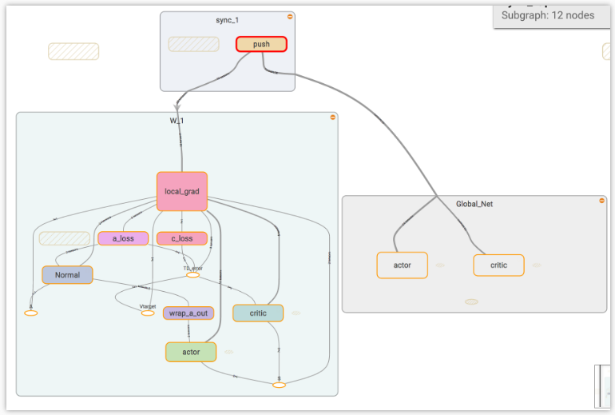

# 强化学习算法

强化学习是一类算法，能够让计算机实现从0到1，也就是说从一开始什么都不懂，脑袋里没有任何一点想法，通过不断的进行尝试，从错误中学习，最后找到学会了其中的规律，从而达到目的的方法，这就是一个完整的强化学习过程。

## 对比监督学习


监督学习, 指存在已有的数据和数据对应的正确标签, 比如这样. 监督学习就能学习出那些脸对应哪种标签. 不过强化学习还要更进一步, 一开始它并没有数据和标签. 

## RL算法


比较有名的算法, 比如有通过行为的价值来选取特定行为的方法, 包括使用表格学习的 q learning, sarsa, 使用神经网络学习的 deep q network, 还有直接输出行为的 policy gradients, 又或者了解所处的环境, 想象出一个虚拟的环境并从虚拟的环境中学习 等等. 

## ModelFree&ModelBased


### model-free

1、将所有强化学习的方法分为 `理不理解所处环境`，通过不断去尝试理解环境，环境给了什么就是什么。

### model-based

1、model就是用模型来表示环境，理解了环境，也就说明学会了用于一个模型来代替环境

```xml
Model-free 的方法有很多, 像 Q learning, Sarsa, Policy Gradients 都是从环境中得到反馈然后从中学习. 
而 model-based RL 只是多了一道程序, 为真实世界建模, 也可以说他们都是 model-free 的强化学习, 
只是 model-based 多出了一个虚拟环境, 我们不仅可以像 model-free 那样在现实中玩耍,还能在游戏中玩耍, 
而玩耍的方式也都是 model-free 中那些玩耍方式, 最终 model-based 还有一个杀手锏是 model-free 超级羡慕的. 
那就是想象力.

Model-free 中, 机器人只能按部就班, 一步一步等待真实世界的反馈, 再根据反馈采取下一步行动. 而 model-based, 
他能通过想象来预判断接下来将要发生的所有情况. 然后选择这些想象情况中最好的那种. 并依据这种情况来采取下一步的策略, 
这也就是 围棋场上 AlphaGo 能够超越人类的原因. 
```

## 基于概率&基于价值


1、基于概率是强化学习中最直接的一种, 能通过感官分析所处的环境, 直接输出下一步要采取的各种动作的概率, 然后根据概率采取行动, 所以每种动作都有可能被选中, 只是可能性不同. 

2、基于价值的方法输出则是所有动作的价值, 会根据最高价值来选着动作, 相比基于概率的方法, 基于价值的决策部分更为铁定, 毫不留情, 就选价值最高的, 而基于概率的, 即使某个动作的概率最高, 但是还是不一定会选到他.

3、现在说的动作都是一个一个不连续的动作, 而对于选取连续的动作, 基于价值的方法是无能为力的. 却能用一个概率分布在连续动作中选取特定动作, 这也是基于概率的方法的优点之一. 

4、那么这两类使用的方法又有哪些呢?

比如在基于概率这边, 有 Policy Gradients, 在基于价值这边有 Q learning, Sarsa 等. 而且还能结合这两类方法的优势之处, 创造更牛逼的一种方法, 叫做 Actor-Critic, actor 会基于概率做出动作, 而 critic 会对做出的动作给出动作的价值, 这样就在原有的 policy gradients 上加速了学习过程.

## 回合更新&单步更新


强化学习另外一种方式分类, 回合更新和单步更新, 想象强化学习就是在玩游戏, 游戏回合有开始和结束. 

1、回合更新指的是游戏开始后, 要等待游戏结束, 然后再总结这一回合中的所有转折点, 再更新行为准则. 

2、单步更新则是在游戏进行中每一步都在更新, 不用等待游戏的结束, 这样就能边玩边学习了.

3、Monte-carlo learning 和基础版的 policy gradients 等都是回合更新制, Qlearning, Sarsa, 升级版的 policy gradients 等都是单步更新制. 因为单步更新更有效率, 所以现在大多方法都是基于单步更新. 比如有的强化学习问题并不属于回合问题.

## 在线学习&离线学习


最后一种分类方式是在线学习和离线学习.

1、在线学习, 就是指必须本人在场, 并且一定是本人边玩边学习

2、离线学习是可以选择自己玩, 也可以选择看着别人玩, 通过看别人玩来学习别人的行为准则

3、离线学习同样是从过往的经验中学习, 但是这些过往的经历没必要是自己的经历, 任何人的经历都能被学习. 或者也不必要边玩边学习, 可以白天先存储下来玩耍时的记忆, 然后晚上通过离线学习来学习白天的记忆.

4、那么每种学习的方法又有哪些呢?

最典型的在线学习就是 Sarsa 了, 还有一种优化 Sarsa 的算法, 叫做 Sarsa lambda, 最典型的离线学习就是 Q learning, 后来人也根据离线学习的属性, 开发了更强大的算法, 比如让计算机学会玩电动的 Deep-Q-Network.

## 强化学习优势

强化学习(Reinforcement Learning)是一个机器学习分支，由于近些年来和深度学习(Deep Learning)整合，使得强化学习有了进一步的运用。 比如让计算机学着玩游戏, AlphaGo 挑战世界围棋高手, 都是强化学习在行的事. 强化学习也是让程序从对当前环境完全陌生, 成长为一个在环境中游刃有余的高手. 

## Q_Learning

### 行为准则


事情的行为准则, 比如小时候爸妈常说”不写完作业就不准看电视”. 

1、所以在写作业的这种状态下, 好的行为就是继续写作业, 直到写完它, 还可以得到奖励, 不好的行为就是没写完就跑去看电视了, 被爸妈发现, 后果很严重.  原来 Q learning 也是一个决策过程, 和小时候的这种情况差不多.

2、假设现在处于写作业的状态而且以前并没有尝试过写作业时看电视, 所以现在有两种选择：1.继续写作业, 2, 跑去看电视. 因为以前没有被罚过, 所以选看电视, 然后现在的状态变成了看电视, 又选了继续看电视, 接着还是看电视, 最后爸妈回家, 发现没写完作业就去看电视了, 狠狠地惩罚了一次, 也深刻地记下了这一次经历, 并在脑海中将 “没写完作业就看电视” 这种行为更改为负面行为.

### Q_Learning决策


假设行为准则已经学习好了, 现在处于状态s1, 在写作业, 有两个行为 a1, a2, 分别是看电视和写作业.

1、在这种 s1 状态下, a2 写作业带来的潜在奖励要比 a1 看电视高, 这里的潜在奖励可以用一个有关于 s 和 a 的 Q 表格代替, 在记忆Q表格中, Q(s1, a1)=-2 要小于 Q(s1, a2)=1, 所以判断要选择 a2 作为下一个行为. 

2、现在状态更新成 s2 , 还是有两个同样的选择, 重复上面的过程, 在行为准则Q 表中寻找 Q(s2, a1) Q(s2, a2) 的值, 并比较他们的大小, 选取较大的一个. 接着根据 a2 到达 s3 并在此重复上面的决策过程. Q learning 的方法也就是这样决策的. 

### Q_Learning更新


回到之前的流程, 根据 Q 表的估计：

1、因为在 s1 中, a2 的值比较大, 通过之前的决策方法, 在 s1 采取了 a2, 并到达 s2, 这时开始更新用于决策的 Q 表, 接着并没有在实际中采取任何行为.

2、在 s2 上采取了每种行为, 分别看看两种行为哪一个的 Q 值大, 比如说 Q(s2, a2) 的值比 Q(s2, a1) 的大, 所以我们把大的 Q(s2, a2) 乘上一个衰减值 gamma (比如是0.9) 并加上到达s2时所获取的奖励 R (这里还没有获取到的棒棒糖, 所以奖励为 0), 因为会获取实实在在的奖励 R , 将这个作为我现实中 Q(s1, a2) 的值.

3、但是之前是根据 Q 表估计 Q(s1, a2) 的值. 所以有了现实和估计值, 就能更新Q(s1, a2) , 根据估计与现实的差距, 将这个差距乘以一个学习效率 alpha 累加上老的 Q(s1, a2) 的值 变成新的值. 但时刻记住, 虽然用 maxQ(s2) 估算了一下 s2 状态, 但还没有在 s2 做出任何的行为, s2 的行为决策要等到更新完了以后再重新另外做. 

这就是 off-policy 的 Q learning 是如何决策和学习优化决策的过程. 

### Q_Learning整体算法



上图概括了 Q learning 的算法整体流程：

1、每次更新都用到了 Q 现实和 Q 估计, 而且 Q learning 的迷人之处就是 在 Q(s1, a2) 现实 中, 也包含了一个 Q(s2) 的最大估计值, 将对下一步的衰减的最大估计和当前所得到的奖励当成这一步的现实.

2、算法中一些参数的意义. Epsilon greedy 是用在决策上的一种策略, 比如 epsilon = 0.9 时, 就说明有90% 的情况会按照 Q 表的最优值选择行为, 10% 的时间使用随机选行为. alpha是学习率, 来决定这次的误差有多少是要被学习的, alpha是一个小于1 的数. gamma 是对未来 reward 的衰减值. 

### Q_Learing`s Gamma


1、重写一下 Q(s1) 的公式, 将 Q(s2) 拆开, 因为Q(s2)可以像 Q(s1)一样,是关于Q(s3) 的, 所以可以写成这样, 然后以此类推, 不停地这样写下去, 最后就能写成这样, 可以看出Q(s1) 是有关于之后所有的奖励, 但这些奖励正在衰减, 离 s1 越远的状态衰减越严重. 

2、想象 Qlearning 的机器人天生近视眼, gamma = 1 时, 机器人有了一副合适的眼镜, 在 s1 看到的 Q 是未来没有任何衰变的奖励, 也就是机器人能清清楚楚地看到之后所有步的全部价值, 但是当 gamma =0, 近视机器人没了眼镜, 只能摸到眼前的 reward, 同样也就只在乎最近的大奖励, 如果 gamma 从 0 变到 1, 眼镜的度数由浅变深, 对远处的价值看得越清楚, 所以机器人渐渐变得有远见, 不仅仅只看眼前的利益, 也为自己的未来着想. 

### Q_Learning`s Explames

#### 引出问题

用 tabular Q-learning 的方法实现一个小例子, 例子的环境是一个一维世界, 在世界的右边有宝藏, 探索者只要得到宝藏尝到了甜头, 然后以后就记住了得到宝藏的方法, 这就是用强化学习所学习到的行为. 

```python
-o---T
# T 就是宝藏的位置, o 是探索者的位置
```

Q-learning 是一种记录行为值 (Q value) 的方法, 每种在一定状态的行为都会有一个值 `Q(s, a)`, 就是说行为 `a` 在 `s` 状态的值是 `Q(s, a)`. `s` 在上面的探索者游戏中, 就是 `o` 所在的地点了. 而每一个地点探索者都能做出两个行为 `left/right`, 这就是探索者的所有可行的 `a` .

如果在某个地点 `s1`, 探索者计算了他能有的两个行为, `a1/a2=left/right`, 计算结果是 `Q(s1, a1) > Q(s1, a2)`, 那么探索者就会选择 `left` 这个行为. 这就是 Q learning 的行为选择简单规则.

#### 预设值

```python
# 导入模块
import numpy as np
import pandas as pd
import time

N_STATES = 6 # 1维世界的宽度
ACTIONS = ['left', 'right'] # 探索者的可用动作
EPSILON = 0.9   # 贪婪度 greedy
ALPHA = 0.1     # 学习率
GAMMA = 0.9    # 奖励递减值
MAX_EPISODES = 13   # 最大回合数
FRESH_TIME = 0.3    # 移动间隔时间
```

#### Q表

对于 tabular Q learning, 必须将所有的 Q values (行为值) 放在 `q_table` 中, 更新 `q_table` 也是在更新行为准则. `q_table` 的 index 是所有对应的 `state` (探索者位置), columns 是对应的 `action` (探索者行为). 

```python
def build_q_table(n_states, actions):
    table = pd.DataFrame(
        np.zeros((n_states, len(actions))),     # q_table 全 0 初始
        columns=actions,    # columns 对应的是行为名称
    )
    return table

# q_table:
"""
   left  right
0   0.0    0.0
1   0.0    0.0
2   0.0    0.0
3   0.0    0.0
4   0.0    0.0
5   0.0    0.0
"""
```

#### 定义动作

定义探索者是如何挑选行为的. 这是引入 `epsilon greedy` 的概念.

1、因为在初始阶段, 随机的探索环境, 往往比固定的行为模式要好, 所以这也是累积经验的阶段, 希望探索者不会那么贪婪(greedy). 所以 `EPSILON` 就是用来控制贪婪程度的值. `EPSILON` 可以随着探索时间不断提升(越来越贪婪), 

2、不过在这个例子中, 就固定成 `EPSILON = 0.9`, 90% 的时间是选择最优策略, 10% 的时间来探索. 

```python
# 在某个 state 地点, 选择行为
def choose_action(state, q_table):
    state_actions = q_table.iloc[state, :]  # 选出这个 state 的所有 action 值
    
    # 非贪婪 or 或者这个 state 还没有探索过
    if (np.random.uniform() > EPSILON) or (state_actions.all() == 0):  
        action_name = np.random.choice(ACTIONS)
    else:
        action_name = state_actions.argmax()    # 贪婪模式
        
    return action_name
```

#### 环境反馈S\_,R

做出行为后, 环境也要给行为一个反馈, 反馈出下个 state (S_) 和 在上个 state (S) 做出 action (A) 所得到的 reward (R). 这里定义的规则就是, 只有当 `o` 移动到了 `T`, 探索者才会得到唯一的一个奖励, 奖励值 R=1, 其他情况都没有奖励. 

```python
def get_env_feedback(S, A):
    # 这是代理与环境交互的方式
    if A == 'right':    # 向右移动
        if S == N_STATES - 2:   # 终止移动
            S_ = 'terminal'
            R = 1
        else:
            S_ = S + 1
            R = 0
    else:   # 向左移动
        R = 0
        if S == 0:
            S_ = S  # 到达终点
        else:
            S_ = S - 1
    return S_, R
```

#### 环境更新

```python
def update_env(S, episode, step_counter):
    # 环境更新的流程
    env_list = ['-']*(N_STATES-1) + ['T']   # '---------T' 运行环境
    if S == 'terminal':
        interaction = 'Episode %s: total_steps = %s' % (episode+1, step_counter)
        print('\r{}'.format(interaction), end='')
        time.sleep(2)
        print('\r                                ', end='')
    else:
        env_list[S] = 'o'
        interaction = ''.join(env_list)
        print('\r{}'.format(interaction), end='')
        time.sleep(FRESH_TIME)
```

#### 强化学习主循环

最重要的地方就在这里. 定义的 RL 方法都在这里体现. 


```python
def rl():
    q_table = build_q_table(N_STATES, ACTIONS)  # 初始 q table
    for episode in range(MAX_EPISODES):     # 回合
        step_counter = 0
        S = 0   # 回合初始位置
        is_terminated = False   # 是否回合结束
        update_env(S, episode, step_counter)    # 环境更新
        while not is_terminated:

            A = choose_action(S, q_table)   # 选行为
            S_, R = get_env_feedback(S, A)  # 实施行为并得到环境的反馈
            q_predict = q_table.loc[S, A]    # 估算的(状态-行为)值
            if S_ != 'terminal':
                q_target = R + GAMMA * q_table.iloc[S_, :].max()   #  实际的(状态-行为)值 (回合没结束)
            else:
                q_target = R     #  实际的(状态-行为)值 (回合结束)
                is_terminated = True    # terminate this episode

            q_table.loc[S, A] += ALPHA * (q_target - q_predict)  #  q_table 更新
            S = S_  # 探索者移动到下一个 state

            update_env(S, episode, step_counter+1)  # 环境更新

            step_counter += 1
    return q_table
```

### Q_Learning算法更新

一个更具体的例子. 让探索者学会走迷宫. 黄色的是天堂 (reward 1), 黑色的地狱 (reward -1). 大多数 RL 是由 reward 导向的, 所以定义 reward 是 RL 中比较重要的一点. 

#### 算法


整个算法就是一直不断更新 Q table 里的值, 然后再根据新的值来判断要在某个 state 采取怎样的 action. 

1、Qlearning 是一个 off-policy 的算法, 因为里面的 `max` action 让 Q table 的更新可以不基于正在经历的经验(可以是现在学习着很久以前的经验,甚至是学习他人的经验). 

2、不过例子, 没有运用到 off-policy, 而是把 Qlearning 用在了 on-policy 上, 也就是现学现卖, 将现在经历的直接当场学习并运用. 

#### Code

首先 import 两个模块, `maze_env` 是环境模块, `maze_env` 模块可以不深入研究,  `maze_env` 就是用 `tkinter` 编写的. 而 `RL_brain` 这个模块是 RL 的大脑部分.

```python
from maze_env import Maze
from RL_brain import QLearningTable
```

#### RL_brain

```python
import numpy as np
import pandas as pd


class QLearningTable:
    def __init__(self, actions, learning_rate=0.01, reward_decay=0.9, e_greedy=0.9):
        self.actions = actions  # a list
        self.lr = learning_rate
        self.gamma = reward_decay
        self.epsilon = e_greedy
        self.q_table = pd.DataFrame(columns=self.actions, dtype=np.float64)

    def choose_action(self, observation):
        self.check_state_exist(observation)
        # action selection
        if np.random.uniform() < self.epsilon:
            # choose best action
            state_action = self.q_table.loc[observation, :]
            # some actions may have the same value, randomly choose on in these actions
            action = np.random.choice(state_action[state_action == np.max(state_action)].index)
        else:
            # choose random action
            action = np.random.choice(self.actions)
        return action

    def learn(self, s, a, r, s_):
        self.check_state_exist(s_)
        q_predict = self.q_table.loc[s, a]
        if s_ != 'terminal':
            q_target = r + self.gamma * self.q_table.loc[s_, :].max()  # next state is not terminal
        else:
            q_target = r  # next state is terminal
        self.q_table.loc[s, a] += self.lr * (q_target - q_predict)  # update

    def check_state_exist(self, state):
        if state not in self.q_table.index:
            # append new state to q table
            self.q_table = self.q_table.append(
                pd.Series(
                    [0]*len(self.actions),
                    index=self.q_table.columns,
                    name=state,
                )
            )
```

#### maze_env

```python
import numpy as np
import time
import sys
if sys.version_info.major == 2:
    import Tkinter as tk
else:
    import tkinter as tk


UNIT = 40   # pixels
MAZE_H = 4  # grid height
MAZE_W = 4  # grid width


class Maze(tk.Tk, object):
    def __init__(self):
        super(Maze, self).__init__()
        self.action_space = ['u', 'd', 'l', 'r']
        self.n_actions = len(self.action_space)
        self.title('maze')
        self.geometry('{0}x{1}'.format(MAZE_W * UNIT, MAZE_H * UNIT))
        self._build_maze()

    def _build_maze(self):
        self.canvas = tk.Canvas(self, bg='white',
                           height=MAZE_H * UNIT,
                           width=MAZE_W * UNIT)

        # create grids
        for c in range(0, MAZE_W * UNIT, UNIT):
            x0, y0, x1, y1 = c, 0, c, MAZE_H * UNIT
            self.canvas.create_line(x0, y0, x1, y1)
        for r in range(0, MAZE_H * UNIT, UNIT):
            x0, y0, x1, y1 = 0, r, MAZE_W * UNIT, r
            self.canvas.create_line(x0, y0, x1, y1)

        # create origin
        origin = np.array([20, 20])

        # hell
        hell1_center = origin + np.array([UNIT * 2, UNIT])
        self.hell1 = self.canvas.create_rectangle(
            hell1_center[0] - 15, hell1_center[1] - 15,
            hell1_center[0] + 15, hell1_center[1] + 15,
            fill='black')
        # hell
        hell2_center = origin + np.array([UNIT, UNIT * 2])
        self.hell2 = self.canvas.create_rectangle(
            hell2_center[0] - 15, hell2_center[1] - 15,
            hell2_center[0] + 15, hell2_center[1] + 15,
            fill='black')

        # create oval
        oval_center = origin + UNIT * 2
        self.oval = self.canvas.create_oval(
            oval_center[0] - 15, oval_center[1] - 15,
            oval_center[0] + 15, oval_center[1] + 15,
            fill='yellow')

        # create red rect
        self.rect = self.canvas.create_rectangle(
            origin[0] - 15, origin[1] - 15,
            origin[0] + 15, origin[1] + 15,
            fill='red')

        # pack all
        self.canvas.pack()

    def reset(self):
        self.update()
        time.sleep(0.5)
        self.canvas.delete(self.rect)
        origin = np.array([20, 20])
        self.rect = self.canvas.create_rectangle(
            origin[0] - 15, origin[1] - 15,
            origin[0] + 15, origin[1] + 15,
            fill='red')
        # return observation
        return self.canvas.coords(self.rect)

    def step(self, action):
        s = self.canvas.coords(self.rect)
        base_action = np.array([0, 0])
        if action == 0:   # up
            if s[1] > UNIT:
                base_action[1] -= UNIT
        elif action == 1:   # down
            if s[1] < (MAZE_H - 1) * UNIT:
                base_action[1] += UNIT
        elif action == 2:   # right
            if s[0] < (MAZE_W - 1) * UNIT:
                base_action[0] += UNIT
        elif action == 3:   # left
            if s[0] > UNIT:
                base_action[0] -= UNIT

        self.canvas.move(self.rect, base_action[0], base_action[1])  # move agent

        s_ = self.canvas.coords(self.rect)  # next state

        # reward function
        if s_ == self.canvas.coords(self.oval):
            reward = 1
            done = True
            s_ = 'terminal'
        elif s_ in [self.canvas.coords(self.hell1), self.canvas.coords(self.hell2)]:
            reward = -1
            done = True
            s_ = 'terminal'
        else:
            reward = 0
            done = False

        return s_, reward, done

    def render(self):
        time.sleep(0.1)
        self.update()


def update():
    for t in range(10):
        s = env.reset()
        while True:
            env.render()
            a = 1
            s, r, done = env.step(a)
            if done:
                break

if __name__ == '__main__':
    env = Maze()
    env.after(100, update)
    env.mainloop()
```

#### run_code

```python
from maze_env import Maze
from RL_brain import QLearningTable


def update():
    for episode in range(100):
        # initial observation
        observation = env.reset()

        while True:
            # fresh env
            env.render()

            # RL choose action based on observation
            action = RL.choose_action(str(observation))

            # RL take action and get next observation and reward
            observation_, reward, done = env.step(action)

            # RL learn from this transition
            RL.learn(str(observation), action, reward, str(observation_))

            # swap observation
            observation = observation_

            # break while loop when end of this episode
            if done:
                break

    # end of game
    print('game over')
    env.destroy()

if __name__ == "__main__":
    env = Maze()
    RL = QLearningTable(actions=list(range(env.n_actions)))

    env.after(100, update)
    env.mainloop()
```

#### update

```python
def update():
    # 学习 100 回合
    for episode in range(100):
        # 初始化 state 的观测值
        observation = env.reset()

        while True:
            # 更新可视化环境
            env.render()

            # RL 大脑根据 state 的观测值挑选 action
            action = RL.choose_action(str(observation))

            # 探索者在环境中实施这个 action, 并得到环境返回的下一个 state 观测值
            # reward 和 done (是否是掉下地狱或者升上天堂)
            observation_, reward, done = env.step(action)

            # RL 从这个序列 (state, action, reward, state_) 中学习
            RL.learn(str(observation), action, reward, str(observation_))

            # 将下一个 state 的值传到下一次循环
            observation = observation_

            # 如果掉下地狱或者升上天堂, 这回合就结束了
            if done:
                break

    # 结束游戏并关闭窗口
    print('game over')
    env.destroy()

if __name__ == "__main__":
    # 定义环境 env 和 RL 方式
    env = Maze()
    RL = QLearningTable(actions=list(range(env.n_actions)))

    # 开始可视化环境 env
    env.after(100, update)
    env.mainloop()
```

### Q_Learning思维决策

实现 `RL_brain` 的 `QLearningTable` 部分, 这也是 RL 的大脑部分, 负责决策和思考. 

#### 主结构

以一个 class 形式定义 Q learning, 并把这种 tabular q learning 方法叫做 `QLearningTable`. 

```python
class QLearningTable:
    # 初始化
    def __init__(self, actions, learning_rate=0.01, reward_decay=0.9, e_greedy=0.9):

    # 选行为
    def choose_action(self, observation):

    # 学习更新参数
    def learn(self, s, a, r, s_):

    # 检测 state 是否存在
    def check_state_exist(self, state):
```

#### 预设值

```python
import numpy as np
import pandas as pd

class QLearningTable:
    def __init__(self, actions, learning_rate=0.01, reward_decay=0.9, e_greedy=0.9):
        self.actions = actions  # a list
        self.lr = learning_rate # 学习率
        self.gamma = reward_decay   # 奖励衰减
        self.epsilon = e_greedy     # 贪婪度
        self.q_table = pd.DataFrame(columns=self.actions, dtype=np.float64) 
```

#### 决定行为

定义如何根据所在的 state, 或者是在这个 state 上的 观测值 (observation) 来决策. 

```python
def choose_action(self, observation):
    self.check_state_exist(observation) # 检测本 state 是否在 q_table 中存在(见后面标题内容)

    # 选择 action
    if np.random.uniform() < self.epsilon:  # 选择 Q value 最高的 action
        state_action = self.q_table.loc[observation, :]

        # 同一个 state, 可能会有多个相同的 Q action value, 所以我们乱序一下
        action = np.random.choice(state_action[state_action == np.max(state_action)].index)

        else:   # 随机选择 action
            action = np.random.choice(self.actions)

        return action
```

#### 学习

根据是否是 `terminal` state (回合终止符) 来判断应该如何更行 `q_table`. 

```python
update = self.lr * (q_target - q_predict)
```

可理解成神经网络中的更新方式, 学习率 * (真实值 - 预测值). 将判断误差传递回去, 有着和神经网络更新的异曲同工之处.

```python
def learn(self, s, a, r, s_):
    self.check_state_exist(s_)  # 检测 q_table 中是否存在 s_ (见后面标题内容)
    q_predict = self.q_table.loc[s, a]
    if s_ != 'terminal':
        q_target = r + self.gamma * self.q_table.loc[s_, :].max()  # 下个 state 不是 终止符
        else:
            q_target = r  # 下个 state 是终止符
        self.q_table.loc[s, a] += self.lr * (q_target - q_predict)  # 更新对应的 state-action 值
```

#### 检查state

检测 `q_table` 中有没有当前 state 的步骤了, 如果还没有当前 state, 那我我们就插入一组全 0 数据, 当做这个 state 的所有 action 初始 values. 

```python
def check_state_exist(self, state):
    if state not in self.q_table.index:
        # append new state to q table
        self.q_table = self.q_table.append(
            pd.Series(
                [0]*len(self.actions),
                index=self.q_table.columns,
                name=state,
            )
        )
```

## Sarsa

Sarsa全称是state-action-reward-state’-action’，目的是学习特定的state下，特定action的价值Q，最终建立和优化一个Q表格，以state为行，action为列，根据与环境交互得到的reward来更新Q表格，更新公式为： 


Sarsa在训练中为了更好的探索环境，采用ε-greedy方式来训练，有一定概率随机选择动作输出。Sarsa 的决策部分和 Q learning 一模一样, 因为使用的是 Q 表的形式决策, 所以会在 Q 表中挑选值较大的动作值施加在环境中来换取奖惩. 但是不同的地方在于 Sarsa 的更新方式是不一样的. 

### Srasa更新行为准则


1、同样, 经历正在写作业的状态 s1, 然后再挑选一个带来最大潜在奖励的动作 a2, 这样就到达了继续写作业状态 s2, 而在这一步, 如果用的是 Q learning, 会观看一下在 s2 上选取哪一个动作会带来最大的奖励, 但是在真正要做决定时, 却不一定会选取到那个带来最大奖励的动作.

2、Q-learning 在这一步只是估计了一下接下来的动作值. 而 Sarsa 是实践派, 说到做到, 在 s2 这一步估算的动作也是接下来要做的动作. 所以 Q(s1, a2) 现实的计算值, 也会稍稍改动, 去掉maxQ, 取而代之的是在 s2 上实实在在选取的 a2 的 Q 值. 最后像 Q learning 一样, 求出现实和估计的差距 并更新 Q 表里的 Q(s1, a2). 

### 对比Q_Learning算法


从算法来看, 这就是两最大的不同之处了. 因为 Sarsa 是说到做到型, 所以也叫 on-policy, 在线学习, 学着自己在做的事情. 而 Q learning 是说到但并不一定做到, 所以它也叫作 Off-policy, 离线学习. 而因为有了 maxQ, Q-learning 也是一个特别勇敢的算法. 


为什么说勇敢?

因为 Q learning 机器人永远都会选择最近的一条通往成功的道路, 不管这条路会有多危险. 而 Sarsa 则是相当保守, 他会选择离危险远远的, 拿到宝藏是次要的, 保住自己的小命才是王道. 这就是使用 Sarsa 方法的不同之处. 

### Srasa算法更新

实现 RL 中另一种和 Qlearning 类似的算法, 叫做 Sarsa (state-action-reward-state*-action*). 从这一个简称可以了解到, Sarsa 的整个循环都将是在一个路径上, 也就是 on-policy, 下一个 state*, 和下一个 action* 将会变成真正采取的 action 和 state. 和 Qlearning 的不同之处就在这. Qlearning 的下个一个 state_ action_ 在算法更新的时候都还是不确定的 (off-policy). 而 Sarsa 的 state*, action* 在这次算法更新的时候已经确定好了 (on-policy). 

#### 算法


整个算法还是一直不断更新 Q table 里的值, 然后再根据新的值来判断要在某个 state 采取怎样的 action. 

不过于 Qlearning 不同之处:

-   在当前 `state` 已经想好了 `state` 对应的 `action`, 而且想好了 下一个 `state_` 和下一个 `action_` (Qlearning 还没有想好下一个 `action_`)
-   更新 `Q(s,a)` 的时候基于的是下一个 `Q(s_, a_)` (Qlearning 是基于 `maxQ(s_)`)

1、这种不同之处使得 Sarsa 相对于 Qlearning, 更加的胆小. 因为 Qlearning 永远都是想着 `maxQ` 最大化, 因为这个 `maxQ` 而变得贪婪, 不考虑其他非 `maxQ` 的结果. 可以理解成 Qlearning 是一种贪婪, 大胆, 勇敢的算法, 对于错误, 死亡并不在乎. 

2、Sarsa 是一种保守的算法, 在乎每一步决策, 对于错误和死亡比较敏感. 两种算法都有他们的好处, 比如在实际中, 比较在乎机器的损害, 用一种保守的算法, 在训练时就能减少损坏的次数.

#### Code

首先 import 两个模块, `maze_env` 是环境模块 `maze_env` 模块可以不深入研究, `maze_env` 就是用 `tkinter` 编写的. 而 `RL_brain` 这个模块是 RL 的大脑部分. 

```python
from maze_env import Maze
from RL_brain import SarsaTable
```

#### update

```python
def update():
    for episode in range(100):
        # 初始化环境
        observation = env.reset()

        # Sarsa 根据 state 观测选择行为
        action = RL.choose_action(str(observation))

        while True:
            # 刷新环境
            env.render()

            # 在环境中采取行为, 获得下一个 state_ (obervation_), reward, 和是否终止
            observation_, reward, done = env.step(action)

            # 根据下一个 state (obervation_) 选取下一个 action_
            action_ = RL.choose_action(str(observation_))

            # 从 (s, a, r, s, a) 中学习, 更新 Q_tabel 的参数 ==> Sarsa
            RL.learn(str(observation), action, reward, str(observation_), action_)

            # 将下一个当成下一步的 state (observation) and action
            observation = observation_
            action = action_

            # 终止时跳出循环
            if done:
                break

    # 大循环完毕
    print('game over')
    env.destroy()

if __name__ == "__main__":
    env = Maze()
    RL = SarsaTable(actions=list(range(env.n_actions)))

    env.after(100, update)
    env.mainloop()
```

### Srasa决策思维

实现 `RL_brain` 的 `SarsaTable` 部分, 这也是 RL 的大脑部分, 负责决策和思考. 

#### 主结构

定义 Qlearning 中的 `QLearningTable` 一样, 因为使用 tabular 方式的 `Sarsa` 和 `Qlearning` 的相似度极高, 

```python
class SarsaTable:
    # 初始化 
    def __init__(self, actions, learning_rate=0.01, reward_decay=0.9, e_greedy=0.9):

    # 选行为 
    def choose_action(self, observation):

    # 学习更新参数 
    def learn(self, s, a, r, s_):

    # 检测 state 是否存在 
    def check_state_exist(self, state):
```

甚至可以定义一个 主class `RL`, 然后将 `QLearningTable` 和 `SarsaTable` 作为 主class `RL` 的衍生, 这个主 `RL` 可以这样定义. 所以将之前的 `__init__`, `check_state_exist`, `choose_action`, `learn` 全部都放在这个主结构中 

```python
import numpy as np
import pandas as pd


class RL(object):
    def __init__(self, action_space, learning_rate=0.01, reward_decay=0.9, e_greedy=0.9):
        ... # 和 QLearningTable 中的代码一样

    def check_state_exist(self, state):
        ... # 和 QLearningTable 中的代码一样

    def choose_action(self, observation):
        ... # 和 QLearningTable 中的代码一样

    def learn(self, *args):
        pass # 每种的都有点不同, 所以用 pass
```

如果是这样定义父类的 `RL` class, 通过继承关系, 那之子类 `QLearningTable` class 就能简化 

```python
class QLearningTable(RL):   # 继承了父类 RL
    def __init__(self, actions, learning_rate=0.01, reward_decay=0.9, e_greedy=0.9):
        # 表示继承关系
        super(QLearningTable, self).__init__(actions, learning_rate, reward_decay, e_greedy)    

    def learn(self, s, a, r, s_):   # learn 的方法在每种类型中有不一样, 需重新定义
        self.check_state_exist(s_)
        q_predict = self.q_table.loc[s, a]
        if s_ != 'terminal':
            q_target = r + self.gamma * self.q_table.loc[s_, :].max()
        else:
            q_target = r
        self.q_table.loc[s, a] += self.lr * (q_target - q_predict)
```

#### 学习

有了父类的 `RL`,  只需要编写 `SarsaTable` 中 `learn` 这个功能就完成了. 因为其他功能都和父类是一样的. 这就是所有的 `SarsaTable` 于父类 `RL` 不同之处的代码. 

```python
class SarsaTable(RL):   # 继承 RL class

    def __init__(self, actions, learning_rate=0.01, reward_decay=0.9, e_greedy=0.9):
        # 表示继承关系
        super(SarsaTable, self).__init__(actions, learning_rate, reward_decay, e_greedy)    

    def learn(self, s, a, r, s_, a_):
        self.check_state_exist(s_)
        q_predict = self.q_table.loc[s, a]
        if s_ != 'terminal':
            # q_target 基于选好的 a_ 而不是 Q(s_) 的最大值
            q_target = r + self.gamma * self.q_table.loc[s_, a_]  
        else:
            q_target = r  # 如果 s_ 是终止符
        self.q_table.loc[s, a] += self.lr * (q_target - q_predict)  # 更新 q_table

```

## Srasa(lambda)

强化学习中基于 Sarsa 的一种提速方法, 叫做 sarsa-lambda. 

### Srasa(n)


Sarsa 是一种单步更新法, 在环境中每走一步, 更新一次自己的行为准则： lambda 到底是什么 ？

1、在这样的 Sarsa 后面打一个括号, 说他是 Sarsa(0), 因为等走完这一步以后直接更新行为准则. 

2、如果延续这种想法, 走完这步, 再走一步, 然后再更新, 可以叫 Sarsa(1). 

3、同理, 如果等待回合完毕一次性再更新呢, 比如这回合走了 n 步, 那就叫 Sarsa(n). 为了统一这样的流程, 就有了一个 lambda 值来代替想要选择的步数, 这也就是 Sarsa(lambda) 的由来.

### 单步更新&回合更新


1、虽然每一步都在更新, 但是在没有获取宝藏的时候, 现在站着的这一步也没有得到任何更新, 也就是直到获取宝藏时, 才为获取到宝藏的上一步更新为: 这一步很好, 和获取宝藏是有关联的, 

2、而之前为了获取宝藏所走的所有步都被认为和获取宝藏没关系. 回合更新虽然要等到这回合结束, 才开始对本回合所经历的所有步都添加更新, 但是这所有的步都是和宝藏有关系的, 都是为了得到宝藏需要学习的步, 所以每一个脚印在下回合被选则的几率又高了一些. 在这种角度来看, 回合更新似乎会有效率一些. 

### 迷茫中..


这种情况, 还是使用单步更新的方法在每一步都进行更新, 但是同时记下之前的寻宝之路. 可以想像, 每走一步, 插上一个小旗子, 这样就能清楚的知道除了最近的一步, 找到宝物时还需要更新哪些步了. 不过, 有时候情况可能没有这么乐观. 开始的几次, 因为完全没有头绪, 可能在原地打转了很久, 然后才找到宝藏, 那些重复的脚步真的对我拿到宝藏很有必要吗? 

答案:所以Sarsa(lambda)登场~

### Lambda含义



1、其实 lambda 就是一个衰变值.

2、它可以让你知道离奖励越远的步可能并不是让你最快拿到奖励的步, 所以想象站在宝藏的位置, 回头看看走过的寻宝之路, 离宝藏越近的脚印越看得清, 远处的脚印太渺小, 都很难看清, 那就索性记下离宝藏越近的脚印越重要, 越需要被好好的更新. 

3、和之前提到过的奖励衰减值 gamma 一样, lambda 是脚步衰减值, 都是一个在 0 和 1 之间的数. 

### Lambda取值


1、当 lambda 取0, 就变成了 Sarsa 的单步更新, 当 lambda 取 1, 就变成了回合更新, 对所有步更新的力度都是一样. 

2、当 lambda 在 0 和 1 之间, 取值越大, 离宝藏越近的步更新力度越大. 这样就不用受限于单步更新的每次只能更新最近的一步, 可以更有效率的更新所有相关步. 

### Srasa_Lambda

#### 引出问题

Sarsa-lambda 是基于 Sarsa 方法的升级版, 能更有效率地学习到怎么样获得好的 reward. 

1、如果说 Sarsa 和 Qlearning 都是每次获取到 reward, 只更新获取到 reward 的前一步. 那 Sarsa-lambda 就是更新获取到 reward 的前 lambda 步. lambda 是在 [0, 1] 之间取值,

2、如果 lambda = 0, Sarsa-lambda 就是 Sarsa, 只更新获取到 reward 前经历的最后一步.

3、如果 lambda = 1, Sarsa-lambda 更新的是 获取到 reward 前所有经历的步.

#### 主结构

使用 `SarsaLambdaTable`在算法更新迭代的部分,和之前的 `SarsaTable` 一样的,没有算法更新部分, 直接变成思维决策部分. 

```python
class SarsaLambdaTable:
    # 初始化 (有改变)
    def __init__(self, actions, learning_rate=0.01, reward_decay=0.9, e_greedy=0.9, trace_decay=0.9):

    # 选行为 (与之前一样)
    def choose_action(self, observation):

    # 学习更新参数 (有改变)
    def learn(self, s, a, r, s_):

    # 检测 state 是否存在 (有改变)
    def check_state_exist(self, state):
```

选择继承的方式, 将 `SarsaLambdaTable` 继承到 `RL`, 所以我们将之前的 `__init__`, `check_state_exist`, `choose_action`, `learn` 全部都放在这个主结构中.

算法的相应更改参考:


#### 预设值

在预设值当中, 添加了 `trace_decay=0.9` 这个就是 `lambda` 的值了. 这个值将会使得拿到 reward 前的每一步都有价值.  

```python
class SarsaLambdaTable(RL): # 继承 RL class
    def __init__(self, actions, learning_rate=0.01, reward_decay=0.9, e_greedy=0.9, trace_decay=0.9):
        super(SarsaLambdaTable, self).__init__(actions, learning_rate, reward_decay, e_greedy)

        # 后向观测算法, eligibility trace.
        self.lambda_ = trace_decay
        self.eligibility_trace = self.q_table.copy()    # 空的 eligibility trace 表
```

#### 检查state

 `check_state_exist` 和之前的是高度相似的. 唯一不同的地方是考虑了 `eligibility_trace` 

```python
class SarsaLambdaTable(RL): # 继承 RL class
    def __init__(self, actions, learning_rate=0.01, reward_decay=0.9, e_greedy=0.9, trace_decay=0.9):
        ...
    def check_state_exist(self, state):
        if state not in self.q_table.index:
            # 向Q表中添加新状态
            to_be_append = pd.Series(
                    [0] * len(self.actions),
                    index=self.q_table.columns,
                    name=state,
                )
            self.q_table = self.q_table.append(to_be_append)

            # 也更新 eligibility trace
            self.eligibility_trace = self.eligibility_trace.append(to_be_append)
```

#### 学习

有了父类的 `RL`, 只需要编写 `SarsaLambdaTable` 中 `learn` 这个功能就完成. 因为其他功能都和父类是一样的. 这就是所有的 `SarsaLambdaTable` 于父类 `RL` 不同之处的代码. 

```python
class SarsaLambdaTable(RL): # 继承 RL class
    def __init__(self, actions, learning_rate=0.01, reward_decay=0.9, e_greedy=0.9, trace_decay=0.9):
        ...
    def check_state_exist(self, state):
        ...
    def learn(self, s, a, r, s_, a_):
        # 这部分和 Sarsa 一样
        self.check_state_exist(s_)
        q_predict = self.q_table.ix[s, a]
        if s_ != 'terminal':
            q_target = r + self.gamma * self.q_table.ix[s_, a_]
        else:
            q_target = r
        error = q_target - q_predict

        # 这里开始不同:
        # 对于经历过的 state-action, 让他+1, 证明他是得到 reward 路途中不可或缺的一环
        self.eligibility_trace.ix[s, a] += 1

        # Q table 更新
        self.q_table += self.lr * error * self.eligibility_trace

        # 随着时间衰减 eligibility trace 的值, 离获取 reward 越远的步, 他的"不可或缺性"越小
        self.eligibility_trace *= self.gamma*self.lambda_
```

除了图中和上面代码这种更新方式, 还有一种会更加有效率. 可以将上面的这一步替换成下面这样: 

```python
# 上面代码中的方式:
self.eligibility_trace.ix[s, a] += 1

# 更有效的方式:
self.eligibility_trace.ix[s, :] *= 0
self.eligibility_trace.ix[s, a] = 1
```

不同之处可以用这张图来概括: 


针对于一个 state-action 值按经历次数的变化. 最上面是经历 state-action 的时间点, 第二张图是使用这种方式所带来的不可或缺性值:

```python
self.eligibility_trace.ix[s, a] += 1
```

下面图是使用这种方法带来的 不可或缺性值:

```python
self.eligibility_trace.ix[s, :] *= 0; self.eligibility_trace.ix[s, a] = 1
```

实验证明选择下面这种方法会有更好的效果.

eligibility trace 只是记录每个回合的每一步, 新回合开始的时候需要将 Trace 清零.

```python
for episode in range(100):
    ...

    # 新回合, 清零
    RL.eligibility_trace *= 0

    while True: # 开始回合
        ...
```

## DQN

Deep Q Network 简称为 DQN. Google Deep mind 团队就是靠着这 DQN 使计算机玩电动玩得比我们还厉害. DQN属于DRL（深度强化学习）的一种，它是深度学习与Q学习的结合体。采用`S-A`表格的局限性，当状态和行为的组合不可穷尽时，就无法通过查表的方式选取最优的Action了。这时候就该想到深度学习了，想通过深度学习找到最优解在很多情况下确实不太靠谱，但是找到一个无限逼近最优解的次优解，倒是没有问题的。

因此DQN实际上，总体思路还是用的Q学习的思路，不过对于给定状态选取哪个动作所能得到的Q值，却是由一个深度神经网络来计算的了，其流程图如下： 


### 强化学习&神经网络


之前所谈论到的强化学习方法都是比较传统的方式, 而如今, 随着机器学习在日常生活中的各种应用, 各种机器学习方法也在融汇, 合并, 升级. 一种融合了神经网络和 Q learning 的方法, 名字叫做 Deep Q Network. 

这种新型结构是为什么被提出来呢? 

原来, 传统的表格形式的强化学习有这样一个瓶颈. 

### 神经网络作用


使用表格来存储每一个状态 state, 和在这个 state 每个行为 action 所拥有的 Q 值. 

1、而当今问题是在太复杂, 状态可以多到比天上的星星还多(比如下围棋). 如果全用表格来存储它们, 恐怕计算机有再大的内存都不够, 而且每次在这么大的表格中搜索对应的状态也是一件很耗时的事. 

2、不过, 在机器学习中, 有一种方法对这种事情很在行, 那就是神经网络. 可以将状态和动作当成神经网络的输入, 然后经过神经网络分析后得到动作的 Q 值, 这样就没必要在表格中记录 Q 值, 而是直接使用神经网络生成 Q 值. 

3、还有一种形式的是这样, 也能只输入状态值, 输出所有的动作值, 然后按照 Q learning 的原则, 直接选择拥有最大值的动作当做下一步要做的动作. 可以想象, 神经网络接受外部的信息, 相当于眼睛鼻子耳朵收集信息, 然后通过大脑加工输出每种动作的值, 最后通过强化学习的方式选择动作. 

### 更新神经网络


基于第二种神经网络来分析，神经网络是要被训练才能预测出准确的值. 那在强化学习中, 神经网络是如何被训练的呢? 

1、首先, 需要 a1, a2 正确的Q值, 这个 Q 值就用之前在 Q learning 中的 Q 现实来代替. 

2、同样还需要一个 Q 估计 来实现神经网络的更新. 

3、所以神经网络的的参数就是老的 NN 参数加学习率 alpha 乘以 Q 现实 和 Q 估计 的差距. 整理一下. 


通过 NN 预测出Q(s2, a1) 和 Q(s2,a2) 的值, 这就是 Q 估计. 然后选取 Q 估计中最大值的动作来换取环境中的奖励 reward. 而 Q 现实中也包含从神经网络分析出来的两个 Q 估计值, 不过这个 Q 估计是针对于下一步在 s' 的估计. 最后再通过刚刚所说的算法更新神经网络中的参数. 但是这并不是 DQN 会玩电动的根本原因. 

还有两大因素支撑着 DQN 使得它变得无比强大. 这两大因素就是 Experience replay 和 Fixed Q-targets. 

### DQN两大利器


1、简单来说, DQN 有一个记忆库用于学习之前的经历. Q learning 是一种 off-policy 离线学习法, 它能学习当前经历着的, 也能学习过去经历过的, 甚至是学习别人的经历. 所以每次 DQN 更新的时候, 都可以随机抽取一些之前的经历进行学习. 

2、随机抽取这种做法打乱了经历之间的相关性, 也使得神经网络更新更有效率. 

3、Fixed Q-targets 也是一种打乱相关性的机理, 如果使用 fixed Q-targets, 就会在 DQN 中使用到两个结构相同但参数不同的神经网络, 预测 Q 估计 的神经网络具备最新的参数, 而预测 Q 现实 的神经网络使用的参数则是很久以前的. 

4、有了这两种提升手段, DQN 才能在一些游戏中超越人类. 

### 算法

Deep Q Network 的简称叫 DQN, 是将 Q learning 的优势 和 Neural networks 结合. 


1、如果使用 tabular Q learning, 对于每一个 state, action 都需要存放在一张 q_table 的表中. 如果像显示生活中, 情况可就比那个迷宫的状况复杂多了, 有千千万万个 state.

2、如果将这千万个 state 的值都放在表中, 受限于计算机硬件, 这样从表中获取数据, 更新数据是没有效率的. 

3、DQN 产生的原因. 可以使用神经网络来估算这个 state 的值, 这样就不需要一张表. 

4、在 Q learning 主框架上加了些装饰.

这些装饰包括:

-   记忆库 (用于重复学习)
-   神经网络计算 Q 值
-   暂时冻结 `q_target` 参数 (切断相关性)

### Code

对应上面的算法, 来实现主循环. 首先 import 所需模块. 

```python
from maze_env import Maze
from RL_brain import DeepQNetwork
```

DQN 于环境交互最重要的部分 

```python
def run_maze():
    step = 0    # 用来控制什么时候学习
    for episode in range(300):
        # 初始化环境
        observation = env.reset()

        while True:
            # 刷新环境
            env.render()

            # DQN 根据观测值选择行为
            action = RL.choose_action(observation)

            # 环境根据行为给出下一个 state, reward, 是否终止
            observation_, reward, done = env.step(action)

            # DQN 存储记忆
            RL.store_transition(observation, action, reward, observation_)

            # 控制学习起始时间和频率 (先累积一些记忆再开始学习)
            if (step > 200) and (step % 5 == 0):
                RL.learn()

            # 将下一个 state_ 变为 下次循环的 state
            observation = observation_

            # 如果终止, 就跳出循环
            if done:
                break
            step += 1   # 总步数

    # end of game
    print('game over')
    env.destroy()


if __name__ == "__main__":
    env = Maze()
    RL = DeepQNetwork(env.n_actions, env.n_features,
                      learning_rate=0.01,
                      reward_decay=0.9,
                      e_greedy=0.9,
                      replace_target_iter=200,  # 每 200 步替换一次 target_net 的参数
                      memory_size=2000, # 记忆上限
                      # output_graph=True   # 是否输出 tensorboard 文件
                      )
    env.after(100, run_maze)
    env.mainloop()
    RL.plot_cost()  # 观看神经网络的误差曲线
```

### DQN_Modified

```python
import numpy as np
import tensorflow as tf

np.random.seed(1)
tf.set_random_seed(1)


# Deep Q Network off-policy
class DeepQNetwork:
    def __init__(
            self,
            n_actions,
            n_features,
            learning_rate=0.01,
            reward_decay=0.9,
            e_greedy=0.9,
            replace_target_iter=300,
            memory_size=500,
            batch_size=32,
            e_greedy_increment=None,
            output_graph=False,
    ):
        self.n_actions = n_actions
        self.n_features = n_features
        self.lr = learning_rate
        self.gamma = reward_decay
        self.epsilon_max = e_greedy
        self.replace_target_iter = replace_target_iter
        self.memory_size = memory_size
        self.batch_size = batch_size
        self.epsilon_increment = e_greedy_increment
        self.epsilon = 0 if e_greedy_increment is not None else self.epsilon_max

        # total learning step
        self.learn_step_counter = 0

        # initialize zero memory [s, a, r, s_]
        self.memory = np.zeros((self.memory_size, n_features * 2 + 2))

        # consist of [target_net, evaluate_net]
        self._build_net()

        t_params = tf.get_collection(tf.GraphKeys.GLOBAL_VARIABLES, scope='target_net')
        e_params = tf.get_collection(tf.GraphKeys.GLOBAL_VARIABLES, scope='eval_net')

        with tf.variable_scope('hard_replacement'):
            self.target_replace_op = [tf.assign(t, e) for t, e in zip(t_params, e_params)]

        self.sess = tf.Session()

        if output_graph:
            # $ tensorboard --logdir=logs
            tf.summary.FileWriter("logs/", self.sess.graph)

        self.sess.run(tf.global_variables_initializer())
        self.cost_his = []

    def _build_net(self):
        # ------------------ all inputs ------------------------
        self.s = tf.placeholder(tf.float32, [None, self.n_features], name='s')  # input State
        self.s_ = tf.placeholder(tf.float32, [None, self.n_features], name='s_')  # input Next State
        self.r = tf.placeholder(tf.float32, [None, ], name='r')  # input Reward
        self.a = tf.placeholder(tf.int32, [None, ], name='a')  # input Action

        w_initializer, b_initializer = tf.random_normal_initializer(0., 0.3), \
        tf.constant_initializer(0.1)

        # ------------------ build evaluate_net ------------------
        with tf.variable_scope('eval_net'):
            e1 = tf.layers.dense(self.s, 20, tf.nn.relu, kernel_initializer=w_initializer,
                                 bias_initializer=b_initializer, name='e1')
            self.q_eval = tf.layers.dense(e1, self.n_actions, kernel_initializer=w_initializer,
                                          bias_initializer=b_initializer, name='q')

        # ------------------ build target_net ------------------
        with tf.variable_scope('target_net'):
            t1 = tf.layers.dense(self.s_, 20, tf.nn.relu, kernel_initializer=w_initializer,
                                 bias_initializer=b_initializer, name='t1')
            self.q_next = tf.layers.dense(t1, self.n_actions, kernel_initializer=w_initializer,
                                          bias_initializer=b_initializer, name='t2')

        with tf.variable_scope('q_target'):
            # shape=(None, )
            q_target = self.r + self.gamma * tf.reduce_max(self.q_next, axis=1, name='Qmax_s_')    
            self.q_target = tf.stop_gradient(q_target)
        with tf.variable_scope('q_eval'):
            a_indices = tf.stack([tf.range(tf.shape(self.a)[0], dtype=tf.int32), self.a], axis=1)
            # shape=(None, )
            self.q_eval_wrt_a = tf.gather_nd(params=self.q_eval, indices=a_indices)    
        with tf.variable_scope('loss'):
            self.loss = tf.reduce_mean(tf.squared_difference(self.q_target, \
                                                             self.q_eval_wrt_a, name='TD_error'))
        with tf.variable_scope('train'):
            self._train_op = tf.train.RMSPropOptimizer(self.lr).minimize(self.loss)

    def store_transition(self, s, a, r, s_):
        if not hasattr(self, 'memory_counter'):
            self.memory_counter = 0
        transition = np.hstack((s, [a, r], s_))
        # replace the old memory with new memory
        index = self.memory_counter % self.memory_size
        self.memory[index, :] = transition
        self.memory_counter += 1

    def choose_action(self, observation):
        # to have batch dimension when feed into tf placeholder
        observation = observation[np.newaxis, :]

        if np.random.uniform() < self.epsilon:
            # forward feed the observation and get q value for every actions
            actions_value = self.sess.run(self.q_eval, feed_dict={self.s: observation})
            action = np.argmax(actions_value)
        else:
            action = np.random.randint(0, self.n_actions)
        return action

    def learn(self):
        # check to replace target parameters
        if self.learn_step_counter % self.replace_target_iter == 0:
            self.sess.run(self.target_replace_op)
            print('\ntarget_params_replaced\n')

        # sample batch memory from all memory
        if self.memory_counter > self.memory_size:
            sample_index = np.random.choice(self.memory_size, size=self.batch_size)
        else:
            sample_index = np.random.choice(self.memory_counter, size=self.batch_size)
        batch_memory = self.memory[sample_index, :]

        _, cost = self.sess.run(
            [self._train_op, self.loss],
            feed_dict={
                self.s: batch_memory[:, :self.n_features],
                self.a: batch_memory[:, self.n_features],
                self.r: batch_memory[:, self.n_features + 1],
                self.s_: batch_memory[:, -self.n_features:],
            })

        self.cost_his.append(cost)

        # increasing epsilon
        self.epsilon = self.epsilon + self.epsilon_increment 
        if self.epsilon < self.epsilon_max else self.epsilon_max
        self.learn_step_counter += 1

    def plot_cost(self):
        import matplotlib.pyplot as plt
        plt.plot(np.arange(len(self.cost_his)), self.cost_his)
        plt.ylabel('Cost')
        plt.xlabel('training steps')
        plt.show()

if __name__ == '__main__':
    DQN = DeepQNetwork(3,4, output_graph=True)
```

### DQN神经网络

#### 神经网络

使用 Tensorflow 来实现 DQN, 比较推荐的方式是搭建两个神经网络, `target_net` 用于预测 `q_target` 值, 不会及时更新参数. `eval_net` 用于预测 `q_eval`, 这个神经网络拥有最新的神经网络参数. 不过这两个神经网络结构是完全一样的, 只是里面的参数不一样. 


#### 神经网络结构

```python
class DeepQNetwork:
    # 建立神经网络
    def _build_net(self):
```

#### 创建两个网络

两个神经网络是为了固定住一个神经网络 (`target_net`) 的参数, `target_net` 是 `eval_net` 的一个历史版本, 拥有 `eval_net` 很久之前的一组参数, 而且这组参数被固定一段时间, 然后再被 `eval_net` 的新参数所替换. 而 `eval_net` 是不断在被提升的, 所以是一个可以被训练的网络 `trainable=True`. 而 `target_net` 的 `trainable=False`. 

```python
class DeepQNetwork:
    def _build_net(self):
        # -------------- 创建 eval 神经网络, 及时提升参数 --------------
        self.s = tf.placeholder(tf.float32, [None, self.n_features], name='s')  # 用来接收 observation
        self.q_target = tf.placeholder(tf.float32, [None, self.n_actions], name='Q_target') # 用来接收 q_target 的值, 这个之后会通过计算得到
        with tf.variable_scope('eval_net'):
            # c_names(collections_names) 是在更新 target_net 参数时会用到
            c_names, n_l1, w_initializer, b_initializer = \
                ['eval_net_params', tf.GraphKeys.GLOBAL_VARIABLES], 10, \
                tf.random_normal_initializer(0., 0.3), tf.constant_initializer(0.1)  # config of layers

            # eval_net 的第一层. collections 是在更新 target_net 参数时会用到
            with tf.variable_scope('l1'):
                w1 = tf.get_variable('w1', [self.n_features, n_l1], initializer=w_initializer, collections=c_names)
                b1 = tf.get_variable('b1', [1, n_l1], initializer=b_initializer, collections=c_names)
                l1 = tf.nn.relu(tf.matmul(self.s, w1) + b1)

            # eval_net 的第二层. collections 是在更新 target_net 参数时会用到
            with tf.variable_scope('l2'):
                w2 = tf.get_variable('w2', [n_l1, self.n_actions], initializer=w_initializer, collections=c_names)
                b2 = tf.get_variable('b2', [1, self.n_actions], initializer=b_initializer, collections=c_names)
                self.q_eval = tf.matmul(l1, w2) + b2

        with tf.variable_scope('loss'): # 求误差
            self.loss = tf.reduce_mean(tf.squared_difference(self.q_target, self.q_eval))
        with tf.variable_scope('train'):    # 梯度下降
            self._train_op = tf.train.RMSPropOptimizer(self.lr).minimize(self.loss)

        # ---------------- 创建 target 神经网络, 提供 target Q ---------------------
        self.s_ = tf.placeholder(tf.float32, [None, self.n_features], name='s_')    # 接收下个 observation
        with tf.variable_scope('target_net'):
            # c_names(collections_names) 是在更新 target_net 参数时会用到
            c_names = ['target_net_params', tf.GraphKeys.GLOBAL_VARIABLES]

            # target_net 的第一层. collections 是在更新 target_net 参数时会用到
            with tf.variable_scope('l1'):
                w1 = tf.get_variable('w1', [self.n_features, n_l1], initializer=w_initializer, collections=c_names)
                b1 = tf.get_variable('b1', [1, n_l1], initializer=b_initializer, collections=c_names)
                l1 = tf.nn.relu(tf.matmul(self.s_, w1) + b1)

            # target_net 的第二层. collections 是在更新 target_net 参数时会用到
            with tf.variable_scope('l2'):
                w2 = tf.get_variable('w2', [n_l1, self.n_actions], initializer=w_initializer, collections=c_names)
                b2 = tf.get_variable('b2', [1, self.n_actions], initializer=b_initializer, collections=c_names)
                self.q_next = tf.matmul(l1, w2) + b2
```

### DQN思维决策

#### 主结构

```python
class DeepQNetwork:
    # 上次的内容
    def _build_net(self):

    # 这次的内容:
    # 初始值
    def __init__(self):

    # 存储记忆
    def store_transition(self, s, a, r, s_):

    # 选行为
    def choose_action(self, observation):

    # 学习
    def learn(self):

    # 看看学习效果 (可选)
    def plot_cost(self):
```

#### 初始值

```python
class DeepQNetwork:
    def __init__(
            self,
            n_actions,
            n_features,
            learning_rate=0.01,
            reward_decay=0.9,
            e_greedy=0.9,
            replace_target_iter=300,
            memory_size=500,
            batch_size=32,
            e_greedy_increment=None,
            output_graph=False,
    ):
        self.n_actions = n_actions
        self.n_features = n_features
        self.lr = learning_rate
        self.gamma = reward_decay
        self.epsilon_max = e_greedy     # epsilon 的最大值
        self.replace_target_iter = replace_target_iter  # 更换 target_net 的步数
        self.memory_size = memory_size  # 记忆上限
        self.batch_size = batch_size    # 每次更新时从 memory 里面取多少记忆出来
        self.epsilon_increment = e_greedy_increment # epsilon 的增量
        
        # 是否开启探索模式, 并逐步减少探索次数
        self.epsilon = 0 if e_greedy_increment is not None else self.epsilon_max 

        # 记录学习次数 (用于判断是否更换 target_net 参数)
        self.learn_step_counter = 0

        # 初始化全 0 记忆 [s, a, r, s_]
        # 和视频中不同, 因为 pandas 运算比较慢, 这里改为直接用 numpy
        self.memory = np.zeros((self.memory_size, n_features*2+2)) 

        # 创建 [target_net, evaluate_net]
        self._build_net()

        # 替换 target net 的参数
        t_params = tf.get_collection('target_net_params')  # 提取 target_net 的参数
        e_params = tf.get_collection('eval_net_params')   # 提取  eval_net 的参数
        
        # 更新 target_net 参数
        self.replace_target_op = [tf.assign(t, e) for t, e in zip(t_params, e_params)] 

        self.sess = tf.Session()

        # 输出 tensorboard 文件
        if output_graph:
            # $ tensorboard --logdir=logs
            tf.summary.FileWriter("logs/", self.sess.graph)

        self.sess.run(tf.global_variables_initializer())
        self.cost_his = []  # 记录所有 cost 变化, 用于最后 plot 出来观看
```

#### 存储记忆

DQN 的精髓部分之一: 记录下所有经历过的步, 这些步可以进行反复的学习, 所以是一种 off-policy 方法, 甚至可以自己玩, 然后记录下自己玩的经历, 让这个 DQN 学习是如何通关的. 

```python
class DeepQNetwork:
    def __init__(self):
        ...
    def store_transition(self, s, a, r, s_):
        if not hasattr(self, 'memory_counter'):
            self.memory_counter = 0

        # 记录一条 [s, a, r, s_] 记录
        transition = np.hstack((s, [a, r], s_))

        # 总 memory 大小是固定的, 如果超出总大小, 旧 memory 就被新 memory 替换
        index = self.memory_counter % self.memory_size
        self.memory[index, :] = transition # 替换过程

        self.memory_counter += 1
```

#### 选行为

和之前的 `QLearningTable`, `SarsaTable` 等一样, 都需要一个选行为的功能. 

```python
class DeepQNetwork:
    def __init__(self):
        ...
    def store_transition(self, s, a, r, s_):
        ...
    def choose_action(self, observation):
        # 统一 observation 的 shape (1, size_of_observation)
        observation = observation[np.newaxis, :]

        if np.random.uniform() < self.epsilon:
            # 让 eval_net 神经网络生成所有 action 的值, 并选择值最大的 action
            actions_value = self.sess.run(self.q_eval, feed_dict={self.s: observation})
            action = np.argmax(actions_value)
        else:
            action = np.random.randint(0, self.n_actions)   # 随机选择
        return action
```

#### 学习

最重要的一步, 就是在 `DeepQNetwork` 中, 是如何学习, 更新参数的. 这里涉及了 `target_net` 和 `eval_net` 的交互使用. 

```python
class DeepQNetwork:
    def __init__(self):
        ...
    def store_transition(self, s, a, r, s_):
        ...
    def choose_action(self, observation):
        ...
    def _replace_target_params(self):
        ...
    def learn(self):
        # 检查是否替换 target_net 参数
        if self.learn_step_counter % self.replace_target_iter == 0:
            self.sess.run(self.replace_target_op)
            print('\ntarget_params_replaced\n')

        # 从 memory 中随机抽取 batch_size 这么多记忆
        if self.memory_counter > self.memory_size:
            sample_index = np.random.choice(self.memory_size, size=self.batch_size)
        else:
            sample_index = np.random.choice(self.memory_counter, size=self.batch_size)
        batch_memory = self.memory[sample_index, :]

        # 获取 q_next (target_net 产生了 q) 和 q_eval(eval_net 产生的 q)
        q_next, q_eval = self.sess.run(
            [self.q_next, self.q_eval],
            feed_dict={
                self.s_: batch_memory[:, -self.n_features:],
                self.s: batch_memory[:, :self.n_features]
            })

        # 下面这几步十分重要. q_next, q_eval 包含所有 action 的值,
        # 而我们需要的只是已经选择好的 action 的值, 其他的并不需要.
        # 所以我们将其他的 action 值全变成 0, 将用到的 action 误差值 反向传递回去, 作为更新凭据.
        # 这是我们最终要达到的样子, 比如 q_target - q_eval = [1, 0, 0] - [-1, 0, 0] = [2, 0, 0]
        # q_eval = [-1, 0, 0] 表示这一个记忆中有我选用过 action 0, 而 action 0 带来的 Q(s, a0) = -1, 
        # 所以其他的 Q(s, a1) = Q(s, a2) = 0.
        # q_target = [1, 0, 0] 表示这个记忆中的 r+gamma*maxQ(s_) = 1, 而且不管在 s_ 上我们取了哪个 action,
        # 我们都需要对应上 q_eval 中的 action 位置, 所以就将 1 放在了 action 0 的位置.

        # 下面也是为了达到上面说的目的, 不过为了更方面让程序运算, 达到目的的过程有点不同.
        # 是将 q_eval 全部赋值给 q_target, 这时 q_target-q_eval 全为 0,
        # 不过 我们再根据 batch_memory 当中的 action 这个 column 来给 q_target 中的对应的 
        # memory-action 位置来修改赋值.
        # 使新的赋值为 reward + gamma * maxQ(s_), 这样 q_target-q_eval 就可以变成我们所需的样子.
        # 具体在下面还有一个举例说明.

        q_target = q_eval.copy()
        batch_index = np.arange(self.batch_size, dtype=np.int32)
        eval_act_index = batch_memory[:, self.n_features].astype(int)
        reward = batch_memory[:, self.n_features + 1]

        q_target[batch_index, eval_act_index] = reward + self.gamma * np.max(q_next, axis=1)

        """
        假如在这个 batch 中, 我们有2个提取的记忆, 根据每个记忆可以生产3个 action 的值:
        q_eval =
        [[1, 2, 3],
         [4, 5, 6]]

        q_target = q_eval =
        [[1, 2, 3],
         [4, 5, 6]]

        然后根据 memory 当中的具体 action 位置来修改 q_target 对应 action 上的值:
        比如在:
            记忆 0 的 q_target 计算值是 -1, 而且我用了 action 0;
            记忆 1 的 q_target 计算值是 -2, 而且我用了 action 2:
        q_target =
        [[-1, 2, 3],
         [4, 5, -2]]

        所以 (q_target - q_eval) 就变成了:
        [[(-1)-(1), 0, 0],
         [0, 0, (-2)-(6)]]

        最后我们将这个 (q_target - q_eval) 当成误差, 反向传递会神经网络.
        所有为 0 的 action 值是当时没有选择的 action, 之前有选择的 action 才有不为0的值.
        我们只反向传递之前选择的 action 的值,
        """

        # 训练 eval_net
        _, self.cost = self.sess.run([self._train_op, self.loss],
                                     feed_dict={self.s: batch_memory[:, :self.n_features],
                                                self.q_target: q_target})
        self.cost_his.append(self.cost) # 记录 cost 误差

        # 逐渐增加 epsilon, 降低行为的随机性
        self.epsilon = self.epsilon + self.epsilon_increment if self.epsilon < self.epsilon_max \
        else self.epsilon_max
        self.learn_step_counter += 1

```

#### 学习效果

```python
class DeepQNetwork:
    def __init__(self):
        ...
    def store_transition(self, s, a, r, s_):
        ...
    def choose_action(self, observation):
        ...
    def _replace_target_params(self):
        ...
    def learn(self):
        ...
    def plot_cost(self):
        import matplotlib.pyplot as plt
        plt.plot(np.arange(len(self.cost_his)), self.cost_his)
        plt.ylabel('Cost')
        plt.xlabel('training steps')
        plt.show()
```


看出曲线并不是平滑下降的, 这是因为 DQN 中的 input 数据是一步步改变的, 而且会根据学习情况, 获取到不同的数据. 所以这并不像一般的监督学习, DQN 的 cost 曲线就有所不同了. 

#### 修改DQN


将 `q_target` 的计算也加在了 Tensorflow 的 graph 里面. 这种结构还是有好处的, 作为学习样本的话, 计算结构全部在 tensorboard 上, 就更好理解, 代码结构也更好理解. 

```python
import numpy as np
import tensorflow as tf

np.random.seed(1)
tf.set_random_seed(1)


# Deep Q Network off-policy
class DeepQNetwork:
    def __init__(
            self,
            n_actions,
            n_features,
            learning_rate=0.01,
            reward_decay=0.9,
            e_greedy=0.9,
            replace_target_iter=300,
            memory_size=500,
            batch_size=32,
            e_greedy_increment=None,
            output_graph=False,
    ):
        self.n_actions = n_actions
        self.n_features = n_features
        self.lr = learning_rate
        self.gamma = reward_decay
        self.epsilon_max = e_greedy
        self.replace_target_iter = replace_target_iter
        self.memory_size = memory_size
        self.batch_size = batch_size
        self.epsilon_increment = e_greedy_increment
        self.epsilon = 0 if e_greedy_increment is not None else self.epsilon_max

        # total learning step
        self.learn_step_counter = 0

        # initialize zero memory [s, a, r, s_]
        self.memory = np.zeros((self.memory_size, n_features * 2 + 2))

        # consist of [target_net, evaluate_net]
        self._build_net()

        t_params = tf.get_collection(tf.GraphKeys.GLOBAL_VARIABLES, scope='target_net')
        e_params = tf.get_collection(tf.GraphKeys.GLOBAL_VARIABLES, scope='eval_net')

        with tf.variable_scope('hard_replacement'):
            self.target_replace_op = [tf.assign(t, e) for t, e in zip(t_params, e_params)]

        self.sess = tf.Session()

        if output_graph:
            # $ tensorboard --logdir=logs
            tf.summary.FileWriter("logs/", self.sess.graph)

        self.sess.run(tf.global_variables_initializer())
        self.cost_his = []

    def _build_net(self):
        # ------------------ all inputs ------------------------
        self.s = tf.placeholder(tf.float32, [None, self.n_features], name='s')  # input State
        self.s_ = tf.placeholder(tf.float32, [None, self.n_features], name='s_')  # input Next State
        self.r = tf.placeholder(tf.float32, [None, ], name='r')  # input Reward
        self.a = tf.placeholder(tf.int32, [None, ], name='a')  # input Action

        w_initializer, b_initializer = tf.random_normal_initializer(0., 0.3), tf.constant_initializer(0.1)

        # ------------------ build evaluate_net ------------------
        with tf.variable_scope('eval_net'):
            e1 = tf.layers.dense(self.s, 20, tf.nn.relu, kernel_initializer=w_initializer,
                                 bias_initializer=b_initializer, name='e1')
            self.q_eval = tf.layers.dense(e1, self.n_actions, kernel_initializer=w_initializer,
                                          bias_initializer=b_initializer, name='q')

        # ------------------ build target_net ------------------
        with tf.variable_scope('target_net'):
            t1 = tf.layers.dense(self.s_, 20, tf.nn.relu, kernel_initializer=w_initializer,
                                 bias_initializer=b_initializer, name='t1')
            self.q_next = tf.layers.dense(t1, self.n_actions, kernel_initializer=w_initializer,
                                          bias_initializer=b_initializer, name='t2')

        with tf.variable_scope('q_target'):
             # shape=(None, )
            q_target = self.r + self.gamma * tf.reduce_max(self.q_next, axis=1, name='Qmax_s_')   
            self.q_target = tf.stop_gradient(q_target)
        with tf.variable_scope('q_eval'):
            a_indices = tf.stack([tf.range(tf.shape(self.a)[0], dtype=tf.int32), self.a], axis=1)
             # shape=(None, )
            self.q_eval_wrt_a = tf.gather_nd(params=self.q_eval, indices=a_indices)   
        with tf.variable_scope('loss'):
            self.loss = tf.reduce_mean(tf.squared_difference(self.q_target, self.q_eval_wrt_a, name='TD_error'))
        with tf.variable_scope('train'):
            self._train_op = tf.train.RMSPropOptimizer(self.lr).minimize(self.loss)

    def store_transition(self, s, a, r, s_):
        if not hasattr(self, 'memory_counter'):
            self.memory_counter = 0
        transition = np.hstack((s, [a, r], s_))
        # replace the old memory with new memory
        index = self.memory_counter % self.memory_size
        self.memory[index, :] = transition
        self.memory_counter += 1

    def choose_action(self, observation):
        # to have batch dimension when feed into tf placeholder
        observation = observation[np.newaxis, :]

        if np.random.uniform() < self.epsilon:
            # forward feed the observation and get q value for every actions
            actions_value = self.sess.run(self.q_eval, feed_dict={self.s: observation})
            action = np.argmax(actions_value)
        else:
            action = np.random.randint(0, self.n_actions)
        return action

    def learn(self):
        # check to replace target parameters
        if self.learn_step_counter % self.replace_target_iter == 0:
            self.sess.run(self.target_replace_op)
            print('\ntarget_params_replaced\n')

        # sample batch memory from all memory
        if self.memory_counter > self.memory_size:
            sample_index = np.random.choice(self.memory_size, size=self.batch_size)
        else:
            sample_index = np.random.choice(self.memory_counter, size=self.batch_size)
        batch_memory = self.memory[sample_index, :]

        _, cost = self.sess.run(
            [self._train_op, self.loss],
            feed_dict={
                self.s: batch_memory[:, :self.n_features],
                self.a: batch_memory[:, self.n_features],
                self.r: batch_memory[:, self.n_features + 1],
                self.s_: batch_memory[:, -self.n_features:],
            })

        self.cost_his.append(cost)

        # increasing epsilon
        self.epsilon = self.epsilon + self.epsilon_increment if self.epsilon < self.epsilon_max \
        else self.epsilon_max
        self.learn_step_counter += 1

    def plot_cost(self):
        import matplotlib.pyplot as plt
        plt.plot(np.arange(len(self.cost_his)), self.cost_his)
        plt.ylabel('Cost')
        plt.xlabel('training steps')
        plt.show()

if __name__ == '__main__':
    DQN = DeepQNetwork(3,4, output_graph=True)
```

### OpenAI gym

OpenAI gym 提供了很多优秀的模拟环境. 各种 RL 算法都能使用这些环境.  

#### 安装gym

```python
# python 2.x, 复制下面
pip install gym

# python 3.x, 复制下面
pip3 install gym
```

#### CartPole 例子


实现主循环. 首先 import 所需模块 

```python
import gym
from RL_brain import DeepQNetwork

env = gym.make('CartPole-v0')   # 定义使用 gym 库中的那一个环境
env = env.unwrapped # 不做这个会有很多限制

print(env.action_space) # 查看这个环境中可用的 action 有多少个
print(env.observation_space)    # 查看这个环境中可用的 state 的 observation 有多少个
print(env.observation_space.high)   # 查看 observation 最高取值
print(env.observation_space.low)    # 查看 observation 最低取值
```

```python
# 定义使用 DQN 的算法
RL = DeepQNetwork(n_actions=env.action_space.n,
                  n_features=env.observation_space.shape[0],
                  learning_rate=0.01, e_greedy=0.9,
                  replace_target_iter=100, memory_size=2000,
                  e_greedy_increment=0.0008,)

total_steps = 0 # 记录步数

for i_episode in range(100):

    # 获取回合 i_episode 第一个 observation
    observation = env.reset()
    ep_r = 0
    while True:
        env.render()    # 刷新环境

        action = RL.choose_action(observation)  # 选行为

        observation_, reward, done, info = env.step(action) # 获取下一个 state

        x, x_dot, theta, theta_dot = observation_   # 细分开, 为了修改原配的 reward

        # x 是车的水平位移, 所以 r1 是车越偏离中心, 分越少
        # theta 是棒子离垂直的角度, 角度越大, 越不垂直. 所以 r2 是棒越垂直, 分越高

        x, x_dot, theta, theta_dot = observation_
        r1 = (env.x_threshold - abs(x))/env.x_threshold - 0.8
        r2 = (env.theta_threshold_radians - abs(theta))/env.theta_threshold_radians - 0.5
        reward = r1 + r2   # 总 reward 是 r1 和 r2 的结合, 既考虑位置, 也考虑角度, 这样 DQN 学习更有效率

        # 保存这一组记忆
        RL.store_transition(observation, action, reward, observation_)

        if total_steps > 1000:
            RL.learn()  # 学习

        ep_r += reward
        if done:
            print('episode: ', i_episode,
                  'ep_r: ', round(ep_r, 2),
                  ' epsilon: ', round(RL.epsilon, 2))
            break

        observation = observation_
        total_steps += 1
# 最后输出 cost 曲线
RL.plot_cost()
```

典型的 RL cost 曲线: 


#### MountainCar 例子


```python
import gym
from RL_brain import DeepQNetwork

env = gym.make('MountainCar-v0')
env = env.unwrapped

print(env.action_space)
print(env.observation_space)
print(env.observation_space.high)
print(env.observation_space.low)

RL = DeepQNetwork(n_actions=3, n_features=2, learning_rate=0.001, e_greedy=0.9,
                  replace_target_iter=300, memory_size=3000,
                  e_greedy_increment=0.0001,)

total_steps = 0


for i_episode in range(10):

    observation = env.reset()
    ep_r = 0
    while True:
        env.render()

        action = RL.choose_action(observation)

        observation_, reward, done, info = env.step(action)

        position, velocity = observation_

        # 车开得越高 reward 越大
        reward = abs(position - (-0.5))

        RL.store_transition(observation, action, reward, observation_)

        if total_steps > 1000:
            RL.learn()

        ep_r += reward
        if done:
            get = '| Get' if observation_[0] >= env.unwrapped.goal_position else '| ----'
            print('Epi: ', i_episode,get,
                  '| Ep_r: ', round(ep_r, 4),
                  '| Epsilon: ', round(RL.epsilon, 2))
            break

        observation = observation_
        total_steps += 1

RL.plot_cost()
```

 cost 曲线: 


## Double DQN

DQN 基于 Q-learning, Q-Learning 中有 `Qmax`, `Qmax` 会导致 `Q现实` 当中的过估计 (overestimate). 而 Double DQN 就是用来解决过估计的. 在实际问题中, 如果输出 DQN 的 Q 值, 可能就会发现, Q 值都超级大. 这就是出现了 overestimate. 


### Double DQN算法

DQN 的神经网络部分可以看成一个 `最新的神经网络` + `老神经网络`, 有相同的结构, 但内部的参数更新却有时差. 而它的 `Q现实` 部分是这样的: 


神经网络预测 `Qmax` 本来就有误差, 每次也向着最大误差的 `Q现实` 改进神经网络, 就是因为这个 `Qmax` 导致overestimate. 所以 Double DQN 的想法就是引入另一个神经网络来打消一些最大误差的影响. 

而 DQN 中本来就有两个神经网络, 用 `Q估计` 的神经网络估计 `Q现实` 中 `Qmax(s', a')` 的最大动作值. 然后用这个被 `Q估计` 估计出来的动作来选择 `Q现实` 中的 `Q(s')`. 总结一下:

有两个神经网络: 

1、`Q_eval` (Q估计中的), 

2、`Q_next` (Q现实中的).

原本的 `Q_next = max(Q_next(s', a_all))`.

Double DQN 中的 `Q_next = Q_next(s', argmax(Q_eval(s', a_all)))`. 也可以表达成下面那样.


### 算法实现

基于之前 DQN , 在 `RL_brain` 中, 将 class 的名字改成 `DoubleDQN`, 为了对比 Natural DQN, 也保留原来大部分的 DQN 的代码. 

在 `__init__` 中加一个 `double_q` 参数来表示使用的是 Natural DQN 还是 Double DQN. 为了对比的需要, `tf.Session()` 也单独传入. 并移除原本在 DQN 代码中的这一句:

```python
self.sess.run(tf.global_variables_initializer())
```

```python
class DoubleDQN:
    def __init__(..., double_q=True, sess=None):
        ...
        self.double_q = double_q
        if sess is None:
            self.sess = tf.Session()
            self.sess.run(tf.global_variables_initializer())
        else:
            self.sess = sess
        ...
```

修改 `learn()` 中的代码. 对比 Double DQN 和 Natural DQN 在 tensorboard 中的图, 发现结构并没有不同, 但是在计算 `q_target` 的时候, 方法是不同的. 


```python
class DoubleDQN:
    def learn(self):
        # 这一段和 DQN 一样:
        if self.learn_step_counter % self.replace_target_iter == 0:
            self.sess.run(self.replace_target_op)
            print('\ntarget_params_replaced\n')

        if self.memory_counter > self.memory_size:
            sample_index = np.random.choice(self.memory_size, size=self.batch_size)
        else:
            sample_index = np.random.choice(self.memory_counter, size=self.batch_size)
        batch_memory = self.memory[sample_index, :]

        # 这一段和 DQN 不一样
        q_next, q_eval4next = self.sess.run(
            [self.q_next, self.q_eval],
            feed_dict={self.s_: batch_memory[:, -self.n_features:],    # next observation
                       self.s: batch_memory[:, -self.n_features:]})    # next observation
        q_eval = self.sess.run(self.q_eval, {self.s: batch_memory[:, :self.n_features]})
        q_target = q_eval.copy()
        batch_index = np.arange(self.batch_size, dtype=np.int32)
        eval_act_index = batch_memory[:, self.n_features].astype(int)
        reward = batch_memory[:, self.n_features + 1]

        if self.double_q:   # 如果是 Double DQN
            # q_eval 得出的最高奖励动作
            max_act4next = np.argmax(q_eval4next, axis=1)        
            # Double DQN 选择 q_next 依据 q_eval 选出的动作
            selected_q_next = q_next[batch_index, max_act4next]  
        else:       # 如果是 Natural DQN
            selected_q_next = np.max(q_next, axis=1)    # natural DQN

        q_target[batch_index, eval_act_index] = reward + self.gamma * selected_q_next


        # 这下面和 DQN 一样:
        _, self.cost = self.sess.run([self._train_op, self.loss],
                                     feed_dict={self.s: batch_memory[:, :self.n_features],
                                                self.q_target: q_target})
        self.cost_his.append(self.cost)
        self.epsilon = self.epsilon + self.epsilon_increment if self.epsilon < self.epsilon_max else self.epsilon_max
        self.learn_step_counter += 1
```

### 记录Q值

修改 `choose_action()` 功能, 让它记录下每次选择的 Q 值. 

```python
class DoubleDQN:
    def choose_action(self, observation):
        observation = observation[np.newaxis, :]
        actions_value = self.sess.run(self.q_eval, feed_dict={self.s: observation})
        action = np.argmax(actions_value)

        if not hasattr(self, 'q'):  # 记录选的 Qmax 值
            self.q = []
            self.running_q = 0
        self.running_q = self.running_q*0.99 + 0.01 * np.max(actions_value)
        self.q.append(self.running_q)

        if np.random.uniform() > self.epsilon:  # 随机选动作
            action = np.random.randint(0, self.n_actions)
        return action
```

### 对比结果

 对比 Natural DQN 和 Double DQN 带来的不同结果

#### Double DQN

```python
import gym
from RL_brain import DoubleDQN
import numpy as np
import matplotlib.pyplot as plt
import tensorflow as tf


env = gym.make('Pendulum-v0')
env.seed(1) # 可重复实验
MEMORY_SIZE = 3000
ACTION_SPACE = 11    # 将原本的连续动作分离成 11 个动作

sess = tf.Session()
with tf.variable_scope('Natural_DQN'):
    natural_DQN = DoubleDQN(
        n_actions=ACTION_SPACE, n_features=3, memory_size=MEMORY_SIZE,
        e_greedy_increment=0.001, double_q=False, sess=sess
    )

with tf.variable_scope('Double_DQN'):
    double_DQN = DoubleDQN(
        n_actions=ACTION_SPACE, n_features=3, memory_size=MEMORY_SIZE,
        e_greedy_increment=0.001, double_q=True, sess=sess, output_graph=True)

sess.run(tf.global_variables_initializer())


def train(RL):
    total_steps = 0
    observation = env.reset()
    while True:
        # if total_steps - MEMORY_SIZE > 8000: env.render()

        action = RL.choose_action(observation)

        f_action = (action-(ACTION_SPACE-1)/2)/((ACTION_SPACE-1)/4)   # 在 [-2 ~ 2] 内离散化动作

        observation_, reward, done, info = env.step(np.array([f_action]))

        reward /= 10     # normalize 到这个区间 (-1, 0). 立起来的时候 reward = 0.
        # 立起来以后的 Q target 会变成 0, 因为 Q_target = r + gamma * Qmax(s', a') = 0 + gamma * 0
        # 所以这个状态时的 Q 值大于 0 时, 就出现了 overestimate.

        RL.store_transition(observation, action, reward, observation_)

        if total_steps > MEMORY_SIZE:   # learning
            RL.learn()

        if total_steps - MEMORY_SIZE > 20000:   # stop game
            break

        observation = observation_
        total_steps += 1
    return RL.q # 返回所有动作 Q 值

# train 两个不同的 DQN
q_natural = train(natural_DQN)
q_double = train(double_DQN)

# 出对比图
plt.plot(np.array(q_natural), c='r', label='natural')
plt.plot(np.array(q_double), c='b', label='double')
plt.legend(loc='best')
plt.ylabel('Q eval')
plt.xlabel('training steps')
plt.grid()
plt.show()
```


Natural DQN 学得差不多后, 在立起来时, 大部分时间都是 估计的 Q值 要大于0, 这时就出现了 overestimate, 而 Double DQN 的 Q值 就消除了一些 overestimate, 将估计值保持在 0 左右. 

## Prioritized Experience Replay(DQN)

使用 MountainCar 来进行实验, 不需要重度改变 reward . 所以只要是没有拿到小旗子, reward=-1, 拿到小旗子时:

定义它获得了 +10 的 reward. 比起之前 DQN 中, 这个 reward 定义更加准确. 如果使用这种 reward 定义方式, 可以想象 Natural DQN 会花很久的时间学习, 因为记忆库中只有很少很少的 +10 reward 可以学习. 正负样本不一样. 而使用 Prioritized replay, 就会重视这种少量的, 但值得学习的样本. 


### Prioritized replay算法


重点就在 batch 抽样的时候并不是随机抽样, 而是按照 Memory 中的样本优先级来抽. 这能更有效找到需要学习的样本.

那么样本的优先级是怎么定的呢? 

1、可以用到 `TD-error`, 也就是 `Q现实 - Q估计` 来规定优先学习的程度. 如果 `TD-error` 越大, 就代表预测精度还有很多上升空间, 那么这个样本就越需要被学习, 也就是优先级 `p` 越高.

2、`TD-error` 就有了优先级 `p`, 那如何有效地根据 `p` 来抽样呢? 如果每次抽样都需要针对 `p` 对所有样本排序, 这将会是一件非常消耗计算能力的事. 好在我们还有其他方法, 这种方法不会对得到的样本进行排序. 

SumTree 是一种树形结构, 每片树叶存储每个样本的优先级 `p`, 每个树枝节点只有两个分叉, 节点的值是两个分叉的合, 所以 SumTree 的顶端就是所有 `p` 的合.), 最下面一层树叶存储样本的 `p`, 叶子上一层最左边的 13 = 3 + 10, 按这个规律相加, 顶层的 root 就是全部 `p` 的合了.


抽样时, 将 `p` 的总合 除以 batch size, 分成 batch size 那么多区间, (n=sum(p)/batch_size). 如果将所有 node 的 priority 加起来是42的话, 如果抽6个样本, 这时的区间拥有的 priority 可能是这样.

```python
[0-7), [7-14), [14-21), [21-28), [28-35), [35-42]
```

然后在每个区间里随机选取一个数. 比如在第区间 `[21-28)` 里选到了24, 就按照这个 24 从最顶上的42开始向下搜索. 

1、首先看到最顶上 `42` 下面有两个 child nodes, 拿着手中的24对比左边的 child `29`, 如果 左边的 child 比自己手中的值大, 那就走左边这条路, 

2、接着再对比 `29` 下面的左边那个点 `13`, 这时, 手中的 24 比 `13` 大, 那就走右边的路, 并且将手中的值根据 `13` 修改一下, 变成 24-13 = 11. 

3、接着拿 11 和 `13` 左下角的 `12` 比, 结果 `12` 比 11 大, 那就选 12 当做这次选到的 priority, 并且也选择 12 对应的数据.

### SumTree有效抽样

首先要提的是, 这个 SumTree 的算法是对于 Jaromír Janisch 写的 Sumtree] 的修改版. Jaromír Janisch 的代码在更新 sumtree 的时候和抽样的时候多次用到了 recursive 递归结构, 在这使用的是 while 循环, 测试要比递归结构运行快. 

```python
class SumTree(object):
    # 建立 tree 和 data,
    # 因为 SumTree 有特殊的数据结构,
    # 所以两者都能用一个一维 np.array 来存储
    def __init__(self, capacity):

    # 当有新 sample 时, 添加进 tree 和 data
    def add(self, p, data):

    # 当 sample 被 train, 有了新的 TD-error, 就在 tree 中更新
    def update(self, tree_idx, p):

    # 根据选取的 v 点抽取样本
    def get_leaf(self, v):

    # 获取 sum(priorities)
    @property
    def totoal_p(self):
```

完整代码：

```python
import numpy as np
import tensorflow as tf

np.random.seed(1)
tf.set_random_seed(1)


class SumTree(object):
    data_pointer = 0

    def __init__(self, capacity):
        self.capacity = capacity  # for all priority values
        self.tree = np.zeros(2 * capacity - 1)
        # [--------------Parent nodes-------------][-------leaves to recode priority-------]
        #             size: capacity - 1                       size: capacity
        self.data = np.zeros(capacity, dtype=object)  # for all transitions
        # [--------------data frame-------------]
        #             size: capacity

    def add(self, p, data):
        tree_idx = self.data_pointer + self.capacity - 1
        self.data[self.data_pointer] = data  # update data_frame
        self.update(tree_idx, p)  # update tree_frame

        self.data_pointer += 1
        if self.data_pointer >= self.capacity:  # replace when exceed the capacity
            self.data_pointer = 0

    def update(self, tree_idx, p):
        change = p - self.tree[tree_idx]
        self.tree[tree_idx] = p
        # then propagate the change through tree
        while tree_idx != 0:    # this method is faster than the recursive loop in the reference code
            tree_idx = (tree_idx - 1) // 2
            self.tree[tree_idx] += change

    def get_leaf(self, v):
        """
        Tree structure and array storage:
        Tree index:
             0         -> storing priority sum
            / \
          1     2
         / \   / \
        3   4 5   6    -> storing priority for transitions
        Array type for storing:
        [0,1,2,3,4,5,6]
        """
        parent_idx = 0
        while True:     # the while loop is faster than the method in the reference code
            cl_idx = 2 * parent_idx + 1         # this leaf's left and right kids
            cr_idx = cl_idx + 1
            if cl_idx >= len(self.tree):        # reach bottom, end search
                leaf_idx = parent_idx
                break
            else:       # downward search, always search for a higher priority node
                if v <= self.tree[cl_idx]:
                    parent_idx = cl_idx
                else:
                    v -= self.tree[cl_idx]
                    parent_idx = cr_idx

        data_idx = leaf_idx - self.capacity + 1
        return leaf_idx, self.tree[leaf_idx], self.data[data_idx]

    @property
    def total_p(self):
        return self.tree[0]  # the root


class Memory(object):  # stored as ( s, a, r, s_ ) in SumTree
    epsilon = 0.01  # small amount to avoid zero priority
    alpha = 0.6  # [0~1] convert the importance of TD error to priority
    beta = 0.4  # importance-sampling, from initial value increasing to 1
    beta_increment_per_sampling = 0.001
    abs_err_upper = 1.  # clipped abs error

    def __init__(self, capacity):
        self.tree = SumTree(capacity)

    def store(self, transition):
        max_p = np.max(self.tree.tree[-self.tree.capacity:])
        if max_p == 0:
            max_p = self.abs_err_upper
        self.tree.add(max_p, transition)   # set the max p for new p

    def sample(self, n):
        b_idx, b_memory, ISWeights = np.empty((n,), dtype=np.int32), np.empty((n, self.tree.data[0].size)), np.empty((n, 1))
        pri_seg = self.tree.total_p / n       # priority segment
        self.beta = np.min([1., self.beta + self.beta_increment_per_sampling])  # max = 1

        min_prob = np.min(self.tree.tree[-self.tree.capacity:]) / self.tree.total_p     # for later calculate ISweight
        for i in range(n):
            a, b = pri_seg * i, pri_seg * (i + 1)
            v = np.random.uniform(a, b)
            idx, p, data = self.tree.get_leaf(v)
            prob = p / self.tree.total_p
            ISWeights[i, 0] = np.power(prob/min_prob, -self.beta)
            b_idx[i], b_memory[i, :] = idx, data
        return b_idx, b_memory, ISWeights

    def batch_update(self, tree_idx, abs_errors):
        abs_errors += self.epsilon  # convert to abs and avoid 0
        clipped_errors = np.minimum(abs_errors, self.abs_err_upper)
        ps = np.power(clipped_errors, self.alpha)
        for ti, p in zip(tree_idx, ps):
            self.tree.update(ti, p)


class DQNPrioritizedReplay:
    def __init__(
            self,
            n_actions,
            n_features,
            learning_rate=0.005,
            reward_decay=0.9,
            e_greedy=0.9,
            replace_target_iter=500,
            memory_size=10000,
            batch_size=32,
            e_greedy_increment=None,
            output_graph=False,
            prioritized=True,
            sess=None,
    ):
        self.n_actions = n_actions
        self.n_features = n_features
        self.lr = learning_rate
        self.gamma = reward_decay
        self.epsilon_max = e_greedy
        self.replace_target_iter = replace_target_iter
        self.memory_size = memory_size
        self.batch_size = batch_size
        self.epsilon_increment = e_greedy_increment
        self.epsilon = 0 if e_greedy_increment is not None else self.epsilon_max

        self.prioritized = prioritized    # decide to use double q or not

        self.learn_step_counter = 0

        self._build_net()
        t_params = tf.get_collection('target_net_params')
        e_params = tf.get_collection('eval_net_params')
        self.replace_target_op = [tf.assign(t, e) for t, e in zip(t_params, e_params)]

        if self.prioritized:
            self.memory = Memory(capacity=memory_size)
        else:
            self.memory = np.zeros((self.memory_size, n_features*2+2))

        if sess is None:
            self.sess = tf.Session()
            self.sess.run(tf.global_variables_initializer())
        else:
            self.sess = sess

        if output_graph:
            tf.summary.FileWriter("logs/", self.sess.graph)

        self.cost_his = []

    def _build_net(self):
        def build_layers(s, c_names, n_l1, w_initializer, b_initializer, trainable):
            with tf.variable_scope('l1'):
                w1 = tf.get_variable('w1', [self.n_features, n_l1], initializer=w_initializer, collections=c_names, trainable=trainable)
                b1 = tf.get_variable('b1', [1, n_l1], initializer=b_initializer, collections=c_names,  trainable=trainable)
                l1 = tf.nn.relu(tf.matmul(s, w1) + b1)

            with tf.variable_scope('l2'):
                w2 = tf.get_variable('w2', [n_l1, self.n_actions], initializer=w_initializer, collections=c_names,  trainable=trainable)
                b2 = tf.get_variable('b2', [1, self.n_actions], initializer=b_initializer, collections=c_names,  trainable=trainable)
                out = tf.matmul(l1, w2) + b2
            return out

        # ------------------ build evaluate_net ------------------
        self.s = tf.placeholder(tf.float32, [None, self.n_features], name='s')  # input
        # for calculating loss
        self.q_target = tf.placeholder(tf.float32, [None, self.n_actions], name='Q_target')  
        if self.prioritized:
            self.ISWeights = tf.placeholder(tf.float32, [None, 1], name='IS_weights')
        with tf.variable_scope('eval_net'):
            c_names, n_l1, w_initializer, b_initializer = \
                ['eval_net_params', tf.GraphKeys.GLOBAL_VARIABLES], 20, \
                tf.random_normal_initializer(0., 0.3), tf.constant_initializer(0.1)  # config of layers

            self.q_eval = build_layers(self.s, c_names, n_l1, w_initializer, b_initializer, True)

        with tf.variable_scope('loss'):
            if self.prioritized:
                 # for updating Sumtree
                self.abs_errors = tf.reduce_sum(tf.abs(self.q_target - self.q_eval), axis=1)   
                self.loss = tf.reduce_mean(self.ISWeights * tf.squared_difference(self.q_target, self.q_eval))
            else:
                self.loss = tf.reduce_mean(tf.squared_difference(self.q_target, self.q_eval))
        with tf.variable_scope('train'):
            self._train_op = tf.train.RMSPropOptimizer(self.lr).minimize(self.loss)

        # ------------------ build target_net ------------------
        self.s_ = tf.placeholder(tf.float32, [None, self.n_features], name='s_')    # input
        with tf.variable_scope('target_net'):
            c_names = ['target_net_params', tf.GraphKeys.GLOBAL_VARIABLES]
            self.q_next = build_layers(self.s_, c_names, n_l1, w_initializer, b_initializer, False)

    def store_transition(self, s, a, r, s_):
        if self.prioritized:    # prioritized replay
            transition = np.hstack((s, [a, r], s_))
            self.memory.store(transition)    # have high priority for newly arrived transition
        else:       # random replay
            if not hasattr(self, 'memory_counter'):
                self.memory_counter = 0
            transition = np.hstack((s, [a, r], s_))
            index = self.memory_counter % self.memory_size
            self.memory[index, :] = transition
            self.memory_counter += 1

    def choose_action(self, observation):
        observation = observation[np.newaxis, :]
        if np.random.uniform() < self.epsilon:
            actions_value = self.sess.run(self.q_eval, feed_dict={self.s: observation})
            action = np.argmax(actions_value)
        else:
            action = np.random.randint(0, self.n_actions)
        return action

    def learn(self):
        if self.learn_step_counter % self.replace_target_iter == 0:
            self.sess.run(self.replace_target_op)
            print('\ntarget_params_replaced\n')

        if self.prioritized:
            tree_idx, batch_memory, ISWeights = self.memory.sample(self.batch_size)
        else:
            sample_index = np.random.choice(self.memory_size, size=self.batch_size)
            batch_memory = self.memory[sample_index, :]

        q_next, q_eval = self.sess.run(
                [self.q_next, self.q_eval],
                feed_dict={self.s_: batch_memory[:, -self.n_features:],
                           self.s: batch_memory[:, :self.n_features]})

        q_target = q_eval.copy()
        batch_index = np.arange(self.batch_size, dtype=np.int32)
        eval_act_index = batch_memory[:, self.n_features].astype(int)
        reward = batch_memory[:, self.n_features + 1]

        q_target[batch_index, eval_act_index] = reward + self.gamma * np.max(q_next, axis=1)

        if self.prioritized:
            _, abs_errors, self.cost = self.sess.run([self._train_op, self.abs_errors, self.loss],
                                         feed_dict={self.s: batch_memory[:, :self.n_features],
                                                    self.q_target: q_target,
                                                    self.ISWeights: ISWeights})
            self.memory.batch_update(tree_idx, abs_errors)     # update priority
        else:
            _, self.cost = self.sess.run([self._train_op, self.loss],
                                         feed_dict={self.s: batch_memory[:, :self.n_features],
                                                    self.q_target: q_target})

        self.cost_his.append(self.cost)

        self.epsilon = self.epsilon + self.epsilon_increment if self.epsilon < self.epsilon_max else self.epsilon_max
        self.learn_step_counter += 1
```

### Memory类

 这个 Memory 类也是基于 Jaromír Janisch 所写的 Memory 进行了修改和优化. 

```python
class Memory(object):
    # 建立 SumTree 和各种参数
    def __init__(self, capacity):

    # 存储数据, 更新 SumTree
    def store(self, transition):

    # 抽取 sample
    def sample(self, n):

    # train 完被抽取的 samples 后更新在 tree 中的 sample 的 priority
    def batch_update(self, tree_idx, abs_errors):
```

ISweight 到底怎么算?

1、需要提到的一点是, 代码中的计算方法是经过了简化的, 将 paper 中的步骤合并了一些. 

比如 `prob = p / self.tree.total_p; ISWeights = np.power(prob/min_prob, -self.beta)` 


在paper 中, `ISWeight = (N*Pj)^(-beta) / maxi_wi` 里面的 `maxi_wi` 是为了 normalize ISWeight, 所以先把它放在一边. 所以单纯的 importance sampling 就是 `(N*Pj)^(-beta)`, 那 `maxi_wi = maxi[(N*Pi)^(-beta)]`.

如果将这两个式子合并,

```
ISWeight = (N*Pj)^(-beta) / maxi[ (N*Pi)^(-beta) ]
```

而且如果将 `maxi[ (N*Pi)^(-beta) ]` 中的 (-beta) 提出来, 这就变成了 `mini[ (N*Pi) ] ^ (-beta)`

看出来了吧, 有的东西可以抵消掉的. 最后

```
ISWeight = (Pj / mini[Pi])^(-beta)
```

这样就有了代码中的样子. 还有代码中的 `alpha` 是一个决定要使用多少 ISweight 的影响, 如果 `alpha = 0`, 就没使用到任何 Importance Sampling.

### 更新方法

基于之前的DQN网络，

将 class 的名字改成 `DQNPrioritiedReplay`, 为了对比 Natural DQN, 也保留原来大部分的 DQN 的代码. 在 `__init__` 中加一个 `prioritized` 参数来表示 DQN 是否具备 prioritized 能力. 为了对比的需要, 的 `tf.Session()` 也单独传入. 并移除原本在 DQN 代码中的这一句:

```python
self.sess.run(tf.global_variables_initializer())
```

```python
class DQNPrioritiedReplay:
    def __init__(..., prioritized=True, sess=None)
        self.prioritized = prioritized
        ...
        if self.prioritized:
            self.memory = Memory(capacity=memory_size)
        else:
            self.memory = np.zeros((self.memory_size, n_features*2+2))

        if sess is None:
            self.sess = tf.Session()
            self.sess.run(tf.global_variables_initializer())
        else:
            self.sess = sess
```


搭建神经网络时, 发现 DQN with Prioritized replay 多了一个 `ISWeights`, 这个正是刚刚算法中提到的 `Importance-Sampling Weights`, 用来恢复被 Prioritized replay 打乱的抽样概率分布. 

```python
class DQNPrioritizedReplay:
    def _build_net(self)
        ...
        # self.prioritized 时 eval net 的 input 多加了一个 ISWeights
        self.s = tf.placeholder(tf.float32, [None, self.n_features], name='s')  # input
        # for calculating loss
        self.q_target = tf.placeholder(tf.float32, [None, self.n_actions], name='Q_target')  
        if self.prioritized:
            self.ISWeights = tf.placeholder(tf.float32, [None, 1], name='IS_weights')

        ...
        # 为了得到 abs 的 TD error 并用于修改这些 sample 的 priority, 我们修改如下
        with tf.variable_scope('loss'):
            if self.prioritized:
                # for updating Sumtree
                self.abs_errors = tf.reduce_sum(tf.abs(self.q_target - self.q_eval), axis=1)    
                self.loss = tf.reduce_mean(self.ISWeights * tf.squared_difference(self.q_target, 
                                                                                  self.q_eval))
            else:
                self.loss = tf.reduce_mean(tf.squared_difference(self.q_target, self.q_eval))

```

与 Natural DQN 使用的 Memory 不一样, 所以在存储 transition 的时候方式也略不相同. 

```python
class DQNPrioritizedReplay:
    def store_transition(self, s, a, r, s_):
        if self.prioritized:    # prioritized replay
            transition = np.hstack((s, [a, r], s_))
            self.memory.store(transition)
        else:       # random replay
            if not hasattr(self, 'memory_counter'):
                self.memory_counter = 0
            transition = np.hstack((s, [a, r], s_))
            index = self.memory_counter % self.memory_size
            self.memory[index, :] = transition
            self.memory_counter += 1
```

### 对比结果


两种方法最初拿到第一个 `R=+10` 奖励的时候算起, 看看经历过一次 `R=+10` 后, 他们有没有好好利用这次的奖励, 可以看出, 有 Prioritized replay 的可以高效的利用这些不常拿到的奖励, 并好好学习他们. 所以 Prioritized replay 会更快结束每个 episode, 很快就到达了小旗子. 

完整代码：

```python
import numpy as np
import pandas as pd
import tensorflow as tf

np.random.seed(1)
tf.set_random_seed(1)


# Deep Q Network off-policy
class DeepQNetwork:
    def __init__(
            self,
            n_actions,
            n_features,
            learning_rate=0.01,
            reward_decay=0.9,
            e_greedy=0.9,
            replace_target_iter=300,
            memory_size=500,
            batch_size=32,
            e_greedy_increment=None,
            output_graph=False,
    ):
        self.n_actions = n_actions
        self.n_features = n_features
        self.lr = learning_rate
        self.gamma = reward_decay
        self.epsilon_max = e_greedy
        self.replace_target_iter = replace_target_iter
        self.memory_size = memory_size
        self.batch_size = batch_size
        self.epsilon_increment = e_greedy_increment
        self.epsilon = 0 if e_greedy_increment is not None else self.epsilon_max

        # total learning step
        self.learn_step_counter = 0

        # initialize zero memory [s, a, r, s_]
        self.memory = np.zeros((self.memory_size, n_features * 2 + 2))

        # consist of [target_net, evaluate_net]
        self._build_net()
        t_params = tf.get_collection('target_net_params')
        e_params = tf.get_collection('eval_net_params')
        self.replace_target_op = [tf.assign(t, e) for t, e in zip(t_params, e_params)]

        self.sess = tf.Session()

        if output_graph:
            # $ tensorboard --logdir=logs
            # tf.train.SummaryWriter soon be deprecated, use following
            tf.summary.FileWriter("logs/", self.sess.graph)

        self.sess.run(tf.global_variables_initializer())
        self.cost_his = []

    def _build_net(self):
        # ------------------ build evaluate_net ------------------
        self.s = tf.placeholder(tf.float32, [None, self.n_features], name='s')  # input
        self.q_target = tf.placeholder(tf.float32, [None, self.n_actions], name='Q_target')  # for calculating loss
        with tf.variable_scope('eval_net'):
            # c_names(collections_names) are the collections to store variables
            c_names, n_l1, w_initializer, b_initializer = \
                ['eval_net_params', tf.GraphKeys.GLOBAL_VARIABLES], 10, \
                tf.random_normal_initializer(0., 0.3), tf.constant_initializer(0.1)  # config of layers

            # first layer. collections is used later when assign to target net
            with tf.variable_scope('l1'):
                w1 = tf.get_variable('w1', [self.n_features, n_l1], initializer=w_initializer, collections=c_names)
                b1 = tf.get_variable('b1', [1, n_l1], initializer=b_initializer, collections=c_names)
                l1 = tf.nn.relu(tf.matmul(self.s, w1) + b1)

            # second layer. collections is used later when assign to target net
            with tf.variable_scope('l2'):
                w2 = tf.get_variable('w2', [n_l1, self.n_actions], initializer=w_initializer, collections=c_names)
                b2 = tf.get_variable('b2', [1, self.n_actions], initializer=b_initializer, collections=c_names)
                self.q_eval = tf.matmul(l1, w2) + b2

        with tf.variable_scope('loss'):
            self.loss = tf.reduce_mean(tf.squared_difference(self.q_target, self.q_eval))
        with tf.variable_scope('train'):
            self._train_op = tf.train.RMSPropOptimizer(self.lr).minimize(self.loss)

        # ------------------ build target_net ------------------
        self.s_ = tf.placeholder(tf.float32, [None, self.n_features], name='s_')    # input
        with tf.variable_scope('target_net'):
            # c_names(collections_names) are the collections to store variables
            c_names = ['target_net_params', tf.GraphKeys.GLOBAL_VARIABLES]

            # first layer. collections is used later when assign to target net
            with tf.variable_scope('l1'):
                w1 = tf.get_variable('w1', [self.n_features, n_l1], initializer=w_initializer, collections=c_names)
                b1 = tf.get_variable('b1', [1, n_l1], initializer=b_initializer, collections=c_names)
                l1 = tf.nn.relu(tf.matmul(self.s_, w1) + b1)

            # second layer. collections is used later when assign to target net
            with tf.variable_scope('l2'):
                w2 = tf.get_variable('w2', [n_l1, self.n_actions], initializer=w_initializer, collections=c_names)
                b2 = tf.get_variable('b2', [1, self.n_actions], initializer=b_initializer, collections=c_names)
                self.q_next = tf.matmul(l1, w2) + b2

    def store_transition(self, s, a, r, s_):
        if not hasattr(self, 'memory_counter'):
            self.memory_counter = 0

        transition = np.hstack((s, [a, r], s_))

        # replace the old memory with new memory
        index = self.memory_counter % self.memory_size
        self.memory[index, :] = transition

        self.memory_counter += 1

    def choose_action(self, observation):
        # to have batch dimension when feed into tf placeholder
        observation = observation[np.newaxis, :]

        if np.random.uniform() < self.epsilon:
            # forward feed the observation and get q value for every actions
            actions_value = self.sess.run(self.q_eval, feed_dict={self.s: observation})
            action = np.argmax(actions_value)
        else:
            action = np.random.randint(0, self.n_actions)
        return action

    def learn(self):
        # check to replace target parameters
        if self.learn_step_counter % self.replace_target_iter == 0:
            self.sess.run(self.replace_target_op)
            print('\ntarget_params_replaced\n')

        # sample batch memory from all memory
        if self.memory_counter > self.memory_size:
            sample_index = np.random.choice(self.memory_size, size=self.batch_size)
        else:
            sample_index = np.random.choice(self.memory_counter, size=self.batch_size)
        batch_memory = self.memory[sample_index, :]

        q_next, q_eval = self.sess.run(
            [self.q_next, self.q_eval],
            feed_dict={
                self.s_: batch_memory[:, -self.n_features:],  # fixed params
                self.s: batch_memory[:, :self.n_features],  # newest params
            })

        # change q_target w.r.t q_eval's action
        q_target = q_eval.copy()

        batch_index = np.arange(self.batch_size, dtype=np.int32)
        eval_act_index = batch_memory[:, self.n_features].astype(int)
        reward = batch_memory[:, self.n_features + 1]

        q_target[batch_index, eval_act_index] = reward + self.gamma * np.max(q_next, axis=1)

        """
        For example in this batch I have 2 samples and 3 actions:
        q_eval =
        [[1, 2, 3],
         [4, 5, 6]]
        q_target = q_eval =
        [[1, 2, 3],
         [4, 5, 6]]
        Then change q_target with the real q_target value w.r.t the q_eval's action.
        For example in:
            sample 0, I took action 0, and the max q_target value is -1;
            sample 1, I took action 2, and the max q_target value is -2:
        q_target =
        [[-1, 2, 3],
         [4, 5, -2]]
        So the (q_target - q_eval) becomes:
        [[(-1)-(1), 0, 0],
         [0, 0, (-2)-(6)]]
        We then backpropagate this error w.r.t the corresponding action to network,
        leave other action as error=0 cause we didn't choose it.
        """

        # train eval network
        _, self.cost = self.sess.run([self._train_op, self.loss],
                                     feed_dict={self.s: batch_memory[:, :self.n_features],
                                                self.q_target: q_target})
        self.cost_his.append(self.cost)

        # increasing epsilon
        self.epsilon = self.epsilon + self.epsilon_increment if self.epsilon < self.epsilon_max else self.epsilon_max
        self.learn_step_counter += 1

    def plot_cost(self):
        import matplotlib.pyplot as plt
        plt.plot(np.arange(len(self.cost_his)), self.cost_his)
        plt.ylabel('Cost')
        plt.xlabel('training steps')
        plt.show()

```

## Dueling DQN

修改 DQN 中神经网络的结构, 就能大幅提升学习效果, 加速收敛. 这种新方法叫做 Dueling DQN. 用一句话来概括 Dueling DQN 就是. 它将每个动作的 Q 拆分成了 state 的 Value 加上 每个动作的 Advantage. 


### Dueling 算法

上一个 Paper 中的经典解释图片, 上者是一般的 DQN 的 Q值 神经网络. 

下者就是 Dueling DQN 中的 Q值 神经网络. 那具体是哪里不同了呢? 


1、DQN 神经网络直接输出的是每种动作的 Q值, 

2、Dueling DQN 每个动作的 Q值 是有下面的公式确定的. 


它分成了这个 state 的值, 加上每个动作在这个 state 上的 advantage. 因为有时候在某种 state, 无论做什么动作, 对下一个 state 都没有多大影响. 比如 paper 中的这张图. 


这是开车的游戏, 左边是 state value, 发红的部分证明了 state value 和前面的路线有关, 右边是 advantage, 发红的部分说明了 advantage 很在乎旁边要靠近的车子, 这时的动作会受更多 advantage 的影响. 

**发红的地方左右了自己车子的移动原则.** 

### 更新方法



### RL_brain.py

```python
import numpy as np
import tensorflow as tf

np.random.seed(1)
tf.set_random_seed(1)


class DuelingDQN:
    def __init__(
            self,
            n_actions,
            n_features,
            learning_rate=0.001,
            reward_decay=0.9,
            e_greedy=0.9,
            replace_target_iter=200,
            memory_size=500,
            batch_size=32,
            e_greedy_increment=None,
            output_graph=False,
            dueling=True,
            sess=None,
    ):
        self.n_actions = n_actions
        self.n_features = n_features
        self.lr = learning_rate
        self.gamma = reward_decay
        self.epsilon_max = e_greedy
        self.replace_target_iter = replace_target_iter
        self.memory_size = memory_size
        self.batch_size = batch_size
        self.epsilon_increment = e_greedy_increment
        self.epsilon = 0 if e_greedy_increment is not None else self.epsilon_max

        self.dueling = dueling      # decide to use dueling DQN or not

        self.learn_step_counter = 0
        self.memory = np.zeros((self.memory_size, n_features*2+2))
        self._build_net()
        t_params = tf.get_collection('target_net_params')
        e_params = tf.get_collection('eval_net_params')
        self.replace_target_op = [tf.assign(t, e) for t, e in zip(t_params, e_params)]

        if sess is None:
            self.sess = tf.Session()
            self.sess.run(tf.global_variables_initializer())
        else:
            self.sess = sess
        if output_graph:
            tf.summary.FileWriter("logs/", self.sess.graph)
        self.cost_his = []

    def _build_net(self):
        def build_layers(s, c_names, n_l1, w_initializer, b_initializer):
            with tf.variable_scope('l1'):
                w1 = tf.get_variable('w1', [self.n_features, n_l1], initializer=w_initializer, collections=c_names)
                b1 = tf.get_variable('b1', [1, n_l1], initializer=b_initializer, collections=c_names)
                l1 = tf.nn.relu(tf.matmul(s, w1) + b1)

            if self.dueling:
                # Dueling DQN
                with tf.variable_scope('Value'):
                    w2 = tf.get_variable('w2', [n_l1, 1], initializer=w_initializer, collections=c_names)
                    b2 = tf.get_variable('b2', [1, 1], initializer=b_initializer, collections=c_names)
                    self.V = tf.matmul(l1, w2) + b2

                with tf.variable_scope('Advantage'):
                    w2 = tf.get_variable('w2', [n_l1, self.n_actions], initializer=w_initializer, collections=c_names)
                    b2 = tf.get_variable('b2', [1, self.n_actions], initializer=b_initializer, collections=c_names)
                    self.A = tf.matmul(l1, w2) + b2

                with tf.variable_scope('Q'):
                    # Q = V(s) + A(s,a)
                    out = self.V + (self.A - tf.reduce_mean(self.A, axis=1, keep_dims=True))     
            else:
                with tf.variable_scope('Q'):
                    w2 = tf.get_variable('w2', [n_l1, self.n_actions], initializer=w_initializer, collections=c_names)
                    b2 = tf.get_variable('b2', [1, self.n_actions], initializer=b_initializer, collections=c_names)
                    out = tf.matmul(l1, w2) + b2

            return out

        # ------------------ build evaluate_net ------------------
        self.s = tf.placeholder(tf.float32, [None, self.n_features], name='s')  # input
        # for calculating loss
        self.q_target = tf.placeholder(tf.float32, [None, self.n_actions], name='Q_target')  
        with tf.variable_scope('eval_net'):
            c_names, n_l1, w_initializer, b_initializer = \
                ['eval_net_params', tf.GraphKeys.GLOBAL_VARIABLES], 20, \
                # config of layers
                tf.random_normal_initializer(0., 0.3), tf.constant_initializer(0.1)  

            self.q_eval = build_layers(self.s, c_names, n_l1, w_initializer, b_initializer)

        with tf.variable_scope('loss'):
            self.loss = tf.reduce_mean(tf.squared_difference(self.q_target, self.q_eval))
        with tf.variable_scope('train'):
            self._train_op = tf.train.RMSPropOptimizer(self.lr).minimize(self.loss)

        # ------------------ build target_net ------------------
        self.s_ = tf.placeholder(tf.float32, [None, self.n_features], name='s_')    # input
        with tf.variable_scope('target_net'):
            c_names = ['target_net_params', tf.GraphKeys.GLOBAL_VARIABLES]

            self.q_next = build_layers(self.s_, c_names, n_l1, w_initializer, b_initializer)

    def store_transition(self, s, a, r, s_):
        if not hasattr(self, 'memory_counter'):
            self.memory_counter = 0
        transition = np.hstack((s, [a, r], s_))
        index = self.memory_counter % self.memory_size
        self.memory[index, :] = transition
        self.memory_counter += 1

    def choose_action(self, observation):
        observation = observation[np.newaxis, :]
        if np.random.uniform() < self.epsilon:  # choosing action
            actions_value = self.sess.run(self.q_eval, feed_dict={self.s: observation})
            action = np.argmax(actions_value)
        else:
            action = np.random.randint(0, self.n_actions)
        return action

    def learn(self):
        if self.learn_step_counter % self.replace_target_iter == 0:
            self.sess.run(self.replace_target_op)
            print('\ntarget_params_replaced\n')

        sample_index = np.random.choice(self.memory_size, size=self.batch_size)
        batch_memory = self.memory[sample_index, :]
		# next observation
        q_next = self.sess.run(self.q_next, feed_dict={self.s_: batch_memory[:, -self.n_features:]}) 
        q_eval = self.sess.run(self.q_eval, {self.s: batch_memory[:, :self.n_features]})

        q_target = q_eval.copy()

        batch_index = np.arange(self.batch_size, dtype=np.int32)
        eval_act_index = batch_memory[:, self.n_features].astype(int)
        reward = batch_memory[:, self.n_features + 1]

        q_target[batch_index, eval_act_index] = reward + self.gamma * np.max(q_next, axis=1)

        _, self.cost = self.sess.run([self._train_op, self.loss],
                                     feed_dict={self.s: batch_memory[:, :self.n_features],
                                                self.q_target: q_target})
        self.cost_his.append(self.cost)

        self.epsilon = self.epsilon + self.epsilon_increment if self.epsilon < self.epsilon_max else self.epsilon_max
        self.learn_step_counter += 1
```

### run.py

```python
import gym
from RL_brain import DuelingDQN
import numpy as np
import matplotlib.pyplot as plt
import tensorflow as tf


env = gym.make('Pendulum-v0')
env = env.unwrapped
env.seed(1)
MEMORY_SIZE = 3000
ACTION_SPACE = 25

sess = tf.Session()
with tf.variable_scope('natural'):
    natural_DQN = DuelingDQN(
        n_actions=ACTION_SPACE, n_features=3, memory_size=MEMORY_SIZE,
        e_greedy_increment=0.001, sess=sess, dueling=False)

with tf.variable_scope('dueling'):
    dueling_DQN = DuelingDQN(
        n_actions=ACTION_SPACE, n_features=3, memory_size=MEMORY_SIZE,
        e_greedy_increment=0.001, sess=sess, dueling=True, output_graph=True)

sess.run(tf.global_variables_initializer())


def train(RL):
    acc_r = [0]
    total_steps = 0
    observation = env.reset()
    while True:
        # if total_steps-MEMORY_SIZE > 9000: env.render()

        action = RL.choose_action(observation)

        f_action = (action-(ACTION_SPACE-1)/2)/((ACTION_SPACE-1)/4)   # [-2 ~ 2] float actions
        observation_, reward, done, info = env.step(np.array([f_action]))

        reward /= 10      # normalize to a range of (-1, 0)
        acc_r.append(reward + acc_r[-1])  # accumulated reward

        RL.store_transition(observation, action, reward, observation_)

        if total_steps > MEMORY_SIZE:
            RL.learn()

        if total_steps-MEMORY_SIZE > 15000:
            break

        observation = observation_
        total_steps += 1
    return RL.cost_his, acc_r

c_natural, r_natural = train(natural_DQN)
c_dueling, r_dueling = train(dueling_DQN)

plt.figure(1)
plt.plot(np.array(c_natural), c='r', label='natural')
plt.plot(np.array(c_dueling), c='b', label='dueling')
plt.legend(loc='best')
plt.ylabel('cost')
plt.xlabel('training steps')
plt.grid()

plt.figure(2)
plt.plot(np.array(r_natural), c='r', label='natural')
plt.plot(np.array(r_dueling), c='b', label='dueling')
plt.legend(loc='best')
plt.ylabel('accumulated reward')
plt.xlabel('training steps')
plt.grid()

plt.show()
```

### 对比结果

累积奖励 reward, 杆子立起来的时候奖励 = 0, 其他时候都是负值, 所以当累积奖励没有在降低时, 说明杆子已经被成功立了很久了.  当可用动作越高, 学习难度就越大, 不过 Dueling DQN 还是会比 Natural DQN 学习得更快. 收敛效果更好. 


## Policy Gradie


强化学习是一个通过奖惩来学习正确行为的机制. 

1、家族中有很多种不一样的成员, 有学习奖惩值, 根据自己认为的高价值选行为, 比如 Q learning, Deep Q Network, 也有不通过分析奖励值, 直接输出行为的方法, 这就是 Policy Gradients . 

2、甚至可以为 Policy Gradients 加上一个神经网络来输出预测的动作. 对比起以值为基础的方法, Policy Gradients 直接输出动作的最大好处就是, 它能在一个连续区间内挑选动作, 而基于值的, 比如 Q-learning, 它如果在无穷多的动作中计算价值, 从而选择行为, 这, 它可吃不消. 

### 不同之处


怎么进行神经网络的误差反向传递呢? Policy Gradients 的误差又是什么呢? 

1、没有误差! 但的确是在进行某一种的反向传递. 这种反向传递的目的是让这次被选中的行为更有可能在下次发生. 

2、但要怎么确定这个行为是不是应当被增加被选的概率呢? reward 奖惩正可以在这时候派上用场, 

### 具体更新步骤


观测的信息通过神经网络分析：

1、选出了左边的行为, 直接进行反向传递, 使之下次被选的可能性增加, 但是奖惩信息却告诉我们, 这次的行为是不好的, 那所选的动作可能性增加的幅度随之被减低. 这样就能靠奖励来左右神经网络反向传递. 

2、再举个例子, 假如这次的观测信息让神经网络选择了右边的行为, 右边的行为随之想要进行反向传递, 使右边的行为下次被多选一点, 这时, 奖惩信息也来了, 告诉这是好行为, 那就在这次反向传递的时候加大力度, 让它下次被多选的幅度更猛烈!  

**这就是 Policy Gradients 的核心思想**

### 算法更新

1、Policy gradient 是 RL 中另外一个大家族, 它不像 Value-based 方法 (Q learning, Sarsa),

2、但也要接受环境信息 (observation), 不同的是它要输出不是 action 的 value, 而是具体的那一个 action, 这样 policy gradient 就跳过了 value 这个阶段. 

3、 Policy gradient 最大的一个优势是: 输出的这个 action 可以是一个连续的值, 之前说到的 value-based 方法输出的都是不连续的值, 然后再选择值最大的 action. 而 policy gradient 可以在一个连续分布上选取 action. 

### 算法

policy gradient 的第一个算法是一种基于 **整条回合数据** 的更新, 也叫 **REINFORCE** 方法. 这种方法是 policy gradient 的最基本方法, 有了这个的基础, 我们再来做更高级的. 


`delta(log(Policy(s,a))*V)` 表示在 状态 `s` 对所选动作 `a` 的吃惊度, 

1、如果 `Policy(s,a)` 概率越小, 反向的 `log(Policy(s,a))` (即 `-log(P)`) 反而越大. 

2、如果在 `Policy(s,a)` 很小的情况下, 拿到了一个 大的 `R`, 也就是 大的 `V`, 那 `-delta(log(Policy(s, a))*V)`就更大, 表示更吃惊, 

3、选了一个不常选的动作, 却发现原来它能得到了一个好的 reward, 那就得对这次的参数进行一个大幅修改.

 这就是吃惊度的物理意义

### code

```python
import gym
from RL_brain import PolicyGradient
import matplotlib.pyplot as plt

RENDER = False  # 在屏幕上显示模拟窗口会拖慢运行速度, 等计算机学得差不多了再显示模拟
DISPLAY_REWARD_THRESHOLD = 400  # 当 回合总 reward 大于 400 时显示模拟窗口

env = gym.make('CartPole-v0')   # CartPole 这个模拟
env = env.unwrapped     # 取消限制
env.seed(1)     # 普通的 Policy gradient 方法, 使得回合的 variance 比较大, 所以我们选了一个好点的随机种子

print(env.action_space)     # 显示可用 action
print(env.observation_space)    # 显示可用 state 的 observation
print(env.observation_space.high)   # 显示 observation 最高值
print(env.observation_space.low)    # 显示 observation 最低值

# 定义
RL = PolicyGradient(
    n_actions=env.action_space.n,
    n_features=env.observation_space.shape[0],
    learning_rate=0.02,
    reward_decay=0.99,   # gamma
    # output_graph=True,    # 输出 tensorboard 文件
)
```

让计算机跑完一整个回合才更新一次. 之前的 Qleanring 等在回合中每一步都可以更新参数. 

```python
for i_episode in range(3000):

    observation = env.reset()

    while True:
        if RENDER: env.render()

        action = RL.choose_action(observation)

        observation_, reward, done, info = env.step(action)

        RL.store_transition(observation, action, reward)    # 存储这一回合的 transition

        if done:
            ep_rs_sum = sum(RL.ep_rs)

            if 'running_reward' not in globals():
                running_reward = ep_rs_sum
            else:
                running_reward = running_reward * 0.99 + ep_rs_sum * 0.01
            if running_reward > DISPLAY_REWARD_THRESHOLD: RENDER = True     # 判断是否显示模拟
            print("episode:", i_episode, "  reward:", int(running_reward))

            vt = RL.learn() # 学习, 输出 vt, 

            if i_episode == 0:
                plt.plot(vt)    # plot 这个回合的 vt
                plt.xlabel('episode steps')
                plt.ylabel('normalized state-action value')
                plt.show()
            break

        observation = observation_
```

### 思维决策

用基本的 Policy gradient 算法, 和之前的 value-based 算法看上去很类似. 

### 主结构

```python
class PolicyGradient:
    # 初始化 (有改变)
    def __init__(self, n_actions, n_features, learning_rate=0.01, reward_decay=0.95, output_graph=False):

    # 建立 policy gradient 神经网络 (有改变)
    def _build_net(self):

    # 选行为 (有改变)
    def choose_action(self, observation):

    # 存储回合 transition (有改变)
    def store_transition(self, s, a, r):

    # 学习更新参数 (有改变)
    def learn(self, s, a, r, s_):

    # 衰减回合的 reward (新内容)
    def _discount_and_norm_rewards(self):
```

### 初始化

初始化时，需要给出对应的参数，并创建一个神经网络

```python
class PolicyGradient:
    def __init__(self, n_actions, n_features, learning_rate=0.01, reward_decay=0.95, 
                 output_graph=False):
        self.n_actions = n_actions
        self.n_features = n_features
        self.lr = learning_rate     # 学习率
        self.gamma = reward_decay   # reward 递减率

        self.ep_obs, self.ep_as, self.ep_rs = [], [], []    # 这是我们存储 回合信息的 list

        self._build_net()   # 建立 policy 神经网络

        self.sess = tf.Session()

        if output_graph:    # 是否输出 tensorboard 文件
            # $ tensorboard --logdir=logs
            # http://0.0.0.0:6006/
            # tf.train.SummaryWriter soon be deprecated, use following
            tf.summary.FileWriter("logs/", self.sess.graph)

        self.sess.run(tf.global_variables_initializer())
```

### 建立Pilicy神经网络

网络结构：


因为是强化学习, 所以神经网络中并没有熟知的监督学习中的 y label. 取而代之的是选的 action. 

```python
class PolicyGradient:
    def __init__(self, n_actions, n_features, learning_rate=0.01, reward_decay=0.95, output_graph=False):
        ...
    def _build_net(self):
        with tf.name_scope('inputs'):
            # 接收 observation
            self.tf_obs = tf.placeholder(tf.float32, [None, self.n_features], name="observations")  
            # 接收在这个回合中选过的 actions
            self.tf_acts = tf.placeholder(tf.int32, [None, ], name="actions_num")   
            # 接收每个 state-action 所对应的 value (通过 reward 计算)
            self.tf_vt = tf.placeholder(tf.float32, [None, ], name="actions_value") 

        # fc1
        layer = tf.layers.dense(
            inputs=self.tf_obs,
            units=10,   # 输出个数
            activation=tf.nn.tanh,  # 激励函数
            kernel_initializer=tf.random_normal_initializer(mean=0, stddev=0.3),
            bias_initializer=tf.constant_initializer(0.1),
            name='fc1'
        )
        # fc2
        all_act = tf.layers.dense(
            inputs=layer,
            units=self.n_actions,   # 输出个数
            activation=None,    # 之后再加 Softmax
            kernel_initializer=tf.random_normal_initializer(mean=0, stddev=0.3),
            bias_initializer=tf.constant_initializer(0.1),
            name='fc2'
        )

        self.all_act_prob = tf.nn.softmax(all_act, name='act_prob')  # 激励函数 softmax 出概率

        with tf.name_scope('loss'):
            # 最大化 总体 reward (log_p * R) 就是在最小化 -(log_p * R), 而 tf 的功能里只有最小化 loss
            # 所选 action 的概率 -log 值
            neg_log_prob = tf.nn.sparse_softmax_cross_entropy_with_logits(logits=all_act, labels=self.tf_acts) 
            # 下面的方式是一样的:
            # (neg_log_prob = 
            # tf.reduce_sum(-tf.log(self.all_act_prob)*tf.one_hot(self.tf_acts, self.n_actions), axis=1))
            
            # (vt = 本reward + 衰减的未来reward) 引导参数的梯度下降
            loss = tf.reduce_mean(neg_log_prob * self.tf_vt)  

        with tf.name_scope('train'):
            self.train_op = tf.train.AdamOptimizer(self.lr).minimize(loss)

```

为什么使用的 `loss= -log(prob)*vt` 当做 loss ? 

1、上面提到了两种形式来计算 `neg_log_prob`, 这两种形式是一模一样的, 只是第二个是第一个的展开形式. 如果仔细看第一个形式, 这不就是在神经网络分类问题中的 cross-entropy 嘛! 使用 softmax 和神经网络的最后一层 logits 输出和真实标签 (`self.tf_acts`) 对比的误差. 并将神经网络的参数按照这个真实标签改进. 

2、这显然和一个分类问题没有太多区别. 能将这个 `neg_log_prob` 理解成 cross-entropy 的分类误差. 分类问题中的标签是真实 x 对应的 y, 而 Policy gradient 中, x 是 state, y 就是它按照这个 x 所做的动作号码. 所以也可以理解成, 它按照 x 做的动作永远是对的 (出来的动作永远是正确标签), 它也永远会按照这个 正确标签 修改自己的参数. 

3、可事实却不是这样, 它的动作不一定都是 正确标签, 这就是强化学习(Policy gradient)和监督学习(classification)的不同.

为了确保这个动作真的是正确标签, 

1、loss 在原本的 cross-entropy 形式上乘以 `vt`, 用 `vt` 来告诉这个 cross-entropy 算出来的梯度是不是一个值得信任的梯度. 如果 `vt` 小, 或者是负的, 就说明这个梯度下降是一个错误的方向, 应该向着另一个方向更新参数, 如果这个 `vt` 是正的, 或很大, `vt` 就会称赞 cross-entropy 出来的梯度, 并朝着这个方向梯度下降. 下面有一张图, 也正是阐述的这个思想.


### 选行为

这个行为不再是用 Q value 来选定的, 而是用概率来选定. 即使不用 epsilon-greedy, 也具有一定的随机性. 

```python
class PolicyGradient:
    def __init__(self, n_actions, n_features, learning_rate=0.01, reward_decay=0.95, output_graph=False):
        ...
    def _build_net(self):
        ...
    def choose_action(self, observation):
        prob_weights = self.sess.run(self.all_act_prob, feed_dict={self.tf_obs: observation[np.newaxis, :]}) 
        # 根据概率来选 action# 所有 action 的概率
        action = np.random.choice(range(prob_weights.shape[1]), p=prob_weights.ravel())  
        return action
```

### 存储回合

将这一步的 `observation`, `action`, `reward` 加到列表中去. 因为本回合完毕之后要清空列表, 然后存储下一回合的数据, 所以会在 `learn()` 当中进行清空列表的动作. 

```python
class PolicyGradient:
    def __init__(self, n_actions, n_features, learning_rate=0.01, reward_decay=0.95, 
                 output_graph=False):
        ...
    def _build_net(self):
        ...
    def choose_action(self, observation):
        ...
    def store_transition(self, s, a, r):
        self.ep_obs.append(s)
        self.ep_as.append(a)
        self.ep_rs.append(r)
```

### 学习

首先要对这回合的所有 `reward` 动动手脚, 使它变得更适合被学习. 第一就是随着时间推进, 用 `gamma` 衰减未来的 `reward`, 然后为了一定程度上减小 policy gradient 回合 variance, 标准化回合的 state-action value.

```python
class PolicyGradient:
    def __init__(self, n_actions, n_features, learning_rate=0.01, reward_decay=0.95, 
                 output_graph=False):
        ...
    def _build_net(self):
        ...
    def choose_action(self, observation):
        ...
    def store_transition(self, s, a, r):
        ...
    def learn(self):
        # 衰减, 并标准化这回合的 reward
        discounted_ep_rs_norm = self._discount_and_norm_rewards()   # 功能再面

        # train on episode
        self.sess.run(self.train_op, feed_dict={
             self.tf_obs: np.vstack(self.ep_obs),  # shape=[None, n_obs]
             self.tf_acts: np.array(self.ep_as),  # shape=[None, ]
             self.tf_vt: discounted_ep_rs_norm,  # shape=[None, ]
        })

        self.ep_obs, self.ep_as, self.ep_rs = [], [], []    # 清空回合 data
        return discounted_ep_rs_norm    # 返回这一回合的 state-action value
```

`discounted_ep_rs_norm` : 

```python
vt = RL.learn() # 学习, 输出 vt, 
if i_episode == 0:
    plt.plot(vt)    # plot 这个回合的 vt
    plt.xlabel('episode steps')
    plt.ylabel('normalized state-action value')
    plt.show()
```

`vt` 也就是 `discounted_ep_rs_norm`, 看它是怎么样诱导 gradient descent. 


可以看出, 左边一段的 `vt` 有较高的值, 右边较低, 这就是 `vt` 在说:

**请重视这回合开始时的一系列动作, 因为前面一段时间杆子还没有掉下来. 而且请惩罚之后的一系列动作, 因为后面的动作让杆子掉下来了** 

或者是

**每次都想让这个动作在下一次增加被做的可能性 (`grad(log(Policy))`), 但是增加可能性的这种做法是好还是坏呢? 这就要由 `vt` 告诉我了, 所以后段时间的 `增加可能性` 做法并没有被提倡, 而前段时间的 `增加可能性` 做法是被提倡的.**

这样 `vt` 就能在这里 `loss = tf.reduce_mean(log_prob * self.tf_vt)` 诱导 gradient descent 朝着正确的方向发展.

发现 `MountainCar` 模拟程序中的 `vt` 长这样:


这张图在说: **请重视这回合最后的一系列动作, 因为这一系列动作让我爬上了山. 而且请惩罚开始的一系列动作, 因为这些动作没能让我爬上山.**

也是通过这些 `vt` 来诱导梯度下降的方向.

最后是如何用算法实现对未来 reward 的衰减.

```python
class PolicyGradient:
    def __init__(self, n_actions, n_features, learning_rate=0.01, reward_decay=0.95, output_graph=False):
        ...
    def _build_net(self):
        ...
    def choose_action(self, observation):
        ...
    def store_transition(self, s, a, r):
        ...
    def learn(self):
        ...
    def _discount_and_norm_rewards(self):
        # discount episode rewards
        discounted_ep_rs = np.zeros_like(self.ep_rs)
        running_add = 0
        for t in reversed(range(0, len(self.ep_rs))):
            running_add = running_add * self.gamma + self.ep_rs[t]
            discounted_ep_rs[t] = running_add

        # normalize episode rewards
        discounted_ep_rs -= np.mean(discounted_ep_rs)
        discounted_ep_rs /= np.std(discounted_ep_rs)
        return discounted_ep_rs
```

### 完整代码

#### RL_brain.py

```python
import numpy as np
import tensorflow as tf

# reproducible
np.random.seed(1)
tf.set_random_seed(1)


class PolicyGradient:
    def __init__(
            self,
            n_actions,
            n_features,
            learning_rate=0.01,
            reward_decay=0.95,
            output_graph=False,
    ):
        self.n_actions = n_actions
        self.n_features = n_features
        self.lr = learning_rate
        self.gamma = reward_decay

        self.ep_obs, self.ep_as, self.ep_rs = [], [], []

        self._build_net()

        self.sess = tf.Session()

        if output_graph:
            # $ tensorboard --logdir=logs
            # http://0.0.0.0:6006/
            # tf.train.SummaryWriter soon be deprecated, use following
            tf.summary.FileWriter("logs/", self.sess.graph)

        self.sess.run(tf.global_variables_initializer())

    def _build_net(self):
        with tf.name_scope('inputs'):
            self.tf_obs = tf.placeholder(tf.float32, [None, self.n_features], name="observations")
            self.tf_acts = tf.placeholder(tf.int32, [None, ], name="actions_num")
            self.tf_vt = tf.placeholder(tf.float32, [None, ], name="actions_value")
        # fc1
        layer = tf.layers.dense(
            inputs=self.tf_obs,
            units=10,
            activation=tf.nn.tanh,  # tanh activation
            kernel_initializer=tf.random_normal_initializer(mean=0, stddev=0.3),
            bias_initializer=tf.constant_initializer(0.1),
            name='fc1'
        )
        # fc2
        all_act = tf.layers.dense(
            inputs=layer,
            units=self.n_actions,
            activation=None,
            kernel_initializer=tf.random_normal_initializer(mean=0, stddev=0.3),
            bias_initializer=tf.constant_initializer(0.1),
            name='fc2'
        )
		 # use softmax to convert to probability
        self.all_act_prob = tf.nn.softmax(all_act, name='act_prob') 

        with tf.name_scope('loss'):
            # to maximize total reward (log_p * R) is to minimize -(log_p * R), and the tf only have minimize(loss)
            neg_log_prob = tf.nn.sparse_softmax_cross_entropy_with_logits(logits=all_act, labels=self.tf_acts)   # this is negative log of chosen action
            # or in this way:
            # neg_log_prob = tf.reduce_sum(-tf.log(self.all_act_prob)*tf.one_hot(self.tf_acts, self.n_actions), axis=1)
            loss = tf.reduce_mean(neg_log_prob * self.tf_vt)  # reward guided loss

        with tf.name_scope('train'):
            self.train_op = tf.train.AdamOptimizer(self.lr).minimize(loss)

    def choose_action(self, observation):
        prob_weights = self.sess.run(self.all_act_prob, feed_dict={self.tf_obs: observation[np.newaxis, :]})
        action = np.random.choice(range(prob_weights.shape[1]), p=prob_weights.ravel())  # select action w.r.t the actions prob
        return action

    def store_transition(self, s, a, r):
        self.ep_obs.append(s)
        self.ep_as.append(a)
        self.ep_rs.append(r)

    def learn(self):
        # discount and normalize episode reward
        discounted_ep_rs_norm = self._discount_and_norm_rewards()

        # train on episode
        self.sess.run(self.train_op, feed_dict={
             self.tf_obs: np.vstack(self.ep_obs),  # shape=[None, n_obs]
             self.tf_acts: np.array(self.ep_as),  # shape=[None, ]
             self.tf_vt: discounted_ep_rs_norm,  # shape=[None, ]
        })

        self.ep_obs, self.ep_as, self.ep_rs = [], [], []    # empty episode data
        return discounted_ep_rs_norm

    def _discount_and_norm_rewards(self):
        # discount episode rewards
        discounted_ep_rs = np.zeros_like(self.ep_rs)
        running_add = 0
        for t in reversed(range(0, len(self.ep_rs))):
            running_add = running_add * self.gamma + self.ep_rs[t]
            discounted_ep_rs[t] = running_add

        # normalize episode rewards
        discounted_ep_rs -= np.mean(discounted_ep_rs)
        discounted_ep_rs /= np.std(discounted_ep_rs)
        return discounted_ep_rs
```

#### run_CartPole.py

```python
import gym
from RL_brain import PolicyGradient
import matplotlib.pyplot as plt

# renders environment if total episode reward is greater then this threshold
DISPLAY_REWARD_THRESHOLD = 400  
RENDER = False  # rendering wastes time

env = gym.make('CartPole-v0')
env.seed(1)     # reproducible, general Policy gradient has high variance
env = env.unwrapped

print(env.action_space)
print(env.observation_space)
print(env.observation_space.high)
print(env.observation_space.low)

RL = PolicyGradient(
    n_actions=env.action_space.n,
    n_features=env.observation_space.shape[0],
    learning_rate=0.02,
    reward_decay=0.99,
    # output_graph=True,
)

for i_episode in range(3000):

    observation = env.reset()

    while True:
        if RENDER: env.render()

        action = RL.choose_action(observation)

        observation_, reward, done, info = env.step(action)

        RL.store_transition(observation, action, reward)

        if done:
            ep_rs_sum = sum(RL.ep_rs)

            if 'running_reward' not in globals():
                running_reward = ep_rs_sum
            else:
                running_reward = running_reward * 0.99 + ep_rs_sum * 0.01
            if running_reward > DISPLAY_REWARD_THRESHOLD: RENDER = True     # rendering
            print("episode:", i_episode, "  reward:", int(running_reward))

            vt = RL.learn()

            if i_episode == 0:
                plt.plot(vt)    # plot the episode vt
                plt.xlabel('episode steps')
                plt.ylabel('normalized state-action value')
                plt.show()
            break

        observation = onservation_
```

#### run_MountaninCar.py

```python
import gym
from RL_brain import PolicyGradient
import matplotlib.pyplot as plt

# renders environment if total episode reward is greater then this threshold
DISPLAY_REWARD_THRESHOLD = -2000  
# episode: 154   reward: -10667
# episode: 387   reward: -2009
# episode: 489   reward: -1006
# episode: 628   reward: -502

RENDER = False  # rendering wastes time

env = gym.make('MountainCar-v0')
env.seed(1)     # reproducible, general Policy gradient has high variance
env = env.unwrapped

print(env.action_space)
print(env.observation_space)
print(env.observation_space.high)
print(env.observation_space.low)

RL = PolicyGradient(
    n_actions=env.action_space.n,
    n_features=env.observation_space.shape[0],
    learning_rate=0.02,
    reward_decay=0.995,
    # output_graph=True,
)

for i_episode in range(1000):

    observation = env.reset()

    while True:
        if RENDER: env.render()

        action = RL.choose_action(observation)

        observation_, reward, done, info = env.step(action)     # reward = -1 in all cases

        RL.store_transition(observation, action, reward)

        if done:
            # calculate running reward
            ep_rs_sum = sum(RL.ep_rs)
            if 'running_reward' not in globals():
                running_reward = ep_rs_sum
            else:
                running_reward = running_reward * 0.99 + ep_rs_sum * 0.01
            if running_reward > DISPLAY_REWARD_THRESHOLD: RENDER = True     # rendering

            print("episode:", i_episode, "  reward:", int(running_reward))

            vt = RL.learn()  # train

            if i_episode == 30:
                plt.plot(vt)  # plot the episode vt
                plt.xlabel('episode steps')
                plt.ylabel('normalized state-action value')
                plt.show()

            break

        observation = onservation_
```

## Actor Critic

强化学习中的一种结合体 Actor Critic (演员评判家), 它合并了 以值为基础 (比如 Q learning) 和 以动作概率为基础 (比如 Policy Gradients) 两类强化学习算法. 

### Actor & Critic


原来 Actor-Critic 的 Actor 的前生是 Policy Gradients, 这能让它毫不费力地在连续动作中选取合适的动作, 而 Q-learning 做这件事会瘫痪. 

那为什么不直接用 Policy Gradients 呢? 

原来 Actor Critic 中的 Critic 的前生是 Q-learning 或者其他的以值为基础的学习法 , 能进行单步更新, 而传统的 Policy Gradients 则是回合更新, 这降低了学习效率. 


两套不同的体系, Actor 和 Critic, 它们都能用不同的神经网络来代替 . 

1、在 Policy Gradients 中, 现实中的奖惩会左右 Actor 的更新情况. Policy Gradients 也是靠着这个来获取适宜的更新. 那么何时会有奖惩这种信息能不能被学习呢? 这看起来不就是以值为基础的强化学习方法做过的事吗. 

2、那就拿一个 Critic 去学习这些奖惩机制, 学习完了以后. 由 Actor 来指手画脚, 由 Critic 来告诉 Actor 你的那些指手画脚哪些指得好, 哪些指得差, Critic 通过学习环境和奖励之间的关系, 能看到现在所处状态的潜在奖励, 所以用它来指点 Actor 便能使 Actor 每一步都在更新, 如果使用单纯的 Policy Gradients, Actor 只能等到回合结束才能开始更新. 

### 改进版(DDPG)

Deep Deterministic Policy Gradient


将之前在电动游戏 Atari 上获得成功的 DQN 网络加入进 Actor Critic 系统中, 这种新算法叫做 Deep Deterministic Policy Gradient, 成功的解决的在连续动作预测上的学不到东西问题.

### AC简述

**一句话概括 Actor Critic 方法**:

结合了 Policy Gradient (Actor) 和 Function Approximation (Critic) 的方法. `Actor` 基于概率选行为, `Critic` 基于 `Actor` 的行为评判行为的得分, `Actor` 根据 `Critic` 的评分修改选行为的概率.

**Actor Critic 方法的优势**: 可以进行单步更新, 比传统的 Policy Gradient 要快.

**Actor Critic 方法的劣势**: 取决于 Critic 的价值判断, 但是 Critic 难收敛, 再加上 Actor 的更新, 就更难收敛. 为了解决收敛问题, Google Deepmind 提出了 `Actor Critic` 升级版 `Deep Deterministic Policy Gradient`. 后者融合了 DQN 的优势, 解决了收敛难的问题. 

### 算法

这套算法是在普通的 Policy gradient 算法上面修改的, 对这套算法打个比方如下: 

 **`Actor` 修改行为时就像蒙着眼睛一直向前开车, `Critic` 就是那个扶方向盘改变 `Actor` 开车方向的.** 


 `Actor` 在运用 Policy Gradient 的方法进行 Gradient ascent 的时候, 由 `Critic` 来告诉他, 这次的 Gradient ascent 是不是一次正确的 ascent, 如果这次的得分不好, 那么就不要 ascent 那么多. 

### 主结构


上图是 `Actor` 的神经网络结果, 代码结构在下面: 

```python
class Actor(object):
    def __init__(self, sess, n_features, n_actions, lr=0.001):
        # 用 tensorflow 建立 Actor 神经网络,
        # 搭建好训练的 Graph.

    def learn(self, s, a, td):
        # s, a 用于产生 Gradient ascent 的方向,
        # td 来自 Critic, 用于告诉 Actor 这方向对不对.

    def choose_action(self, s):
        # 根据 s 选 行为 a
```


 上图是 `Critic` 的神经网络结果, 代码结构在下面: 

```python
class Critic(object):
    def __init__(self, sess, n_features, lr=0.01):
        # 用 tensorflow 建立 Critic 神经网络,
        # 搭建好训练的 Graph.

    def learn(self, s, r, s_):
        # 学习 状态的价值 (state value), 不是行为的价值 (action value),
        # 计算 TD_error = (r + v_) - v,
        # 用 TD_error 评判这一步的行为有没有带来比平时更好的结果,
        # 可以把它看做 Advantage
        return # 学习时产生的 TD_error
```

### AC学习方式

`Actor` 想要最大化期望的 `reward`, 在 `Actor Critic` 算法中, 用比平时好多少 (`TD error`) 来当做 `reward`, 所以就是: 

```python
with tf.variable_scope('exp_v'):
    log_prob = tf.log(self.acts_prob[0, self.a])    # log 动作概率
    self.exp_v = tf.reduce_mean(log_prob * self.td_error)   # log 概率 * TD 方向
with tf.variable_scope('train'):
    # 因为我们想不断增加这个 exp_v (动作带来的额外价值),
    # 所以我们用过 minimize(-exp_v) 的方式达到
    # maximize(exp_v) 的目的
    self.train_op = tf.train.AdamOptimizer(lr).minimize(-self.exp_v)
```

`Critic` 的更新很简单, 就是像 Q learning 那样更新现实和估计的误差 (TD error) 就好. 

```python
with tf.variable_scope('squared_TD_error'):
    self.td_error = self.r + GAMMA * self.v_ - self.v
    self.loss = tf.square(self.td_error)    # TD_error = (r+gamma*V_next) - V_eval
with tf.variable_scope('train'):
    self.train_op = tf.train.AdamOptimizer(lr).minimize(self.loss)
```

### 每回合算法

```python
for i_episode in range(MAX_EPISODE):
    s = env.reset()
    t = 0
    track_r = []    # 每回合的所有奖励
    while True:
        if RENDER: env.render()

        a = actor.choose_action(s)

        s_, r, done, info = env.step(a)

        if done: r = -20    # 回合结束的惩罚

        track_r.append(r)

        td_error = critic.learn(s, r, s_)  # Critic 学习
        actor.learn(s, a, td_error)     # Actor 学习

        s = s_
        t += 1

        if done or t >= MAX_EP_STEPS:
            # 回合结束, 打印回合累积奖励
            ep_rs_sum = sum(track_r)
            if 'running_reward' not in globals():
                running_reward = ep_rs_sum
            else:
                running_reward = running_reward * 0.95 + ep_rs_sum * 0.05
            if running_reward > DISPLAY_REWARD_THRESHOLD: RENDER = True  # rendering
            print("episode:", i_episode, "  reward:", int(running_reward))
            break
```

### 完整代码

```python
import numpy as np
import tensorflow as tf
import gym

np.random.seed(2)
tf.set_random_seed(2)  # reproducible

# Superparameters
OUTPUT_GRAPH = False
MAX_EPISODE = 3000
# renders environment if total episode reward is greater then this threshold
DISPLAY_REWARD_THRESHOLD = 200  
MAX_EP_STEPS = 1000   # maximum time step in one episode
RENDER = False  # rendering wastes time
GAMMA = 0.9     # reward discount in TD error
LR_A = 0.001    # learning rate for actor
LR_C = 0.01     # learning rate for critic

env = gym.make('CartPole-v0')
env.seed(1)  # reproducible
env = env.unwrapped

N_F = env.observation_space.shape[0]
N_A = env.action_space.n


class Actor(object):
    def __init__(self, sess, n_features, n_actions, lr=0.001):
        self.sess = sess

        self.s = tf.placeholder(tf.float32, [1, n_features], "state")
        self.a = tf.placeholder(tf.int32, None, "act")
        self.td_error = tf.placeholder(tf.float32, None, "td_error")  # TD_error

        with tf.variable_scope('Actor'):
            l1 = tf.layers.dense(
                inputs=self.s,
                units=20,    # number of hidden units
                activation=tf.nn.relu,
                kernel_initializer=tf.random_normal_initializer(0., .1),    # weights
                bias_initializer=tf.constant_initializer(0.1),  # biases
                name='l1'
            )

            self.acts_prob = tf.layers.dense(
                inputs=l1,
                units=n_actions,    # output units
                activation=tf.nn.softmax,   # get action probabilities
                kernel_initializer=tf.random_normal_initializer(0., .1),  # weights
                bias_initializer=tf.constant_initializer(0.1),  # biases
                name='acts_prob'
            )

        with tf.variable_scope('exp_v'):
            log_prob = tf.log(self.acts_prob[0, self.a])
            self.exp_v = tf.reduce_mean(log_prob * self.td_error)  # advantage (TD_error) guided loss

        with tf.variable_scope('train'):
             # minimize(-exp_v) = maximize(exp_v)
            self.train_op = tf.train.AdamOptimizer(lr).minimize(-self.exp_v) 

    def learn(self, s, a, td):
        s = s[np.newaxis, :]
        feed_dict = {self.s: s, self.a: a, self.td_error: td}
        _, exp_v = self.sess.run([self.train_op, self.exp_v], feed_dict)
        return exp_v

    def choose_action(self, s):
        s = s[np.newaxis, :]
        probs = self.sess.run(self.acts_prob, {self.s: s})   # get probabilities for all actions
        return np.random.choice(np.arange(probs.shape[1]), p=probs.ravel())   # return a int


class Critic(object):
    def __init__(self, sess, n_features, lr=0.01):
        self.sess = sess

        self.s = tf.placeholder(tf.float32, [1, n_features], "state")
        self.v_ = tf.placeholder(tf.float32, [1, 1], "v_next")
        self.r = tf.placeholder(tf.float32, None, 'r')

        with tf.variable_scope('Critic'):
            l1 = tf.layers.dense(
                inputs=self.s,
                units=20,  # number of hidden units
                activation=tf.nn.relu,  # None
                # have to be linear to make sure the convergence of actor.
                # But linear approximator seems hardly learns the correct Q.
                kernel_initializer=tf.random_normal_initializer(0., .1),  # weights
                bias_initializer=tf.constant_initializer(0.1),  # biases
                name='l1'
            )

            self.v = tf.layers.dense(
                inputs=l1,
                units=1,  # output units
                activation=None,
                kernel_initializer=tf.random_normal_initializer(0., .1),  # weights
                bias_initializer=tf.constant_initializer(0.1),  # biases
                name='V'
            )

        with tf.variable_scope('squared_TD_error'):
            self.td_error = self.r + GAMMA * self.v_ - self.v
            self.loss = tf.square(self.td_error)    # TD_error = (r+gamma*V_next) - V_eval
        with tf.variable_scope('train'):
            self.train_op = tf.train.AdamOptimizer(lr).minimize(self.loss)

    def learn(self, s, r, s_):
        s, s_ = s[np.newaxis, :], s_[np.newaxis, :]

        v_ = self.sess.run(self.v, {self.s: s_})
        td_error, _ = self.sess.run([self.td_error, self.train_op],
                                          {self.s: s, self.v_: v_, self.r: r})
        return td_error


sess = tf.Session()

actor = Actor(sess, n_features=N_F, n_actions=N_A, lr=LR_A)
critic = Critic(sess, n_features=N_F, lr=LR_C)     # we need a good teacher, so the teacher should learn faster than the actor

sess.run(tf.global_variables_initializer())

if OUTPUT_GRAPH:
    tf.summary.FileWriter("logs/", sess.graph)

for i_episode in range(MAX_EPISODE):
    s = env.reset()
    t = 0
    track_r = []
    while True:
        if RENDER: env.render()

        a = actor.choose_action(s)

        s_, r, done, info = env.step(a)

        if done: r = -20

        track_r.append(r)

        td_error = critic.learn(s, r, s_)  # gradient = grad[r + gamma * V(s_) - V(s)]
        actor.learn(s, a, td_error)     # true_gradient = grad[logPi(s,a) * td_error]

        s = s_
        t += 1

        if done or t >= MAX_EP_STEPS:
            ep_rs_sum = sum(track_r)

            if 'running_reward' not in globals():
                running_reward = ep_rs_sum
            else:
                running_reward = running_reward * 0.95 + ep_rs_sum * 0.05
            if running_reward > DISPLAY_REWARD_THRESHOLD: RENDER = True  # rendering
            print("episode:", i_episode, "  reward:", int(running_reward))
            break
```

## DDPG

强化学习中的一种actor critic 的提升方式 Deep Deterministic Policy Gradient (DDPG), DDPG 最大的优势就是能够在连续动作上更有效地学习. 


它吸收了 Actor-Critic) 让 Policy gradient 单步更新的精华, 而且还吸收让计算机学会玩游戏的 [DQN](https://mofanpy.com/tutorials/machine-learning/reinforcement-learning/intro-DQN) 的精华, 合并成了一种新算法, 叫做 Deep Deterministic Policy Gradient. 

DDPG 到底是什么样的算法？

1、将 DDPG 分成 ‘Deep’ 和 ‘Deterministic Policy Gradient’

2、然后 ‘Deterministic Policy Gradient’ 又能被细分为 ‘Deterministic’ 和 ‘Policy Gradient’

### Deep&DQN


Deep 顾名思义, 就是走向更深层次, 在 DQN 中提到过, 使用一个记忆库和两套结构相同, 但参数更新频率不同的神经网络能有效促进学习. 那也把这种思想运用到 DDPG 当中, 使 DDPG 也具备这种优良形式. 但是 DDPG 的神经网络形式却比 DQN 的要复杂一点点. 

### DPG


Policy gradient 中提到过, 相比其他的强化学习方法, 它能被用来在连续动作上进行动作的筛选 . 而且筛选的时候是根据所学习到的动作分布随机进行筛选, 而 Deterministic 有点看不下去, Deterministic 说: 我说兄弟, 你其实在做动作的时候没必要那么不确定, 那么犹豫嘛, 反正你最终都只是要输出一个动作值, 干嘛要随机, 铁定一点, 有什么不好. 所以 Deterministic 就改变了输出动作的过程, 斩钉截铁的只在连续动作上输出一个动作值. 

### DDPG神经网络



DDPG 神经网络：

1、它其实和之前提到的 Actor-Critic 形式差不多, 也需要有基于策略 Policy 的神经网络和基于价值 Value 的神经网络, 但是为了体现 DQN 的思想, 每种神经网络都需要再细分为两个

2、Policy Gradient 这边, 有估计网络和现实网络, 估计网络用来输出实时的动作, 供 actor 在现实中实行. 而现实网络则是用来更新价值网络系统的. 

3、所以再来看看价值系统这边, 也有现实网络和估计网络, 都在输出这个状态的价值, 而输入端却有不同, 状态现实网络这边会拿着从动作现实网络来的动作加上状态的观测值加以分析, 而状态估计网络则是拿着当时 Actor 施加的动作当做输入.在实际运用中, DDPG 的这种做法的确带来了更有效的学习过程. 

### DDPG简述

Google DeepMind 提出的一种使用 `Actor Critic` 结构, 但是输出的不是行为的概率, 而是具体的行为, 用于连续动作 (continuous action) 的预测. `DDPG` 结合了之前获得成功的 `DQN` 结构, 提高了 `Actor Critic` 的稳定性和收敛性.

因为 `DDPG` 和 `DQN` 还有 `Actor Critic` 很相关

### 算法

`DDPG` 的算法实际上就是一种 `Actor Critic` 


关于 `Actor` 部分, 他的参数更新同样会涉及到 `Critic`, 上面是关于 `Actor` 参数的更新, 它的前半部分 `grad[Q]` 是从 `Critic` 来的, 这是在说: **这次 `Actor` 的动作要怎么移动, 才能获得更大的 `Q`**, 而后半部分 `grad[u]` 是从 `Actor` 来的, 这是在说: **`Actor` 要怎么样修改自身参数, 使得 `Actor` 更有可能做这个动作**. 所以两者合起来就是在说: **`Actor` 要朝着更有可能获取大 `Q` 的方向修改动作参数**. 


关于 `Critic` 的更新, 它借鉴了 `DQN` 和 `Double Q learning` 的方式, 有两个计算 `Q` 的神经网络, `Q_target` 中依据下一状态, 用 `Actor` 来选择动作, 而这时的 `Actor` 也是一个 `Actor_target` (有着 Actor 很久之前的参数). 使用这种方法获得的 `Q_target` 能像 `DQN` 那样切断相关性, 提高收敛性. 

### 主结构


 首先看 `Actor` 和 `Critic` 中各有什么结构. 


 搭建的代码部分：

```python
class Actor(object):
    def __init__(self):
        ...
        with tf.variable_scope('Actor'):
            # 这个网络用于及时更新参数
            self.a = self._build_net(S, scope='eval_net', trainable=True)
            # 这个网络不及时更新参数, 用于预测 Critic 的 Q_target 中的 action
            self.a_ = self._build_net(S_, scope='target_net', trainable=False)
        ...

class Critic(object):
    def __init__(self):
        with tf.variable_scope('Critic'):
            # 这个网络是用于及时更新参数
            # 这个 a 是来自 Actor 的, 但是 self.a 在更新 Critic 的时候是之前选择的 a 而不是来自 Actor 的 a.
            self.a = a  
            self.q = self._build_net(S, self.a, 'eval_net', trainable=True)
            # 这个网络不及时更新参数, 用于给出 Actor 更新参数时的 Gradient ascent 强度
            self.q_ = self._build_net(S_, a_, 'target_net', trainable=False)

```

### A&C

对 `Actor Critic` 每个里面各两个神经网络结构的了解, 再来具体看是如何进行交流, 传递信息的. 从 `Actor` 的学习更新方式开始说起. 


`Actor` 的更新到底基于了哪些东西. 可以看出, 它使用了两个 `eval_net`, 所以 `Actor` class 中用于 train 的代码这样写: 

```python
with tf.variable_scope('policy_grads'):
    # 这是在计算 (dQ/da) * (da/dparams)
    self.policy_grads = tf.gradients(
        ys=self.a, xs=self.e_params, # 计算 ys 对于 xs 的梯度
        grad_ys=a_grads # 这是从 Critic 来的 dQ/da
    )
with tf.variable_scope('A_train'):
    # 负的学习率为了使我们计算的梯度往上升, 和 Policy Gradient 中的方式一个性质
    opt = tf.train.AdamOptimizer(-self.lr)  
    self.train_op = opt.apply_gradients(zip(self.policy_grads, self.e_params)) # 对 eval_net 的参数更新
```

同时下面也提到的传送给 `Actor` 的 `a_grad` 应该用 Tensorflow 怎么计算. 这个 `a_grad` 是 `Critic` class 里面的, 这个 `a` 是来自 `Actor` 根据 `S` 计算而来的: 

```python
with tf.variable_scope('a_grad'):
    self.a_grads = tf.gradients(self.q, self.a)[0]   # dQ/da
```

在 `Critic` 中, 用的东西简单一点. 


 `Critic` 更新时的代码:

```python
# 计算 target Q
with tf.variable_scope('target_q'):
    self.target_q = R + self.gamma * self.q_    # self.q_ 根据 Actor 的 target_net 来的
# 计算误差并反向传递误差
with tf.variable_scope('TD_error'):
    # self.q 又基于 Actor 的 target_net
    self.loss = tf.reduce_mean(tf.squared_difference(self.target_q, self.q))  
with tf.variable_scope('C_train'):
    self.train_op = tf.train.AdamOptimizer(self.lr).minimize(self.loss)

```

建立并把 `Actor` 和 `Critic` 融合在一起 

```python
actor = Actor(...)
critic = Critic(..., actor.a, actor.a_)  # 将 actor 同它的 eval_net/target_net 产生的 a/a_ 传给 Critic
actor.add_grad_to_graph(critic.a_grads) # 将 critic 产出的 dQ/da 加入到 Actor 的 Graph 中去
```

### Memory

记忆库 memory, 关于类似于 `DQN` 中的记忆库代码, 用一个 `class` 来建立. 关于 `Memory` 的算法

```python
class Memory(object):
    def __init__(self, capacity, dims):
        """用 numpy 初始化记忆库"""

    def store_transition(self, s, a, r, s_):
        """保存每次记忆在 numpy array 里"""

    def sample(self, n):
        """随即从记忆库中抽取 n 个记忆进行学习"""
```

### 每回合算法

```python
var = 3  # 这里初始化一个方差用于增强 actor 的探索性

for i in range(MAX_EPISODES):
    ...
    for j in range(MAX_EP_STEPS):
        ...

        a = actor.choose_action(s)
        a = np.clip(np.random.normal(a, var), -2, 2) # 增强探索性
        s_, r, done, info = env.step(a)

        M.store_transition(s, a, r / 10, s_)   # 记忆库

        if M.pointer > MEMORY_CAPACITY: # 记忆库头一次满了以后
            var *= .9998    # 逐渐降低探索性
            b_M = M.sample(BATCH_SIZE)
            ...   # 将 b_M 拆分成下面的输入信息
            critic.learn(b_s, b_a, b_r, b_s_)
            actor.learn(b_s)

        s = s_

        if j == MAX_EP_STEPS-1:
            break
```

### 完整代码

```python
import tensorflow as tf
import numpy as np
import gym
import time


np.random.seed(1)
tf.set_random_seed(1)

#####################  hyper parameters  ####################

MAX_EPISODES = 200
MAX_EP_STEPS = 200
LR_A = 0.001    # learning rate for actor
LR_C = 0.001    # learning rate for critic
GAMMA = 0.9     # reward discount
REPLACEMENT = [
    dict(name='soft', tau=0.01),
    dict(name='hard', rep_iter_a=600, rep_iter_c=500)
][0]            # you can try different target replacement strategies
MEMORY_CAPACITY = 10000
BATCH_SIZE = 32

RENDER = False
OUTPUT_GRAPH = True
ENV_NAME = 'Pendulum-v0'

###############################  Actor  ####################################


class Actor(object):
    def __init__(self, sess, action_dim, action_bound, learning_rate, replacement):
        self.sess = sess
        self.a_dim = action_dim
        self.action_bound = action_bound
        self.lr = learning_rate
        self.replacement = replacement
        self.t_replace_counter = 0

        with tf.variable_scope('Actor'):
            # input s, output a
            self.a = self._build_net(S, scope='eval_net', trainable=True)

            # input s_, output a, get a_ for critic
            self.a_ = self._build_net(S_, scope='target_net', trainable=False)

        self.e_params = tf.get_collection(tf.GraphKeys.GLOBAL_VARIABLES, scope='Actor/eval_net')
        self.t_params = tf.get_collection(tf.GraphKeys.GLOBAL_VARIABLES, scope='Actor/target_net')

        if self.replacement['name'] == 'hard':
            self.t_replace_counter = 0
            self.hard_replace = [tf.assign(t, e) for t, e in zip(self.t_params, self.e_params)]
        else:
            self.soft_replace = [tf.assign(t, (1 - self.replacement['tau']) * t + self.replacement['tau'] * e)
                                 for t, e in zip(self.t_params, self.e_params)]

    def _build_net(self, s, scope, trainable):
        with tf.variable_scope(scope):
            init_w = tf.random_normal_initializer(0., 0.3)
            init_b = tf.constant_initializer(0.1)
            net = tf.layers.dense(s, 30, activation=tf.nn.relu,
                                  kernel_initializer=init_w, bias_initializer=init_b, name='l1',
                                  trainable=trainable)
            with tf.variable_scope('a'):
                actions = tf.layers.dense(net, self.a_dim, activation=tf.nn.tanh, kernel_initializer=init_w,
                                          bias_initializer=init_b, name='a', trainable=trainable)
                scaled_a = tf.multiply(actions, self.action_bound, name='scaled_a')  # Scale output to -action_bound to action_bound
        return scaled_a

    def learn(self, s):   # batch update
        self.sess.run(self.train_op, feed_dict={S: s})

        if self.replacement['name'] == 'soft':
            self.sess.run(self.soft_replace)
        else:
            if self.t_replace_counter % self.replacement['rep_iter_a'] == 0:
                self.sess.run(self.hard_replace)
            self.t_replace_counter += 1

    def choose_action(self, s):
        s = s[np.newaxis, :]    # single state
        return self.sess.run(self.a, feed_dict={S: s})[0]  # single action

    def add_grad_to_graph(self, a_grads):
        with tf.variable_scope('policy_grads'):
            # ys = policy;
            # xs = policy's parameters;
            # a_grads = the gradients of the policy to get more Q
            # tf.gradients will calculate dys/dxs with a initial gradients for ys, so this is dq/da * da/dparams
            self.policy_grads = tf.gradients(ys=self.a, xs=self.e_params, grad_ys=a_grads)

        with tf.variable_scope('A_train'):
            opt = tf.train.AdamOptimizer(-self.lr)  # (- learning rate) for ascent policy
            self.train_op = opt.apply_gradients(zip(self.policy_grads, self.e_params))


###############################  Critic  ####################################

class Critic(object):
    def __init__(self, sess, state_dim, action_dim, learning_rate, gamma, replacement, a, a_):
        self.sess = sess
        self.s_dim = state_dim
        self.a_dim = action_dim
        self.lr = learning_rate
        self.gamma = gamma
        self.replacement = replacement

        with tf.variable_scope('Critic'):
            # Input (s, a), output q
            self.a = tf.stop_gradient(a)    # stop critic update flows to actor
            self.q = self._build_net(S, self.a, 'eval_net', trainable=True)

            # Input (s_, a_), output q_ for q_target
            # target_q is based on a_ from Actor's target_net
            self.q_ = self._build_net(S_, a_, 'target_net', trainable=False)    

            self.e_params = tf.get_collection(tf.GraphKeys.GLOBAL_VARIABLES, scope='Critic/eval_net')
            self.t_params = tf.get_collection(tf.GraphKeys.GLOBAL_VARIABLES, scope='Critic/target_net')

        with tf.variable_scope('target_q'):
            self.target_q = R + self.gamma * self.q_

        with tf.variable_scope('TD_error'):
            self.loss = tf.reduce_mean(tf.squared_difference(self.target_q, self.q))

        with tf.variable_scope('C_train'):
            self.train_op = tf.train.AdamOptimizer(self.lr).minimize(self.loss)

        with tf.variable_scope('a_grad'):
            self.a_grads = tf.gradients(self.q, self.a)[0]   # tensor of gradients of each sample (None, a_dim)

        if self.replacement['name'] == 'hard':
            self.t_replace_counter = 0
            self.hard_replacement = [tf.assign(t, e) for t, e in zip(self.t_params, self.e_params)]
        else:
            self.soft_replacement = [tf.assign(t, (1 - self.replacement['tau']) * t + \
                                               self.replacement['tau'] * e)
                                     for t, e in zip(self.t_params, self.e_params)]

    def _build_net(self, s, a, scope, trainable):
        with tf.variable_scope(scope):
            init_w = tf.random_normal_initializer(0., 0.1)
            init_b = tf.constant_initializer(0.1)

            with tf.variable_scope('l1'):
                n_l1 = 30
                w1_s = tf.get_variable('w1_s', [self.s_dim, n_l1], initializer=init_w, trainable=trainable)
                w1_a = tf.get_variable('w1_a', [self.a_dim, n_l1], initializer=init_w, trainable=trainable)
                b1 = tf.get_variable('b1', [1, n_l1], initializer=init_b, trainable=trainable)
                net = tf.nn.relu(tf.matmul(s, w1_s) + tf.matmul(a, w1_a) + b1)

            with tf.variable_scope('q'):
                q = tf.layers.dense(net, 1, kernel_initializer=init_w, bias_initializer=init_b, trainable=trainable)   # Q(s,a)
        return q

    def learn(self, s, a, r, s_):
        self.sess.run(self.train_op, feed_dict={S: s, self.a: a, R: r, S_: s_})
        if self.replacement['name'] == 'soft':
            self.sess.run(self.soft_replacement)
        else:
            if self.t_replace_counter % self.replacement['rep_iter_c'] == 0:
                self.sess.run(self.hard_replacement)
            self.t_replace_counter += 1


#####################  Memory  ####################

class Memory(object):
    def __init__(self, capacity, dims):
        self.capacity = capacity
        self.data = np.zeros((capacity, dims))
        self.pointer = 0

    def store_transition(self, s, a, r, s_):
        transition = np.hstack((s, a, [r], s_))
        index = self.pointer % self.capacity  # replace the old memory with new memory
        self.data[index, :] = transition
        self.pointer += 1

    def sample(self, n):
        assert self.pointer >= self.capacity, 'Memory has not been fulfilled'
        indices = np.random.choice(self.capacity, size=n)
        return self.data[indices, :]


env = gym.make(ENV_NAME)
env = env.unwrapped
env.seed(1)

state_dim = env.observation_space.shape[0]
action_dim = env.action_space.shape[0]
action_bound = env.action_space.high

# all placeholder for tf
with tf.name_scope('S'):
    S = tf.placeholder(tf.float32, shape=[None, state_dim], name='s')
with tf.name_scope('R'):
    R = tf.placeholder(tf.float32, [None, 1], name='r')
with tf.name_scope('S_'):
    S_ = tf.placeholder(tf.float32, shape=[None, state_dim], name='s_')


sess = tf.Session()

# Create actor and critic.
# They are actually connected to each other, details can be seen in tensorboard or in this picture:
actor = Actor(sess, action_dim, action_bound, LR_A, REPLACEMENT)
critic = Critic(sess, state_dim, action_dim, LR_C, GAMMA, REPLACEMENT, actor.a, actor.a_)
actor.add_grad_to_graph(critic.a_grads)

sess.run(tf.global_variables_initializer())

M = Memory(MEMORY_CAPACITY, dims=2 * state_dim + action_dim + 1)

if OUTPUT_GRAPH:
    tf.summary.FileWriter("logs/", sess.graph)

var = 3  # control exploration

t1 = time.time()
for i in range(MAX_EPISODES):
    s = env.reset()
    ep_reward = 0

    for j in range(MAX_EP_STEPS):

        if RENDER:
            env.render()

        # Add exploration noise
        a = actor.choose_action(s)
        # add randomness to action selection for exploration
        a = np.clip(np.random.normal(a, var), -2, 2)    
        s_, r, done, info = env.step(a)

        M.store_transition(s, a, r / 10, s_)

        if M.pointer > MEMORY_CAPACITY:
            var *= .9995    # decay the action randomness
            b_M = M.sample(BATCH_SIZE)
            b_s = b_M[:, :state_dim]
            b_a = b_M[:, state_dim: state_dim + action_dim]
            b_r = b_M[:, -state_dim - 1: -state_dim]
            b_s_ = b_M[:, -state_dim:]

            critic.learn(b_s, b_a, b_r, b_s_)
            actor.learn(b_s)

        s = s_
        ep_reward += r

        if j == MAX_EP_STEPS-1:
            print('Episode:', i, ' Reward: %i' % int(ep_reward), 'Explore: %.2f' % var, )
            if ep_reward > -300:
                RENDER = True
            break

print('Running time: ', time.time()-t1)
```

### A3C.py

```python
import multiprocessing
import threading
import tensorflow as tf
import numpy as np
from arm_env import ArmEnv


# np.random.seed(1)
# tf.set_random_seed(1)

MAX_GLOBAL_EP = 2000
MAX_EP_STEP = 300
UPDATE_GLOBAL_ITER = 5
N_WORKERS = multiprocessing.cpu_count()
LR_A = 1e-4  # learning rate for actor
LR_C = 2e-4  # learning rate for critic
GAMMA = 0.9  # reward discount
MODE = ['easy', 'hard']
n_model = 1
GLOBAL_NET_SCOPE = 'Global_Net'
ENTROPY_BETA = 0.01
GLOBAL_RUNNING_R = []
GLOBAL_EP = 0


env = ArmEnv(mode=MODE[n_model])
N_S = env.state_dim
N_A = env.action_dim
A_BOUND = env.action_bound
del env


class ACNet(object):
    def __init__(self, scope, globalAC=None):

        if scope == GLOBAL_NET_SCOPE:   # get global network
            with tf.variable_scope(scope):
                self.s = tf.placeholder(tf.float32, [None, N_S], 'S')
                self._build_net()
                self.a_params = tf.get_collection(tf.GraphKeys.TRAINABLE_VARIABLES, scope=scope + '/actor')
                self.c_params = tf.get_collection(tf.GraphKeys.TRAINABLE_VARIABLES, scope=scope + '/critic')
        else:   # local net, calculate losses
            with tf.variable_scope(scope):
                self.s = tf.placeholder(tf.float32, [None, N_S], 'S')
                self.a_his = tf.placeholder(tf.float32, [None, N_A], 'A')
                self.v_target = tf.placeholder(tf.float32, [None, 1], 'Vtarget')

                mu, sigma, self.v = self._build_net()

                td = tf.subtract(self.v_target, self.v, name='TD_error')
                with tf.name_scope('c_loss'):
                    self.c_loss = tf.reduce_mean(tf.square(td))

                with tf.name_scope('wrap_a_out'):
                    self.test = sigma[0]
                    mu, sigma = mu * A_BOUND[1], sigma + 1e-5

                normal_dist = tf.contrib.distributions.Normal(mu, sigma)

                with tf.name_scope('a_loss'):
                    log_prob = normal_dist.log_prob(self.a_his)
                    exp_v = log_prob * td
                    entropy = normal_dist.entropy()  # encourage exploration
                    self.exp_v = ENTROPY_BETA * entropy + exp_v
                    self.a_loss = tf.reduce_mean(-self.exp_v)

                with tf.name_scope('choose_a'):  # use local params to choose action
                    self.A = tf.clip_by_value(tf.squeeze(normal_dist.sample(1), axis=0), *A_BOUND)
                with tf.name_scope('local_grad'):
                    self.a_params = tf.get_collection(tf.GraphKeys.TRAINABLE_VARIABLES, scope=scope + '/actor')
                    self.c_params = tf.get_collection(tf.GraphKeys.TRAINABLE_VARIABLES, scope=scope + '/critic')
                    self.a_grads = tf.gradients(self.a_loss, self.a_params)
                    self.c_grads = tf.gradients(self.c_loss, self.c_params)

            with tf.name_scope('sync'):
                with tf.name_scope('pull'):
                    self.pull_a_params_op = [l_p.assign(g_p) for l_p, g_p in zip(self.a_params, globalAC.a_params)]
                    self.pull_c_params_op = [l_p.assign(g_p) for l_p, g_p in zip(self.c_params, globalAC.c_params)]
                with tf.name_scope('push'):
                    self.update_a_op = OPT_A.apply_gradients(zip(self.a_grads, globalAC.a_params))
                    self.update_c_op = OPT_C.apply_gradients(zip(self.c_grads, globalAC.c_params))

    def _build_net(self):
        w_init = tf.contrib.layers.xavier_initializer()
        with tf.variable_scope('actor'):
            l_a = tf.layers.dense(self.s, 400, tf.nn.relu6, kernel_initializer=w_init, name='la')
            l_a = tf.layers.dense(l_a, 300, tf.nn.relu6, kernel_initializer=w_init, name='la2')
            mu = tf.layers.dense(l_a, N_A, tf.nn.tanh, kernel_initializer=w_init, name='mu')
            sigma = tf.layers.dense(l_a, N_A, tf.nn.softplus, kernel_initializer=w_init, name='sigma')
        with tf.variable_scope('critic'):
            l_c = tf.layers.dense(self.s, 400, tf.nn.relu6, kernel_initializer=w_init, name='lc')
            l_c = tf.layers.dense(l_c, 200, tf.nn.relu6, kernel_initializer=w_init, name='lc2')
            v = tf.layers.dense(l_c, 1, kernel_initializer=w_init, name='v')  # state value
        return mu, sigma, v

    def update_global(self, feed_dict):  # run by a local
        _, _, t = SESS.run([self.update_a_op, self.update_c_op, self.test], feed_dict)  # local grads applies to global net
        return t

    def pull_global(self):  # run by a local
        SESS.run([self.pull_a_params_op, self.pull_c_params_op])

    def choose_action(self, s):  # run by a local
        s = s[np.newaxis, :]
        return SESS.run(self.A, {self.s: s})[0]


class Worker(object):
    def __init__(self, name, globalAC):
        self.env = ArmEnv(mode=MODE[n_model])
        self.name = name
        self.AC = ACNet(name, globalAC)

    def work(self):
        global GLOBAL_RUNNING_R, GLOBAL_EP
        total_step = 1
        buffer_s, buffer_a, buffer_r = [], [], []
        while not COORD.should_stop() and GLOBAL_EP < MAX_GLOBAL_EP:
            s = self.env.reset()
            ep_r = 0
            for ep_t in range(MAX_EP_STEP):
                if self.name == 'W_0':
                    self.env.render()
                a = self.AC.choose_action(s)
                s_, r, done = self.env.step(a)
                if ep_t == MAX_EP_STEP - 1: done = True
                ep_r += r
                buffer_s.append(s)
                buffer_a.append(a)
                buffer_r.append(r)

                if total_step % UPDATE_GLOBAL_ITER == 0 or done:   # update global and assign to local net
                    if done:
                        v_s_ = 0   # terminal
                    else:
                        v_s_ = SESS.run(self.AC.v, {self.AC.s: s_[np.newaxis, :]})[0, 0]
                    buffer_v_target = []
                    for r in buffer_r[::-1]:    # reverse buffer r
                        v_s_ = r + GAMMA * v_s_
                        buffer_v_target.append(v_s_)
                    buffer_v_target.reverse()

                    buffer_s, buffer_a, buffer_v_target = np.vstack(buffer_s), np.vstack(buffer_a),np.vstack(buffer_v_target)
                    feed_dict = {
                        self.AC.s: buffer_s,
                        self.AC.a_his: buffer_a,
                        self.AC.v_target: buffer_v_target,
                    }
                    test = self.AC.update_global(feed_dict)
                    buffer_s, buffer_a, buffer_r = [], [], []
                    self.AC.pull_global()

                s = s_
                total_step += 1
                if done:
                    if len(GLOBAL_RUNNING_R) == 0:  # record running episode reward
                        GLOBAL_RUNNING_R.append(ep_r)
                    else:
                        GLOBAL_RUNNING_R.append(0.9 * GLOBAL_RUNNING_R[-1] + 0.1 * ep_r)
                    print(
                        self.name,
                        "Ep:", GLOBAL_EP,
                        "| Ep_r: %i" % GLOBAL_RUNNING_R[-1],
                        '| Var:', test,

                          )
                    GLOBAL_EP += 1
                    break

if __name__ == "__main__":
    SESS = tf.Session()

    with tf.device("/cpu:0"):
        OPT_A = tf.train.RMSPropOptimizer(LR_A, name='RMSPropA')
        OPT_C = tf.train.RMSPropOptimizer(LR_C, name='RMSPropC')
        GLOBAL_AC = ACNet(GLOBAL_NET_SCOPE)  # we only need its params
        workers = []
        # Create worker
        for i in range(N_WORKERS):
            i_name = 'W_%i' % i   # worker name
            workers.append(Worker(i_name, GLOBAL_AC))

    COORD = tf.train.Coordinator()
    SESS.run(tf.global_variables_initializer())

    worker_threads = []
    for worker in workers:
        job = lambda: worker.work()
        t = threading.Thread(target=job)
        t.start()
        worker_threads.append(t)
    COORD.join(worker_threads)
```

### DDPG.py

```python
import tensorflow as tf
import numpy as np
import os
import shutil
from arm_env import ArmEnv


np.random.seed(1)
tf.set_random_seed(1)

MAX_EPISODES = 600
MAX_EP_STEPS = 200
LR_A = 1e-4  # learning rate for actor
LR_C = 1e-4  # learning rate for critic
GAMMA = 0.9  # reward discount
REPLACE_ITER_A = 1100
REPLACE_ITER_C = 1000
MEMORY_CAPACITY = 5000
BATCH_SIZE = 16
VAR_MIN = 0.1
RENDER = True
LOAD = False
MODE = ['easy', 'hard']
n_model = 1

env = ArmEnv(mode=MODE[n_model])
STATE_DIM = env.state_dim
ACTION_DIM = env.action_dim
ACTION_BOUND = env.action_bound

# all placeholder for tf
with tf.name_scope('S'):
    S = tf.placeholder(tf.float32, shape=[None, STATE_DIM], name='s')
with tf.name_scope('R'):
    R = tf.placeholder(tf.float32, [None, 1], name='r')
with tf.name_scope('S_'):
    S_ = tf.placeholder(tf.float32, shape=[None, STATE_DIM], name='s_')


class Actor(object):
    def __init__(self, sess, action_dim, action_bound, learning_rate, t_replace_iter):
        self.sess = sess
        self.a_dim = action_dim
        self.action_bound = action_bound
        self.lr = learning_rate
        self.t_replace_iter = t_replace_iter
        self.t_replace_counter = 0

        with tf.variable_scope('Actor'):
            # input s, output a
            self.a = self._build_net(S, scope='eval_net', trainable=True)

            # input s_, output a, get a_ for critic
            self.a_ = self._build_net(S_, scope='target_net', trainable=False)

        self.e_params = tf.get_collection(tf.GraphKeys.GLOBAL_VARIABLES, scope='Actor/eval_net')
        self.t_params = tf.get_collection(tf.GraphKeys.GLOBAL_VARIABLES, scope='Actor/target_net')
        self.replace = [tf.assign(t, e) for t, e in zip(self.t_params, self.e_params)]

    def _build_net(self, s, scope, trainable):
        with tf.variable_scope(scope):
            init_w = tf.contrib.layers.xavier_initializer()
            init_b = tf.constant_initializer(0.001)
            net = tf.layers.dense(s, 200, activation=tf.nn.relu6,
                                  kernel_initializer=init_w, bias_initializer=init_b, name='l1',
                                  trainable=trainable)
            net = tf.layers.dense(net, 200, activation=tf.nn.relu6,
                                  kernel_initializer=init_w, bias_initializer=init_b, name='l2',
                                  trainable=trainable)
            net = tf.layers.dense(net, 10, activation=tf.nn.relu,
                                  kernel_initializer=init_w, bias_initializer=init_b, name='l3',
                                  trainable=trainable)
            with tf.variable_scope('a'):
                actions = tf.layers.dense(net, self.a_dim, activation=tf.nn.tanh, kernel_initializer=init_w,
                                          name='a', trainable=trainable)
                # Scale output to -action_bound to action_bound
                scaled_a = tf.multiply(actions, self.action_bound, name='scaled_a')  
        return scaled_a

    def learn(self, s):   # batch update
        self.sess.run(self.train_op, feed_dict={S: s})
        if self.t_replace_counter % self.t_replace_iter == 0:
            self.sess.run(self.replace)
        self.t_replace_counter += 1

    def choose_action(self, s):
        s = s[np.newaxis, :]    # single state
        return self.sess.run(self.a, feed_dict={S: s})[0]  # single action

    def add_grad_to_graph(self, a_grads):
        with tf.variable_scope('policy_grads'):
            self.policy_grads = tf.gradients(ys=self.a, xs=self.e_params, grad_ys=a_grads)

        with tf.variable_scope('A_train'):
            opt = tf.train.RMSPropOptimizer(-self.lr)  # (- learning rate) for ascent policy
            self.train_op = opt.apply_gradients(zip(self.policy_grads, self.e_params))


class Critic(object):
    def __init__(self, sess, state_dim, action_dim, learning_rate, gamma, t_replace_iter, a, a_):
        self.sess = sess
        self.s_dim = state_dim
        self.a_dim = action_dim
        self.lr = learning_rate
        self.gamma = gamma
        self.t_replace_iter = t_replace_iter
        self.t_replace_counter = 0

        with tf.variable_scope('Critic'):
            # Input (s, a), output q
            self.a = a
            self.q = self._build_net(S, self.a, 'eval_net', trainable=True)

            # Input (s_, a_), output q_ for q_target
            # target_q is based on a_ from Actor's target_net
            self.q_ = self._build_net(S_, a_, 'target_net', trainable=False)    

            self.e_params = tf.get_collection(tf.GraphKeys.GLOBAL_VARIABLES, scope='Critic/eval_net')
            self.t_params = tf.get_collection(tf.GraphKeys.GLOBAL_VARIABLES, scope='Critic/target_net')

        with tf.variable_scope('target_q'):
            self.target_q = R + self.gamma * self.q_

        with tf.variable_scope('TD_error'):
            self.loss = tf.reduce_mean(tf.squared_difference(self.target_q, self.q))

        with tf.variable_scope('C_train'):
            self.train_op = tf.train.RMSPropOptimizer(self.lr).minimize(self.loss)

        with tf.variable_scope('a_grad'):
            # tensor of gradients of each sample (None, a_dim)
            self.a_grads = tf.gradients(self.q, a)[0]   
        self.replace = [tf.assign(t, e) for t, e in zip(self.t_params, self.e_params)]

    def _build_net(self, s, a, scope, trainable):
        with tf.variable_scope(scope):
            init_w = tf.contrib.layers.xavier_initializer()
            init_b = tf.constant_initializer(0.01)

            with tf.variable_scope('l1'):
                n_l1 = 200
                w1_s = tf.get_variable('w1_s', [self.s_dim, n_l1], initializer=init_w, trainable=trainable)
                w1_a = tf.get_variable('w1_a', [self.a_dim, n_l1], initializer=init_w, trainable=trainable)
                b1 = tf.get_variable('b1', [1, n_l1], initializer=init_b, trainable=trainable)
                net = tf.nn.relu6(tf.matmul(s, w1_s) + tf.matmul(a, w1_a) + b1)
            net = tf.layers.dense(net, 200, activation=tf.nn.relu6,
                                  kernel_initializer=init_w, bias_initializer=init_b, name='l2',
                                  trainable=trainable)
            net = tf.layers.dense(net, 10, activation=tf.nn.relu,
                                  kernel_initializer=init_w, bias_initializer=init_b, name='l3',
                                  trainable=trainable)
            with tf.variable_scope('q'):
                q = tf.layers.dense(net, 1, kernel_initializer=init_w, bias_initializer=init_b, trainable=trainable)   # Q(s,a)
        return q

    def learn(self, s, a, r, s_):
        self.sess.run(self.train_op, feed_dict={S: s, self.a: a, R: r, S_: s_})
        if self.t_replace_counter % self.t_replace_iter == 0:
            self.sess.run(self.replace)
        self.t_replace_counter += 1


class Memory(object):
    def __init__(self, capacity, dims):
        self.capacity = capacity
        self.data = np.zeros((capacity, dims))
        self.pointer = 0

    def store_transition(self, s, a, r, s_):
        transition = np.hstack((s, a, [r], s_))
        index = self.pointer % self.capacity  # replace the old memory with new memory
        self.data[index, :] = transition
        self.pointer += 1

    def sample(self, n):
        assert self.pointer >= self.capacity, 'Memory has not been fulfilled'
        indices = np.random.choice(self.capacity, size=n)
        return self.data[indices, :]


sess = tf.Session()

# Create actor and critic.
actor = Actor(sess, ACTION_DIM, ACTION_BOUND[1], LR_A, REPLACE_ITER_A)
critic = Critic(sess, STATE_DIM, ACTION_DIM, LR_C, GAMMA, REPLACE_ITER_C, actor.a, actor.a_)
actor.add_grad_to_graph(critic.a_grads)

M = Memory(MEMORY_CAPACITY, dims=2 * STATE_DIM + ACTION_DIM + 1)

saver = tf.train.Saver()
path = './'+MODE[n_model]

if LOAD:
    saver.restore(sess, tf.train.latest_checkpoint(path))
else:
    sess.run(tf.global_variables_initializer())


def train():
    var = 2.  # control exploration

    for ep in range(MAX_EPISODES):
        s = env.reset()
        ep_reward = 0

        for t in range(MAX_EP_STEPS):
        # while True:
            if RENDER:
                env.render()

            # Added exploration noise
            a = actor.choose_action(s)
            # add randomness to action selection for exploration
            a = np.clip(np.random.normal(a, var), *ACTION_BOUND)    
            s_, r, done = env.step(a)
            M.store_transition(s, a, r, s_)

            if M.pointer > MEMORY_CAPACITY:
                var = max([var*.9999, VAR_MIN])    # decay the action randomness
                b_M = M.sample(BATCH_SIZE)
                b_s = b_M[:, :STATE_DIM]
                b_a = b_M[:, STATE_DIM: STATE_DIM + ACTION_DIM]
                b_r = b_M[:, -STATE_DIM - 1: -STATE_DIM]
                b_s_ = b_M[:, -STATE_DIM:]

                critic.learn(b_s, b_a, b_r, b_s_)
                actor.learn(b_s)

            s = s_
            ep_reward += r

            if t == MAX_EP_STEPS-1 or done:
            # if done:
                result = '| done' if done else '| ----'
                print('Ep:', ep,
                      result,
                      '| R: %i' % int(ep_reward),
                      '| Explore: %.2f' % var,
                      )
                break

    if os.path.isdir(path): shutil.rmtree(path)
    os.mkdir(path)
    ckpt_path = os.path.join('./'+MODE[n_model], 'DDPG.ckpt')
    save_path = saver.save(sess, ckpt_path, write_meta_graph=False)
    print("\nSave Model %s\n" % save_path)


def eval():
    env.set_fps(30)
    s = env.reset()
    while True:
        if RENDER:
            env.render()
        a = actor.choose_action(s)
        s_, r, done = env.step(a)
        s = s_

if __name__ == '__main__':
    if LOAD:
        eval()
    else:
        train()
```

### DDPO.py

```python
import tensorflow as tf
from tensorflow.contrib.distributions import Normal
import numpy as np
import matplotlib.pyplot as plt
import threading, queue
from arm_env import ArmEnv


EP_MAX = 2000
EP_LEN = 300
N_WORKER = 4                # parallel workers
GAMMA = 0.9                 # reward discount factor
A_LR = 0.0001               # learning rate for actor
C_LR = 0.0005                # learning rate for critic
MIN_BATCH_SIZE = 64         # minimum batch size for updating PPO
UPDATE_STEP = 5             # loop update operation n-steps
EPSILON = 0.2               # Clipped surrogate objective
MODE = ['easy', 'hard']
n_model = 1

env = ArmEnv(mode=MODE[n_model])
S_DIM = env.state_dim
A_DIM = env.action_dim
A_BOUND = env.action_bound[1]


class PPO(object):
    def __init__(self):
        self.sess = tf.Session()

        self.tfs = tf.placeholder(tf.float32, [None, S_DIM], 'state')

        # critic
        l1 = tf.layers.dense(self.tfs, 100, tf.nn.relu)
        self.v = tf.layers.dense(l1, 1)
        self.tfdc_r = tf.placeholder(tf.float32, [None, 1], 'discounted_r')
        self.advantage = self.tfdc_r - self.v
        self.closs = tf.reduce_mean(tf.square(self.advantage))
        self.ctrain_op = tf.train.AdamOptimizer(C_LR).minimize(self.closs)

        # actor
        pi, pi_params = self._build_anet('pi', trainable=True)
        oldpi, oldpi_params = self._build_anet('oldpi', trainable=False)
        self.sample_op = tf.squeeze(pi.sample(1), axis=0)  # choosing action
        self.update_oldpi_op = [oldp.assign(p) for p, oldp in zip(pi_params, oldpi_params)]

        self.tfa = tf.placeholder(tf.float32, [None, A_DIM], 'action')
        self.tfadv = tf.placeholder(tf.float32, [None, 1], 'advantage')
        # ratio = tf.exp(pi.log_prob(self.tfa) - oldpi.log_prob(self.tfa))
        ratio = pi.prob(self.tfa) / (oldpi.prob(self.tfa) + 1e-5)
        surr = ratio * self.tfadv   # surrogate loss

        self.aloss = -tf.reduce_mean(tf.minimum(
            surr,
            tf.clip_by_value(ratio, 1. - EPSILON, 1. + EPSILON) * self.tfadv))

        self.atrain_op = tf.train.AdamOptimizer(A_LR).minimize(self.aloss)
        self.sess.run(tf.global_variables_initializer())

    def update(self):
        global GLOBAL_UPDATE_COUNTER
        while not COORD.should_stop():
            if GLOBAL_EP < EP_MAX:
                UPDATE_EVENT.wait()         # wait until get batch of data
                self.sess.run(self.update_oldpi_op)   # old pi to pi
                data = [QUEUE.get() for _ in range(QUEUE.qsize())]
                data = np.vstack(data)
                s, a, r = data[:, :S_DIM], data[:, S_DIM: S_DIM + A_DIM], data[:, -1:]
                adv = self.sess.run(self.advantage, {self.tfs: s, self.tfdc_r: r})
                [self.sess.run(self.atrain_op, {self.tfs: s, self.tfa: a, self.tfadv: adv}) for _ in range(UPDATE_STEP)]
                [self.sess.run(self.ctrain_op, {self.tfs: s, self.tfdc_r: r}) for _ in range(UPDATE_STEP)]
                UPDATE_EVENT.clear()        # updating finished
                GLOBAL_UPDATE_COUNTER = 0   # reset counter
                ROLLING_EVENT.set()         # set roll-out available

    def _build_anet(self, name, trainable):
        with tf.variable_scope(name):
            l1 = tf.layers.dense(self.tfs, 200, tf.nn.relu, trainable=trainable)
            mu = A_BOUND * tf.layers.dense(l1, A_DIM, tf.nn.tanh, trainable=trainable)
            sigma = tf.layers.dense(l1, A_DIM, tf.nn.softplus, trainable=trainable)
            norm_dist = Normal(loc=mu, scale=sigma)
        params = tf.get_collection(tf.GraphKeys.GLOBAL_VARIABLES, scope=name)
        return norm_dist, params

    def choose_action(self, s):
        s = s[np.newaxis, :]
        a = self.sess.run(self.sample_op, {self.tfs: s})[0]
        return np.clip(a, -2, 2)

    def get_v(self, s):
        if s.ndim < 2: s = s[np.newaxis, :]
        return self.sess.run(self.v, {self.tfs: s})[0, 0]


class Worker(object):
    def __init__(self, wid):
        self.wid = wid
        self.env = ArmEnv(mode=MODE[n_model])
        self.ppo = GLOBAL_PPO

    def work(self):
        global GLOBAL_EP, GLOBAL_RUNNING_R, GLOBAL_UPDATE_COUNTER
        while not COORD.should_stop():
            s = self.env.reset()
            ep_r = 0
            buffer_s, buffer_a, buffer_r = [], [], []
            for t in range(EP_LEN):
                if not ROLLING_EVENT.is_set():                  # while global PPO is updating
                    ROLLING_EVENT.wait()                        # wait until PPO is updated
                    buffer_s, buffer_a, buffer_r = [], [], []   # clear history buffer
                a = self.ppo.choose_action(s)
                s_, r, done = self.env.step(a)
                buffer_s.append(s)
                buffer_a.append(a)
                buffer_r.append(r)                    # normalize reward, find to be useful
                s = s_
                ep_r += r

                GLOBAL_UPDATE_COUNTER += 1                      # count to minimum batch size
                if t == EP_LEN - 1 or GLOBAL_UPDATE_COUNTER >= MIN_BATCH_SIZE:
                    v_s_ = self.ppo.get_v(s_)
                    discounted_r = []                           # compute discounted reward
                    for r in buffer_r[::-1]:
                        v_s_ = r + GAMMA * v_s_
                        discounted_r.append(v_s_)
                    discounted_r.reverse()

                    bs, ba, br = np.vstack(buffer_s), np.vstack(buffer_a), np.array(discounted_r)[:, np.newaxis]
                    buffer_s, buffer_a, buffer_r = [], [], []
                    QUEUE.put(np.hstack((bs, ba, br)))
                    if GLOBAL_UPDATE_COUNTER >= MIN_BATCH_SIZE:
                        ROLLING_EVENT.clear()       # stop collecting data
                        UPDATE_EVENT.set()          # globalPPO update

                    if GLOBAL_EP >= EP_MAX:         # stop training
                        COORD.request_stop()
                        break

            # record reward changes, plot later
            if len(GLOBAL_RUNNING_R) == 0: GLOBAL_RUNNING_R.append(ep_r)
            else: GLOBAL_RUNNING_R.append(GLOBAL_RUNNING_R[-1]*0.9+ep_r*0.1)
            GLOBAL_EP += 1
            print('{0:.1f}%'.format(GLOBAL_EP/EP_MAX*100), '|W%i' % self.wid,  '|Ep_r: %.2f' % ep_r,)


if __name__ == '__main__':
    GLOBAL_PPO = PPO()
    UPDATE_EVENT, ROLLING_EVENT = threading.Event(), threading.Event()
    UPDATE_EVENT.clear()    # no update now
    ROLLING_EVENT.set()     # start to roll out
    workers = [Worker(wid=i) for i in range(N_WORKER)]
    
    GLOBAL_UPDATE_COUNTER, GLOBAL_EP = 0, 0
    GLOBAL_RUNNING_R = []
    COORD = tf.train.Coordinator()
    QUEUE = queue.Queue()
    threads = []
    for worker in workers:  # worker threads
        t = threading.Thread(target=worker.work, args=())
        t.start()
        threads.append(t)
    # add a PPO updating thread
    threads.append(threading.Thread(target=GLOBAL_PPO.update,))
    threads[-1].start()
    COORD.join(threads)

    # plot reward change and testing
    plt.plot(np.arange(len(GLOBAL_RUNNING_R)), GLOBAL_RUNNING_R)
    plt.xlabel('Episode'); plt.ylabel('Moving reward'); plt.ion(); plt.show()
    env.set_fps(30)
    while True:
        s = env.reset()
        for t in range(400):
            env.render()
            s = env.step(GLOBAL_PPO.choose_action(s))[0]
```

### Arm_Env.py

机械臂....

```python
import numpy as np
import pyglet


pyglet.clock.set_fps_limit(10000)


class ArmEnv(object):
    action_bound = [-1, 1]
    action_dim = 2
    state_dim = 7
    dt = .1  # refresh rate
    arm1l = 100
    arm2l = 100
    viewer = None
    viewer_xy = (400, 400)
    get_point = False
    mouse_in = np.array([False])
    point_l = 15
    grab_counter = 0

    def __init__(self, mode='easy'):
        # node1 (l, d_rad, x, y),
        # node2 (l, d_rad, x, y)
        self.mode = mode
        self.arm_info = np.zeros((2, 4))
        self.arm_info[0, 0] = self.arm1l
        self.arm_info[1, 0] = self.arm2l
        self.point_info = np.array([250, 303])
        self.point_info_init = self.point_info.copy()
        self.center_coord = np.array(self.viewer_xy)/2

    def step(self, action):
        # action = (node1 angular v, node2 angular v)
        action = np.clip(action, *self.action_bound)
        self.arm_info[:, 1] += action * self.dt
        self.arm_info[:, 1] %= np.pi * 2

        arm1rad = self.arm_info[0, 1]
        arm2rad = self.arm_info[1, 1]
        arm1dx_dy = np.array([self.arm_info[0, 0] * np.cos(arm1rad), self.arm_info[0, 0] * np.sin(arm1rad)])
        arm2dx_dy = np.array([self.arm_info[1, 0] * np.cos(arm2rad), self.arm_info[1, 0] * np.sin(arm2rad)])
        self.arm_info[0, 2:4] = self.center_coord + arm1dx_dy  # (x1, y1)
        self.arm_info[1, 2:4] = self.arm_info[0, 2:4] + arm2dx_dy  # (x2, y2)

        s, arm2_distance = self._get_state()
        r = self._r_func(arm2_distance)

        return s, r, self.get_point

    def reset(self):
        self.get_point = False
        self.grab_counter = 0

        if self.mode == 'hard':
            pxy = np.clip(np.random.rand(2) * self.viewer_xy[0], 100, 300)
            self.point_info[:] = pxy
        else:
            arm1rad, arm2rad = np.random.rand(2) * np.pi * 2
            self.arm_info[0, 1] = arm1rad
            self.arm_info[1, 1] = arm2rad
            arm1dx_dy = np.array([self.arm_info[0, 0] * np.cos(arm1rad), self.arm_info[0, 0] * np.sin(arm1rad)])
            arm2dx_dy = np.array([self.arm_info[1, 0] * np.cos(arm2rad), self.arm_info[1, 0] * np.sin(arm2rad)])
            self.arm_info[0, 2:4] = self.center_coord + arm1dx_dy  # (x1, y1)
            self.arm_info[1, 2:4] = self.arm_info[0, 2:4] + arm2dx_dy  # (x2, y2)

            self.point_info[:] = self.point_info_init
        return self._get_state()[0]

    def render(self):
        if self.viewer is None:
            self.viewer = Viewer(*self.viewer_xy, self.arm_info, self.point_info, self.point_l, self.mouse_in)
        self.viewer.render()

    def sample_action(self):
        return np.random.uniform(*self.action_bound, size=self.action_dim)

    def set_fps(self, fps=30):
        pyglet.clock.set_fps_limit(fps)

    def _get_state(self):
        # return the distance (dx, dy) between arm finger point with blue point
        arm_end = self.arm_info[:, 2:4]
        t_arms = np.ravel(arm_end - self.point_info)
        center_dis = (self.center_coord - self.point_info)/200
        in_point = 1 if self.grab_counter > 0 else 0
        return np.hstack([in_point, t_arms/200, center_dis,
                          # arm1_distance_p, arm1_distance_b,
                          ]), t_arms[-2:]

    def _r_func(self, distance):
        t = 50
        abs_distance = np.sqrt(np.sum(np.square(distance)))
        r = -abs_distance/200
        if abs_distance < self.point_l and (not self.get_point):
            r += 1.
            self.grab_counter += 1
            if self.grab_counter > t:
                r += 10.
                self.get_point = True
        elif abs_distance > self.point_l:
            self.grab_counter = 0
            self.get_point = False
        return r


class Viewer(pyglet.window.Window):
    color = {
        'background': [1]*3 + [1]
    }
    fps_display = pyglet.clock.ClockDisplay()
    bar_thc = 5

    def __init__(self, width, height, arm_info, point_info, point_l, mouse_in):
        super(Viewer, self).__init__(width, height, resizable=False, caption='Arm', vsync=False)  # vsync=False to not use the monitor FPS
        self.set_location(x=80, y=10)
        pyglet.gl.glClearColor(*self.color['background'])

        self.arm_info = arm_info
        self.point_info = point_info
        self.mouse_in = mouse_in
        self.point_l = point_l

        self.center_coord = np.array((min(width, height)/2, ) * 2)
        self.batch = pyglet.graphics.Batch()

        arm1_box, arm2_box, point_box = [0]*8, [0]*8, [0]*8
        c1, c2, c3 = (249, 86, 86)*4, (86, 109, 249)*4, (249, 39, 65)*4
        self.point = self.batch.add(4, pyglet.gl.GL_QUADS, None, ('v2f', point_box), ('c3B', c2))
        self.arm1 = self.batch.add(4, pyglet.gl.GL_QUADS, None, ('v2f', arm1_box), ('c3B', c1))
        self.arm2 = self.batch.add(4, pyglet.gl.GL_QUADS, None, ('v2f', arm2_box), ('c3B', c1))

    def render(self):
        pyglet.clock.tick()
        self._update_arm()
        self.switch_to()
        self.dispatch_events()
        self.dispatch_event('on_draw')
        self.flip()

    def on_draw(self):
        self.clear()
        self.batch.draw()
        # self.fps_display.draw()

    def _update_arm(self):
        point_l = self.point_l
        point_box = (self.point_info[0] - point_l, self.point_info[1] - point_l,
                     self.point_info[0] + point_l, self.point_info[1] - point_l,
                     self.point_info[0] + point_l, self.point_info[1] + point_l,
                     self.point_info[0] - point_l, self.point_info[1] + point_l)
        self.point.vertices = point_box

        arm1_coord = (*self.center_coord, *(self.arm_info[0, 2:4]))  # (x0, y0, x1, y1)
        arm2_coord = (*(self.arm_info[0, 2:4]), *(self.arm_info[1, 2:4]))  # (x1, y1, x2, y2)
        arm1_thick_rad = np.pi / 2 - self.arm_info[0, 1]
        x01, y01 = arm1_coord[0] - np.cos(arm1_thick_rad) * self.bar_thc, arm1_coord[1] + np.sin(
            arm1_thick_rad) * self.bar_thc
        x02, y02 = arm1_coord[0] + np.cos(arm1_thick_rad) * self.bar_thc, arm1_coord[1] - np.sin(
            arm1_thick_rad) * self.bar_thc
        x11, y11 = arm1_coord[2] + np.cos(arm1_thick_rad) * self.bar_thc, arm1_coord[3] - np.sin(
            arm1_thick_rad) * self.bar_thc
        x12, y12 = arm1_coord[2] - np.cos(arm1_thick_rad) * self.bar_thc, arm1_coord[3] + np.sin(
            arm1_thick_rad) * self.bar_thc
        arm1_box = (x01, y01, x02, y02, x11, y11, x12, y12)
        arm2_thick_rad = np.pi / 2 - self.arm_info[1, 1]
        x11_, y11_ = arm2_coord[0] + np.cos(arm2_thick_rad) * self.bar_thc, arm2_coord[1] - np.sin(
            arm2_thick_rad) * self.bar_thc
        x12_, y12_ = arm2_coord[0] - np.cos(arm2_thick_rad) * self.bar_thc, arm2_coord[1] + np.sin(
            arm2_thick_rad) * self.bar_thc
        x21, y21 = arm2_coord[2] - np.cos(arm2_thick_rad) * self.bar_thc, arm2_coord[3] + np.sin(
            arm2_thick_rad) * self.bar_thc
        x22, y22 = arm2_coord[2] + np.cos(arm2_thick_rad) * self.bar_thc, arm2_coord[3] - np.sin(
            arm2_thick_rad) * self.bar_thc
        arm2_box = (x11_, y11_, x12_, y12_, x21, y21, x22, y22)
        self.arm1.vertices = arm1_box
        self.arm2.vertices = arm2_box

    def on_key_press(self, symbol, modifiers):
        if symbol == pyglet.window.key.UP:
            self.arm_info[0, 1] += .1
            print(self.arm_info[:, 2:4] - self.point_info)
        elif symbol == pyglet.window.key.DOWN:
            self.arm_info[0, 1] -= .1
            print(self.arm_info[:, 2:4] - self.point_info)
        elif symbol == pyglet.window.key.LEFT:
            self.arm_info[1, 1] += .1
            print(self.arm_info[:, 2:4] - self.point_info)
        elif symbol == pyglet.window.key.RIGHT:
            self.arm_info[1, 1] -= .1
            print(self.arm_info[:, 2:4] - self.point_info)
        elif symbol == pyglet.window.key.Q:
            pyglet.clock.set_fps_limit(1000)
        elif symbol == pyglet.window.key.A:
            pyglet.clock.set_fps_limit(30)

    def on_mouse_motion(self, x, y, dx, dy):
        self.point_info[:] = [x, y]

    def on_mouse_enter(self, x, y):
        self.mouse_in[0] = True

    def on_mouse_leave(self, x, y):
        self.mouse_in[0] = False
```

## A3C

强化学习中的一种有效利用计算资源, 并且能提升训练效用的算法, Asynchronous Advantage Actor-Critic, 简称 A3C. 

### 平行宇宙


平行宇宙. 

1、想像现在有三个平行宇宙, 那么就意味着这3个平行宇宙上存在3个你, 而你可能在电脑前呆了很久,

2、然后你被催促起来做运动~ 接着你 和 你 还有 你, 就无奈地在做着不同的运动

3、 假设3个你都能互相通信, 告诉对方, “我这个动作可以有效缓解我的颈椎病”, “我做那个动作后, 腰就不痛了 “, “我活动了手臂, 肩膀就不痛了”. 这样你是不是就同时学到了对身体好的三招. 这样是不是感觉特别有效率. 让你看看更有效率的, 那就想想3个你同时在写作业, 一共3题, 每人做一题, 只用了1/3 的时间就把作业做完

### 平行训练


传说中的 A3C. A3C 其实只是这种平行方式的一种而已：

1、它采用的是之前提到的 Actor-Critic 的形式. 为了训练一对 Actor 和 Critic, 将它复制多份红色的, 然后同时放在不同的平行宇宙当中, 让他们各自玩各的. 

2、然后每个红色副本都悄悄告诉黑色的 Actor-Critic 自己在那边的世界玩得怎么样, 有哪些经验值得分享. 然后还能从黑色的 Actor-Critic 这边再次获取综合考量所有副本经验后的通关秘籍. 这样一来一回, 形成了一种有效率的强化学习方式. 

### 多核训练


目前的计算机多半是有双核, 4核, 甚至 6核, 8核. 一般的学习方法, 只能让机器人在一个核上面玩耍. 但是如果使用 A3C 的方法, 可以给他们安排去不同的核, 并行运算. 实验结果就是, 这样的计算方式往往比传统的方式快上好多倍. 

### A3C简述

Google DeepMind 提出的一种解决 `Actor-Critic` 不收敛问题的算法. 它会创建多个并行的环境, 让多个拥有副结构的 agent 同时在这些并行环境上更新主结构中的参数. 并行中的 agent 们互不干扰, 而主结构的参数更新受到副结构提交更新的不连续性干扰, 所以更新的相关性被降低, 收敛性提高. 

### 算法

`A3C` 的算法实际上就是将 `Actor-Critic` 放在了多个线程中进行同步训练. 可以想象成几个人同时在玩一样的游戏, 而玩游戏的经验都会同步上传到一个中央大脑. 然后又从中央大脑中获取最新的玩游戏方法.

**这样, 对于这几个人, 他们的好处是:** 中央大脑汇集了所有人的经验, 是最会玩游戏的一个, 他们能时不时获取到中央大脑的必杀招, 用在自己的场景中.

**对于中央大脑的好处是:** 中央大脑最怕一个人的连续性更新, 不只基于一个人推送更新这种方式能打消这种连续性. 使中央大脑不必有用像 `DQN`, `DDPG` 那样的记忆库也能很好的更新.


为了达到这个目的, 需要有两套体系, 可以看作中央大脑拥有 `global net` 和他的参数, 每位玩家有一个 `global net` 的副本 `local net`, 可以定时向 `global net` 推送更新, 然后定时从 `global net` 那获取综合版的更新. 


`W_0` 就是第0个 worker, 每个 worker 都可以分享 `global_net`. 


 如果调用 `sync` 中的 `pull`, 这个 worker 就会从 `global_net` 中获取到最新的参数. 



如果调用 `sync` 中的 `push`, 这个 worker 就会将自己的个人更新推送去 `global_net`. 

### 主结构


1、使用了 Normal distribution 来选择动作, 所以在搭建神经网络的时候, `actor` 这边要输出动作的均值和方差. 

2、然后放入 Normal distribution 去选择动作. 计算 `actor` loss 的时候还需要使用到 `critic` 提供的 `TD error` 作为 gradient ascent 的导向. 


 `critic` 很简单啦, 只需要得到对于 state 的价值就好了. 用于计算 `TD error`. 

### AC网络

将 `Actor` 和 `Critic` 合并成一整套系统 

```python
# 这个 class 可以被调用生成一个 global net.
# 也能被调用生成一个 worker 的 net, 因为他们的结构是一样的,
# 所以这个 class 可以被重复利用.
class ACNet(object):
    def __init__(self, globalAC=None):
        # 当创建 worker 网络的时候, 传入之前创建的 globalAC 给这个 worker
        if 这是 global:   # 判断当下建立的网络是 local 还是 global
            with tf.variable_scope('Global_Net'):
                self._build_net()
        else:
            with tf.variable_scope('worker'):
                self._build_net()

            # 接着计算 critic loss 和 actor loss
            # 用这两个 loss 计算要推送的 gradients

            with tf.name_scope('sync'):  # 同步
                with tf.name_scope('pull'):
                    # 更新去 global
                with tf.name_scope('push'):
                    # 获取 global 参数

    def _build_net(self):
        # 在这里搭建 Actor 和 Critic 的网络
        return 均值, 方差, state_value

    def update_global(self, feed_dict):
        # 进行 push 操作

    def pull_global(self):
        # 进行 pull 操作

    def choose_action(self, s):
        # 根据 s 选动作
```

创建网络, `worker` 还有属于自己的 class, 用来执行在每个线程里的工作. 

### Worker 

每个 `worker` 有自己的 class, class 里面有工作内容 `work` 

```python
class Worker(object):
    def __init__(self, name, globalAC):
        self.env = gym.make(GAME).unwrapped # 创建自己的环境
        self.name = name    # 自己的名字
        self.AC = ACNet(name, globalAC) # 自己的 local net, 并绑定上 globalAC

    def work(self):
        # s, a, r 的缓存, 用于 n_steps 更新
        buffer_s, buffer_a, buffer_r = [], [], []
        while not COORD.should_stop() and GLOBAL_EP < MAX_GLOBAL_EP:
            s = self.env.reset()

            for ep_t in range(MAX_EP_STEP):
                a = self.AC.choose_action(s)
                s_, r, done, info = self.env.step(a)

                buffer_s.append(s)  # 添加各种缓存
                buffer_a.append(a)
                buffer_r.append(r)

                # 每 UPDATE_GLOBAL_ITER 步 或者回合完了, 进行 sync 操作
                if total_step % UPDATE_GLOBAL_ITER == 0 or done:
                    # 获得用于计算 TD error 的 下一 state 的 value
                    if done:
                        v_s_ = 0   # terminal
                    else:
                        v_s_ = SESS.run(self.AC.v, {self.AC.s: s_[np.newaxis, :]})[0, 0]

                    buffer_v_target = []    # 下 state value 的缓存, 用于算 TD
                    for r in buffer_r[::-1]:    # 进行 n_steps forward view
                        v_s_ = r + GAMMA * v_s_
                        buffer_v_target.append(v_s_)
                    buffer_v_target.reverse()

                    buffer_s, buffer_a, buffer_v_target = np.vstack(buffer_s), np.vstack(buffer_a), \np.vstack(buffer_v_target)

                    feed_dict = {
                        self.AC.s: buffer_s,
                        self.AC.a_his: buffer_a,
                        self.AC.v_target: buffer_v_target,
                    }

                    self.AC.update_global(feed_dict)    # 推送更新去 globalAC
                    buffer_s, buffer_a, buffer_r = [], [], []   # 清空缓存
                    self.AC.pull_global()   # 获取 globalAC 的最新参数

                s = s_
                if done:
                    GLOBAL_EP += 1  # 加一回合
                    break   # 结束这回合
```

### Worker并行计算

```python
with tf.device("/cpu:0"):
    GLOBAL_AC = ACNet(GLOBAL_NET_SCOPE)  # 建立 Global AC
    workers = []
    for i in range(N_WORKERS):  # 创建 worker, 之后在并行
        workers.append(Worker(GLOBAL_AC))   # 每个 worker 都有共享这个 global AC

COORD = tf.train.Coordinator()  # Tensorflow 用于并行的工具

worker_threads = []
for worker in workers:
    job = lambda: worker.work()
    t = threading.Thread(target=job)    # 添加一个工作线程
    t.start()
    worker_threads.append(t)
COORD.join(worker_threads)  # tf 的线程调度
```

可以建立 4个 worker, 也就可以把它们放在4个线程中并行探索更新. 最后的学习结果可以用这个获取 moving average 的 reward 的图来概括. 


### 完整代码

```python
import multiprocessing
import threading
import tensorflow as tf
import numpy as np
import gym
import os
import shutil
import matplotlib.pyplot as plt

GAME = 'Pendulum-v0'
OUTPUT_GRAPH = True
LOG_DIR = './log'
N_WORKERS = multiprocessing.cpu_count()
MAX_EP_STEP = 200
MAX_GLOBAL_EP = 2000
GLOBAL_NET_SCOPE = 'Global_Net'
UPDATE_GLOBAL_ITER = 10
GAMMA = 0.9
ENTROPY_BETA = 0.01
LR_A = 0.0001    # learning rate for actor
LR_C = 0.001    # learning rate for critic
GLOBAL_RUNNING_R = []
GLOBAL_EP = 0

env = gym.make(GAME)

N_S = env.observation_space.shape[0]
N_A = env.action_space.shape[0]
A_BOUND = [env.action_space.low, env.action_space.high]


class ACNet(object):
    def __init__(self, scope, globalAC=None):

        if scope == GLOBAL_NET_SCOPE:   # get global network
            with tf.variable_scope(scope):
                self.s = tf.placeholder(tf.float32, [None, N_S], 'S')
                self.a_params, self.c_params = self._build_net(scope)[-2:]
        else:   # local net, calculate losses
            with tf.variable_scope(scope):
                self.s = tf.placeholder(tf.float32, [None, N_S], 'S')
                self.a_his = tf.placeholder(tf.float32, [None, N_A], 'A')
                self.v_target = tf.placeholder(tf.float32, [None, 1], 'Vtarget')

                mu, sigma, self.v, self.a_params, self.c_params = self._build_net(scope)

                td = tf.subtract(self.v_target, self.v, name='TD_error')
                with tf.name_scope('c_loss'):
                    self.c_loss = tf.reduce_mean(tf.square(td))

                with tf.name_scope('wrap_a_out'):
                    mu, sigma = mu * A_BOUND[1], sigma + 1e-4

                normal_dist = tf.distributions.Normal(mu, sigma)

                with tf.name_scope('a_loss'):
                    log_prob = normal_dist.log_prob(self.a_his)
                    exp_v = log_prob * tf.stop_gradient(td)
                    entropy = normal_dist.entropy()  # encourage exploration
                    self.exp_v = ENTROPY_BETA * entropy + exp_v
                    self.a_loss = tf.reduce_mean(-self.exp_v)

                with tf.name_scope('choose_a'):  # use local params to choose action
                    self.A = tf.clip_by_value(tf.squeeze(normal_dist.sample(1), axis=[0, 1]), A_BOUND[0], A_BOUND[1])
                with tf.name_scope('local_grad'):
                    self.a_grads = tf.gradients(self.a_loss, self.a_params)
                    self.c_grads = tf.gradients(self.c_loss, self.c_params)

            with tf.name_scope('sync'):
                with tf.name_scope('pull'):
                    self.pull_a_params_op = [l_p.assign(g_p) for l_p, g_p in zip(self.a_params, globalAC.a_params)]
                    self.pull_c_params_op = [l_p.assign(g_p) for l_p, g_p in zip(self.c_params, globalAC.c_params)]
                with tf.name_scope('push'):
                    self.update_a_op = OPT_A.apply_gradients(zip(self.a_grads, globalAC.a_params))
                    self.update_c_op = OPT_C.apply_gradients(zip(self.c_grads, globalAC.c_params))

    def _build_net(self, scope):
        w_init = tf.random_normal_initializer(0., .1)
        with tf.variable_scope('actor'):
            l_a = tf.layers.dense(self.s, 200, tf.nn.relu6, kernel_initializer=w_init, name='la')
            mu = tf.layers.dense(l_a, N_A, tf.nn.tanh, kernel_initializer=w_init, name='mu')
            sigma = tf.layers.dense(l_a, N_A, tf.nn.softplus, kernel_initializer=w_init, name='sigma')
        with tf.variable_scope('critic'):
            l_c = tf.layers.dense(self.s, 100, tf.nn.relu6, kernel_initializer=w_init, name='lc')
            v = tf.layers.dense(l_c, 1, kernel_initializer=w_init, name='v')  # state value
        a_params = tf.get_collection(tf.GraphKeys.TRAINABLE_VARIABLES, scope=scope + '/actor')
        c_params = tf.get_collection(tf.GraphKeys.TRAINABLE_VARIABLES, scope=scope + '/critic')
        return mu, sigma, v, a_params, c_params

    def update_global(self, feed_dict):  # run by a local
        SESS.run([self.update_a_op, self.update_c_op], feed_dict)  # local grads applies to global net

    def pull_global(self):  # run by a local
        SESS.run([self.pull_a_params_op, self.pull_c_params_op])

    def choose_action(self, s):  # run by a local
        s = s[np.newaxis, :]
        return SESS.run(self.A, {self.s: s})


class Worker(object):
    def __init__(self, name, globalAC):
        self.env = gym.make(GAME).unwrapped
        self.name = name
        self.AC = ACNet(name, globalAC)

    def work(self):
        global GLOBAL_RUNNING_R, GLOBAL_EP
        total_step = 1
        buffer_s, buffer_a, buffer_r = [], [], []
        while not COORD.should_stop() and GLOBAL_EP < MAX_GLOBAL_EP:
            s = self.env.reset()
            ep_r = 0
            for ep_t in range(MAX_EP_STEP):
                # if self.name == 'W_0':
                #     self.env.render()
                a = self.AC.choose_action(s)
                s_, r, done, info = self.env.step(a)
                done = True if ep_t == MAX_EP_STEP - 1 else False

                ep_r += r
                buffer_s.append(s)
                buffer_a.append(a)
                buffer_r.append((r+8)/8)    # normalize

                if total_step % UPDATE_GLOBAL_ITER == 0 or done:   # update global and assign to local net
                    if done:
                        v_s_ = 0   # terminal
                    else:
                        v_s_ = SESS.run(self.AC.v, {self.AC.s: s_[np.newaxis, :]})[0, 0]
                    buffer_v_target = []
                    for r in buffer_r[::-1]:    # reverse buffer r
                        v_s_ = r + GAMMA * v_s_
                        buffer_v_target.append(v_s_)
                    buffer_v_target.reverse()

                    buffer_s, buffer_a, buffer_v_target = np.vstack(buffer_s), np.vstack(buffer_a), np.vstack(buffer_v_target)
                    feed_dict = {
                        self.AC.s: buffer_s,
                        self.AC.a_his: buffer_a,
                        self.AC.v_target: buffer_v_target,
                    }
                    self.AC.update_global(feed_dict)
                    buffer_s, buffer_a, buffer_r = [], [], []
                    self.AC.pull_global()

                s = s_
                total_step += 1
                if done:
                    if len(GLOBAL_RUNNING_R) == 0:  # record running episode reward
                        GLOBAL_RUNNING_R.append(ep_r)
                    else:
                        GLOBAL_RUNNING_R.append(0.9 * GLOBAL_RUNNING_R[-1] + 0.1 * ep_r)
                    print(
                        self.name,
                        "Ep:", GLOBAL_EP,
                        "| Ep_r: %i" % GLOBAL_RUNNING_R[-1],
                          )
                    GLOBAL_EP += 1
                    break

if __name__ == "__main__":
    SESS = tf.Session()

    with tf.device("/cpu:0"):
        OPT_A = tf.train.RMSPropOptimizer(LR_A, name='RMSPropA')
        OPT_C = tf.train.RMSPropOptimizer(LR_C, name='RMSPropC')
        GLOBAL_AC = ACNet(GLOBAL_NET_SCOPE)  # we only need its params
        workers = []
        # Create worker
        for i in range(N_WORKERS):
            i_name = 'W_%i' % i   # worker name
            workers.append(Worker(i_name, GLOBAL_AC))

    COORD = tf.train.Coordinator()
    SESS.run(tf.global_variables_initializer())

    if OUTPUT_GRAPH:
        if os.path.exists(LOG_DIR):
            shutil.rmtree(LOG_DIR)
        tf.summary.FileWriter(LOG_DIR, SESS.graph)

    worker_threads = []
    for worker in workers:
        job = lambda: worker.work()
        t = threading.Thread(target=job)
        t.start()
        worker_threads.append(t)
    COORD.join(worker_threads)

    plt.plot(np.arange(len(GLOBAL_RUNNING_R)), GLOBAL_RUNNING_R)
    plt.xlabel('step')
    plt.ylabel('Total moving reward')
    plt.show()
```

## DDPO

**OpenAI 提出的一种解决 Policy Gradient 不好确定 Learning rate (或者 Step size) 的问题. 因为如果 step size 过大, 学出来的 Policy 会一直乱动, 不会收敛, 但如果 Step Size 太小, 对于完成训练, 会等到绝望. PPO 利用 New Policy 和 Old Policy 的比例, 限制了 New Policy 的更新幅度, 让 Policy Gradient 对稍微大点的 Step size 不那么敏感.**

因为 PPO 是基于 `Actor-Critic` 算法

### 算法

PPO 的前生是 OpenAI 发表的 [Trust Region Policy Optimization](https://arxiv.org/abs/1502.05477), 但是 Google DeepMind 看过 OpenAI 关于 Trust Region Policy Optimization 的 conference 后, 却抢在 OpenAI 前面 (2017年7月7号) 把 [Distributed PPO](https://arxiv.org/abs/1707.02286)给先发布了. 我觉得 DeepMind 有点抢, 这让 OpenAI 有点难堪. 不过 OpenAI 还是在 2017年7月20号 发表了一份拿得出手的 [PPO 论文](https://arxiv.org/abs/1707.06347) (估计是突然看到了 Google 抢了自己的东西, 所以赶紧把自己的也发了). 

### 优势

OpenAI PPO 论文里给出的算法... 写得也太简单了 (注意他们这个 PPO 算法应该算是串行的，要等所有 Actor 都做完事才更新，影响速度): 


 DeepMind 总结 OpenAI conference 上的 PPO 的代码: 


总的来说 PPO 是一套 Actor-Critic 结构, Actor 想**最大化** `J_PPO`, Critic 想**最小化** `L_BL`. Critic 的 loss 好说, 就是减小 TD error. 而 Actor 的就是在 old Policy 上根据 Advantage (TD error) 修改 new Policy, advantage 大的时候, 修改幅度大, 让 new Policy 更可能发生. 而且附加了一个 KL Penalty (惩罚项 KL divergence), 简单来说, 如果 new Policy 和 old Policy 差太多, 那 KL divergence 也越大, 不希望 new Policy 比 old Policy 差太多, 如果会差太多, 就相当于用了一个大的 Learning rate, 这样是不好的, 难收敛. 

### 主结构


图中的 `pi` 就是 Actor . 每次要进行 PPO 更新 Actor 和 Critic 的时候, 有需要将 `pi` 的参数复制给 `oldpi`. 

这就是 `update_oldpi` 这个 operation 在做的事. Critic 和 Actor 的内部结构. 因为就是一堆的神经网络而已. 这里的 Actor 使用了 normal distribution 正态分布输出动作.

这个 `PPO` 可以用一个 Python 的 class 代替:

```python
class PPO(object):
    def __init__(self):
        # 建 Actor Critic 网络
        # 搭计算图纸 graph
    def update(self, s, a, r):
        # 更新 PPO
    def choose_action(self, s):
        # 选动作
    def get_v(self, s):
        # 算 state value
```

而这个 `PPO` 和 `env` 环境的互动可以简化成这样. 

```python
ppo = PPO()
for ep in range(EP_MAX):
    s = env.reset()
    buffer_s, buffer_a, buffer_r = [], [], []
    for t in range(EP_LEN):
        env.render()
        a = ppo.choose_action(s)
        s_, r, done, _ = env.step(a)
        buffer_s.append(s)
        buffer_a.append(a)
        buffer_r.append((r+8)/8)    # normalize reward, 发现有帮助
        s = s_

        # 如果 buffer 收集一个 batch 了或者 episode 完了
        if (t+1) % BATCH == 0 or t == EP_LEN-1:
            # 计算 discounted reward
            v_s_ = ppo.get_v(s_)
            discounted_r = []
            for r in buffer_r[::-1]:
                v_s_ = r + GAMMA * v_s_
                discounted_r.append(v_s_)
            discounted_r.reverse()

            bs, ba, br = batch(buffer_s, buffer_a, discounted_r)
            # 清空 buffer
            buffer_s, buffer_a, buffer_r = [], [], []
            ppo.update(bs, ba, br)  # 更新 PPO
```

如何更新 `PPO`. 更新 Critic 的时候是根据 刚刚计算的 `discounted_r` 和自己分析出来的 `state value` 这两者的差 (advantage). 然后最小化这个差值: 

```python
class PPO:
    def __init__(self):
        self.advantage = self.tfdc_r - self.v   # discounted reward - Critic 出来的 state value
        self.closs = tf.reduce_mean(tf.square(self.advantage))
        self.ctrain_op = tf.train.AdamOptimizer(C_LR).minimize(self.closs)
```

在更新 Actor 的时候, 其实有两种方式, 一种是用之前提到的 KL penalty 来更新. 


在代码中也写上的这种方式的计算图纸要怎么搭, 不过还有一种是 OpenAI 在 [PPO 这篇 paper](https://arxiv.org/abs/1707.06347) 中提到的 `clipped surrogate objective`, `surrogate objective` 就是这个:


实验中得出的结论说: `clipped surrogate objective` 要比 `KL penalty` 形式好. 那 `clipped surrogate objective` 到底是什么呢? 其实就是限制了 surrogate 的变化幅度, 和 `KL` 的规则差不多. 


这里的 `r(theta)` 是 (New Policy/Old Policy) 的比例:

```python
class PPO:
    def __init__(self):
        self.tfa = tf.placeholder(tf.float32, [None, A_DIM], 'action')
        self.tfadv = tf.placeholder(tf.float32, [None, 1], 'advantage')
        with tf.variable_scope('loss'):
            with tf.variable_scope('surrogate'):
                ratio = pi.prob(self.tfa) / oldpi.prob(self.tfa)
                surr = ratio * self.tfadv   # surrogate objective
            if METHOD['name'] == 'kl_pen':      # 如果用 KL penatily
                self.tflam = tf.placeholder(tf.float32, None, 'lambda')
                kl = kl_divergence(oldpi, pi)
                self.kl_mean = tf.reduce_mean(kl)
                self.aloss = -(tf.reduce_mean(surr - self.tflam * kl))
            else:                               # 如果用 clipping 的方式
                self.aloss = -tf.reduce_mean(tf.minimum(
                    surr,
                    tf.clip_by_value(ratio, 1.-METHOD['epsilon'], 1.+METHOD['epsilon'])*self.tfadv))

        with tf.variable_scope('atrain'):
            self.atrain_op = tf.train.AdamOptimizer(A_LR).minimize(self.aloss)
```

最重要的更新 PPO 时间,  注意的是, 这个 `update` 的步骤里, 用 `for loop` 更新了很多遍 Actor 和 Critic, 在 loop 之前, `pi` 和 `old pi` 是一样的, 每次 loop 的之后, `pi` 会变动, 而 `old pi` 不变, 这样这个 surrogate 


 就会开始变动了. 这就是 PPO 的精辟.

```python
class PPO:
    def update(self, s, a, r):
        # 先要将 oldpi 里的参数更新 pi 中的
        self.sess.run(self.update_oldpi_op)

        # 更新 Actor 时, kl penalty 和 clipping 方式是不同的
        if METHOD['name'] == 'kl_pen':  # 如果用 KL penalty
            for _ in range(A_UPDATE_STEPS):
                _, kl = self.sess.run(
                        [self.atrain_op, self.kl_mean],
                        {self.tfs: s, self.tfa: a, self.tfadv: adv, self.tflam: METHOD['lam']})
                # 之后根据 kl 的值, 调整 METHOD['lam'] 这个参数
        else:   # 如果用 clipping 的方法
            [self.sess.run(self.atrain_op, {self.tfs: s, self.tfa: a, self.tfadv: adv}) for _ in range(A_UPDATE_STEPS)]

        # 更新 Critic 的时候, 他们是一样的
        [self.sess.run(self.ctrain_op, {self.tfs: s, self.tfdc_r: r}) for _ in range(C_UPDATE_STEPS)]
```

 效果图: 


### 完整代码

```python
import tensorflow as tf
import numpy as np
import matplotlib.pyplot as plt
import gym

EP_MAX = 1000
EP_LEN = 200
GAMMA = 0.9
A_LR = 0.0001
C_LR = 0.0002
BATCH = 32
A_UPDATE_STEPS = 10
C_UPDATE_STEPS = 10
S_DIM, A_DIM = 3, 1
METHOD = [
    dict(name='kl_pen', kl_target=0.01, lam=0.5),   # KL penalty
    dict(name='clip', epsilon=0.2),                 # Clipped surrogate objective, find this is better
][1]        # choose the method for optimization


class PPO(object):

    def __init__(self):
        self.sess = tf.Session()
        self.tfs = tf.placeholder(tf.float32, [None, S_DIM], 'state')

        # critic
        with tf.variable_scope('critic'):
            l1 = tf.layers.dense(self.tfs, 100, tf.nn.relu)
            self.v = tf.layers.dense(l1, 1)
            self.tfdc_r = tf.placeholder(tf.float32, [None, 1], 'discounted_r')
            self.advantage = self.tfdc_r - self.v
            self.closs = tf.reduce_mean(tf.square(self.advantage))
            self.ctrain_op = tf.train.AdamOptimizer(C_LR).minimize(self.closs)

        # actor
        pi, pi_params = self._build_anet('pi', trainable=True)
        oldpi, oldpi_params = self._build_anet('oldpi', trainable=False)
        with tf.variable_scope('sample_action'):
            self.sample_op = tf.squeeze(pi.sample(1), axis=0)       # choosing action
        with tf.variable_scope('update_oldpi'):
            self.update_oldpi_op = [oldp.assign(p) for p, oldp in zip(pi_params, oldpi_params)]

        self.tfa = tf.placeholder(tf.float32, [None, A_DIM], 'action')
        self.tfadv = tf.placeholder(tf.float32, [None, 1], 'advantage')
        with tf.variable_scope('loss'):
            with tf.variable_scope('surrogate'):
                # ratio = tf.exp(pi.log_prob(self.tfa) - oldpi.log_prob(self.tfa))
                ratio = pi.prob(self.tfa) / (oldpi.prob(self.tfa) + 1e-5)
                surr = ratio * self.tfadv
            if METHOD['name'] == 'kl_pen':
                self.tflam = tf.placeholder(tf.float32, None, 'lambda')
                kl = tf.distributions.kl_divergence(oldpi, pi)
                self.kl_mean = tf.reduce_mean(kl)
                self.aloss = -(tf.reduce_mean(surr - self.tflam * kl))
            else:   # clipping method, find this is better
                self.aloss = -tf.reduce_mean(tf.minimum(
                    surr,
                    tf.clip_by_value(ratio, 1.-METHOD['epsilon'], 1.+METHOD['epsilon'])*self.tfadv))

        with tf.variable_scope('atrain'):
            self.atrain_op = tf.train.AdamOptimizer(A_LR).minimize(self.aloss)

        tf.summary.FileWriter("log/", self.sess.graph)

        self.sess.run(tf.global_variables_initializer())

    def update(self, s, a, r):
        self.sess.run(self.update_oldpi_op)
        adv = self.sess.run(self.advantage, {self.tfs: s, self.tfdc_r: r})
        # adv = (adv - adv.mean())/(adv.std()+1e-6)     # sometimes helpful

        # update actor
        if METHOD['name'] == 'kl_pen':
            for _ in range(A_UPDATE_STEPS):
                _, kl = self.sess.run(
                    [self.atrain_op, self.kl_mean],
                    {self.tfs: s, self.tfa: a, self.tfadv: adv, self.tflam: METHOD['lam']})
                if kl > 4*METHOD['kl_target']:  # this in in google's paper
                    break
            if kl < METHOD['kl_target'] / 1.5:  # adaptive lambda, this is in OpenAI's paper
                METHOD['lam'] /= 2
            elif kl > METHOD['kl_target'] * 1.5:
                METHOD['lam'] *= 2
                # sometimes explode, this clipping is my solution
            METHOD['lam'] = np.clip(METHOD['lam'], 1e-4, 10)    
        else:   # clipping method, find this is better (OpenAI's paper)
            [self.sess.run(self.atrain_op, {self.tfs: s, self.tfa: a, 
                                            self.tfadv: adv}) for _ in range(A_UPDATE_STEPS)]

        # update critic
        [self.sess.run(self.ctrain_op, {self.tfs: s, self.tfdc_r: r}) for _ in range(C_UPDATE_STEPS)]

    def _build_anet(self, name, trainable):
        with tf.variable_scope(name):
            l1 = tf.layers.dense(self.tfs, 100, tf.nn.relu, trainable=trainable)
            mu = 2 * tf.layers.dense(l1, A_DIM, tf.nn.tanh, trainable=trainable)
            sigma = tf.layers.dense(l1, A_DIM, tf.nn.softplus, trainable=trainable)
            norm_dist = tf.distributions.Normal(loc=mu, scale=sigma)
        params = tf.get_collection(tf.GraphKeys.GLOBAL_VARIABLES, scope=name)
        return norm_dist, params

    def choose_action(self, s):
        s = s[np.newaxis, :]
        a = self.sess.run(self.sample_op, {self.tfs: s})[0]
        return np.clip(a, -2, 2)

    def get_v(self, s):
        if s.ndim < 2: s = s[np.newaxis, :]
        return self.sess.run(self.v, {self.tfs: s})[0, 0]

env = gym.make('Pendulum-v0').unwrapped
ppo = PPO()
all_ep_r = []

for ep in range(EP_MAX):
    s = env.reset()
    buffer_s, buffer_a, buffer_r = [], [], []
    ep_r = 0
    for t in range(EP_LEN):    # in one episode
        env.render()
        a = ppo.choose_action(s)
        s_, r, done, _ = env.step(a)
        buffer_s.append(s)
        buffer_a.append(a)
        buffer_r.append((r+8)/8)    # normalize reward, find to be useful
        s = s_
        ep_r += r

        # update ppo
        if (t+1) % BATCH == 0 or t == EP_LEN-1:
            v_s_ = ppo.get_v(s_)
            discounted_r = []
            for r in buffer_r[::-1]:
                v_s_ = r + GAMMA * v_s_
                discounted_r.append(v_s_)
            discounted_r.reverse()

            bs, ba, br = np.vstack(buffer_s), np.vstack(buffer_a), np.array(discounted_r)[:, np.newaxis]
            buffer_s, buffer_a, buffer_r = [], [], []
            ppo.update(bs, ba, br)
    if ep == 0: all_ep_r.append(ep_r)
    else: all_ep_r.append(all_ep_r[-1]*0.9 + ep_r*0.1)
    print(
        'Ep: %i' % ep,
        "|Ep_r: %i" % ep_r,
        ("|Lam: %.4f" % METHOD['lam']) if METHOD['name'] == 'kl_pen' else '',
    )

plt.plot(np.arange(len(all_ep_r)), all_ep_r)
plt.xlabel('Episode');plt.ylabel('Moving averaged episode reward');plt.show()
```


