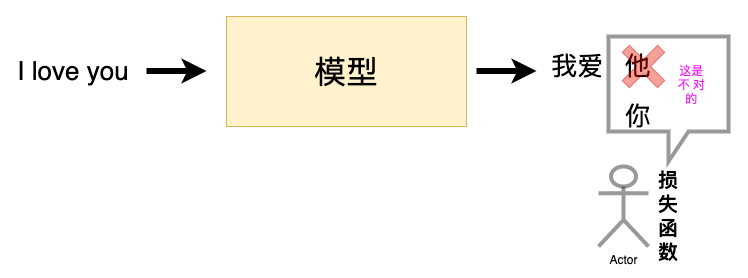
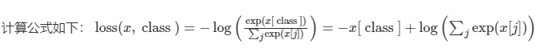
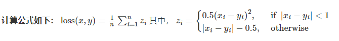
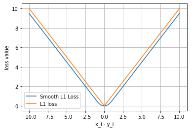
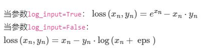
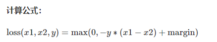
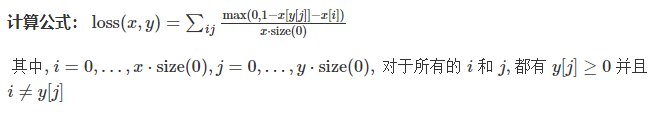
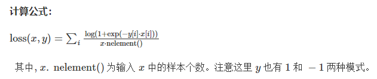
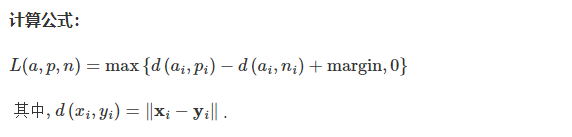

# PyTorch

## Pytorch简介

PyTorch是由FackBook人工智能研究小组开发的一种基于Lua编写的Torch库，由python实现的深度学习库，目前被广泛应用学术界和工业界，而随着Caffe2项目并入PyTorch，PyTorch开始影响到Tensorflow在深度学习应用领域的地位。

## PyTorch优势

1、简洁，相比于其他的框架，PyTorch框架更加简洁。PyTorch的设计追求最少的封装，避免重复造轮子。

2、上手快，掌握Numpy和基本的深度学习知识即可上手。

3、PyTorch有着良好的文档和社区支持。

4、项目开源，在Github上越来越多的开源代码使用PyTorch进行开发。

5、可调试代码。

6、越来越完善扩展库，活力旺盛。

## PyTorch基础

### 张量

几何代数中定义的张量是基于向量和矩阵的推广，如：可将标量视为零阶张量，矢量可视为一阶张量，矩阵可视为二阶张量。

| 张量维度 |                  代表含义                   |
| :------: | :-----------------------------------------: |
| 0维张量  |               代表标量(数字)                |
| 1维张量  |                  代表向量                   |
| 2维张量  |                  代表矩阵                   |
| 3维张量  | 时间序列(股价、文本数据、单张彩色图片(RGB)) |

张量核心是一个数据容器，多数情况下，包含数字、有时候也包含字符串、可想象成一个数字的水桶。

存储在各类型张量的公用数据集类型：

- 3维 = 时间序列
- 4维 = 图像
- 5维 = 视频


例子：

一个图像可以用三个字段表示

```python
(width, height, channel)
```


处理集合。4D张量

```python
(batch_size, width, height, channel) = 4D
```

在PyTorch中，torch.Tensor是存储和交换数据的主要工具。Tensor与Numpy的多维数组相似，然而，Tensor提供GPU计算和自动求梯度等功能，这些功能使Tensor这一数据类型更加适合深度学习。

### 创建Tensor

1、随机初始化矩阵，可通过torch.rand()方法，构造随机初始化的矩阵

```python
import torch
x = torch.rand(4, 3) # 4 行 3 列
print(x)
```

```python
tensor([[0.7569, 0.4281, 0.4722],
        [0.9513, 0.5168, 0.1659],
        [0.4493, 0.2846, 0.4363],
        [0.5043, 0.9637, 0.1469]])
```

2、全0矩阵的构建，可通过torch.zeros()构造一个矩阵全为0，并且通过dtype设置数据类型为long。除此之外，可通过torch.zero_()和torch.zeros_like()将现有的矩阵全部转换为全0矩阵。

```python
import torch
x = torch.zeros(4, 3, dtype = torch.long) # 4 行 3 列 数据类型为long
print(x)
```

```python
tensor([[0, 0, 0],
        [0, 0, 0],
        [0, 0, 0],
        [0, 0, 0]])
```

3、张量的构建，可通过torch.tensor()直接使用数据，构建一个张量

```python
import torch
x = torch.tensor([5, 5, 3])
print(x)
```

```python
tensor([5.5000, 3.0000])
```

4、基于已存在的tensor，创建一个tensor

```python
# 创建一个新的全1矩阵tensor，返回的tensor默认具有相同的torch.dtype和torch.device
# 也可像之前的写法 x = otrch.ones(4, 3, dtype = torch.double)
x = x.new_ones(4, 3, dtype = torch.double)
print(x)

# 重置数据类型
x = torch.randn_like(x, dtype = torch.float)
print(x)

# 结果会有一样的size
# 获取它的维度信息
print(x.size)
print(x.shape)
```

```python
tensor([[1., 1., 1.],
        [1., 1., 1.],
        [1., 1., 1.],
        [1., 1., 1.]], dtype=torch.float64)
tensor([[ 2.7311, -0.0720,  0.2497],
        [-2.3141,  0.0666, -0.5934],
        [ 1.5253,  1.0336,  1.3859],
        [ 1.3806, -0.6965, -1.2255]])
torch.Size([4, 3])
torch.Size([4, 3])
```

返回的torch.size其实是一个tuple，支持所有tuple的操作。可使用索引取得张量的长、宽等数据维度。

构造tensor常见的方法：

|            函数             |                       功能                       |
| :-------------------------: | :----------------------------------------------: |
|        tensor(size)         |                   基础构造函数                   |
|        tensor(data)         |                   类似np.array                   |
|         ones(sizes)         |                     全1矩阵                      |
|        zeros(sizes)         |                     全0矩阵                      |
|         eye(sizes)          |              对角为1，其余为0的矩阵              |
|  arange(start, end, step)   |        从start开始，到end结束，步长为step        |
| linspace(start, end, steps) |     从start开始，到end结束，均分为step(等差)     |
|      rand/randn(sizes)      | rand是[0, 1]均匀分布；randn服从N[0, 1]的正态分布 |
|      normal(mean, std)      |        正态分布(均值为mean，标准差是std)         |
|         randperm(m)         |                     随机排列                     |

### 张量操作

1、加法操作

```python
import torch

# 方法1
y = torch.rand(4, 3)
print(x+y)

# 方法2
print(torch.add(x, y))

# 方法3 in-place，原值修改
y.add_(x)
print(y)
```

```python
tensor([[ 2.8977,  0.6581,  0.5856],
        [-1.3604,  0.1656, -0.0823],
        [ 2.1387,  1.7959,  1.5275],
        [ 2.2427, -0.3100, -0.4826]])
tensor([[ 2.8977,  0.6581,  0.5856],
        [-1.3604,  0.1656, -0.0823],
        [ 2.1387,  1.7959,  1.5275],
        [ 2.2427, -0.3100, -0.4826]])
tensor([[ 2.8977,  0.6581,  0.5856],
        [-1.3604,  0.1656, -0.0823],
        [ 2.1387,  1.7959,  1.5275],
        [ 2.2427, -0.3100, -0.4826]])
```

2、索引操作

类似Numpy。注意：索引出来的结果与原数据共享内存，修改一个，另一个也会跟着修改。如果不想进行修改，可考虑使用copy()等方法。

```python
import torch

x = torch.rand(4, 3)

# 取第二列
print(:, 1) # 0 1 2
```

```python
tensor([-0.0720,  0.0666,  1.0336, -0.6965])
```

```python
y = x[0, :1]
y += 1

print(y)
# 原tensor也被修改了
print(x[0, :])
```

```python
tensor([3.7311, 0.9280, 1.2497])
tensor([3.7311, 0.9280, 1.2497])
```

3、维度变换，张量的维度变换常见的方法有torch.view()和torch.reshpae()

```python
import torch

# 1. torch.view()
x = torch.rand(4, 4)
print(x)

y = x.view(16)
print(y)

# -1指这一我i都的维数由其他维度决定
z = x.view(-1, 8)
print(z)

print(x.size(), y.size(), z.size())
```

```python
tensor([[0.7462, 0.3352, 0.6003, 0.6176],
        [0.4908, 0.8969, 0.0714, 0.4192],
        [0.5545, 0.2102, 0.8996, 0.6602],
        [0.1178, 0.7226, 0.1388, 0.0561]])
tensor([0.7462, 0.3352, 0.6003, 0.6176, 0.4908, 0.8969, 0.0714, 0.4192, 0.5545,
        0.2102, 0.8996, 0.6602, 0.1178, 0.7226, 0.1388, 0.0561])
tensor([[0.7462, 0.3352, 0.6003, 0.6176, 0.4908, 0.8969, 0.0714, 0.4192],
        [0.5545, 0.2102, 0.8996, 0.6602, 0.1178, 0.7226, 0.1388, 0.0561]])
torch.Size([4, 4]) torch.Size([16]) torch.Size([2, 8])
```

注意：torch.view()返回新的tensor与原tensor共享内存(其实是同一个tensor)，更改其中的一个，另一个也会跟着改变。view()仅仅改变了对这个张量的观察角度。

```python
x += 1

print(x)

# 也增加1
print(y)
```

```python
tensor([[1.7462, 1.3352, 1.6003, 1.6176],
        [1.4908, 1.8969, 1.0714, 1.4192],
        [1.5545, 1.2102, 1.8996, 1.6602],
        [1.1178, 1.7226, 1.1388, 1.0561]])
tensor([1.7462, 1.3352, 1.6003, 1.6176, 1.4908, 1.8969, 1.0714, 1.4192, 1.5545,
        1.2102, 1.8996, 1.6602, 1.1178, 1.7226, 1.1388, 1.0561])
```

torch.view()会改变原始张量，在多数情况下，希望原始张量和变换后的张量互补影响。为了使创建的张量和原始张量不共享内存，需要使用torch.reshape()。同样可改变张量的形状，单此函数并不保证返回的是拷贝值。推荐方法使用cloen()创造一个张量副本，然后再使用torch.view()进行函数维度变换。


注意：使用clone()方法，还存在一个好处就是会记录在计算图内，即梯度回传副本时会传到原tensor。取值操作，如果存在一个tensor,可使用.item()来获取value，而不获取其他性质。

```python
import torch

x = randon(1)

print(type(x))
print(type(x.item()))
```

```python
<class 'torch.Tensor'>
<class 'float'>
```

PyTorch中的 Tensor 支持超过一百种操作，包括转置、索引、切片、数学运算、线性代数、随机数等等，具体使用方法可参考[官方文档](https://pytorch.org/docs/stable/tensors.html)。 

### 广播机制

当对两个形状不同的tensor按元素运算时，可能会触发广播(broadcasting)机制，先适当复制元素，使这两个tensor形状相同后再按元素进行运算。

```python
import torch

# arange(start, end, step)从start开始，到end结束，步长为step
# view()维度变换
x = torch.arange(1, 3).view(1, 2)
print(x)

y = torch.arange(1, 4).view(3, 1)
print(y)

print(x + y)
```

```python
tensor([[1, 2]])
tensor([[1],
        [2],
        [3]])
tensor([[2, 3],
        [3, 4],
        [4, 5]])
```

由于x和y分别是1行2列和3行1列，如果要计算x+y，那么在x中第一行的2个元素就会被广播(复制)到第二行和第三行，而y中第一列的3个元素会被广播(复制)到第二列。如此，就可按2个3行2列的矩阵按元素相加。

### 自动求导

PyTorch中，所有神经网络的核心是autograd包。autograd包为张量上的所有操作提供了自动求导机制。它是一个在运行时定义(define-by-run)的框架，这意味着反向传播时根据如何运行来决定的，并且每次迭代可以为不同。

### autograd简介

torch.tensor是这个包的核心类。如果设置它的属性为 .requires_grad为True，将会追踪对于该张量的所有操作。当计算完后可通过.backward()，来自动计算所有的梯度，这个张量的所有梯度将会自动累加到.grad属性。

注意：在y.backward()时，如果y时标量，则不需要为backward()传入任何参数；否则，需要传入一个与y同形的tensor。

阻止一个张量被跟踪历史，可以调用`.detach()`方法将其与计算历史分离，并阻止它未来的计算记录被跟踪。为了防止跟踪历史记录(和使用内存），可以将代码块包装在 `with torch.no_grad(): `中。在评估模型时特别有用，因为模型可能具有 `requires_grad = True` 的可训练的参数，但是我们不需要在此过程中对他们进行梯度计算。

还有一个类对于`autograd`的实现非常重要：`Function`。`Tensor `和` Function` 互相连接生成了一个无环图 (acyclic graph)，它编码了完整的计算历史。每个张量都有一个`.grad_fn`属性，该属性引用了创建 `Tensor `自身的`Function`(除非这个张量是用户手动创建的，即这个张量的`grad_fn`是 `None` )。


下面给出的例子中，张量由用户手动创建，因此grad_fn返回结果是None。

```python
from __future__ import print_function
import torch

x = torch.randn(3, 3, requires_grad = True)
print(x.grad_fn)
```

```python
None
```

如果需要计算导数，可以在 `Tensor` 上调用 `.backward()`。

如果` Tensor` 是一个标量(即它包含一个元素的数据），则不需要为 `backward() `指定任何参数，但是如果它有更多的元素，则需要指定一个`gradient`参数，该参数是形状匹配的张量。

创建一个张量并设置`requires_grad=True`用来追踪其计算历史

```python
import torch

# 创建2行2列全1，被追踪计算历史
x = torch.ones(2, 2, requires_grad = True)
print(x)
```

```python
tensor([[1., 1.],
        [1., 1.]], requires_grad=True)
```

对此张量进行一次计算

```python
# 计算1平方
y = x ** 2
print(y)
```

```python
tensor([[1., 1.],
        [1., 1.]], grad_fn=<PowBackward0>)
```

y是计算的结果，所有它由grad_fn属性

```python
print(y.grad_fn)
```

```python
<PowBackward0 object at 0x000001CB45988C70>
```

对y进行更多操作

```python
z = y * y * 3

# 均值
out = z.mean()

print(z, put)
```

```python
tensor([[3., 3.],
        [3., 3.]], grad_fn=<MulBackward0>) tensor(3., grad_fn=<MeanBackward0>)
```

 `.requires_grad_(...) `原地改变了现有张量的`requires_grad`标志。如果没有指定的话，默认输入的这个标志是` False`。 

```python
# 缺失情况下，默认requires_grad = False
a = torch.randn(2, 2)
print(a.requires_grad)

a.requires_grad_(True)
print(a.requires_grad)

b = (a * a).sum()
print(b.grad_fn)
```

```python
False
True
<SumBackward0 object at 0x000001CB4A19FB50>
```

### 梯度

进行反向传播，因为out是一个标量，因此out.backward()和out.backward(torch.tensor(1.))等价

```python
out.backward()
```

输出导数d(out)/dx

```python
print(x.grad)
```

```python
tensor([[3., 3.],
        [3., 3.]])
```

举例：

~~~ python
import torch

x = torch.randn(1, requires_grad=True)
b = torch.randn(1, requires_grad=True)
w = torch.randn(1, requires_grad=True)
print("x:", x)
print("b:", b)
print("w:", w)
y = w * x
z = y + b

# 计算图在backward一次之后默认就消失，retain_graph=True保存这个图。
z.backward(retain_graph=True)
print()
print("w_grad: ", w.grad)
print(b.grad)
~~~


注意：在Pytorch中不会对非叶子节点保存梯度，但是根据求导的链式法则，计算梯度肯定要。


注意：grad在方向传播过程中是累加的(accumulated)，这意味这每一次运行反向传播，梯度都会累加之前的梯度，所有一般在反向传播之前需要将梯度进行清零。

```python
# 再次进行反向传播一次，注意grad是累加的
out2 = x.sum()
out2.backward()
print(out2)

out3 = x.sum()
x.grad.data.zero_()
out3.backward()
print(x.grad)
```

```python
tensor([[4., 4.],
        [4., 4.]])
tensor([[1., 1.],
        [1., 1.]])
```

雅可比向量积的案例

```python
import torch
x = torch.randn(3, requires_grad = True)
print(x)

y = x * 2
i = 0

# 对y张量L2范数，先对y中每一项取平方，之后累加，最后取根号
while y.data.norm() < 1000:
    y = y * 2
    i = i + 1

print(y)
print(i)
```

在这种情况下，`y `不再是标量。`torch.autograd` 不能直接计算完整的雅可比矩阵，但是如果我们只想要雅可比向量积，只需将这个向量作为参数传给 `backward：` 

```python
v = torch.tensor([0.1, 1.0, 0.0001], dtype=torch.float)
y.backward(v)

print(x.grad)
```

```python
tensor([5.1200e+01, 5.1200e+02, 5.1200e-02])
```

也可以通过将代码块包装在` with torch.no_grad():` 中，来阻止 autograd 跟踪设置了`.requires_grad=True`的张量的历史记录。 

```python
print(x.requires_grad)
print((x ** 2).requires_grad)

with torch.no_grad():
    print((x ** 2).requires_grad)
```

```python
True
True
False
```

如果想要修改 tensor 的数值，但是又不希望被 autograd 记录(即不会影响反向传播)， 那么可以对 tensor.data 进行操作。 

```python
import torch
x = torch.ones(1, requires_grad = True)

# 还是一个tensor
print(x.data) 

# 但已经是独立于计算图之外
print(x.data.requres_grad)

y = 2 * x
# 指示改变值，不会记录在计算图中，所有不会影响梯度传播
x.data *= 100

y.backward()

# 更改data的值也会影响tensor的值
print(x.grad)
```

```python
tensor([1.])
False
tensor([100.], requires_grad=True)
tensor([2.])
```


### 并行计算

在利用PyTorch做深度学习的过程中，可能会遇到数据量较大无法在单块GPU上完成，或者需要提升计算速度的场景，这时就需要用到并行计算。 

1、为什么要做并行计算？

深度学习的发展离不开算力的发展，GPU的出现让模型可以训练的更快，更好。所以，充分利用GPU的性能来提高模型学习的效果，就是PyTorch的并行计算。PyTorch可以在编写完模型之后，让多个GPU来参与训练，减少训练时间。 

2、为什么需要CUDA？

`CUDA`是使用GPU的提供商——NVIDIA提供的GPU并行计算框架。对于GPU本身的编程，使用的是`CUDA`语言来实现的。但是，在使用PyTorch编写深度学习代码时，使用的`CUDA`又是另一个意思。在PyTorch使用 `CUDA`表示要开始要求模型或者数据开始使用GPU了。

在编写程序中，当使用了 `.cuda()` 时，其功能是让模型或者数据从CPU迁移到GPU(0)当中，通过GPU开始计算。

注：

1. 使用GPU时使用的是`.cuda()`而不是使用`.gpu()`。这是因为当前GPU的编程接口采用CUDA，但是市面上的GPU并不是都支持CUDA，只有部分NVIDIA的GPU才支持，AMD的GPU编程接口采用的是OpenCL，在现阶段PyTorch并不支持。
2. 数据在GPU和CPU之间进行传递时会比较耗时，应当尽量避免数据的切换。
3. GPU运算很快，但是在使用简单的操作时，应该尽量使用CPU去完成。
4. 当服务器上有多个GPU，应该指明使用的GPU是哪一块，如果不设置的话，tensor.cuda()方法会默认将tensor保存到第一块GPU上，等价于tensor.cuda(0)，这将会导致爆出`out of memory`的错误。


3、设置方式

```python
# 设置在文件最开始部分
import os

# 设置默认的显卡
os.environ["CUDA_VRSIBLE_DEVICE"] = "2"

# 使用0, 1两块GPU
CUDA_VISBLE_DEVICE = 0, 1
```


4、常见并行方法

**网络结构分布到不同的设备中(Network partitioning)**

在刚开始做模型并行的时候，这个方案使用的比较多。其中主要的思路是，将一个模型的各个部分拆分，然后将不同的部分放入到GPU来做不同任务的计算。其架构如下： 


这里遇到的问题就是，不同模型组件在不同的GPU上时，GPU之间的传输就很重要，对于GPU之间的通信是一个考验。但是GPU的通信在这种密集任务中很难办到，所以这个方式慢慢淡出了视野 

**同一层的任务分布到不同数据中(Layer-wise partitioning)**

第二种方式就是，同一层的模型做一个拆分，让不同的GPU去训练同一层模型的部分任务。其架构如下： 


这样可以保证在不同组件之间传输的问题，但是在需要大量的训练，同步任务加重的情况下，会出现和第一种方式一样的问题。 

**不同的数据分布到不同的设备中，执行相同的任务(Data parallelism)**

第三种方式有点不一样，它的逻辑是，我不再拆分模型，我训练的时候模型都是一整个模型。但是我将输入的数据拆分。所谓的拆分数据就是，同一个模型在不同GPU中训练一部分数据，然后再分别计算一部分数据之后，只需要将输出的数据做一个汇总，然后再反传。其架构如下： 


 这种方式可以解决之前模式遇到的通讯问题。现在的主流方式是**数据并行**的方式(Data parallelism) 

## PyTorch组成模块

### Thinking RL

回顾在完成一项机器学习任务时的步骤:

先**需要对数据进行预处理**，其中重要的步骤包括数据格式的统一和必要的数据变换，同时**划分训练集和测试集**。接下来**选择模型**，并设定**损失函数和优化方法**，以及对应的**超参数**（当然可以使用sklearn这样的机器学习库中模型自带的损失函数和优化器）。最后用模型去拟合训练集数据，并在**验证集/测试集上计算模型表现**。

深度学习和机器学习在流程上类似，但在代码实现上有较大的差异:

首先，**由于深度学习所需的样本量很大，一次加载全部数据运行可能会超出内存容量而无法实现；同时还有批（batch）训练等提高模型表现的策略，需要每次训练读取固定数量的样本送入模型中训练**，因此深度学习在数据加载上需要有专门的设计。

在模型实现上，深度学习和机器学习也有很大差异。由于深度神经网络层数往往较多，同时会有一些用于实现特定功能的层（如卷积层、池化层、批正则化层、LSTM层等），因此**深度神经网络往往需要“逐层”搭建，或者预先定义好可以实现特定功能的模块，再把这些模块组装起来**。这种“定制化”的模型构建方式能够充分保证模型的灵活性，也对代码实现提出了新的要求。

接下来是损失函数和优化器的设定。这部分和经典机器学习的实现是类似的。但由于模型设定的灵活性，**因此损失函数和优化器要能够保证反向传播能够在用户自行定义的模型结构上实现**。

上述步骤完成后就可以开始训练了。前面介绍了GPU的概念和GPU用于并行计算加速的功能，不过**程序默认是在CPU上运行的**，因此在代码实现中，需要把模型和数据“放到”GPU上去做运算，同时还需要保证损失函数和优化器能够在GPU上工作。如果使用多张GPU进行训练，还需要考虑模型和数据分配、整合的问题。此外，后续计算一些指标还需要把数据“放回”CPU。这里涉及到了一系列**有关于GPU的配置和操作**。

**深度学习中训练和验证过程最大的特点在于读入数据是按批的，每次读入一个批次的数据，放入GPU中训练，然后将损失函数反向传播回网络最前面的层，同时使用优化器调整网络参数。这里会涉及到各个模块配合的问题。训练/验证后还需要根据设定好的指标计算模型表现。**

经过以上步骤，一个深度学习任务就完成了。

### 基本配置

对于一个PyTorch项目，需要导入一些Python常用的包来帮助快速实现功能。 常见的包有os、numpy等，此外还需要调用PyTorch自身一些模块便于灵活使用。

比如torch、torch.nn、torch.utils.data.Dataset、torch.utils.data.DataLoader、torch.optimizer等等。 


1、首先导入必须的包

```python
import os
import numpy as np
import torch
import torch.nn as nn
from torch.utils.data import Dataset, DataLoader
import torch.optim as optimizer
```

2、统一设置超参数，方便后续调试时修改

- batch_size
- 初始学习效率
- 训练次数(max_epochs)
- GPU配置

```python
# 批次大小
batch_size = 16

# 优化器的学习效率
max_epoches = 100
```

GPU两种常见设置方法

```python
# 1.使用os.environ，这种情况如果使用GPU不需要设置
os.environ["CUDA_VISIBLE_DEVICES"] = '0, 1'

# 2. 使用"device"，后续对要使用GPU的变量用.to(device)即可
device = torch.device("cuda；1" if torch.cuda.is_available() else "cpu")
```

### 数据读取

PyTorch数据读入是通过Dataset+DataLoader的方式完成的，Dataset定义好数据的格式和数据变换形式，DataLoader用iterative的方式不断读入批次数据。 

定义自己的Dataset类来实现灵活的数据读取，定义的类需要继承PyTorch自身的Dataset类。主要包含三个函数：

- `__init__`: 用于向类中传入外部参数，同时定义样本集
- `__getitem__`: 用于逐个读取样本集合中的元素，可以进行一定的变换，并将返回训练/验证所需的数据
- `__len__`: 用于返回数据集的样本数


下面以cifar10数据集为例给出构建Dataset类的方式： 

```python
import torch
from torchvision import datasets

train_data = dataset.ImageFolder(train_path, transfrom = data_tansform)
val_data = datasets.ImageFolder(val_path, transform = data_transform)
```

这里使用了PyTorch自带的ImageFolder类用来读取按一定结构存储的图片数据(path对应图片存放的目录，目录下包含若干子目录，每个子目录对应属于同一类的图片）


data_transform可对图像进行一定的变换，如翻转。裁剪等操作。


案例：

这里另外给出一个列子，其中图片存放在文件夹，另外一个csv文件给出了图片名称对应的标签，这种需要自己定义Dataset类：

```python
class MyDataset(Dataset):
    
    def __init__(self, data_dir, info_csv, image_list, transform = None):
        """
        Args:
            data_dir: Image 数据文件存储路径
            info_csv: csv 图片标签数据
            image_list: 图片列表
            transform: 样本
        """
        
        # 使用pandas读取csv文件数据
        lable_info = pd.read_csv(info_csv)
        
        # 按行读取列表图片
        image_file = open(image_list).readlines()
        
        self.data_dir = data_dir
        self.info_csv = info_csv
        self.image_list = image_list
        self.transform = transform
        
    def __getitem__(self, index):
        """
        Args:
            index: 元素索引
        Returns:
            返回图片和它的标签
        """
        
        image_name = self.image_file[index].strip('\n')
        raw_label = self.label_info.loc[self.label_info['Image_index'] == image_name]
        label = raw_label.iloc[:,0]
        image_name = os.path.join(self.data_dir, image_name)
        image = Image.open(image_name).convert('RGB')
        
        if self.transform is not None:
            image = self.transform(image)
        return image, label
    
    def __len__(self):
        return len(self.image_file)
```

构建好Dataset后，就可使用DataLoader来按批次读取读入数据

```python
from torch.utils.data import DataLoader

train_loader = torch.utils.data.DataLoader(train_data, batch_size=batch_size, num_workers=4, shuffle=True, drop_last=True)

val_loader = torch.utils.data.DataLoader(val_data, batch_size=batch_size, num_workers=4, shuffle=False)
```

其中：

- batch_size：样是按“批“读入的，batch_size就是每次读入的样本数。
- num_worker：启动多少个进行来用于读取数据。
- shuffle：是否将读入的数据打乱。
- drop_last：对于样本最后一部分没有达到批次数的样本，使其不再参与训练。

查看加载的数据，PyTorch中的DataLoader的读取可以使用next和iter来完成：

```python
import matplotlib.pyplot as plt

images, labels = next(iter(val_loader))
print(images.shape)

plt.imshow(image[0].transpose(1, 2, 0))
plt.show()
```

### 模型构建

人工智能的第三次浪潮受益于卷积神经网络的出现和BP反向传播算法的实现，随着深度学习的发展，研究人员研究出了许许多多的模型，PyTorch中神经网络构造一般是基于 Module 类的模型来完成的，它让模型构造更加灵活。 

1、神经网络的构造

Module类是nn模块里面提供的一个模型构造类，是所有神经网络模块的基类，可继承它来定义需要的模型。下面继承Module类构造多层感知机，这里定义了MLP类重载了Module类的init函数和forward函数，它们分别用于创建模型参数和定义前向计算(前向计算也称为“正向传播”）

```python
import torch
from torch import nn

class MLP(nn.Module):
    # 声明带有模型参数的层，这里声明了两个全连接层
    def __Init(self, **kwargs):
        
        # 调用MLP费用类Block的构造函数来进行初始化，这一在构造函数实列时也可以制定其他函数
        super(MLP, self).__init__(**kwargs)
        
        self.hidden = nn.Linear(784, 256)
        self.act = nn.ReLU()
        self.output = nn.Liner(256, 10)
        
    # 定义模型的前向计算，即如何根据输入X计算返回所需要的模型输出
    def forward(self, x):
        out = slec.act(self.hidden(x))
        return self.output(out)
```

以上的MLP类中无需定义反向传播函数。系统将通过自动求梯度而自动生成反向传播所需的backward函数。

可实例化MLP类得到模型变量net。 下⾯的代码初始化 net 并传入输⼊数据 X 做一次前向计算。其中， net(X) 会调用 MLP 继承⾃自 Module 类的 **call** 函数，这个函数将调⽤用 MLP 类定义的forward 函数来完成前向计算。 

```python
x = torch.rand(2, 784)
net = MLP()
print(net)

net(x)
```

```python
MLP(
  (hidden): Linear(in_features=784, out_features=256, bias=True)
  (act): ReLU()
  (output): Linear(in_features=256, out_features=10, bias=True)
)
tensor([[ 0.0149, -0.2641, -0.0040,  0.0945, -0.1277, -0.0092,  0.0343,  0.0627,
         -0.1742,  0.1866],
        [ 0.0738, -0.1409,  0.0790,  0.0597, -0.1572,  0.0479, -0.0519,  0.0211,
         -0.1435,  0.1958]], grad_fn=<AddmmBackward>)
```

注意：

这里并没有将 Module 类命名为 Layer (层)或者 Model (模型)之类的名字，这是因为该类是一个可供⾃由组建的部件。它的子类既可以是⼀个层(如PyTorch提供的 Linear 类)，⼜可以是一个模型(如这里定义的 MLP 类)，或者是模型的⼀个部分。 


2、神经网络中常见的层

深度学习的一个魅力在于神经网络中各式各样的层，例如全连接层、卷积层、池化层与循环层等等。虽然PyTorch提供了⼤量常用的层，但有时候依然希望⾃定义层。如何使用 Module 来自定义层，从而可以被反复调用。 

**不含模型参数的层**

如何定义一个不含模型参数的自定义层。下⾯构造的 MyLayer 类通过继承 Module 类自定义了一个**将输入减掉均值后输出**的层，并将层的计算定义在了 forward 函数里。这个层里不含模型参数。 

```python
import torch
from torch import nn

class MyLayer(nn.Module):
    def __init__(self, **kwargs):
        super(MyLayer, self).__init__(**kwargs)
        
    def forward(self, x):
        return x-x.mean()
```

测试，实例化该层，然后做前向计算 

```python
layer = MyLayer()
layer(torch.tensor([1, 2, 3, 4, 5], dtype=torch.float))
```

```python
tensor([-2., -1.,  0.,  1.,  2.])
```


**含模参数的层**

自定义含模型参数的自定义层。其中的模型参数可以通过训练学出。

Parameter 类其实是 Tensor 的子类，如果一 个 Tensor 是 Parameter ，那么它会⾃动被添加到模型的参数列表里。所以在⾃定义含模型参数的层时，应该将参数定义成 Parameter ，除了直接定义成 Parameter 类外，还可以使⽤ ParameterList 和 ParameterDict 分别定义参数的列表和字典。

```python
class MyListDense(nn.Module):
    def __init__(self):
        super(MyListDense, self).__init__()
        self.params = nn.ParameterList([nn.Parameter(torch.randn(4, 4)) \
                                        for i in range(3)])
        self.params.append(nn.Parameter(torch.randn(4, 1)))

    def forward(self, x):
        for i in range(len(self.params)):
            x = torch.mm(x, self.params[i])
            
        return x
    
# 实例化MyListDense()
net = MyListDense()
print(net)
```

```python
class MyDictDense(nn.Module):
    def __init__(self):
        super(MyDictDense, self).__init__()
        self.params = nn.ParameterDict({
                'linear1': nn.Parameter(torch.randn(4, 4)),
                'linear2': nn.Parameter(torch.randn(4, 1))
        })
        
        self.params.update({'linear3': nn.Parameter(torch.randn(4, 2))}) # 新增

    def forward(self, x, choice='linear1'):
        return torch.mm(x, self.params[choice])  # torch.mm矩阵相乘

# 实例化
net = MyDictDense()
print(net)
```


**二维卷积层**

二维卷积层将输入和卷积核做互相关运算，并加上一个标量偏差来得到输出。卷积层的模型参数包括了卷积核和标准偏差。在训练模型的时候，通常先对卷积核随机初始化，然后通过不断迭代卷积核和偏差。

```python
import torch
from torch import nn

# 卷积运算(二维互相关)
def corr2d(X, K):
    h, w = K.shape()
    X, K = X.float(), K.float()
    Y = torch.zeros((X.shape[0] - h + 1, X.shape[1] - w + 1)
    for i in range(Y.shape[1]):
         for i in range(Y.shape[1])
             Y[i, j] = (x[i: i + h, j: j + w] * K).sum()
     return Y

# 二维卷积层
class Conv2D(nn.Module):
                    
	# 初始化
    def __init__(self, kernel_size):
        super(Conv2D, self).__init__()
        self.weight = nn.Parameter(torch.randn(kernel_size))
        self.bias = nn.Parameter(torch.randn(1))
    
    def forward(self. x):
        return corr2d(x, self.weight) + self.bias          
```

卷积窗口形状为p × q的卷积层称为p × q卷积层。同样, p × q卷积或p×q卷积核说明卷积核的高和宽分别为p和q。

**填充(padding)指在输入高和出入宽的两侧填充元素，通常是0元素。**

创建一个高和宽为3的二维卷积层，然后设输入高和输出宽两侧的填充数分别为1.给定一个高和宽为9的输入，发现输出高和宽也是8.

```python
import torch
from torch import nn

# 定义一个函数计算卷积层，他对输入和输出做相应的升维和降维
def comp_conv2d(conv2d, x):
      # (1, 1)代表批量大小和通道数
      X = X.view9((1, 1) + X.shape)
      Y = conv2d(X)
  
  # 排除不关心的前两维，批量和通道
  return Y.view(Y.shape[2:])

# 注意：这里两侧分别填充1行或列，所有在两侧一共填充2行或列
conv2d = nn.Conv2d(in_channels = 1, out_channels = 1, kernel_size = 3, padding = 1)

X = torch.rand(8, 8)
comp_conv2d(conv2d, X).shape
```

```python
torch.size([8, 8])
```


当卷积核的高核宽不同时，也可以通过设置高核宽上不同的填充数来使输出核输入具有相同的高和宽。

```python
# 使用高为5，宽为3的卷积核，在高和宽两侧填充数分别为2和1
conv2d = nn.Conv2d(in_channels = 1, out_channels = 1, kernel_size = (5, 3), padding = (2, 1))
comp_conv2d(conv2d, X).shape
```

```python
torch,size(8, 8)
```


在二维互相关运算中，卷积窗口从输入数组的最左上方开始，按从左到右、从上往下的顺序，一次在输入数组上进行滑动，将每次滑动的行数和列数称为步幅(stride)。

```python
conv2d = nn.Conv2d(1, 1, kernel_size = (3, 5), paddong = (0, 1), stride = (3, 4))
comp_conv2d(conv2d, X).shape
```

```python
otrch.size([2, 2])
```

填充可以增加输出的高和宽，常用来使输出和输入具有相同的高和宽。

步幅可以减少输出的高和宽，例如输出的高和宽仅为输入的高和宽的(为大于1的整数)


**池化层**

池化层每次对输入数据的一个固定形状窗口(又称为池化窗口)中的元素计算出书，不同于卷积层里计算输入和核的互相关性，池化层直接计算池化窗口内元素的最大值或者平均值。


该运算也分别叫最大池化和平均池化。在二维最大池化中，池化窗口从输入数组的最左上方开始，按从左到右、从上到下的顺序，一次在输入数组上进行滑动。当池化窗口到某一位置时，窗口中的输入子数组的最大值即输出数组中对应位置的元素。

将池化层的前向计算实现在poll2d函数里

```python
import torch
from torch import nn

# 定义poll2d函数
def pool2d(X, pool_size, mode='max'):
    p_h, p_w = pool_size
    Y = torch.zeros((X.shape[0] - p_h + 1, X.shape[1] - p_w + 1))
    for i in range(Y.shape[0]):
        for j in range(Y.shape[1]):
            if mode == 'max':
                Y[i, j] = X[i: i + p_h, j: j + p_w].max()
            elif mode == 'avg':
                Y[i, j] = X[i: i + p_h, j: j + p_w].mean()
    return Y
```

```python
X = torch.tensor([[0, 1, 2], [3, 4, 5], [6, 7, 8]], dtype=torch.float)
pool2d(X, (2, 2))
```

```python
tensor([[4., 5.],
	[7., 8.]])

pool2d(X, (2, 2), 'avg')

tensor([[2., 3.],
	[5., 6.]])
```

使用`torch.nn`包来构建神经网络。autograd`包，`nn`包则依赖于`autograd`包来定义模型并对它们求导。一个`nn.Module`包含各个层和一个`forward(input)`方法，该方法返回`output`。 


3、模型示例

**LeNet**


前馈神经网络(feed-forwaed network)(LeNet)，它接受一个输入，然后将它送入下一层，一层一层的传递，最后给出输出。

一个神经网络的训练过程：

1.定义包含可学习参数(或者叫权重)的神经网络

2.在输入数据集上进行迭代

3.通过网络处理输入

4.计算loss(输出和正确答案的距离)

5.将梯度反向传播给网络的参数

6.更新网络的权重，一般使用的规则为：

```python
weight = weight - learning_rate * gradient
```

```python
import torch
import torch.nn as nn
import torch.nn.functional as F


class Net(nn.Module):

    def __init__(self):
        super(Net, self).__init__()
        # 输入图像channel：1；输出channel：6；5x5卷积核
        self.conv1 = nn.Conv2d(1, 6, 5)
        self.conv2 = nn.Conv2d(6, 16, 5)
        
        # an affine operation: y = Wx + b
        self.fc1 = nn.Linear(16 * 5 * 5, 120)
        self.fc2 = nn.Linear(120, 84)
        self.fc3 = nn.Linear(84, 10)

    def forward(self, x):
        # 2x2 Max pooling
        x = F.max_pool2d(F.relu(self.conv1(x)), (2, 2))
        
        # 如果是方阵,则可以只使用一个数字进行定义
        x = F.max_pool2d(F.relu(self.conv2(x)), 2)
        x = x.view(-1, self.num_flat_features(x))
        x = F.relu(self.fc1(x))
        x = F.relu(self.fc2(x))
        x = self.fc3(x)
        return x

    def num_flat_features(self, x):
        size = x.size()[1:]  # 除去批处理维度的其他所有维度
        num_features = 1
        for s in size:
            num_features *= s
        return num_features


net = Net()
print(net)
```

```python
Net(
  (conv1): Conv2d(1, 6, kernel_size=(5, 5), stride=(1, 1))
  (conv2): Conv2d(6, 16, kernel_size=(5, 5), stride=(1, 1))
  (fc1): Linear(in_features=400, out_features=120, bias=True)
  (fc2): Linear(in_features=120, out_features=84, bias=True)
  (fc3): Linear(in_features=84, out_features=10, bias=True)
)
```

只需要定义 `forward` 函数，`backward`函数会在使用`autograd`时自动定义，`backward`函数用来计算导数。我们可以在 `forward` 函数中使用任何针对张量的操作和计算。

一个模型的可学习参数可以通过`net.parameters()`返回

```python
params = list(net.parameters())
print(len(params))

# conv1的权重
print(params[0].size())  
```

```python
10
torch.Size([6, 1, 5, 5])
```

尝试一个随机的 32x32 的输入。注意:这个网络 (LeNet）的期待输入是 32x32 的张量。如果使用 MNIST 数据集来训练这个网络，要把图片大小重新调整到 32x32。 

```python
input = torch.randn(1, 1, 32, 32)
out = net(input)
print(out)
```

 清零所有参数的梯度缓存，然后进行随机梯度的反向传播： 

```python
net.zero_grad()
out.backward(torch.randn(1, 10))
```

注意：`torch.nn`只支持小批量处理 (mini-batches）。整个 `torch.nn` 包只支持小批量样本的输入，不支持单个样本的输入。比如，`nn.Conv2d` 接受一个4维的张量，即`nSamples x nChannels x Height x Width `如果是一个单独的样本，只需要使用`input.unsqueeze(0)` 来添加一个“假的”批大小维度。

1.`torch.Tensor` - 一个多维数组，支持诸如`backward()`等的自动求导操作，同时也保存了张量的梯度。

2.`nn.Module `- 神经网络模块。是一种方便封装参数的方式，具有将参数移动到GPU、导出、加载等功能。

3.`nn.Parameter `- 张量的一种，当它作为一个属性分配给一个`Module`时，它会被自动注册为一个参数。

4.`autograd.Function` - 实现了自动求导前向和反向传播的定义，每个`Tensor`至少创建一个`Function`节点，该节点连接到创建`Tensor`的函数并对其历史进行编码。

下面再介绍一个比较基础的案例AlexNet

**AlexNet**


```python
class AlexNet(nn.Module):
    def __init__(self):
        super(AlexNet, self).__init__()
        self.conv = nn.Sequential(
            nn.Conv2d(1, 96, 11, 4), # in_channels, out_channels, kernel_size, stride, padding
            nn.ReLU(),
            nn.MaxPool2d(3, 2), # kernel_size, stride
            
            # 减小卷积窗口，使用填充为2来使得输入与输出的高和宽一致，且增大输出通道数
            nn.Conv2d(96, 256, 5, 1, 2),
            nn.ReLU(),
            nn.MaxPool2d(3, 2),
            
            # 连续3个卷积层，且使用更小的卷积窗口。除了最后的卷积层外，进一步增大了输出通道数。
            # 前两个卷积层后不使用池化层来减小输入的高和宽
            nn.Conv2d(256, 384, 3, 1, 1),
            nn.ReLU(),
            nn.Conv2d(384, 384, 3, 1, 1),
            nn.ReLU(),
            nn.Conv2d(384, 256, 3, 1, 1),
            nn.ReLU(),
            nn.MaxPool2d(3, 2)
        )
        
         # 这里全连接层的输出个数比LeNet中的大数倍。使用丢弃层来缓解过拟合
        self.fc = nn.Sequential(
            nn.Linear(256*5*5, 4096),
            nn.ReLU(),
            nn.Dropout(0.5),
            nn.Linear(4096, 4096),
            nn.ReLU(),
            nn.Dropout(0.5),
            
            # 输出层。由于这里使用Fashion-MNIST，所以用类别数为10，而非论文中的1000
            nn.Linear(4096, 10),
        )

    def forward(self, img):
        feature = self.conv(img)
        output = self.fc(feature.view(img.shape[0], -1))
        return output
```

```python
net = AlexNet()
print(net)
```

```python
AlexNet(
  (conv): Sequential(
    (0): Conv2d(1, 96, kernel_size=(11, 11), stride=(4, 4))
    (1): ReLU()
    (2): MaxPool2d(kernel_size=3, stride=2, padding=0, dilation=1, ceil_mode=False)
    (3): Conv2d(96, 256, kernel_size=(5, 5), stride=(1, 1), padding=(2, 2))
    (4): ReLU()
    (5): MaxPool2d(kernel_size=3, stride=2, padding=0, dilation=1, ceil_mode=False)
    (6): Conv2d(256, 384, kernel_size=(3, 3), stride=(1, 1), padding=(1, 1))
    (7): ReLU()
    (8): Conv2d(384, 384, kernel_size=(3, 3), stride=(1, 1), padding=(1, 1))
    (9): ReLU()
    (10): Conv2d(384, 256, kernel_size=(3, 3), stride=(1, 1), padding=(1, 1))
    (11): ReLU()
    (12): MaxPool2d(kernel_size=3, stride=2, padding=0, dilation=1, ceil_mode=False)
  )
  (fc): Sequential(
    (0): Linear(in_features=6400, out_features=4096, bias=True)
    (1): ReLU()
    (2): Dropout(p=0.5)
    (3): Linear(in_features=4096, out_features=4096, bias=True)
    (4): ReLU()
    (5): Dropout(p=0.5)
    (6): Linear(in_features=4096, out_features=10, bias=True)
  )
)
```


### 模型初始化

在深度学习模型的训练中，权重的初始值极为重要。一个好的权重值，会使模型收敛速度提高，使模型准确率更精确。为了利于训练和减少收敛时间，我们需要对模型进行合理的初始化。 

1、torch.nn.init

通过访问torch.nn.init的官方文档[链接](https://pytorch.org/docs/stable/nn.init.html) ，torch.nn.init`提供了以下初始化方法： `

`1 . `torch.nn.init.uniform_`(tensor, a=0.0, b=1.0) `

`2 . `torch.nn.init.normal_`(tensor, mean=0.0, std=1.0) `

`3 . `torch.nn.init.constant_`(tensor, val) `

`4 . `torch.nn.init.ones_`(tensor) `

`5 . `torch.nn.init.zeros_`(tensor) `

`6 . `torch.nn.init.eye_`(tensor) `

`7 . `torch.nn.init.dirac_`(tensor, groups=1) `

`8 . `torch.nn.init.xavier_uniform_`(tensor, gain=1.0) `

`9 . `torch.nn.init.xavier_normal_`(tensor, gain=1.0) `

`10 . `torch.nn.init.kaiming_uniform_`(tensor, a=0, mode='fan__in',nonlinearity='leaky_relu') `

`11 . `torch.nn.init.kaiming_normal_`(tensor, a=0, mode='fan_in', nonlinearity='leaky_relu') `

`12 . `torch.nn.init.orthogonal_`(tensor, gain=1) `

`13 . `torch.nn.init.sparse_`(tensor, sparsity, std=0.01) `

 `14 . `torch.nn.init.calculate_gain`(nonlinearity, param=None) 

关于计算增益如下表： 

|  nonlinearity   |        gain         |
| :-------------: | :-----------------: |
| Linear/Identity |          1          |
|  Conv{1,2,3}D   |          1          |
|     Sigmod      |          1          |
|      Tanh       |         5/3         |
|      ReLU       |       sqrt(2)       |
|   Leaky Relu    | sqrt(2/1+neg_slop^2 |

可以发现这些函数除了`calculate_gain`，所有函数的后缀都带有下划线，意味着这些函数将会直接原地更改输入张量的值 


2、torch.nn.init使用

根据实际模型来使用`torch.nn.init`进行初始化，通常使用`isinstance`来进行判断模块（回顾3.4模型构建）属于什么类型。 

```python
import torch
import torch.nn as nn

conv = nn.Conv2d(1, 3, 3)
linear = nn.Linear(10, 1)

isinstance(conv, nn.Conv2d) # True
isinstance(linear, nn.Conv2d) # False
```

```python
True
False
```

对于不同的类型层，我们就可以设置不同的权值初始化的方法。 

```python
# 查看随机初始化的conv参数
conv.weight.data

# 查看linear发参数
linear.weight.data
```

```python
tensor([[[[ 0.1174,  0.1071,  0.2977],
          [-0.2634, -0.0583, -0.2465],
          [ 0.1726, -0.0452, -0.2354]]],
        [[[ 0.1382,  0.1853, -0.1515],
          [ 0.0561,  0.2798, -0.2488],
          [-0.1288,  0.0031,  0.2826]]],
        [[[ 0.2655,  0.2566, -0.1276],
          [ 0.1905, -0.1308,  0.2933],
          [ 0.0557, -0.1880,  0.0669]]]])

tensor([[-0.0089,  0.1186,  0.1213, -0.2569,  0.1381,  0.3125,  0.1118, -0.0063, -0.2330,  0.1956]])
```


```python
# 对conv进行kaiming初始化
torch.nn.init.laiming_normal_(conv.weight.data)
conv.weught.data

# 对linear进行常数初始化
torch.nn.init.constant_(linear.weight.data, 0.3)
linear.weight.data
```

```python
tensor([[[[ 0.3249, -0.0500,  0.6703],
          [-0.3561,  0.0946,  0.4380],
          [-0.9426,  0.9116,  0.4374]]],
        [[[ 0.6727,  0.9885,  0.1635],
          [ 0.7218, -1.2841, -0.2970],
          [-0.9128, -0.1134, -0.3846]]],
        [[[ 0.2018,  0.4668, -0.0937],
          [-0.2701, -0.3073,  0.6686],
          [-0.3269, -0.0094,  0.3246]]]])
tensor([[0.3000, 0.3000, 0.3000, 0.3000, 0.3000, 0.3000, 0.3000, 0.3000, 0.3000,0.3000]])
```


**初始化函数的封装**

将各种初始化方法定义为一个initiallize_weights()的函数并在模型初始化后进行使用

```python
def initialize_weight(self):
    for m in slef.modules():
         # 判断是否属于Conv2d
            if isinstance(, nn.Conv2d):
                torch.nn.init.xavier_(m.weight.data)
                
                # 判断是否偏置
                if m.bias is not None:
                    torch.nn.init.constant_(m.bias, 0.3)
            elif isinstance(m, nn.Linear):
                torch.n.init.normal_(m.weight.data, 0.1)
                if m.bias is not None:
                    torch.nn.init.zeros_(m.bias.data)
            elif isinstance(m, nn.BatchNormal2d):
                m.weight.data.fill_(1)
                m.bias.data.zeros_()
```

这段代码流程是遍历当前模型的每一层，然后判断各层属于什么类型，然后根据不同类型层，设定不同的权值初始化方法。可以通过下面的例程进行一个简短的演示： 

```python
# 定义模型
class MLP(nn.Module):
    
    # 声明带有模型参数的层，这里声明了两个全连接层
    def __init__(self, **kwargs):
        # 调用MLP父类的BLOCK的构造函数进行必要的初始化，这一在构造实列时可以指定其他函数
        super(MLP, self).__init__(**kwargs)
    self.hidden = nn.Conv2d(1,1,3)
    self.act = nn.ReLU()
    self.output = nn.Linear(10,1)
    
   # 定义模型的前向计算，即如何根据输入x计算返回所需要的模型输出
  def forward(self, x):
    o = self.act(self.hidden(x))
    return self.output(o)

mlp = MLP()
print(list(mlp.parameters()))
print("-------初始化-------")

initialize_weights(mlp)
print(list(mlp.parameters()))
```

```python
[Parameter containing:
tensor([[[[ 0.2103, -0.1679,  0.1757],
          [-0.0647, -0.0136, -0.0410],
          [ 0.1371, -0.1738, -0.0850]]]], requires_grad=True), Parameter containing:
tensor([0.2507], requires_grad=True), Parameter containing:
tensor([[ 0.2790, -0.1247,  0.2762,  0.1149, -0.2121, -0.3022, -0.1859,  0.2983,
         -0.0757, -0.2868]], requires_grad=True), Parameter containing:
tensor([-0.0905], requires_grad=True)]
"-------初始化-------"
[Parameter containing:
 tensor([[[[-0.3196, -0.0204, -0.5784],
           [ 0.2660,  0.2242, -0.4198],
           [-0.0952,  0.6033, -0.8108]]]], requires_grad=True),
 Parameter containing:
 tensor([0.3000], requires_grad=True),
 Parameter containing:
 tensor([[ 0.7542,  0.5796,  2.2963, -0.1814, -0.9627,  1.9044,  0.4763,  1.2077,
           0.8583,  1.9494]], requires_grad=True),
 Parameter containing:
 tensor([0.], requires_grad=True)]
```


### 损失函数

在深度学习广为使用的今天，可以在脑海里清晰的知道，一个模型想要达到很好的效果需要学习，也就是常说的训练。一个好的训练离不开优质的负反馈，这里的损失函数就是模型的负反馈。 



在PyTorch中，损失函数必不可少。它是数据输入到模型中，产生的结果于真实标签的评价指标，模型可以按照损失函数的目标做出改进。

1、二分类交叉熵损失函数

> 交叉熵概念：https://www.zhihu.com/question/65288314/answer/244557337

```python
torch.nn.BCELoss(weight=None, size_average=None, reduce=None, reduction='mean')
```

功能：计算二分类任务时的交叉熵(Cross Entropy)函数。在二分类中，label是{0, 1}，对于进行交叉熵函数的input为概率分布的形式，一般来说，input为sigmoid激活层的输出，或者softmax的输出。

参数：

weight：每个类别的loss设置权值

size_average：数据为bool，为True时，返回的loss为平均值，为False时，返回的各样本的loss之和

reduce：数据类型为bloo，为True时，loss的返回是标量


```python
# 激活函数
m = nn.Sigmoid()

# 二分类交叉熵损失函数
loss = nn.BCELoss()

# 数据输入
input = torch.randn(3, requires_grad = True)

# 目标或标签数据
target = torch.empty(3).random_(2)

# 通过损失函数输出结果
output = loss(m(input), target)
output.backward()
```

```python
print('BCELoss损失函数的计算结果为',output)
```

```python
BCELoss损失函数的计算结果为 tensor(0.5732, grad_fn=<BinaryCrossEntropyBackward>)
```


2、交叉熵损失函数

```python
torch.nn.CrossEntropyLoss(weight=None, size_average=None, ignore_index=-100, reduce=None, reduction='mean')
```

功能：计算交叉熵函数

参数：

weight：每个类别的loss设置权值

size_average：数据为bool，为True时，返回的loss为平均值，为False时，饭hi的各个样本的loss之和

ignore_index：忽略某个类的损失函数

reduce：数据类型为bool，为True时，loss的返回是标量



```python
# 交叉熵损失函数
loss = nn.CrossEntropyLoss()

# 输入数据
input = torch.randn(3, 5, requires_gead = True)

target = torch.empty(3, dtype = torch.long).random_(5)

output = loss(input, target)
output.backward()
```

```python
print(output)
```

```python
tensor(2.0115, grad_fn=<NllLossBackward>)
```


3、L1损失函数

```python
torch.nn.L1Loss(size_average=None, reduce=None, reduction='mean')
```

功能：计算输出y和真实标签target之间的差值的绝对值

reduction参数决定了计算模式，有三种计算模式可选：

none：逐个元素计算

sun：所有元素求和，返回标量

mean：加权平均，返回标量

如果选择none，那么返回的结果是和输出元素相同尺寸的，默认计算方式就是求平均。


```python
# L1损失函数
loss = nn.L1Loss()

# 输入数据
input = torch.randn(3, 5, requires_grad = True)

# 标签
target = torch.randn(3, 5)

# 输出结果
output = loss(input, target)

# 回调函数
output.backward()
```

```python
print('L1损失函数的计算结果为',output)
```

```python
L1损失函数的计算结果为 tensor(1.5729, grad_fn=<L1LossBackward>)
```


4、MSE损失函数

```python
torch.nn.MSELoss(size_average=None, reduce=None, reduction='mean')
```

功能：计算输出y和真实标签target之差的平方

与L1Loss一样，MSELoss损失函数中，reduction参数决定了计算模式，有三种计算模式可选：

none：逐个元素计算

sun：所有元素求和，返回标量

mean：加权平均，返回标量

如果选择none，那么返回的结果是和输出元素相同尺寸的，默认计算方式就是求平均。


```python
# MSE损失函数
loss = nn.MSELoss()

# 输入数据
input = torch.randn(3, 5, requires_grad = True)

# 目标数据
target = torch.randn(3, 5)

# 输出数据
output = loss(input, target)

# 回调函数
output.backward()
```

```python
print('MSE损失函数的计算结果为',output)
```

```python
MSE损失函数的计算结果为 tensor(1.6968, grad_fn=<MseLossBackward>)
```


5、平滑L1(Smooth L1)损失函数

```python
torch.nn.SmoothL1Loss(size_average=None, reduce=None, reduction='mean', beta=1.0)
```

功能：L1的平滑输出，其功能就是减轻离群点带来的影响

reduction参数决定了计算模式，有三种计算模式可选：

none：逐个元素进行计算

sum：所有元素进行求和，返回标量。默认计算方式是平均。

提醒：往下的损失函数中，关于reduction这个参数依旧会参在。



```python
# 平滑L1损失函数
loss = nn.SmoothL1Loss()

# 输入数据
input = torch.randn(3, 5, requires_grad = True)

# 标签或检测数据
target = torch.randn(3, 5)

# 将输入数据和标签数据，放入损失函数中进行输出
output = loss(input. target)
output.backward()
```

```python
print('SmoothL1Loss损失函数的计算结果为',output)
```

```python
SmoothL1Loss损失函数的计算结果为 tensor(0.7808, grad_fn=<SmoothL1LossBackward>)
```

**平滑L1与L1的对比**

通过可视化两种损失函数曲线来对比平滑L1和L1两种损失函数的区别 

```python
# 输入数据为等差数据集
inputs = torch.linspace(-10, 10, steps=5000)
target = torch.zeros_like(inputs)

loss_f_smooth = nn.SmoothL1Loss(reduction='none')
loss_smooth = loss_f_smooth(inputs, target)
loss_f_l1 = nn.L1Loss(reduction='none')
loss_l1 = loss_f_l1(inputs,target)

plt.plot(inputs.numpy(), loss_smooth.numpy(), label='Smooth L1 Loss')
plt.plot(inputs.numpy(), loss_l1, label='L1 loss')
plt.xlabel('x_i - y_i')
plt.ylabel('loss value')
plt.legend()
plt.grid()
plt.show()
```

 可以看出，对于`smoothL1`来说，在 0 这个尖端处，过渡更为平滑。 




6、目标泊松分布的负对数似然损失

```python
torch.nn.PoissonNLLLoss(log_input=True, full=False, size_average=None, eps=1e-08, reduce=None, reduction='mean')
```

功能：播送分布的负对数似然损失

参数：

log_input：输入是否为对数形式，决定计算公式

full：计算所有loss，默认为False

eps：修正项，避免input为0时，log(input)为nan的情况

数学公式：



```python
# 泊松负对数损失函数
loss = nn.PoissonNLLLoss()

# 对数数据
log_input = torch.randn(5, 2, requires_grad = True)

target = torch.randn(5, 2)

output = loss(log_input, target)
output.backward()
```

```python
print('PoissonNLLLoss损失函数的计算结果为',output)
```

```python
PoissonNLLLoss损失函数的计算结果为 tensor(0.7358, grad_fn=<MeanBackward0>)
```


7、KL散度

```python
torch.nn.KLDivLoss(size_average=None, reduce=None, reduction='mean', log_target=False)
```

功能：计算KL散度，也就是计算相对熵。用于连续分布的距离度量，并且对离散采样的连续输出空间分布进行回归通过很有效果。

参数：

reduction：计算模式，可为：none/sum/mean/batchmean

```python
none：逐个元素进行计算
sum：所有元素进行求和，返回标量
mean：加权平均，返回标量
batchmean：batchsize 维度求平均值
```


```python
# 输入数据
inputs = torch.tensor([[0.5, 0.3, 0.2], [0.2, 0.3, 0.5]])

# 标签
target = torch.tensor([[0.9, 0.05, 0.05], [0.1, 0.7, 0.2]], dtype=torch.float)

# KL离散
loss = nn.KLDivLoss()
output = loss(inputs,target)

print('KLDivLoss损失函数的计算结果为',output)
```

```python
KLDivLoss损失函数的计算结果为 tensor(-0.3335)
```


8、MarginRankingLoss

```python
torch.nn.MarginRankingLoss(margin=0.0, size_average=None, reduce=None, reduction='mean')
```

功能：计算两个向量之间的相似度，用于排序任务。该方法用于计算两组数据之间的差异

参数：

margin：边界值，x1和x2之间的差异值

reduction：计算模式，可为none/sum/mean



```python
# MRL损失函数
loss = nn.MarginRankingLoss()

# 输入数据
input1 = torch.randn(3, requires_grad=True)
input2 = torch.randn(3, requires_grad=True)

# 标签
target = torch.randn(3).sign()

# 输出
output = loss(input1, input2, target)
output.backward()

print('MarginRankingLoss损失函数的计算结果为',output)
```

```python
MarginRankingLoss损失函数的计算结果为 tensor(0.7740, grad_fn=<MeanBackward0>)
```


9、多标签边界损失函数

```python
torch.nn.MultiLabelMarginLoss(size_average=None, reduce=None, reduction='mean')
```

功能：对于多标签分类问题计算损失函数

参数：

reduction：计算损失模式吗，可为none/sum.mean



```python
# 多标签边界损失函数
loss = nn.MultiLabelMarginLoss()

# 浮点型张量输入数据
x = torch.FloatTensor([[0.9, 0.2, 0.4, 0.8]])

# for target y, only consider labels 3 and 0, not after label -1
y = torch.LongTensor([[3, 0, -1, 1]])# 真实的分类是，第3类和第0类
output = loss(x, y)

print('MultiLabelMarginLoss损失函数的计算结果为',output)
```

```python
MultiLabelMarginLoss损失函数的计算结果为 tensor(0.4500)
```


10、二分类损失函数

```python
torch.nn.SoftMarginLoss(size_average=None, reduce=None, reduction='mean')
torch.nn.(size_average=None, reduce=None, reduction='mean')
```

功能：计算二分类的logistic损失

参数：

reduction：计算模式，可为none/mean/sum




```python
# 两个样本，两个神经元
inputs = torch.tensor([[0.3, 0.7], [0.5, 0.5]])  

# 该 loss 为逐个神经元计算，需要为每个神经元单独设置标签
target = torch.tensor([[-1, 1], [1, -1]], dtype=torch.float)  

loss_f = nn.SoftMarginLoss()
output = loss_f(inputs, target)

print('SoftMarginLoss损失函数的计算结果为',output)
```

```python
SoftMarginLoss损失函数的计算结果为 tensor(0.6764)
```


11、多分类的折页损失

```python
torch.nn.MultiMarginLoss(p=1, margin=1.0, weight=None, size_average=None, reduce=None, reduction='mean')
```

功能：计算多分类的折页损失

参数：

reduction：计算模式，可为none/mean/sum

p：可选1或2

weight：各类别的loss设置权值

margin：边界值


```python
inputs = torch.tensor([[0.3, 0.7], [0.5, 0.5]]) 
target = torch.tensor([0, 1], dtype=torch.long) 

# 多分类折页损失函数
loss_f = nn.MultiMarginLoss()
output = loss_f(inputs, target)

print('MultiMarginLoss损失函数的计算结果为',output)
```

```python
MultiMarginLoss损失函数的计算结果为 tensor(0.6000)
```


12、三元组损失

```python
torch.nn.TripletMarginLoss(margin=1.0, p=2.0, eps=1e-06, swap=False, size_average=None, reduce=None, reduction='mean')
```

功能：计算三元组损失

三元组： 这是一种数据的存储或者使用格式。<实体1，关系，实体2>。在项目中，也可以表示为< `anchor`, `positive examples` , `negative examples`> 。 在这个损失函数中，希望去`anchor`的距离更接近`positive examples`，而远离`negative examples` 

参数：

reduction：计算模式，可为none/mean/sum

p：可选1或2

margin：边界值



```python
# 三元组损失函数
triplet_loss = nn.TripletMarginLoss(margin=1.0, p=2)

anchor = torch.randn(100, 128, requires_grad=True)
positive = torch.randn(100, 128, requires_grad=True)
negative = torch.randn(100, 128, requires_grad=True)
output = triplet_loss(anchor, positive, negative)

output.backward()
print('TripletMarginLoss损失函数的计算结果为',output)
```

```python
TripletMarginLoss损失函数的计算结果为 tensor(1.1667, grad_fn=<MeanBackward0>)
```


13、HingEmBeddingLoss

```python
torch.nn.HingeEmbeddingLoss(margin=1.0, size_average=None, reduce=None, reduction='mean')
```

功能：对输出的embedding结果做Hing损失计算

参数：

reduction：计算模式，可为none/sum/mean

margin：边界值


让个输出的是正例yn=1,那么loss就是x，如果输出的是负例y=-1，那么输出的loss就是要做一个比较。 

```python
loss_f = nn.HingeEmbeddingLoss()
inputs = torch.tensor([[1., 0.8, 0.5]])
target = torch.tensor([[1, 1, -1]])
output = loss_f(inputs,target)

print('HingEmbeddingLoss损失函数的计算结果为',output)
```

```python
HingEmbeddingLoss损失函数的计算结果为 tensor(0.7667)
```


14、余弦相似度

```python
torch.nn.CosineEmbeddingLoss(margin=0.0, size_average=None, reduce=None, reduction='mean')
```

功能： 对两个向量做余弦相似度 

参数:

reduction：计算模式，可为 none/sum/mean。

margin：可取值[-1,1] ，推荐为[0,0.5] 。


这个损失函数应该是最广为人知的。对于两个向量，做余弦相似度。将余弦相似度作为一个距离的计算方式，如果两个向量的距离近，则损失函数值小，反之亦然。 

```python
loss_f = nn.CosineEmbeddingLoss()
inputs_1 = torch.tensor([[0.3, 0.5, 0.7], [0.3, 0.5, 0.7]])
inputs_2 = torch.tensor([[0.1, 0.3, 0.5], [0.1, 0.3, 0.5]])
target = torch.tensor([[1, -1]], dtype=torch.float)
output = loss_f(inputs_1,inputs_2,target)

print('CosineEmbeddingLoss损失函数的计算结果为',output)
```

```python
CosineEmbeddingLoss损失函数的计算结果为 tensor(0.5000)
```


15、CTC损失函数

```python
torch.nn.CTCLoss(blank=0, reduction='mean', zero_infinity=False)
```

功能：用于解决时序类数据的分类

计算连续时间序列和目标序列之间的损失。CTCLoss对输入和目标的可能排列的概率进行求和，产生一个损失值，这个损失值对每个输入节点来说是可分的。输入与目标的对齐方式被假定为 "多对一"，这就限制了目标序列的长度，使其必须是≤输入长度。

参数:

reduction：计算模式，可为 none/sum/mean。

blank：blank label。

zero_infinity：无穷大的值或梯度值为

```python
# Target are to be padded
T = 50      # Input sequence length
C = 20      # Number of classes (including blank)
N = 16      # Batch size
S = 30      # Target sequence length of longest target in batch (padding length)
S_min = 10  # Minimum target length, for demonstration purposes

# Initialize random batch of input vectors, for *size = (T,N,C)
input = torch.randn(T, N, C).log_softmax(2).detach().requires_grad_()

# Initialize random batch of targets (0 = blank, 1:C = classes)
target = torch.randint(low=1, high=C, size=(N, S), dtype=torch.long)

input_lengths = torch.full(size=(N,), fill_value=T, dtype=torch.long)
target_lengths = torch.randint(low=S_min, high=S, size=(N,), dtype=torch.long)
ctc_loss = nn.CTCLoss()
loss = ctc_loss(input, target, input_lengths, target_lengths)
loss.backward()


# Target are to be un-padded
T = 50      # Input sequence length
C = 20      # Number of classes (including blank)
N = 16      # Batch size

# Initialize random batch of input vectors, for *size = (T,N,C)
input = torch.randn(T, N, C).log_softmax(2).detach().requires_grad_()
input_lengths = torch.full(size=(N,), fill_value=T, dtype=torch.long)

# Initialize random batch of targets (0 = blank, 1:C = classes)
target_lengths = torch.randint(low=1, high=T, size=(N,), dtype=torch.long)
target = torch.randint(low=1, high=C, size=(sum(target_lengths),), dtype=torch.long)
ctc_loss = nn.CTCLoss()
loss = ctc_loss(input, target, input_lengths, target_lengths)
loss.backward()

print('CTCLoss损失函数的计算结果为',loss)
```

```python
CTCLoss损失函数的计算结果为 tensor(16.0885, grad_fn=<MeanBackward0>)
```

### 训练和评估

加载数据开始训练模型。

1、首先应该设置模型的状态：如果是训练状态，那么模型的参数应该支持反向传播的修改；如果是验证/测试状态，则不应该修改模型参数。在PyTorch中，模型的状态设置非常简便，如下的两个操作二选一即可： 

```python
# 训练状态
model.train()

# 验证/测试状态
model.eval()
```

2、前面在DataLoader构建完成后介绍了如何从中读取数据，在训练过程中使用类似的操作即可，区别在于此时要用for循环读取DataLoader中的全部数据。 

```python
for data, label in train_loader:
```

3、之后将数据放到GPU上用于后续计算，此处以``.cuda()``为列

```python
data, label = data.cuda(), label.cuda()
```

4、开始使用当前批次数据进行训练时，应当将优化器的梯度置为零

```python
optimizer.zero_grad()
```

5、再将data送入模型中进行训练

```python
output = modle(data)
```

6、根据预先定义的criterion计算损失函数

```python
loss = criterion(output, label)
```

7、将loss反向传播回网络

```python
loss.backward()
```

8、使用优化器更新模型参数

```python
optimizer.step
```

以上为一个完整的训练过程，后续还可计算模型准确效率等指标。

验证/测试的流程与训练过程一致，不同点在于：

1.需要预先设置troch.no_grad，以及将model调至eval模式

2.不需要将优化器梯度置为零

3.不需要将loss反向回传到网络

4.不需要更新optimiter


一个完整的图像分类的训练过程，如下：

```python
def train(epoch):
    
    # 开始训练状态
    model.train()
    train_loss = 0
    for data label in train_loader:
        data, label = data.cuda(), label.cuda()
        optimiter.zero_grad()
        
        # 模型数据输出
        output = model(data)
        
        # 损失函数
        loss = criterion(label, output)
        loss.backward()
        
        # 更新模型参数
        optimiter.step()
        train_loss += loss.item()*data.size(0)
        
    train_loss = train_loss/len(train_loader.dataset)
    print('Epoch: {} \tTraining Loss: {:.6f}'.format(epoch, train_loss))
```

对应的，一个完整图像分类的验证过程，如下：

```python
def val(epoch):
    
    # 验证
    model.eval()
    val_loss = 0
    
    with torch.no_grad():
        for data, label in val_loader:
            data, label = data.cuda(), label.cuda()
            output = model(data)
            preds = torch.argmax(output, 1)
            loss = criterion(output, label)
            val_loss += loss.item()*data.size(0)
            running_accu += tor.sum(preds == label.data)
        val_loss = val_loss / len(val_loader.dataset)
        print('Epoch: {} \tTraining Loss: {:.6f}'.format(epoch, val_loss))
```

### 可视化

在PyTorch深度学习中，可视化是一个可选项，指的是某些任务在训练完成后，需要对一些必要的内容进行可视化，比如分类的ROC曲线，卷积网络中的卷积核，以及训练/验证过程的损失函数曲线等等。 

### 优化器

深度学习的目标是通过不断改变网络参数，使得参数能够对输入做各种非线性变换拟合输出，本质上就是一个函数去寻找最优解，只不过这个最优解是一个矩阵，而如何快速求得这个最优解是深度学习研究的一个重点，以经典的resnet-50为例，它大约有2000万个系数需要进行计算，那么如何计算出这么多系数，有以下两种方法： 

1.第一种，直接暴力穷举一遍参数，这种方法实施可能性基本为0，堪比愚公移山的plus难度

2.为了使求解参数过程更快，人们提出了第二种办法，即BP+优化器求解


优化器时根据网络反向传播的梯度信息来更新网络的参数，以起到降低loss函数计算值，使得模型输出更加接近真实标签。

1、PyTorch提供的优化器

Pytorch提供了一个优化器的库torch.optim，在这里面提供了十种优化器。

-   torch.optim.ASGD
-   torch.optim.Adadelta
-   torch.optim.Adagrad
-   torch.optim.Adam
-   torch.optim.AdamW
-   torch.optim.Adamax
-   torch.optim.LBFGS
-   torch.optim.RMSprop
-   torch.optim.Rprop
-   torch.optim.SGD
-   torch.optim.SparseAdam

以上优化算法均继承与Optimiter，Optimiter时所有优化器的基类，定义如下：

```python
class Optimiter(object):
    def __init(self, params, defaults):
        self.defaults = defaults
        self.state = defaultdict(dict)
        self.param_groups = []
```

2、Optimiter属性

defaults：存储的是优化器的超参数，例子如下：

```python
{'lr': 0.1, 'momentum': 0.9, 'dampening': 0, 'weight_decay': 0, 'nesterov': False}
```

state：参数的缓存，例子如下；

```python
defaultdict(<class 'dict'>, {tensor([[ 0.3864, -0.0131],
        [-0.1911, -0.4511]], requires_grad=True): {'momentum_buffer': tensor([[0.0052, 0.0052],
        [0.0052, 0.0052]])}})
```

param_groups：管理的参数组，为一个list，其中每一个元素是一个字典，顺序是params，lr，momentum，dampening，weight_decay，nesterov，例子如下： 

```python
[{'params': [tensor([[-0.1022, -1.6890],[-1.5116, -1.7846]], requires_grad=True)], 'lr': 1, 'momentum': 0, 'dampening': 0, 'weight_decay': 0, 'nesterov': False}]
```

3、Optimiter方法

zero_grad()：清空所管理参数的梯度， PyTorch的特性是张量的梯度不自动清零，因此每次反向传播后都需要清空梯度。 

```python
def zero_grad(self, set_to_none: bool = False):
    for group in self.param_groups:
        for p in group['params']:
            if st_to_none:
                p.grad = None
            else:
                if p.grad.grad_fn is not None:
                    p.grad.detach_()
                else:
                    p.grad.requires_grad_(False)
                # 梯度设置为0
                p.grad_zero_()
```

step()：执行一步梯度更新，参数更新

```python
def step(slef, closure):
    raise NotImplementedError
```

add_param_group()：添加参数组

```python
def add_param_group(self, param_group):
    assert isinstance(param_group, dict), "param group must be a dict"
    
	# 检查类型是否为tensor
    params = param_group['params']
    if isinstance(params, torch.Tensor):
        param_group['params'] = [params]
    elif isinstance(params, set):
        raise TypeError('optimizer parameters need to be organized in ordered collections, but '
                        'the ordering of tensors in sets will change between runs. Please use a list instead.')
    else:
        param_group['params'] = list(params)
        
    for param in param_group['params']:
        if not isinstance(param, torch.Tensor):
            raise TypeError("optimizer can only optimize Tensors, "
                            "but one of the params is " + torch.typename(param))
        if not param.is_leaf:
            raise ValueError("can't optimize a non-leaf Tensor")

    for name, default in self.defaults.items():
        if default is required and name not in param_group:
            raise ValueError("parameter group didn't specify a value of required optimization parameter " +
                             name)
        else:
            param_group.setdefault(name, default)

    params = param_group['params']
    if len(params) != len(set(params)):
        warnings.warn("optimizer contains a parameter group with duplicate parameters; "
                      "in future, this will cause an error; "
                      "see github.com/pytorch/pytorch/issues/40967 for more information", stacklevel=3)
	
    # 上面好像都在进行一些类的检测，报Warning和Error
    param_set = set()
    for group in self.param_groups:
        param_set.update(set(group['params']))

    if not param_set.isdisjoint(set(param_group['params'])):
        raise ValueError("some parameters appear in more than one parameter group")
        
	# 添加参数
    self.param_groups.append(param_group)
```

load_state_dict()：加载状态参数字典，可以用来进行模型的断点续训练，继续上次的参数进行训练

```python
def load_state_dict(self, state_dict):
    r"""Loads the optimizer state.

    Arguments:
        state_dict (dict): optimizer state. Should be an object returned
            from a call to :meth:`state_dict`.
    """
    # deepcopy, to be consistent with module API
    state_dict = deepcopy(state_dict)
    # Validate the state_dict
    groups = self.param_groups
    saved_groups = state_dict['param_groups']

    if len(groups) != len(saved_groups):
        raise ValueError("loaded state dict has a different number of "
                         "parameter groups")
    param_lens = (len(g['params']) for g in groups)
    saved_lens = (len(g['params']) for g in saved_groups)
    if any(p_len != s_len for p_len, s_len in zip(param_lens, saved_lens)):
        raise ValueError("loaded state dict contains a parameter group "
                         "that doesn't match the size of optimizer's group")

    # Update the state
    id_map = {old_id: p for old_id, p in
              zip(chain.from_iterable((g['params'] for g in saved_groups)),
                  chain.from_iterable((g['params'] for g in groups)))}

    def cast(param, value):
        r"""Make a deep copy of value, casting all tensors to device of param."""
   		.....

    # Copy state assigned to params (and cast tensors to appropriate types).
    # State that is not assigned to params is copied as is (needed for
    # backward compatibility).
    state = defaultdict(dict)
    for k, v in state_dict['state'].items():
        if k in id_map:
            param = id_map[k]
            state[param] = cast(param, v)
        else:
            state[k] = v

    # Update parameter groups, setting their 'params' value
    def update_group(group, new_group):
       ...
    param_groups = [
        update_group(g, ng) for g, ng in zip(groups, saved_groups)]
    self.__setstate__({'state': state, 'param_groups': param_groups})
```

state_dict()：获取优化器当前状态信息字典

```python
def state_dict(self):
    r"""Returns the state of the optimizer as a :class:`dict`.

    It contains two entries:

    * state - a dict holding current optimization state. Its content
        differs between optimizer classes.
    * param_groups - a dict containing all parameter groups
    """
    # Save order indices instead of Tensors
    param_mappings = {}
    start_index = 0

    def pack_group(group):
		......
    param_groups = [pack_group(g) for g in self.param_groups]
    # Remap state to use order indices as keys
    packed_state = {(param_mappings[id(k)] if isinstance(k, torch.Tensor) else k): v
                    for k, v in self.state.items()}
    return {
        'state': packed_state,
        'param_groups': param_groups,
    }
```

4、实际操作

```python
import os
import torch

# 设置权重，服从正态分布 --> 2 × 2
wright = torch.randn((2, 2), requires_grad = True)

# 设置梯度为全1矩阵 --> 2 × 2
weight.grad = torchones((2, 2))

# 输出现有的weight和data
print("The data of weight before step:\n{}".format(weight.data))
print("The grad of weight before step:\n{}".format(weight.grad))

# 实例化优化器
optimiter = torch.optim.SGD([weight], lr = 0.1, momentum = 0.9)

# 进一步操作
optimiter.step()

# 查看进一步后的值，梯度
print("The data of weight after step:\n{}".format(weight.data))
print("The grad of weight after step:\n{}".format(weight.grad))

# 权重清零
optimiter.zero_grad()

# 校验权重是否为0
print("The grad of weight after optimizer.zero_grad():\n{}".format(weight.grad))

# 输出参数
print("optimizer.params_group is \n{}".format(optimizer.param_groups))

# 查看参数位置，optimizer和weight的位置一样，我觉得这里可以参考Python是基于值管理
print("weight in optimizer:{}\nweight in weight:{}\n".format(id(optimizer.param_groups[0]['params'][0]), id(weight)))


# 添加参数：weight2
# add_param_group()：添加参数组
weight2 = torch.randn((3, 3), requires+grad = True)
optimizer.add_param_group({"params": weight2, 'lr': 0.0001, 'nesterov': True})


# 查看现有的参数
print("optimizer.param_groups is\n{}".format(optimizer.param_groups))

# 查看当前状态信息
opt_state_dict = optimizer.state_dict()
print("state_dict before step:\n", opt_state_dict)

# 进行5次step操作
for _ in range(50):
    optimizer.step()
    
# 输出现有状态信息
print("state_dict after step:\n", optimizer.state_dict())

# 保存参数信息
torch.save(optimizer.state_dict(),os.path.join(r"D:\pythonProject\Attention_Unet", "optimizer_state_dict.pkl"))
print("----------done-----------")

# 加载参数信息
state_dict = torch.load(r"D:\pythonProject\Attention_Unet\optimizer_state_dict.pkl") # 需要修改为你自己的路径
optimizer.load_state_dict(state_dict)
print("load state_dict successfully\n{}".format(state_dict))

# 输出最后属性信息
print("\n{}".format(optimizer.defaults))
print("\n{}".format(optimizer.state))
print("\n{}".format(optimizer.param_groups))
```

输出结果

```python
# 进行更新前的数据，梯度
The data of weight before step:
tensor([[-0.3077, -0.1808],
        [-0.7462, -1.5556]])
The grad of weight before step:
tensor([[1., 1.],
        [1., 1.]])

# 进行更新后的数据，梯度
The data of weight after step:
tensor([[-0.4077, -0.2808],
        [-0.8462, -1.6556]])
The grad of weight after step:
tensor([[1., 1.],
        [1., 1.]])

# 进行梯度清零的梯度
The grad of weight after optimizer.zero_grad():
tensor([[0., 0.],
        [0., 0.]])

# 输出信息
optimizer.params_group is 
[{'params': [tensor([[-0.4077, -0.2808],
        [-0.8462, -1.6556]], requires_grad=True)], 'lr': 0.1, 'momentum': 0.9, 'dampening': 0, 'weight_decay': 0, 'nesterov': False}]

# 证明了优化器的和weight的储存是在一个地方，Python基于值管理
weight in optimizer:1841923407424
weight in weight:1841923407424
    
# 输出参数
optimizer.param_groups is
[{'params': [tensor([[-0.4077, -0.2808],
        [-0.8462, -1.6556]], requires_grad=True)], 'lr': 0.1, 'momentum': 0.9, 'dampening': 0, 'weight_decay': 0, 'nesterov': False}, {'params': [tensor([[ 0.4539, -2.1901, -0.6662],
        [ 0.6630, -1.5178, -0.8708],
        [-2.0222,  1.4573,  0.8657]], requires_grad=True)], 'lr': 0.0001, 'nesterov': True, 'momentum': 0.9, 'dampening': 0, 'weight_decay': 0}]

# 进行更新前的参数查看，用state_dict
state_dict before step:
 {'state': {0: {'momentum_buffer': tensor([[1., 1.],
        [1., 1.]])}}, 'param_groups': [{'lr': 0.1, 'momentum': 0.9, 'dampening': 0, 'weight_decay': 0, 'nesterov': False, 'params': [0]}, {'lr': 0.0001, 'nesterov': True, 'momentum': 0.9, 'dampening': 0, 'weight_decay': 0, 'params': [1]}]}

# 进行更新后的参数查看，用state_dict
state_dict after step:
 {'state': {0: {'momentum_buffer': tensor([[0.0052, 0.0052],
        [0.0052, 0.0052]])}}, 'param_groups': [{'lr': 0.1, 'momentum': 0.9, 'dampening': 0, 'weight_decay': 0, 'nesterov': False, 'params': [0]}, {'lr': 0.0001, 'nesterov': True, 'momentum': 0.9, 'dampening': 0, 'weight_decay': 0, 'params': [1]}]}

# 存储信息完毕
----------done-----------
# 加载参数信息成功
load state_dict successfully

# 加载参数信息
{'state': {0: {'momentum_buffer': tensor([[0.0052, 0.0052],
        [0.0052, 0.0052]])}}, 'param_groups': [{'lr': 0.1, 'momentum': 0.9, 'dampening': 0, 'weight_decay': 0, 'nesterov': False, 'params': [0]}, {'lr': 0.0001, 'nesterov': True, 'momentum': 0.9, 'dampening': 0, 'weight_decay': 0, 'params': [1]}]}

# defaults的属性输出
{'lr': 0.1, 'momentum': 0.9, 'dampening': 0, 'weight_decay': 0, 'nesterov': False}

# state属性输出
defaultdict(<class 'dict'>, {tensor([[-1.3031, -1.1761],
        [-1.7415, -2.5510]], requires_grad=True): {'momentum_buffer': tensor([[0.0052, 0.0052],
        [0.0052, 0.0052]])}})

# param_groups属性输出
[{'lr': 0.1, 'momentum': 0.9, 'dampening': 0, 'weight_decay': 0, 'nesterov': False, 'params': [tensor([[-1.3031, -1.1761],
        [-1.7415, -2.5510]], requires_grad=True)]}, {'lr': 0.0001, 'nesterov': True, 'momentum': 0.9, 'dampening': 0, 'weight_decay': 0, 'params': [tensor([[ 0.4539, -2.1901, -0.6662],
        [ 0.6630, -1.5178, -0.8708],
        [-2.0222,  1.4573,  0.8657]], requires_grad=True)]}]
```

**注意：**

1.每一个优化器都是一个类，一定要进行实例化后才能使用，如：

```python
class Net(nn.Module):
    ...

net = Net()
optim = torch.opti.SGD(net.parameters(), lr = lr)
optim.step()
```

2.optimiter在一个神经网络的epoch中需要实现下面两个步骤

-   梯度置零
-   梯度更新

```python
optimiter = torch.optim.SGD(net.parameters(), lr = 1e-5)
for epoch in range(EPOCH):
    ...
    # 梯度置零
    optimiter.zeros_grad()
    
    # 计算loss 损失数据
    loss = ....
    
    # BP 反向传播
    loss.backward()
    
    # 梯度更新
    optimiter.step()
```

3.给网络不同的层赋予不同的优化器参数

```python
from torch import optim
from torchvision.models import resnet18

net = resnet18()

optimiter = optim.SGD(
	{'params':net.fc.parameters()},#fc的lr使用默认的1e-5
    {'params':net.layer4[0].conv1.parameters(),'lr':1e-2}],lr=1e-5
)

# 可使用param_group查看属性
```


5、实验

1.数据生成

```python
import torch

a = torch.linspace(-1, 1, 1000)

# 升维操作
x = torch.unsqueeze(a, dim = 1)
y = x.pow(2) + 0.1 * torch.normal(torch.zeros(x.size()))
```

2.数据分布曲线


3.网络结构

```python
class Net(nn.Module):
    def __init__(self):
        super(Net, self).__init__()
        self.hidden = nn.Linear(1, 20)
        self.predict = nn.Linear(20, 1)
        
    def forward(self, x):
        x = self.hidden(x)
        x = f.relu(x)
        x = slef.predict(x)
        
        return x
```

下面部分为测试图，纵坐标代表loss，横坐标代表step


在上面的图片上，曲线下降的趋势和对应的steps代表了在这轮数据，模型下的收敛速度

注意:优化器的选择是需要根据模型进行改变的，不存在绝对的好坏之分，需要多进行一些测试。

后续会添加SparseAdam，LBFGS这两个优化器的可视化结果

## PyTorch实战(MNIST)


该实战任务是对10个类别的“时装”图像进行分类，使用[FashionMNIST数据集](https://github.com/zalandoresearch/fashion-mnist/tree/master/data/fashion)。 

上图给出了FashionMNIST中数据的若干样例图，其中每个小图对应一个样本。FashionMNIST数据集中包含已经预先划分好的训练集和测试集，其中训练集共60,000张图像，测试集共10,000张图像。每张图像均为单通道黑白图像，大小为28*28pixel，分属10个类别。

1、首先导入必要的包

```python
import os
import numnpy as np
import pandas as pd
import torch
import torch.nn as nn
import torch.optim as optim
from torch.utils.data import Dataset, DataLoader
```

2、配置训练环境和超参数

```python
# 配置GPU，两种方式
# 1.使用os.environ
os.environ['CUDA_VISIBLE_DEVICES'] = '0'

# 2.使用 "device" ，后续需要使用GPU的变量用 .to(device) 即可
device = torch.device("cuda: 1" if torch.cuda.is_available() else "cpu")

# 配置超参数，如batch_size，num_worker，learning rate, 以及总的epochs
batch_size = 256
num_wokers = 4
lr = 1e-4
epochs = 20
```

3、数据读入和加载

展示两种方式

1.下载并使用PyTorch提供的内置数据集

2.从网站下载以CSV格式存储的数据，读入并转成预期的格式

第一种数据读入方式只适用于常见的数据集，如MNIST，CIFAR10等，PyTorch官方提供了数据下载。这种方式往往适用于快速测试方法（比如测试下某个idea在MNIST数据集上是否有效）

第二种数据读入方式需要自己构建Dataset，这对于PyTorch应用于自己的工作中十分重要， 同时，还需要对数据进行必要的变换，比如说需要将图片统一为一致的大小，以便后续能够输入网络训练；需要将数据格式转为Tensor类，等等。 

这些变换可以很方便地借助torchvision包来完成，这是PyTorch官方用于图像处理的工具库，上面提到的使用内置数据集的方式也要用到。PyTorch的一大方便之处就在于它是一整套“生态”，有着官方和第三方各个领域的支持。 

```python
# 首先设置数据变换
from torchvision import transforms

# 图片大小为28
image_size = 28

data_transform = transforms.Compose(
	[
        transforms.ToPILmage(),
        
        # 这一步取决于后续的数据读取方式，如果使用内置数据集读取方式，则不需要
        transforms.Resize(image_size)
        
        transforms.ToTensor()
    ]
)
```

```python
# 读取方式1，使用torchvision自带数据集，需要自动下载
from torchvision import datasets

train_data = datasets.FashionMNIST(root = '/', train = True, download = True, transform = data_transform)
test_data = datasets.FashionMNIST(root = '/', train = False, download = True, transform = data_transform)
```

```python
# 读取方式2，读取CSV格式的数据，自定构建Dataset类
# 自定义数据集读取时，必须实现三个方法__init__()、__len__()、__getitem__()
class FMDataset(Dataset):
    
    def __init__(self, df, transform = None):
        self.df = df
        self.transform = transform
        self.images = df.iloc[:, 1:].values.astype(np.uint8)
        self.labes = df.iloc[:, 0].values
        
    def __len__(self):
        return len(slef.images)
    
    def __getitem__(self, idx):
        image = self.images[idx].reshape(28, 28, 1)
        label = int(self.labels[idx])
        
        if slef.transform is not None:
            image = self.transform(image)
        else:
            image = torch.tensor(image/255., dtype = torch.float)
            lable = torch.tensor(label, dtype = torch.long)
            
        return image, label
    
train_df = pd.read_csv("./FashionMNIST/fashion-mnist_train.csv")
test_df = pd.read_csv("./FashionMNIST/fashion-mnist_test.csv")
train_data = FMDataset(train_df, data_transform)
test_data = FMDataset(test_df, data_transform)
```

在构建训练和测试数据完成后，需要自定义DataLoader类，一边在训练和测试时加载数据

```python
train_loader = DataLoader(train_data, batch_size=batch_size, shuffle=True, num_workers=num_workers, drop_last=True)
test_loader = DataLoader(test_data, batch_size=batch_size, shuffle=False, num_workers=num_workers)
```

读取数据后，可进行数据可视化操作，主要是为了验证读取的数据是否正确

```python
import matplotlib.pyplot as plt

image, label = next(iter(train_loader))

print(image.shape, label.shape)
plt.imshow(image[0][0], cmap = "gay")
```

```python
torch.Size([256, 1, 28, 28]) 
torch.Size([256])   
<matplotlib.image.AxesImage at 0x7f19a043cc10>
```


4、模型设计

此模型设计以CNN为列，不考虑当下各种模型的复杂结构，模型构建完成后，将模型放到GPU上用于训练

```python
class Net(nn.Module):
    def __init__(self):
        super(Net, self).__init__()
        self.conv = nn.Sequential(
        	nn.Conv2d(1, 32, 5),
            nn.Relu(),
            nn.MaxPool2d(2, stride = 2),
            nn.Dropout(0.3),
            nn.Conv2d(32, 64, 5),
            nn.Relu(),
            nn.MaxPool2d(2, stride = 2),
            nn.Dropout(0, 3)
        )
        
        self.fc = nn.Sequential(
        	nn.Linear(64 * 4 * 4, 512),
            nn.Relu(),
            nn.Linear(512, 10)
        )
        
    def fowward(self, x):
        x = self.conv(x)
        x = x.view(-1, 64 * 4 * 4)
        
        # x = nn.functional.normalize(x)
        return x
    
model = Net()
model = model.cuda()

# 多卡训练时的写法
# model = nn.DataParallel(model).cuda()
```


5.设定损失函数

使用torch.nn模块自带的CrossEntropy损失， PyTorch会自动把整数型的label转为one-hot型，用于计算CE loss这里需要确保label是从0开始的，同时模型不加softmax层（使用logits计算）,这也说明了PyTorch训练中各个部分不是独立的，需要通盘考虑。

```python
criterion = nn.CrossEntropyLoss()
# criterion = nn.CrossEntropyLoss(weight=[1,1,1,1,3,1,1,1,1,1])
```

```python
?nn.CrossEntropyLoss # 这里方便看一下weighting等策略
```


6、设定优化器

 这里使用Adam优化器 

```python
optimizer = optim.Adam(model.parameters(), lr=0.001)
```


7、训练和验证(测试)

各自封装成函数，方便后续调用，关注两者主要区别：

1.模型状态设置

2.是否需要初始化优化器

3.是否需要将loss传回网络

4.是否需要每步更新optimiter

`此处，对于测试或验证过程，可以计算分类准确率`

```python
# 训练
def train(epoch):
    
    # 训练模型
    model.train()
    train_loss = 0
    
    for data, label in train_loader:
        data, label = data/cuda(), label.cuda()
        
        # 梯度置零
        optimiter.zero_grad()
        output = model(data)
        loss = criterion(output, label)
        loss.backward()
        optimiter.step()
        
        train_loss += loss.item()*data.size(0)
        
    train_loss = train_loss/len(train_loader.dataset)
    print('Epoch: {} \tTraining Loss: {:.6f}'.format(epoch, train_loss))
```

```python
# 测试/验证
def val(epoch):
    # 验证
    model.eval()
    val_loss = 0
    gt_labels = []
    pred_labels = []
    
    with torch.no_grad():
        for data, label in test_loader:
            data, label = data.cuda(), label.cuda()
            output = model(data)
            preds = torch.argmax(output, 1)
            gt_label.append(label.cpu().data.numpy())
      		loss = criterion(output, label)
            val_loss += loss.item()*data.size(0)
            
            
    val_loss = val_loss/len(test_loader.dataset)
    gt_labels, pred_labels = np.concatenate(gt_labels), np.concatenate(pred_labels)
    acc = np.sum(gt_labels==pred_labels)/len(pred_labels)
    print('Epoch: {} \tValidation Loss: {:.6f}, Accuracy: {:6f}'.format(epoch, val_loss, acc))
```

```python
# 输出每次训练与校验
for epoch in range(1, epoch+1):
    train(epoch)
    val(epoch)
```

```python
/data1/ljq/anaconda3/envs/smp/lib/python3.8/site-packages/torch/nn/functional.py:718: UserWarning: Named tensors and all their associated APIs are an experimental feature and subject to change. Please do not use them for anything important until they are released as stable. (Triggered internally at  /opt/conda/conda-bld/pytorch_1623448234945/work/c10/core/TensorImpl.h:1156.)
  return torch.max_pool2d(input, kernel_size, stride, padding, dilation, ceil_mode)


Epoch: 1 	Training Loss: 0.659050
Epoch: 1 	Validation Loss: 0.420328, Accuracy: 0.852000
Epoch: 2 	Training Loss: 0.403703
Epoch: 2 	Validation Loss: 0.350373, Accuracy: 0.872300
Epoch: 3 	Training Loss: 0.350197
Epoch: 3 	Validation Loss: 0.293053, Accuracy: 0.893200
Epoch: 4 	Training Loss: 0.322463
Epoch: 4 	Validation Loss: 0.283335, Accuracy: 0.892300
Epoch: 5 	Training Loss: 0.300117
Epoch: 5 	Validation Loss: 0.268653, Accuracy: 0.903500
Epoch: 6 	Training Loss: 0.282179
Epoch: 6 	Validation Loss: 0.247219, Accuracy: 0.907200
Epoch: 7 	Training Loss: 0.268283
Epoch: 7 	Validation Loss: 0.242937, Accuracy: 0.907800
Epoch: 8 	Training Loss: 0.257615
Epoch: 8 	Validation Loss: 0.234324, Accuracy: 0.912200
Epoch: 9 	Training Loss: 0.245795
Epoch: 9 	Validation Loss: 0.231515, Accuracy: 0.914100
Epoch: 10 	Training Loss: 0.238739
Epoch: 10 	Validation Loss: 0.229616, Accuracy: 0.914400
Epoch: 11 	Training Loss: 0.230499
Epoch: 11 	Validation Loss: 0.228124, Accuracy: 0.915200
Epoch: 12 	Training Loss: 0.221574
Epoch: 12 	Validation Loss: 0.211928, Accuracy: 0.921200
Epoch: 13 	Training Loss: 0.217924
Epoch: 13 	Validation Loss: 0.209744, Accuracy: 0.921700
Epoch: 14 	Training Loss: 0.206033
Epoch: 14 	Validation Loss: 0.215477, Accuracy: 0.921400
Epoch: 15 	Training Loss: 0.203349
Epoch: 15 	Validation Loss: 0.215550, Accuracy: 0.919400
Epoch: 16 	Training Loss: 0.196319
Epoch: 16 	Validation Loss: 0.210800, Accuracy: 0.923700
Epoch: 17 	Training Loss: 0.191969
Epoch: 17 	Validation Loss: 0.207266, Accuracy: 0.923700
Epoch: 18 	Training Loss: 0.185466
Epoch: 18 	Validation Loss: 0.207138, Accuracy: 0.924200
Epoch: 19 	Training Loss: 0.178241
Epoch: 19 	Validation Loss: 0.204093, Accuracy: 0.924900
Epoch: 20 	Training Loss: 0.176674
Epoch: 20 	Validation Loss: 0.197495, Accuracy: 0.928300
```

8、模型保存

训练完成后，可使用torch.save保存模型参数或者整个模型，也可以在训练过程中保存模型。

```python
save_path = "./FashionModel.pkl"
torch.save(model, save_path)
```

## PyTorch模型定义

模型在深度学习中扮演着重要的角色，好的模型极大地促进了深度学习的发展进步，比如CNN的提出解决了图像、视频处理中的诸多问题，RNN/LSTM模型解决了序列数据处理的问题，GNN在图模型上发挥着重要的作用。当在向他人介绍一项深度学习工作的时候，对方可能首先要问的就是使用了哪些模型。


### 模型定义方式

1、必要知识回顾

1.Module类是torch.nn模块里提供的一个模型构造类(nn.Module)，是所有神经网络模块的基类，可继承它来定义模型。

2.PyTorch模型定义包括两个主要部分：各个部分的初始化(\_\_init\_\_)，数据流向定义(forward)

3.基于nn.Module，可通过Sequential， ModuleList和ModuleDict三张方式定义PyTorch模型


2、Sequential

对于模块为nn.Sequential()，当模型的前向计算为简单串联各个层的计算时，Sequential类可以通过更加简单的方式定义模型。它可以接收一个子模块的有序字典(OrderedDict)或者一系列子模块作为参数来逐一添加Module的实例，而模型的前向计算就是将这些实例按添加的顺序逐一计算。集合Sequential和定义方式进行解读加深理解。

```python
class MySequential(nn.Module):
    from collection import OrderedDict
    
    def __init__(self, *args):
        super(MySequential, self).__init()
        
        # 如果传入的时一个oOrderedDict
        if len(args) == 1 and isinstance(args[0], OrderedDict):
            for key, moduel in args[0].items():
                
                # add_module方法会将module添加进入slef._modules(一个OrderedDict)
                self.add_module(key, module)
                
        # 传入的是一些Module
        else:
            for idx, module in enumerate(args):
                self.add_module(str(idx), module)
        
    def forward(self, input):
        # self._modules返回一个OrderedDict，保证会按照成员添加时的顺序遍历
        for module in self._modules.values():
        	input = module(input)
        
        return input  
```

如何使用`Sequential`来定义模型。只需要将模型的层按序排列起来即可，根据层名的不同，排列的时候有两种方式： 

1.直接排列

```python
import torch.nn as nn
net = nn.Sequential(
	nn.Linear(784, 256),
    nn.Relu(),
    nn.Linear(356, 10),
)

print(net)
```

```python
Sequential(
  (0): Linear(in_features=784, out_features=256, bias=True)
  (1): ReLU()
  (2): Linear(in_features=256, out_features=10, bias=True)
)
```

2.使用OrderedDict

```python
import collections
import torch.nn as nn

net2 = nn.Sequential(collections.OrderedDict(
	[
      ('fc1', nn.Linear(784, 256)),
          ('relu1', nn.ReLU()),
          ('fc2', nn.Linear(256, 10))   
    ]
))

print(net2)
```

```python
Sequential(
  (fc1): Linear(in_features=784, out_features=256, bias=True)
  (relu1): ReLU()
  (fc2): Linear(in_features=256, out_features=10, bias=True)
)
```

使用`Sequential`定义模型的好处在于简单、易读，同时使用`Sequential`定义的模型不需要再写`forward`，因为顺序已经定义好了。但使用`Sequential`也会使得模型定义丧失灵活性，比如需要在模型中间加入一个外部输入时就不适合用`Sequential`的方式实现。使用时需根据实际需求加以选择。 


3、ModuleList

对应模块为nn.ModuleList()， `ModuleList` 接收一个子模块（或层，需属于`nn.Module`类）的列表作为输入，然后也可以类似`List`那样进行append和extend操作。同时，子模块或层的权重也会自动添加到网络中来。 

```python
net = nn.ModuleList(
	[
        nn.Linear(784, 256),
        nn.Relu(),
    ]
)

# 类似List的append操作
net.append(nn.Linear(356, 10))

# 类似list的索引访问
print(net(-1))
print(net)
```

```python
Linear(in_features=256, out_features=10, bias=True)
ModuleList(
  (0): Linear(in_features=784, out_features=256, bias=True)
  (1): ReLU()
  (2): Linear(in_features=256, out_features=10, bias=True)
)
```

特别注意的是，`nn.ModuleList` 并没有定义一个网络，它只是将不同的模块储存在一起。`ModuleList`中元素的先后顺序并不代表其在网络中的真实位置顺序，需要经过forward函数指定各个层的先后顺序后才算完成了模型的定义。具体实现时用for循环即可完成： 

```python
class model(nn.Modul):
    def __init__(self, ...):
        super().__init__()
        self.modulelist = ...
        ...
    def forward(self, x):
        for layer in self.modulelist:
            x = layer(x)
            
        return x
```

4、ModuleDict

对应模块为nn.ModuleDict()， `ModuleDict`和`ModuleList`的作用类似，只是`ModuleDict`能够更方便地为神经网络的层添加名称。 

```python
net = nn.ModuleDict({
    'linear': nn.Linear(784, 256),
    'act': nn.ReLU(),
})
net['output'] = nn.Linear(256, 10) # 添加
print(net['linear']) # 访问
print(net.output)
print(net)
```

```python
Linear(in_features=784, out_features=256, bias=True)
Linear(in_features=256, out_features=10, bias=True)
ModuleDict(
  (act): ReLU()
  (linear): Linear(in_features=784, out_features=256, bias=True)
  (output): Linear(in_features=256, out_features=10, bias=True)
)
```


5、三种方法的比较与适用场景

`Sequential`适用于快速验证结果，因为已经明确了要用哪些层，直接写一下就好了，不需要同时写`__init__`和`forward`；

ModuleList和ModuleDict在某个完全相同的层需要重复出现多次时，非常方便实现，可以”一行顶多行“；

当需要之前层的信息的时候，比如 ResNets 中的残差计算，当前层的结果需要和之前层中的结果进行融合，一般使用 ModuleList/ModuleDict 比较方便。


### 利用模型搭建网络

对于大部分模型结构（比如ResNet、DenseNet等），仔细观察就会发现，虽然模型有很多层， 但是其中有很多重复出现的结构。考虑到每一层有其输入和输出，若干层串联成的”模块“也有其输入和输出，如果能将这些重复出现的层定义为一个”模块“，每次只需要向网络中添加对应的模块来构建模型，这样将会极大便利模型构建的过程。 

1、U-Net简介

U-Net是分割(Segmentation)模型的杰作，在医学影像为代表的诸多领域有着广泛的应用。U-Net模型结构如下图所示，通过残差连接结构解决了模型学习中的退化问题，使得神经网络的深度能够不断扩展，


2、U-Net模型块分析

结合上图，发现U-Net模型具有非常好的对称性。

模型从上到下分为若干层，每层由左侧和右侧两个模型块组成，每侧的模型块与其上下模型块之间有连接；同时位于同一层左右两侧的模型块之间也有连接，称为“Skip-connection”。此外还有输入和输出处理等其他组成部分。由于模型的形状非常像英文字母的“U”，因此被命名为“U-Net”。 

U-Net模型主要组成：

1.每个子块内部的两次卷积(Double Convolution)

2.左侧模型快之间的下采样连接，即最大池化(MaxPooling)

3.右侧模型快之间的上采样连接(UpSampling)

4.输出层的处理

除了模型块外，还有模型快之间的横向连接，输入与U-Net底部的连接等计算，这些单独的操作可通过forward函数来进行实现。


3、U-Net模型块实现

在使用PyTorch实现U-Net模型时，不必把每一层按序排列显式写出，这样太麻烦且不宜读，一种比较好的方法是先定义好模型块，再定义模型块之间的连接顺序和计算方式。就好比装配零件一样，先装配好一些基础的部件，之后再用这些可以复用的部件得到整个装配体。

这里的基础部件对应上一节分析的四个模型块，根据功能将其命名为：DoubleConv, Down, Up, OutConv。下面给出U-Net中模型块的PyTorch 实现：

```python
import torch
import torch.nn as nn
import torch.nn.functional as F

class DoubleConv(nn.Module):
    """(convolution => [BN] => ReLU) * 2"""

    def __init__(self, in_channels, out_channels, mid_channels=None):
        super().__init__()
        if not mid_channels:
            mid_channels = out_channels
        self.double_conv = nn.Sequential(
            nn.Conv2d(in_channels, mid_channels, kernel_size=3, padding=1, bias=False),
            nn.BatchNorm2d(mid_channels),
            nn.ReLU(inplace=True),
            nn.Conv2d(mid_channels, out_channels, kernel_size=3, padding=1, bias=False),
            nn.BatchNorm2d(out_channels),
            nn.ReLU(inplace=True)
        )

    def forward(self, x):
        return self.double_conv(x)
```

```python
class Down(nn.Module):
    """Downscaling with maxpool then double conv"""

    def __init__(self, in_channels, out_channels):
        super().__init__()
        self.maxpool_conv = nn.Sequential(
            nn.MaxPool2d(2),
            DoubleConv(in_channels, out_channels)
        )

    def forward(self, x):
        return self.maxpool_conv(x)

class Up(nn.Module):
    """Upscaling then double conv"""

    def __init__(self, in_channels, out_channels, bilinear=False):
        super().__init__()

        # if bilinear, use the normal convolutions to reduce the number of channels
        if bilinear:
            self.up = nn.Upsample(scale_factor=2, mode='bilinear', align_corners=True)
            self.conv = DoubleConv(in_channels, out_channels, in_channels // 2)
        else:
            self.up = nn.ConvTranspose2d(in_channels, in_channels // 2, kernel_size=2, stride=2)
            self.conv = DoubleConv(in_channels, out_channels)

    def forward(self, x1, x2):
        x1 = self.up(x1)
        # input is CHW
        diffY = x2.size()[2] - x1.size()[2]
        diffX = x2.size()[3] - x1.size()[3]

        x1 = F.pad(x1, [diffX // 2, diffX - diffX // 2,
                        diffY // 2, diffY - diffY // 2])
        # if you have padding issues, see
        # https://github.com/HaiyongJiang/U-Net-Pytorch-Unstructured-Buggy/commit/0e854509c2cea854e247a9c615f175f76fbb2e3a
        # https://github.com/xiaopeng-liao/Pytorch-UNet/commit/8ebac70e633bac59fc22bb5195e513d5832fb3bd
        x = torch.cat([x2, x1], dim=1)
        return self.conv(x)
```

```python
class OutConv(nn.Module):
    def __init__(self, in_channels, out_channels):
        super(OutConv, self).__init__()
        self.conv = nn.Conv2d(in_channels, out_channels, kernel_size=1)

    def forward(self, x):
        return self.conv(x)
```

4、利用模型块组装U-Net

使用写好的模型块，可以非常方便地组装U-Net模型。可以看到，通过模型块的方式实现了代码复用，整个模型结构定义所需的代码总行数明显减少，代码可读性也得到了提升。 

```python
class UNet(nn.Module):
    def __init__(self, n_channels, n_classes, bilinear=False):
        super(UNet, self).__init__()
        self.n_channels = n_channels
        self.n_classes = n_classes
        self.bilinear = bilinear

        self.inc = DoubleConv(n_channels, 64)
        self.down1 = Down(64, 128)
        self.down2 = Down(128, 256)
        self.down3 = Down(256, 512)
        factor = 2 if bilinear else 1
        self.down4 = Down(512, 1024 // factor)
        self.up1 = Up(1024, 512 // factor, bilinear)
        self.up2 = Up(512, 256 // factor, bilinear)
        self.up3 = Up(256, 128 // factor, bilinear)
        self.up4 = Up(128, 64, bilinear)
        self.outc = OutConv(64, n_classes)

    def forward(self, x):
        x1 = self.inc(x)
        x2 = self.down1(x1)
        x3 = self.down2(x2)
        x4 = self.down3(x3)
        x5 = self.down4(x4)
        x = self.up1(x5, x4)
        x = self.up2(x, x3)
        x = self.up3(x, x2)
        x = self.up4(x, x1)
        logits = self.outc(x)
        return logits
```

### 模型修改

除了自己构建PyTorch模型外，还有另一种应用场景：已经有一个现成的模型，但该模型中的部分结构不符合要求，为了使用模型，需要对模型结构进行必要的修改。随着深度学习的发展和PyTorch越来越广泛的使用，有越来越多的开源模型可以供我们使用，很多时候也不必从头开始构建模型。因此，掌握如何修改PyTorch模型就显得尤为重要。 

1、修改模型层

这里以pytorch官方视觉库torchvision预定义好的模型ResNet50为例，探索如何修改模型的某一层或者某几层。先看看模型的定义是怎样的： 

```python
import torchvision.models as models
net = models.resnet50()

print(net)
```

```python
ResNet(
  (conv1): Conv2d(3, 64, kernel_size=(7, 7), stride=(2, 2), padding=(3, 3), bias=False)
  (bn1): BatchNorm2d(64, eps=1e-05, momentum=0.1, affine=True, track_running_stats=True)
  (relu): ReLU(inplace=True)
  (maxpool): MaxPool2d(kernel_size=3, stride=2, padding=1, dilation=1, ceil_mode=False)
  (layer1): Sequential(
    (0): Bottleneck(
      (conv1): Conv2d(64, 64, kernel_size=(1, 1), stride=(1, 1), bias=False)
      (bn1): BatchNorm2d(64, eps=1e-05, momentum=0.1, affine=True, track_running_stats=True)
      (conv2): Conv2d(64, 64, kernel_size=(3, 3), stride=(1, 1), padding=(1, 1), bias=False)
      (bn2): BatchNorm2d(64, eps=1e-05, momentum=0.1, affine=True, track_running_stats=True)
      (conv3): Conv2d(64, 256, kernel_size=(1, 1), stride=(1, 1), bias=False)
      (bn3): BatchNorm2d(256, eps=1e-05, momentum=0.1, affine=True, track_running_stats=True)
      (relu): ReLU(inplace=True)
      (downsample): Sequential(
        (0): Conv2d(64, 256, kernel_size=(1, 1), stride=(1, 1), bias=False)
        (1): BatchNorm2d(256, eps=1e-05, momentum=0.1, affine=True, track_running_stats=True)
      )
    )
..............
  (avgpool): AdaptiveAvgPool2d(output_size=(1, 1))
  (fc): Linear(in_features=2048, out_features=1000, bias=True)
)
```

这里模型结构是为了适配ImageNet预训练的权重，因此最后全连接层（fc）的输出节点数是1000。

假设要用这个resnet模型去做一个10分类的问题，就应该修改模型的fc层，将其输出节点数替换为10。另外，觉得一层全连接层可能太少了，想再加一层。可以做如下修改：

```python
from collections import OrderedDict
classifier = nn.Sequential(OrderedDict([('fc1', nn.Linear(2048, 128)),
                          ('relu1', nn.ReLU()), 
                          ('dropout1',nn.Dropout(0.5)),
                          ('fc2', nn.Linear(128, 10)),
                          ('output', nn.Softmax(dim=1))
                          ]))
    
net.fc = classifier
```

这里的操作相当于将模型（net）最后名称为“fc”的层替换成了名称为“classifier”的结构，该结构是自己定义的。


2、添加外部输入

有时候在模型训练中，除了已有模型的输入之外，还需要输入额外的信息。比如在CNN网络中，除了输入图像，还需要同时输入图像对应的其他信息，这时候就需要在已有的CNN网络中添加额外的输入变量。


基本思路是：

将原模型添加输入位置前的部分作为一个整体，同时在forward中定义好原模型不变的部分、添加的输入和后续层之间的连接关系，从而完成模型的修改。


以torchvision的resnet50模型为基础，任务还是10分类任务。不同点在于，希望利用已有的模型结构，在倒数第二层增加一个额外的输入变量add_variable来辅助预测。具体实现如下：


```python
class Model(nn.Module):
    def __init__(self, net):
        super(Model, self).__init__()
        self.net = net
        self.relu = nn.ReLU()
        self.dropout = nn.Dropout(0.5)
        self.fc_add = nn.Linear(1001, 10, bias=True)
        self.output = nn.Softmax(dim=1)
        
    def forward(self, x, add_variable):
        x = self.net(x)
        x = torch.cat((self.dropout(self.relu(x)), add_variable.unsqueeze(1)),1)
        x = self.fc_add(x)
        x = self.output(x)
        return x
```

这里的实现要点是通过torch.cat实现了tensor的拼接。torchvision中的resnet50输出是一个1000维的tensor，通过修改forward函数（配套定义一些层），先将1000维的tensor通过激活函数层和dropout层，再和外部输入变量"add_variable"拼接，最后通过全连接层映射到指定的输出维度10。

另外这里对外部输入变量"add_variable"进行unsqueeze操作是为了和net输出的tensor保持维度一致，常用于add_variable是单一数值 (scalar) 的情况，此时add_variable的维度是 (batch_size, )，需要在第二维补充维数1，从而可以和tensor进行torch.cat操作。对于unsqueeze操作可以复习下2.1节的内容和配套代码 :)

之后对修改好的模型结构进行实例化，就可以使用了：

```python
import torchvision.models as models
net = models.resnet50()
model = Model(net).cuda()
```

另外别忘了，训练中在输入数据的时候要给两个inputs： 

```python
outputs = model(inputs, add_var)
```


3、添加额外输出

有时候在模型训练中，除了模型最后的输出外，需要输出模型某一中间层的结果，以施加额外的监督，获得更好的中间层结果。基本的思路是修改模型定义中forward函数的return变量。

依然以resnet50做10分类任务为例，在已经定义好的模型结构上，同时输出1000维的倒数第二层和10维的最后一层结果。具体实现如下：

```python
class Model(nn.Module):
    def __init__(self, net):
        super(Model, self).__init__()
        self.net = net
        self.relu = nn.ReLU()
        self.dropout = nn.Dropout(0.5)
        self.fc1 = nn.Linear(1000, 10, bias=True)
        self.output = nn.Softmax(dim=1)
        
    def forward(self, x, add_variable):
        x1000 = self.net(x)
        x10 = self.dropout(self.relu(x1000))
        x10 = self.fc1(x10)
        x10 = self.output(x10)
        return x10, x1000
```

之后对修改好的模型结构进行实例化，就可以使用了： 

```python
import torchvision.models as models
net = models.resnet50()
model = Model(net).cuda()
```

另外别忘了，训练中在输入数据后会有两个outputs：

```python
out10, out1000 = model(inputs, add_var)
```

### 模型保存与读取

1、模型存储格式

PyTorch存储模型主要采用pkl，pt，pth三种格式。 


2、模型存储内容

一个PyTorch模型主要包含两个部分：模型结构和权重。其中模型是继承nn.Module的类，权重的数据结构是一个字典（key是层名，value是权重向量）。

存储也由此分为两种形式：存储整个模型（包括结构和权重），和只存储模型权重。 

```python
from torchvision import models
model = models.resnet152(pretrained=True)

# 保存整个模型
torch.save(model, save_dir)

# 保存模型权重
torch.save(model.state_dict, save_dir)

# 对于PyTorch而言，pt, pth和pkl三种数据格式均支持模型权重和整个模型的存储，因此使用上没有差别。
```


3、单卡和多卡模型存储的区别

PyTorch中将模型和数据放到GPU上有两种方式——.cuda()和.to(device)，针对前一种方式进行讨论。如果要使用多卡训练的话，需要对模型使用torch.nn.DataParallel。示例如下： 

```python
# 如果是多卡改成类似0,1,2
os.environ['CUDA_VISIBLE_DEVICES'] = '0' 

# 单卡
model = model.cuda()  

# 多卡
model = torch.nn.DataParallel(model).cuda()  
```

把model对应的layer名称打印出来看一下，可以观察到差别在于多卡并行的模型每层的名称前多了一个“module”。 

1.单卡模型的层名 


2.多卡模型的层名


这种模型表示的不同可能会导致模型保存和加载过程中需要处理一些矛盾点，下面对各种可能的情况做分类讨论。 

4、情况分类讨论

由于训练和测试所使用的硬件条件不同，在模型的保存和加载过程中可能因为单GPU和多GPU环境的不同带来模型不匹配等问题。 这里对PyTorch框架下单卡/多卡下模型的保存和加载问题进行排列组合（=4），样例模型是torchvision中预训练模型resnet152 。

1.单卡保存+单卡加载

在使用os.envision命令指定使用的GPU后，即可进行模型保存和读取操作。注意这里即便保存和读取时使用的GPU不同也无妨。 

```python
import os
import torch
from torchvision import models

#这里替换成希望使用的GPU编号
os.environ['CUDA_VISIBLE_DEVICES'] = '0'   
model = models.resnet152(pretrained=True)
model.cuda()

# 保存+读取整个模型
torch.save(model, save_dir)
loaded_model = torch.load(save_dir)
loaded_model.cuda()

# 保存+读取模型权重
torch.save(model.state_dict(), save_dir)
loaded_dict = torch.load(save_dir)

#注意这里需要对模型结构有定义
loaded_model = models.resnet152()   
loaded_model.state_dict = loaded_dict
loaded_model.cuda()
```


2.单卡保存+多卡加载

这种情况的处理比较简单，读取单卡保存的模型后，使用nn.DataParallel函数进行分布式训练设置即可（相当于代码中.cuda()替换一下）： 

```python
import os
import torch
from torchvision import models

#这里替换成希望使用的GPU编号
os.environ['CUDA_VISIBLE_DEVICES'] = '0'   
model = models.resnet152(pretrained=True)
model.cuda()

# 保存+读取整个模型
torch.save(model, save_dir)


#这里替换成希望使用的GPU编号
os.environ['CUDA_VISIBLE_DEVICES'] = '1,2'   
loaded_model = torch.load(save_dir)
loaded_model = nn.DataParallel(loaded_model).cuda()

# 保存+读取模型权重
torch.save(model.state_dict(), save_dir)


#这里替换成希望使用的GPU编号
os.environ['CUDA_VISIBLE_DEVICES'] = '1,2'   
loaded_dict = torch.load(save_dir)

#注意这里需要对模型结构有定义
loaded_model = models.resnet152()   
loaded_model.state_dict = loaded_dict
loaded_model = nn.DataParallel(loaded_model).cuda()
```


3.多卡保存+单卡加载

这种情况下的核心问题是：如何去掉权重字典键名中的"module"，以保证模型的统一性。对于加载整个模型，直接提取模型的module属性即可：

```python
import os
import torch
from torchvision import models

#这里替换成希望使用的GPU编号
os.environ['CUDA_VISIBLE_DEVICES'] = '1,2'   

model = models.resnet152(pretrained=True)
model = nn.DataParallel(model).cuda()

# 保存+读取整个模型
torch.save(model, save_dir)

#这里替换成希望使用的GPU编号
os.environ['CUDA_VISIBLE_DEVICES'] = '0'   
loaded_model = torch.load(save_dir)
loaded_model = loaded_model.module
```


对于加载模型权重，有以下几种思路： 

**去除字典里的module麻烦，往model里添加module简单（推荐）** 

```python
import os
import torch
from torchvision import models


#这里替换成希望使用的GPU编号
os.environ['CUDA_VISIBLE_DEVICES'] = '0,1,2'   

model = models.resnet152(pretrained=True)
model = nn.DataParallel(model).cuda()

# 保存+读取模型权重
torch.save(model.state_dict(), save_dir)


#这里替换成希望使用的GPU编号
os.environ['CUDA_VISIBLE_DEVICES'] = '0'   
loaded_dict = torch.load(save_dir)

#注意这里需要对模型结构有定义
loaded_model = models.resnet152()   
loaded_model = nn.DataParallel(loaded_model).cuda()
loaded_model.state_dict = loaded_dict
```

这样即便是单卡，也可以开始训练了（相当于分布到单卡上） 

**遍历字典去除module** 

```python
from collections import OrderedDict

#这里替换成希望使用的GPU编号
os.environ['CUDA_VISIBLE_DEVICES'] = '0'   

loaded_dict = torch.load(save_dir)

new_state_dict = OrderedDict()
for k, v in loaded_dict.items():
    
    # module字段在最前面，从第7个字符开始就可以去掉module
    name = k[7:] 
    
    #新字典的key值对应的value一一对应
    new_state_dict[name] = v 

#注意这里需要对模型结构有定义
loaded_model = models.resnet152()   
loaded_model.state_dict = new_state_dict
loaded_model = loaded_model.cuda()
```

**使用replace操作去除module** 

```python
loaded_model = models.resnet152()    
loaded_dict = torch.load(save_dir)
loaded_model.load_state_dict({k.replace('module.', ''): v for k, v in loaded_dict.items()})
```


4.多卡保存+多卡加载

由于是模型保存和加载都使用的是多卡，因此不存在模型层名前缀不同的问题。但多卡状态下存在一个device（使用的GPU）匹配的问题，即**保存整个模型**时会同时保存所使用的GPU id等信息，读取时若这些信息和当前使用的GPU信息不符则可能会报错或者程序不按预定状态运行。具体表现为以下两点：

**读取整个模型再使用nn.DataParallel进行分布式训练设置**

这种情况很可能会造成保存的整个模型中GPU id和读取环境下设置的GPU id不符，训练时数据所在device和模型所在device不一致而报错。

**读取整个模型而不使用nn.DataParallel进行分布式训练设置**

这种情况可能不会报错，测试中发现程序会自动使用设备的前n个GPU进行训练（n是保存的模型使用的GPU个数）。此时如果指定的GPU个数少于n，则会报错。在这种情况下，只有保存模型时环境的device id和读取模型时环境的device id一致，程序才会按照预期在指定的GPU上进行分布式训练。

相比之下，读取模型权重，之后再使用nn.DataParallel进行分布式训练设置则没有问题。因此**多卡模式下建议使用权重的方式存储和读取模型**：

```python
import os
import torch
from torchvision import models

#这里替换成希望使用的GPU编号
os.environ['CUDA_VISIBLE_DEVICES'] = '0,1,2'   

model = models.resnet152(pretrained=True)
model = nn.DataParallel(model).cuda()

# 保存+读取模型权重，强烈建议！！
torch.save(model.state_dict(), save_dir)
loaded_dict = torch.load(save_dir)

#注意这里需要对模型结构有定义
loaded_model = models.resnet152()   
loaded_model = nn.DataParallel(loaded_model).cuda()
loaded_model.state_dict = loaded_dict
```

如果只有保存的整个模型，也可以采用提取权重的方式构建新的模型： 

```python
# 读取整个模型
loaded_whole_model = torch.load(save_dir)

#注意这里需要对模型结构有定义
loaded_model = models.resnet152()   
loaded_model.state_dict = loaded_whole_model.state_dict
loaded_model = nn.DataParallel(loaded_model).cuda()
```

另外，上面所有对于loaded_model修改权重字典的形式都是通过赋值来实现的，在PyTorch中还可以通过"load_state_dict"函数来实现：

```python
loaded_model.load_state_dict(loaded_dict)
```


## PyTorch进阶技巧

### 自定义损失函数

PyTorch在torch.nn模块提供了许多常用的损失函数，比如：MSELoss，L1Loss，BCELoss...... 但是随着深度学习的发展，出现了越来越多的非官方提供的Loss，比如DiceLoss，HuberLoss，SobolevLoss...... 这些Loss Function专门针对一些非通用的模型，PyTorch不能将他们全部添加到库中去，因此这些损失函数的实现则需要我们通过自定义损失函数来实现。

另外，在科学研究中，往往会提出全新的损失函数来提升模型的表现，这时既无法使用PyTorch自带的损失函数，也没有相关的博客供参考，此时自己实现损失函数就显得更为重要了。 

1、以函数的方式进行定义

事实上，损失函数仅仅是一个函数而已，因此可以通过直接以函数定义的凡是定义一个损失函数，如下：

```python
def my_loss(output, target):
    loss = torch.mean((output - target)**2)
    
    return loss
```

2、以类的方式定义

虽然以函数的方式很简单，但是以类方式进行定义，更加常用。在以类定义损失函数时，如果看每一个损失函数的继承关系就可发现Loss函数部分继承\_loss，部分继承来自\_weightedLoss，而\_weightedLoss继承_loss，\_loss继承nn.Module。可将其当成一个神经网络的一层来对待，同意的，损失函数类需要继承nn.Module类。

以DiceLoss为例，Dice Loss是一种在分割领域常见的损失函数，定义如下： 


代码如下：

```python
class DiceLoss(nn.Module):
    def __init__(self, weight = None, size_average = True):
        super(DiceLoss, self).__init__()
        
    def forward(self, inputs, targets, smooth = 1):
        inputs = F.sigmod(inputs)
        inputs = inputs.view(-1)
        targets = targets.view(-1)
        intersection = (inputs * targets).sum()
        dice = (2.*intersection + smooth)/(inputs.sum() + targets.sum() + smooth)  
        
        return 1 - dice
    
# 使用方法
critertion = DiceLoss()
loss = criterion(input, targets)
```

除此之外，常见的损失函数还有BCE-Dice Loss，Jaccard/Intersection over Union (IoU) Loss，Focal Loss...... 

```python
class DiceBCELoss(nn.Module):
    def __init__(self, weight=None, size_average=True):
        super(DiceBCELoss, self).__init__()

    def forward(self, inputs, targets, smooth=1):
        inputs = F.sigmoid(inputs)       
        inputs = inputs.view(-1)
        targets = targets.view(-1)
        intersection = (inputs * targets).sum()                     
        dice_loss = 1 - (2.*intersection + smooth)/(inputs.sum() + targets.sum() + smooth)  
        BCE = F.binary_cross_entropy(inputs, targets, reduction='mean')
        Dice_BCE = BCE + dice_loss
        
        return Dice_BCE
--------------------------------------------------------------------
    
class IoULoss(nn.Module):
    def __init__(self, weight=None, size_average=True):
        super(IoULoss, self).__init__()

    def forward(self, inputs, targets, smooth=1):
        inputs = F.sigmoid(inputs)       
        inputs = inputs.view(-1)
        targets = targets.view(-1)
        intersection = (inputs * targets).sum()
        total = (inputs + targets).sum()
        union = total - intersection 
        
        IoU = (intersection + smooth)/(union + smooth)
                
        return 1 - IoU
--------------------------------------------------------------------
    
ALPHA = 0.8
GAMMA = 2

class FocalLoss(nn.Module):
    def __init__(self, weight=None, size_average=True):
        super(FocalLoss, self).__init__()

    def forward(self, inputs, targets, alpha=ALPHA, gamma=GAMMA, smooth=1):
        inputs = F.sigmoid(inputs)       
        inputs = inputs.view(-1)
        targets = targets.view(-1)
        BCE = F.binary_cross_entropy(inputs, targets, reduction='mean')
        BCE_EXP = torch.exp(-BCE)
        focal_loss = alpha * (1-BCE_EXP)**gamma * BCE
                       
        return focal_loss
# 更多的可以参考链接1
```

**注：**

在自定义损失函数时，涉及到数学运算时，最好全程使用PyTorch提供的张量计算接口，这样就不需要实现自动求导功能并且可以直接调用cuda，使用numpy或者scipy的数学运算时，操作会有些麻烦。

### 动态调整学习率

学习率的选择是深度学习中一个困扰人们许久的问题，学习速率设置过小，会极大降低收敛速度，增加训练时间；学习率太大，可能导致参数在最优解两侧来回振荡。

但是当选定了一个合适的学习率后，经过许多轮的训练后，可能会出现准确率震荡或loss不再下降等情况，说明当前学习率已不能满足模型调优的需求。此时就可以通过一个适当的学习率衰减策略来改善这种现象，提高精度。这种设置方式在PyTorch中被称为scheduler。


1、使用官方scheduler

官方提供的API，在训练神经网络的过程中，学习率时最终哟的超参数之一，作为当前较为流行的升读学习框架，PoTorch在torch.optim.lr_scheduler中封装了一些动态调整学习率的方法，如下：

-   [`lr_scheduler.LambdaLR`](https://pytorch.org/docs/stable/generated/torch.optim.lr_scheduler.LambdaLR.html#torch.optim.lr_scheduler.LambdaLR)
-   [`lr_scheduler.MultiplicativeLR`](https://pytorch.org/docs/stable/generated/torch.optim.lr_scheduler.MultiplicativeLR.html#torch.optim.lr_scheduler.MultiplicativeLR)
-   [`lr_scheduler.StepLR`](https://pytorch.org/docs/stable/generated/torch.optim.lr_scheduler.StepLR.html#torch.optim.lr_scheduler.StepLR)
-   [`lr_scheduler.MultiStepLR`](https://pytorch.org/docs/stable/generated/torch.optim.lr_scheduler.MultiStepLR.html#torch.optim.lr_scheduler.MultiStepLR)
-   [`lr_scheduler.ExponentialLR`](https://pytorch.org/docs/stable/generated/torch.optim.lr_scheduler.ExponentialLR.html#torch.optim.lr_scheduler.ExponentialLR)
-   [`lr_scheduler.CosineAnnealingLR`](https://pytorch.org/docs/stable/generated/torch.optim.lr_scheduler.CosineAnnealingLR.html#torch.optim.lr_scheduler.CosineAnnealingLR)
-   [`lr_scheduler.ReduceLROnPlateau`](https://pytorch.org/docs/stable/generated/torch.optim.lr_scheduler.ReduceLROnPlateau.html#torch.optim.lr_scheduler.ReduceLROnPlateau)
-   [`lr_scheduler.CyclicLR`](https://pytorch.org/docs/stable/generated/torch.optim.lr_scheduler.CyclicLR.html#torch.optim.lr_scheduler.CyclicLR)
-   [`lr_scheduler.OneCycleLR`](https://pytorch.org/docs/stable/generated/torch.optim.lr_scheduler.OneCycleLR.html#torch.optim.lr_scheduler.OneCycleLR)
-   [`lr_scheduler.CosineAnnealingWarmRestarts`](https://pytorch.org/docs/stable/generated/torch.optim.lr_scheduler.CosineAnnealingWarmRestarts.html#torch.optim.lr_scheduler.CosineAnnealingWarmRestarts)


官方API的使用，如何使用这些动态调整学习率的策略？

```python
# 选择一种优化器
optimiter = torch.optim.Adam(...)

# 选择上面给出的一种或多种动态调整学习率的方法
scheduler1 = torch.optim.lr_scheduler.LamdbaLR
scheduler2 = torch.optim.lr_scheduler.MultiplicativeLR
...
schedulern = torch.optim.lr_scheduler....


# 进行训练
for epoch in range(100):
    train(...)
    validate(...)
    optimizer.step()
    
    # 需要在优化器参数更新之后再动态调整学习率
    scheduler1.step() 
	...
    schedulern.step()
```

**注**：

在使用官方给出的`torch.optim.lr_scheduler`时，需要将`scheduler.step()`放在`optimizer.step()`后面进行使用。

2、自定义scheduler

虽然PyTorch官方给提供了许多的API，但是在实验中也有可能碰到需要自己定义学习率调整策略的情况，而方法是自定义函数`adjust_learning_rate`来改变`param_group`中`lr`的值。

假设现在正在做实验，需要学习率每30轮下降为原来的1/10，假设已有的官方API中没有符合需求的，那就需要自定义函数来实现学习率的改变。

```python
def adjust_learing_rate(optimizer, epoch):
    lr = args.lr * (0.1 ** (epoch // 30))
    for param_group in optimzer.param_groups:
        parm_group['lr'] = lr
```

有了`adjust_learning_rate`函数的定义，在训练的过程就可以调用函数来实现学习率的动态变化 

```python
def adjust_learning_rate(optimizer,...):
    ...
optimizer = torch.optim.SGD(model.parameters(),lr = args.lr,momentum = 0.9)
for epoch in range(10):
    train(...)
    validate(...)
    adjust_learning_rate(optimizer,epoch)
```


### 模型微调(torchvision)

随着深度学习的发展，模型的参数越来越大，许多开源模型都是在较大数据集上进行训练的，比如Imagenet-1k，Imagenet-11k，甚至是ImageNet-21k等。但在实际应用中，数据集可能只有几千张，这时从头开始训练具有几千万参数的大型神经网络是不现实的，因为越大的模型对数据量的要求越大，过拟合无法避免。 

一种解决办法是应用迁移学习(transfer learning)，将从源数据集学到的知识迁移到目标数据集上。 

迁移学习的一大应用场景是模型微调（finetune）。简单来说，就是先找到一个同类的别人训练好的模型，把别人现成的训练好了的模型拿过来，换成自己的数据，通过训练调整一下参数。 在PyTorch中提供了许多预训练好的网络模型（VGG，ResNet系列，mobilenet系列......），这些模型都是PyTorch官方在相应的大型数据集训练好的。学习如何进行模型微调，可以方便快速使用预训练模型完成自己的任务 

1、模型微调的流程

1.在源数据集(如ImageNet数据集)上训练一个神经网络模型，即源模型

2.创建一个新的神经模型，即莫表模型。 它复制了源模型上除了输出层外的所有模型设计及其参数。假设这些模型参数包含了源数据集上学习到的知识，且这些知识同样适用于目标数据集。还假设源模型的输出层跟源数据集的标签紧密相关，因此在目标模型中不予采用。

3.为目标模型添加一个输出⼤小为⽬标数据集类别个数的输出层，并随机初始化该层的模型参数 。

4.在目标数据集上训练目标模型。将从头训练输出层，而其余层的参数都是基于源模型的参数微调得到的


2、使用已有模型结构

以torchvision中的常见模型为例，列出了如何在图像分类任务中使用PyTorch提供的常见模型结构和参数。对于其他任务和网络结构，使用方式是类似的： 

1.实例化网络

```python
import torchvision.models as models

resnet18 = models.resnet18

# resnet18 = models.resnet18(pretrained=False)  等价于与上面的表达式
alexnet = models.alexnet()
vgg16 = models.vgg16()
squeezenet = models.squeezenet1_0()
densenet = models.densenet161()
inception = models.inception_v3()
googlenet = models.googlenet()
shufflenet = models.shufflenet_v2_x1_0()
mobilenet_v2 = models.mobilenet_v2()
mobilenet_v3_large = models.mobilenet_v3_large()
mobilenet_v3_small = models.mobilenet_v3_small()
resnext50_32x4d = models.resnext50_32x4d()
wide_resnet50_2 = models.wide_resnet50_2()
mnasnet = models.mnasnet1_0()
```

2.传递pretrained参数

通过`True`或者`False`来决定是否使用预训练好的权重，在默认状态下`pretrained = False`，意味着不使用预训练得到的权重，当`pretrained = True`，意味着将使用在一些数据集上预训练得到的权重。 

```python
import torchvision.models as models
resnet18 = models.resnet18(pretrained=True)
alexnet = models.alexnet(pretrained=True)
squeezenet = models.squeezenet1_0(pretrained=True)
vgg16 = models.vgg16(pretrained=True)
densenet = models.densenet161(pretrained=True)
inception = models.inception_v3(pretrained=True)
googlenet = models.googlenet(pretrained=True)
shufflenet = models.shufflenet_v2_x1_0(pretrained=True)
mobilenet_v2 = models.mobilenet_v2(pretrained=True)
mobilenet_v3_large = models.mobilenet_v3_large(pretrained=True)
mobilenet_v3_small = models.mobilenet_v3_small(pretrained=True)
resnext50_32x4d = models.resnext50_32x4d(pretrained=True)
wide_resnet50_2 = models.wide_resnet50_2(pretrained=True)
mnasnet = models.mnasnet1_0(pretrained=True)
```

注意事项：

​	1.通常PyTorch模型的扩展为`.pt`或`.pth`，程序运行时会首先检查默认路径中是否有已经下载的模型权重，一旦权重被下载，下次加载就不需要下载了。

​	2.一般情况下预训练模型的下载会比较慢，可以直接通过迅雷或者其他方式去 [这里](https://github.com/pytorch/vision/tree/master/torchvision/models) 查看自己的模型里面`model_urls`，然后手动下载，预训练模型的权重在`Linux`和`Mac`的默认下载路径是用户根目录下的`.cache`文件夹。在`Windows`下就是`C:\Users\\.cache\torch\hub\checkpoint`。可以通过使用 [`torch.utils.model_zoo.load_url()`](https://pytorch.org/docs/stable/model_zoo.html#torch.utils.model_zoo.load_url)设置权重的下载地址。

​	3.如果觉得麻烦，还可以将自己的权重下载下来放到同文件夹下，然后再将参数加载网络。

```python
self.model = models.resnet50(pretrained=False)
self.model.load_state_dict(torch.load('./model/resnet50-19c8e357.pth'))
```

​	4.如果中途强行停止下载的话，需要去对应的路径将权重文件删除干净，否则会报错。


3、训练特定层

在默认情况下，参数的属性.requires_grad = True，如果从头开始训练或微调不需要主要这里。 但如果正在提取特征并且只想为新初始化的层计算梯度，其他参数不进行改变。

那就需要通过设置`requires_grad = False`来冻结部分层。在PyTorch官方中提供了这样一个例程。 

```python
def set_parameter_requires_grad(model, feature_extracting):
    if feature_extracting:
        for param in model.parameters():
            param.requires_grad = False
```

在下面仍旧使用`resnet18`为例的将1000类改为4类，但是仅改变最后一层的模型参数，不改变特征提取的模型参数；注意先冻结模型参数的梯度，再对模型输出部分的全连接层进行修改，这样修改后的全连接层的参数就是可计算梯度的。 

```python
import torchvision.models as models

# 冻结参数的梯度
feature_extract = True
model = models.resnet18(pretrained=True)
set_parameter_requires_grad(model, feature_extract)

# 修改模型
num_ftrs = model.fc.in_features
model.fc = nn.Linear(in_features=num_ftrs, out_features=4, bias=True)
```

之后在训练过程中，model仍会进行梯度回传，但是参数更新则只会发生在fc层。通过设定参数的requires_grad属性，完成了指定训练模型的特定层的目标，这对实现模型微调非常重要。 

### 模型微调(timm)

除了使用`torchvision.models`进行预训练以外，还有一个常见的预训练模型库，叫做`timm`，这个库是由来自加拿大温哥华Ross Wightman创建的。

里面提供了许多计算机视觉的SOTA模型，可以当作是torchvision的扩充版本，并且里面的模型在准确度上也较高。

1、安装timm

```python
# 1.使用pip进行安装
pip install timm


# 2.使用git与pip进行安装
git clone https://github.com/rwightman/pytorch-image-models
cd pytorch-image-models && pip install -e .
```

2、查看训练模型种类

1.查看timm提供的预训练模型 截止到2022.3.27日为止，timm提供的预训练模型已经达到了592个，通过`timm.list_models()`方法查看timm提供的预训练模型。

```python
import timm

avail_pretrained_models = timm.list_models(pretrained=True)

len(avail_pretrained_models)
```

```python
592
```

2.查看特定模型的所有种类，每一种系列可能对应着不同方案的模型，比如Resnet系列就包括了ResNet18，50， 101等模型，可在timi.list_models()传入想拆寻的模型名称(模糊查询)。

```python
all_densnet_models = timm.list_models("*densenet*")
all_densnet_models
```

以列表的形式返回了所有densenet系列的所有模型。 

```python
['densenet121',
 'densenet121d',
 'densenet161',
 'densenet169',
 'densenet201',
 'densenet264',
 'densenet264d_iabn',
 'densenetblur121d',
 'tv_densenet121']
```

3.查看模型的具体参数，可通过访问模型的default_cfg属性来继续查看

```python
model = timm.create_model('resnet34',num_classes=10,pretrained=True)
model.default_cfg
```

```python
{'url': 'https://github.com/rwightman/pytorch-image-models/releases/download/v0.1-weights/resnet34-43635321.pth',
 'num_classes': 1000,
 'input_size': (3, 224, 224),
 'pool_size': (7, 7),
 'crop_pct': 0.875,
 'interpolation': 'bilinear',
 'mean': (0.485, 0.456, 0.406),
 'std': (0.229, 0.224, 0.225),
 'first_conv': 'conv1',
 'classifier': 'fc',
 'architecture': 'resnet34'}
```

通过访问这个[链接](https://rwightman.github.io/pytorch-image-models/results/) 查看提供的预训练模型的准确度等信息。 

3、使用和修改预训练模型

在得到想要使用的预训练模型后，可以通过`timm.create_model()`的方法来进行模型的创建，可以通过传入参数`pretrained=True`，来使用预训练模型。同样的，也可以使用跟torchvision里面的模型一样的方法查看模型的参数，类型。

```python
import timm
import torch

# 模型
model = timm.creat_model('resnet34', pretrained = True)

x = torch.randn(1, 2, 224, 224)

# 输出
output = model(x)

# 查看模型大小
output.shape
```

```python
torch.Size([1, 1000])
```

1.查看某一层模型参数(以第一层卷积为例)

```python
model = timm.create_model('resnet34',pretrained=True)
list(dict(model.named_children())['conv1'].parameters())
```

```python
[Parameter containing:
 tensor([[[[-2.9398e-02, -3.6421e-02, -2.8832e-02,  ..., -1.8349e-02,
            -6.9210e-03,  1.2127e-02],
           [-3.6199e-02, -6.0810e-02, -5.3891e-02,  ..., -4.2744e-02,
            -7.3169e-03, -1.1834e-02],
            ...
           [ 8.4563e-03, -1.7099e-02, -1.2176e-03,  ...,  7.0081e-02,
             2.9756e-02, -4.1400e-03]]]], requires_grad=True)]
```

2.修改模型(将1000类改为10类输出)

```python
model = timm.create_model('resnet34',num_classes=10,pretrained=True)
x = torch.randn(1,3,224,224)
output = model(x)
output.shape
```

```python
torch.Size([1, 10])
```

3.改变输入通道数(比如传入的图片时单通道，但是模型需要的是三通过，可通过添加in_chans = 1改变)

```python
model = timm.create_model('resnet34',num_classes=10,pretrained=True,in_chans=1)
x = torch.randn(1,1,224,224)
output = model(x)
```

4、模型保存

timm库所创建的模型是`torch.model`的子类，可以直接使用torch库中内置的模型参数保存和加载的方法，具体操作如下方代码所示 

```python
torch.save(model.state_dict(),'./checkpoint/timm_model.pth')
model.load_state_dict(torch.load('./checkpoint/timm_model.pth'))
```


### 半精度训练

提到PyTorch时候，总会想到要用硬件设备GPU的支持，也就是“卡”。

GPU的性能主要分为两部分：算力和显存，前者决定了显卡计算的速度，后者则决定了显卡可以同时放入多少数据用于计算。在可以使用的显存数量一定的情况下，每次训练能够加载的数据更多（也就是batch size更大），则也可以提高训练效率。另外，有时候数据本身也比较大（比如3D图像、视频等），显存较小的情况下可能甚至batch size为1的情况都无法实现。因此，合理使用显存也就显得十分重要。

观察PyTorch默认的浮点数存储方式用的是torch.float32，小数点后位数更多固然能保证数据的精确性，但绝大多数场景其实并不需要这么精确，只保留一半的信息也不会影响结果，也就是使用torch.float16格式。由于数位减了一半，因此被称为“半精度”，具体如下图：


 显然半精度能够减少显存占用，使得显卡可以同时加载更多数据进行计算。 

1、半精度训练的设置

在PyTorch中使用autocast配置版精度训练，同时需要在下面三处加以设置

1.import autocast

```python
from torch.cuda.amp import autocast
```

2.模型设置

在模型定义中，使用python的装饰器方法，用autocast装饰模型中的forward函数。关于装饰器的使用，可以参考[这里](https://www.cnblogs.com/jfdwd/p/11253925.html)： 

```python
@autocast()   
def forward(self, x):
    ...
    return x
```

3.训练过程

在训练过程中，只需在将数据输入模型及其之后的部分放入“with autocast():“即可： 

```python
for x in train_loader:
	x = x.cuda()
	with autocast():
        output = model(x)
        ...
```

**注意：**

半精度训练主要适用于数据本身的size比较大（比如说3D图像、视频等）。当数据本身的size并不大时（比如手写数字MNIST数据集的图片尺寸只有28*28），使用半精度训练则可能不会带来显著的提升。


### 数据增强

深度学习最重要的是数据。需要大量数据才能避免模型的过度拟合。但是在许多场景无法获得大量数据，例如医学图像分析。数据增强技术的存在是为了解决这个问题，这是针对有限数据问题的解决方案。数据增强一套技术，可提高训练数据集的大小和质量，以便可以使用它们来构建更好的深度学习模型。 

在计算视觉领域，生成增强图像相对容易。即使引入噪声或裁剪图像的一部分，模型仍可以对图像进行分类，数据增强有一系列简单有效的方法可供选择，有一些机器学习库来进行计算视觉领域的数据增强，比如：imgaug [官网](https://github.com/aleju/imgaug)它封装了很多数据增强算法，给开发者提供了方便。

1、imgaug简介&安装

1.imgaug简介

imgaug是计算机视觉中常用的一个数据增强的包，相比torchvision.transforms，它提供了更多的数据增强方法。因此在各种竞赛中，人们广泛使用`imgaug`来对数据进行增强操作。

Github地址：[imgaug](https://github.com/aleju/imgaug)

Readthedocs：[imgaug](https://imgaug.readthedocs.io/en/latest/source/examples_basics.html)

官方提供notebook例程：[notebook](https://github.com/aleju/imgaug-doc/tree/master/notebooks)

2.imgaug安装

imgaug的安装方法和其他的Python包类似，可通过以下两种方式进行安装 

```python
# conda
conda config --add channels conda-forge
conda onstall imgaug

# pip
pip install imgaug

pip install git+https://github.com/aleju/imgaug.git
```

2、imgaug使用

imgaug仅仅提供了图像增强的一些方法，但是并未提供图像的IO操作，因此需要使用一些库来对图像进行导入，建议使用imageio进行读入，如果使用opencv进行文件读取的时候，需要进行手动改变通道，将读取的BGR图像转换为RGB图像。除此以外，当用PIL.Image进行读取时，因为读取的图片没有shape的属性，所以需要将读取到的img转换为np.array()的形式再进行处理。因此官方的例程中也是使用imageio进行图片读取。 

1.单张图片处理

在该单元，仅以集中数据增强操作为例，如何使用imgaug来对数据进行操作

```python
import imageio
import imgaug as ia
%matplotlib inline

# 图片的读取
img = imageio.imread("./Lenna.jpg")

# 使用Image进行读取
# img = Image.open("./Lenna.jpg")
# image = np.array(img)
# ia.imshow(image)

# 可视化图片
ia.imshow(img
```


现在已经得到了需要处理的图片，`imgaug`包含了许多从`Augmenter`继承的数据增强的操作。在这里以`Affine`为例子。 

```python
from imaug import augmenters as iaa

# 设置随机数种子
iia.seed(4)

# 实例化方法
rotate = iaa.Affine(rotate = (-4, 45))

img_aug = rotate(image = img)
ia.imshow(img_aug)
```


对一张图片进行一种操作方式，但实际情况下，可能对一张图片做多种数据增强处理。

这种情况下，需要利用`imgaug.augmenters.Sequential()`来构造数据增强的pipline，该方法与`torchvison.transforms.Compose()`相类似。 

```python
iaa.Sequential(children=None, # Augmenter集合
               random_order=False, # 是否对每个batch使用不同顺序的Augmenter list
               name=None,
               deterministic=False,
               random_state=None)
```

```python
# 构建处理序列
aug_seq = iaa.Sequential([
    iaa.Affine(rotate=(-25,25)),
    iaa.AdditiveGaussianNoise(scale=(10,60)),
    iaa.Crop(percent=(0,0.2))
])

# 对图片进行处理，image不可以省略，也不能写成images
image_aug = aug_seq(image=img)
ia.imshow(image_aug)
```


总的来说，对单张图片处理的方式基本相同，可根据实际需求，选择合适的数据增强方法对数据进行处理。 

3、对批次图片进行处理

在实际使用中，通常需要处理更多份的图像数据。此时，可以将图形数据按照NHWC的形式或者由列表组成的HWC的形式对批量的图像进行处理。

主要分为以下两部分，对批次的图片以同一种方式处理和对批次的图片进行分部分处理。 

1.对批次的图片以同一种方式进行处理

对一批次的图片进行处理时，只需要将待处理的图片放在一个`list`中，并将image改为image即可进行数据增强操作，具体实际操作如下： 

```python
images = [img,img,img,img,]
images_aug = rotate(images=images)
ia.imshow(np.hstack(images_aug))
```


 在上述的例子中，仅仅对图片进行了仿射变换，同样的，也可以对批次的图片使用多种增强方法，与单张图片的方法类似，同样需要借助`Sequential`来构造数据增强的pipline。 

```python
aug_seq = iaa.Sequential([
    iaa.Affine(rotate=(-25, 25)),
    iaa.AdditiveGaussianNoise(scale=(10, 60)),
    iaa.Crop(percent=(0, 0.2))
])

# 传入时需要指明是images参数
images_aug = aug_seq.augment_images(images = images)

#images_aug = aug_seq(images = images) 
ia.imshow(np.hstack(images_aug))
```

2.对批次的图片分部分处理

imgaug相较于其他的数据增强的库，有一个很有意思的特性，即就是可以通过`imgaug.augmenters.Sometimes()`对batch中的一部分图片应用一部分Augmenters,剩下的图片应用另外的Augmenters。 

```python
iaa.Sometimes(p=0.5,  # 代表划分比例
# Augmenter集合。p概率的图片进行变换的Augmenters。
              then_list=None,  
#1-p概率的图片会被进行变换的Augmenters。注意变换的图片应用的Augmenter只能是then_list或者else_list中的一个。
              else_list=None,  
              name=None,
              deterministic=False,
              random_state=None)
```

4、对不同大小的图片进行处理

上面提到的图片都是基于相同的图像。以下的示例具有不同图像大小的情况，从维基百科加载三张图片，将它们作为一个批次进行扩充，然后一张一张地显示每张图片。具体的操作跟单张的图片都是十分相似，因此不做过多赘述。 

```python
# 构建pipline
seq = iaa.Sequential([
    iaa.CropAndPad(percent=(-0.2, 0.2), pad_mode="edge"),  # crop and pad images
    iaa.AddToHueAndSaturation((-60, 60)),  # change their color
    iaa.ElasticTransformation(alpha=90, sigma=9),  # water-like effect
    iaa.Cutout()  # replace one squared area within the image by a constant intensity value
], random_order=True)

# 加载不同大小的图片
images_different_sizes = [
    imageio.imread("https://upload.wikimedia.org/wikipedia/commons/e/ed/BRACHYLAGUS_IDAHOENSIS.jpg"),
    imageio.imread("https://upload.wikimedia.org/wikipedia/commons/c/c9/Southern_swamp_rabbit_baby.jpg"),
    imageio.imread("https://upload.wikimedia.org/wikipedia/commons/9/9f/Lower_Keys_marsh_rabbit.jpg")
]

# 对图片进行增强
images_aug = seq(images=images_different_sizes)

# 可视化结果
print("Image 0 (input shape: %s, output shape: %s)" % (images_different_sizes[0].shape, images_aug[0].shape))
ia.imshow(np.hstack([images_different_sizes[0], images_aug[0]]))

print("Image 1 (input shape: %s, output shape: %s)" % (images_different_sizes[1].shape, images_aug[1].shape))
ia.imshow(np.hstack([images_different_sizes[1], images_aug[1]]))

print("Image 2 (input shape: %s, output shape: %s)" % (images_different_sizes[2].shape, images_aug[2].shape))
ia.imshow(np.hstack([images_different_sizes[2], images_aug[2]]))
```


5、imgaug在pytorch中的应用

关于PyTorch中如何使用imgaug每一个人的模板是不一样的，在这里也仅仅给出imgaug的issue里面提出的一种解决方案，可根据实际需求进行改变。 具体链接：[how to use imgaug with pytorch](https://github.com/aleju/imgaug/issues/406) 

```python
import numpy as np
from imgaug import augmenters as iaa
from torch.utils.data import DataLoader, Dataset
from torchvision import transforms

# 构建pipline
tfs = transforms.Compose([
    iaa.Sequential([
        iaa.flip.Fliplr(p=0.5),
        iaa.flip.Flipud(p=0.5),
        iaa.GaussianBlur(sigma=(0.0, 0.1)),
        iaa.MultiplyBrightness(mul=(0.65, 1.35)),
    ]).augment_image,
    
    # 不要忘记了使用ToTensor()
    transforms.ToTensor()
])

# 自定义数据集
class CustomDataset(Dataset):
    def __init__(self, n_images, n_classes, transform=None):
		# 图片的读取，建议使用imageio
        self.images = np.random.randint(0, 255,
                                        (n_images, 224, 224, 3),
                                        dtype=np.uint8)
        self.targets = np.random.randn(n_images, n_classes)
        self.transform = transform

    def __getitem__(self, item):
        image = self.images[item]
        target = self.targets[item]

        if self.transform:
            image = self.transform(image)

        return image, target

    def __len__(self):
        return len(self.images)


def worker_init_fn(worker_id):
    imgaug.seed(np.random.get_state()[1][0] + worker_id)


custom_ds = CustomDataset(n_images=50, n_classes=10, transform=tfs)
custom_dl = DataLoader(custom_ds, batch_size=64,
                       num_workers=4, pin_memory=True, 
                       worker_init_fn=worker_init_fn)
```

关于num_workers在Windows系统上只能设置成0，但是当使用Linux远程服务器时，可能使用不同的num_workers的数量，这是需要注意worker_init_fn()函数的作用了。

它保证了使用的数据增强在num_workers>0时是对数据的增强是随机的。 

###  使用argparse调参

**引言**

在深度学习中时，超参数的修改和保存是非常重要的一步，尤其是在服务器上跑模型时，如何更方便的修改超参数是需要考虑的一个问题。这时候，要是有一个库或者函数可以解析输入的命令行参数再传入模型的超参数中该多好。到底有没有这样的一种方法呢？

答案是肯定的，这个就是 Python 标准库的一部分：Argparse。

1、argparse简介

argsparse是python的命令行解析的标准模块，内置于python，不需要安装。这个库可以直接在命令行中就可以向程序中传入参数。可以使用`python file.py`来运行python文件。而argparse的作用就是将命令行传入的其他参数进行解析、保存和使用。在使用argparse后，在命令行输入的参数就可以以这种形式`python file.py --lr 1e-4 --batch_size 32`来完成对常见超参数的设置。 

2、argparse使用

可将argparse使用分为三步：

-   创建`ArgumentParser()`对象
-   调用`add_argument()`方法添加参数
-   使用`parse_args()`解析参数 在接下来的内容中，将以实际操作来学习argparse的使用方法。

```python
import argparse

# 创建ArgumentParser()对象
parser = argparse.ArgumentParser()

# 添加参数
parser.add_argument('-o', '--output', action='store_true', 
    help="shows output")
# action = `store_true` 会将output参数记录为True
# type 规定了参数的格式
# default 规定了默认值
parser.add_argument('--lr', type=float, default=3e-5, help='select the learning rate, default=1e-3') 

parser.add_argument('--batch_size', type=int, required=True, help='input batch size')  
# 使用parse_args()解析函数
args = parser.parse_args()

if args.output:
    print("This is some output")
    print(f"learning rate:{args.lr} ")

```

在命令行使用`python demo.py --lr 3e-4 --batch_size 32`，就可以看到以下的输出 

```python
This is some output
learning rate: 3e-4
```


argparse参数主要可分为可选参数和必选参数，可选参数与lr参数相似，在未输入的情况下，会设置默认值。必须参数与batch_size参数相似，当给参数设置required = True后，就必须传入该参数，否则会报错。看到输入格式后，可能会有这样一个疑问，输入参数的时候不使用--可以吗？答案是肯定的，不过需要在设置上做出一些改变。 

```python
import argparse

# 位置参数
parser = argparse.ArgumentParser()

parser.add_argument('name')
parser.add_argument('age')

args = parser.parse_args()

print(f'{args.name} is {args.age} years old')
```

当不实用--后，将会严格按照参数位置进行解析。 

```python
>>> positional_arg.py Peter 23
Peter is 23 years old
```

总的来说，argparse的使用很简单，以上这些操作就可以帮助进行参数的修改，在下面的部分，将是如何在模型训练中使用argparse进行超参数的修改。 

3、使用argparse修改超参数

每个人都有着不同的超参数管理方式，在使用argparse管理超参数的方式。通常情况下，为了使代码更加简洁和模块化，一般会将有关超参数的操作写在`config.py`，然后在`train.py`或者其他文件导入就可以。具体的`config.py`可以参考如下内容。 

```python
import argparse  
  
def get_options(parser=argparse.ArgumentParser()):  
  
    parser.add_argument('--workers', type=int, default=0,  
                        help='number of data loading workers, you had better put it '  
                              '4 times of your gpu')  
  
    parser.add_argument('--batch_size', type=int, default=4, help='input batch size, default=64')  
  
    parser.add_argument('--niter', type=int, default=10, help='number of epochs to train for, default=10')  
  
    parser.add_argument('--lr', type=float, default=3e-5, help='select the learning rate, default=1e-3')  
  
    parser.add_argument('--seed', type=int, default=118, help="random seed")  
  
    parser.add_argument('--cuda', action='store_true', default=True, help='enables cuda')  
    parser.add_argument('--checkpoint_path',type=str,default='',  
                        help='Path to load a previous trained model if not empty (default empty)')  
    parser.add_argument('--output',action='store_true',default=True,help="shows output")  
  
    opt = parser.parse_args()  
  
    if opt.output:  
        print(f'num_workers: {opt.workers}')  
        print(f'batch_size: {opt.batch_size}')  
        print(f'epochs (niters) : {opt.niter}')  
        print(f'learning rate : {opt.lr}')  
        print(f'manual_seed: {opt.seed}')  
        print(f'cuda enable: {opt.cuda}')  
        print(f'checkpoint_path: {opt.checkpoint_path}')  
  
    return opt  
  
if __name__ == '__main__':  
    opt = get_options()
```

```python
>>> python config.py

num_workers: 0
batch_size: 4
epochs (niters) : 10
learning rate : 3e-05
manual_seed: 118
cuda enable: True
checkpoint_path:
```

随后在`train.py`等其他文件，就可以使用下面的这样的结构来调用参数。 

```python
# 导入必要库
...
import config

opt = config.get_options()

manual_seed = opt.seed
num_workers = opt.workers
batch_size = opt.batch_size
lr = opt.lr
niters = opt.niters
checkpoint_path = opt.checkpoint_path

# 随机数的设置，保证复现结果
def set_seed(seed):
    torch.manual_seed(seed)
    torch.cuda.manual_seed_all(seed)
    random.seed(seed)
    np.random.seed(seed)
    torch.backends.cudnn.benchmark = False
    torch.backends.cudnn.deterministic = True

...


if __name__ == '__main__':
	set_seed(manual_seed)
	for epoch in range(niters):
		train(model,lr,batch_size,num_workers,checkpoint_path)
		val(model,lr,batch_size,num_workers,checkpoint_path)
```