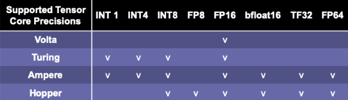

# Pytorch技巧


## 技巧一

**直接在目标设备上创建Tensor**

①：使用 `device` 参数直接在目标设备上创建张量

1、现在cpu上创建tensor，然后使用 `.cuda()` 移动到gpu上

```python
start_time = time.time()

for _ in range(100):
    # 在cpu上创建张量，然后转移到gpu上
    cpu_tensor = torch.ones((1000, 64, 64))
    gpu_tensor = cpu_tensor.cuda()
    
print('Total time: {:.3f}s'.format(time.time() - start_time))
```

②：直接在目标设备上创建张量

```python
start_time = time.time()

for _ in range(100):
    # 在gpu目标设备上创建
    cpu_tensor = torch.ones((1000, 64, 64), device = 'cuda')
    
print('Total time: {:.3f}s'.format(time.time() - start_time))
```

`cuda`在能使用的环境下，建议使用 `cuda`

## 技巧二

**尽可能的多使用Sequential层**

①：采用 `Sequential`层，会使代码变得非常简介

```python
class ExampleModel(nn.Module):
  def __init__(self):
    super().__init__()

    input_size = 2
    output_size = 3
    hidden_size = 16

    self.input_layer = nn.Linear(input_size, hidden_size)
    self.input_activation = nn.ReLU()

    self.mid_layer = nn.Linear(hidden_size, hidden_size)
    self.mid_activation = nn.ReLU()

    self.output_layer = nn.Linear(hidden_size, output_size)

  def forward(self, x):
    z = self.input_layer(x)
    z = self.input_activation(z)
    
    z = self.mid_layer(z)
    z = self.mid_activation(z)
    
    out = self.output_layer(z)

    return out
```

采用Sequential来搭建网络模型的写法：

```python
class ExampleSequentialModel(nn.Module):
  def __init__(self):
    super().__init__()

    input_size = 2
    output_size = 3
    hidden_size = 16

    self.layers = nn.Sequential(
      nn.Linear(input_size, hidden_size),
      nn.ReLU(),
      nn.Linear(hidden_size, hidden_size),
      nn.ReLU(),
      nn.Linear(hidden_size, output_size))

  def forward(self, x):
    out = self.layers(x)
    return out
```

## 技巧三

**不要使用列表来存储网络层**

①：不建议使用列表来存放创建的网络层，因为 `nn.Module`类不能注册它们。相反，应该将列表传入到 `nn.Sequential`中

错误例子：

```python
class BadListModel(nn.Module):
  def __init__(self):
    super().__init__()

    input_size = 2
    output_size = 3
    hidden_size = 16

    self.input_layer = nn.Linear(input_size, hidden_size)
    self.input_activation = nn.ReLU()

    # Fairly common when using residual layers
    self.mid_layers = []
    for _ in range(5):
      self.mid_layers.append(nn.Linear(hidden_size, hidden_size))
      self.mid_layers.append(nn.ReLU()) # 问题。

    self.output_layer = nn.Linear(hidden_size, output_size)

  def forward(self, x):
    z = self.input_layer(x)
    z = self.input_activation(z)
    
    for layer in self.mid_layers:
      z = layer(z)
    
    out = self.output_layer(z)

    return out
  
bad_list_model = BadListModel()
print('Output shape:', bad_list_model(torch.ones([100, 2])).shape)
gpu_input = torch.ones([100, 2], device='cuda')
gpu_bad_list_model = bad_list_model.cuda()
print('Output shape:', bad_list_model(gpu_input).shape)
```

正确写法：

```python
class CorrectListModel(nn.Module):
  def __init__(self):
    super().__init__()

    input_size = 2
    output_size = 3
    hidden_size = 16

    self.input_layer = nn.Linear(input_size, hidden_size)
    self.input_activation = nn.ReLU()

    # Fairly common when using residual layers
    self.mid_layers = []
    for _ in range(5):
      self.mid_layers.append(nn.Linear(hidden_size, hidden_size))
      self.mid_layers.append(nn.ReLU())
    self.mid_layers = nn.Sequential(*self.mid_layers) # 所在。。。。。。。。。。。。。。。

    self.output_layer = nn.Linear(hidden_size, output_size)

  def forward(self, x):
    z = self.input_layer(x)
    z = self.input_activation(z)
    z = self.mid_layers(z)
    out = self.output_layer(z)

    return out

correct_list_model = CorrectListModel()
gpu_input = torch.ones([100, 2], device='cuda')
gpu_correct_list_model = correct_list_model.cuda()
print('Output shape:', correct_list_model(gpu_input).shape)
```

## 技巧四

**好好利用 `distributions` **

①：因为 `torch.distributions` 库中的对象和方法实现了分布式。 该`distributions`包包含可参数化的概率分布和采样函数。这允许构建随机计算图和随机梯度估计器以进行优化。这个包通常遵循[TensorFlow Distributions](https://arxiv.org/abs/1711.10604)包的设计。 

```python
from torch.distributions import Categorical
from torch.distribututions.kl import kl_divergence

example_model = ExampleModel()
input_tensor = torch.rand(5, 2)
output = example_model(input_tensor)

dist = Categorical(logits = output)
print(dist)

# 采集样例
dist.sample()

# 计算 KL-Divergence
dist_1 = Categorical(lgits=output[0])
dist_2 = Categorical(lgits=output[1])

kl_divergence(dist_1, dist_2)
```

## 技巧五

**在长期指标上使用 `detach`**

①：在每一个epoch之间如果需要存储张量指标，采样 `.detach()` 来防止内存泄漏

举例：

初始配置

```python
# Setup
example_model = ExampleModel()
data_batches = [torch.rand((10, 2)) for _ in range(5)]
criterion = nn.MSELoss(reduce='mean')
```

错误写法：

```python
losses = []

# Training loop
for batch in data_batches:
  output = example_model(batch)

  target = torch.rand((10, 3))
  loss = criterion(output, target)
  losses.append(loss)

  # Optimization happens here
```

正确写法：

```python
losses = []

# Training loop
for batch in data_batches:
  output = example_model(batch)

  target = torch.rand((10, 3))
  loss = criterion(output, target)
  losses.append(loss.item()) # Or `loss.item()`

  # Optimization happens here

print(losses)
```

这里应该调用`loss.item()` 方法来保存每个epoch中的loss数值。

## 技巧六

**删除GPU上模型的技巧**

①： 可以采用 `torch.cuda.empty_cache()`来清理 GPU 缓存，这个方法在使用 notebook的时候很有帮助，特别是想要删除和重新创建一个很大的模型的时候。 

举例：

```python
import gc

example_model = ExampleModel().cuda()

del example_model

gc.collect()

#模型通常会保留在缓存中，直到有被击打敲醒发生
torch.cuda.empty_cache()
```

## 技巧七

**测试前调用 `eval()` ** 

①： 开始测试前别忘了调用`model.eval()`，这个很简单但很容易忘记。这个操作会让一些在训练和验证阶段设置不一样的网络层有必要的改变，会有影响的模块包括：

-   Dropout
-   Batch Normalization
-   RNNs
-   Lazy Variants

 

|     Base class     |                      Module                       |                Critera                 |
| :----------------: | :-----------------------------------------------: | :------------------------------------: |
|      RNNBase       |                   RNN LSTM GRU                    |        droupout > 0(default: 0)        |
| Tramsformer layers | Transformer TransformerEncoder TransformerDecoder | droupout > 0(transformer default: 0.1) |
|   Laay vatiants    |    LazyBatchNorm Currently nightly mergerd PR     |      track_running_states = True       |

```python
example_model = ExampleModel()

# Do training

example_model.eval()

# Do testing

example_model.train()

# Do training again
```

## Pytorch 18 skill

①：数据加载，将数据放到SSD中

②：开启几个线程工作

```python
Dataloader(dataset, num_workers=4*num_GPU)
```

③：pin_memory就是锁页内存，创建DataLoader时，设置pin_memory=True，则意味着生成的Tensor数据最开始是属于内存中的锁页内存，这样将内存的Tensor转义到GPU的显存就会更快一些。

主机中的内存，有两种存在方式：

一、是锁页

二、是不锁页，锁页内存存放的内容在任何情况下都不会与主机的虚拟内存进行交换(注：虚拟内存就是硬盘)，而不锁页内存在主机内存不足时，数据会存放在虚拟内存中。

显卡中的显存全部是锁页内存,当计算机的内存充足的时候，可以设置pin_memory=True。当系统卡住，或者交换内存使用过多的时候，设置pin_memory=False。因为pin_memory与电脑硬件性能有关，pytorch开发者不能确保每一个炼丹玩家都有高端设备，因此pin_memory默认为False。

```python
Dataloader(dataset, pin_memory=True)
```

④：直接在设备中创建 `torch.tensor` ，不要再一个设备创建，在移动到另一个设备

⑤：避免CPU和GPU之间不必要的数据传输

⑥： 使用torch.from_numpy(numpy_array)`或者torch.as_tensor(others)` 

⑦： 在数据传输操作可以重叠时，使用tensor.to(non_blocking=True)` 

⑧： 使用PyTorch JIT将元素操作融合到单个kernel中 

⑨： 在使用混合精度的FP16时，对于所有不同架构设计，设置尺寸为8的倍数 

⑩： 将batch size设置为8的倍数，最大化GPU内存的使用 

⑩①： 前向的时候使用混合精度（后向的使用不用） 

⑩②： 在优化器更新权重之前，设置梯度为None`，`model.zero_grad(set_to_none=True)` 

⑩③： 梯度积累：每隔x个batch更新一次权重，模拟大batch size的效果 

⑩④：关闭梯度计算

⑩⑤： orch.backends.cudnn.benchmark = True 

⑩⑥： 对于4D NCHW Tensors，使用channels_last的内存格式 

⑩⑦： 在batch normalization之前的卷积层可以去掉bias 

⑩⑧： 用DistributedDataParallel`代替DataParallel` 


**1、把数据移动到SSD中**

有些机器有不同的硬盘驱动器，如HHD和SSD。

建议将项目中使用的数据移动到SSD(或具有更好i/o的硬盘驱动器)以获得更快的速度。 


**2、在加载数据和数据增强的时候异步处理**

`num_workers=0`使数据加载需要在训练完成后或前一个处理已完成后进行。设置登录后复制`num_workers`>0有望加快速度，特别是对于大数据的i/o和增强。具体到GPU，有实验发现登录后复制`num_workers = 4*num_GPU` 具有最好的性能。也就是说，你也可以为你的机器测试最佳的登录后复制`num_workers`。需要注意的是，高登录后复制`num_workers`将会有很大的内存消耗开销，这也是意料之中的，因为更多的数据副本正在内存中同时处理。

```python
Dataloader(dataset, num_workers=4*num_GPU)
```


**3、使用pinned memory来降低数据传输**


设置pin_memory=True可以跳过从可分页memory到pinned memory的数据传输

GPU无法直接从CPU的可分页内存中访问数据。设置登录后复制`pin_memory=True` 可以为CPU主机上的数据直接分配临时内存，节省将数据从可分页内存转移到临时内存(即固定内存又称页面锁定内存)的时间。

该设置可以与`num_workers = 4*num_GPU`结合使用。

```python
Dataloader(dataset, pin_memory=True)
```


**4、直接在设备中创建张量**

只要你需要复制`torch.Tensor`，首先尝试在要使用它们的设备上创建它们。不要使用原生Python或NumPy创建数据，然后将其转换为复制`torch.Tensor`。在大多数情况下，如果你要在GPU中使用它们，直接在GPU中创建它们。

```python
# Random numbers between 0 and 1
# Same as np.random.rand([10,5])
tensor = torch.rand([10, 5], device=torch.device('cuda:0'))

# Random numbers from normal distribution with mean 0 and variance 1
# Same as np.random.randn([10,5])
tensor = torch.randn([10, 5], device=torch.device('cuda:0'))
```

唯一的语法差异是NumPy中的随机数生成需要额外的**random**，例如：复制`np.random.rand()` vs 复制`torch.rand()`。许多其他函数在NumPy中也有相应的函数： 

```python
torch.empty(), torch.zeros(), 
torch.full(), torch.ones(), 
torch.eye(), torch.randint(),
torch.rand(), torch.randn()
```


**5、避免在CPU和GPU中传输数据， 尽可能地减少I/O。注意下面这些命令**： 

```python
# BAD! AVOID THEM IF UNNECESSARY!
print(cuda_tensor)
cuda_tensor.cpu()
cuda_tensor.to_device('cpu')
cpu_tensor.cuda()
cpu_tensor.to_device('cuda')
cuda_tensor.item()
cuda_tensor.numpy()
cuda_tensor.nonzero()
cuda_tensor.tolist()

# Python control flow which depends on operation results of CUDA tensors
if (cuda_tensor != 0).all():
    run_func()
```


**6、使用 复制`torch.from_numpy(numpy_array)`和复制`torch.as_tensor(others)`代替 复制`torch.tensor`**

>   复制`torch.tensor()` 会拷贝数据

如果源设备和目标设备都是CPU，复制`torch.from_numpy`和复制`torch.as_tensor`不会创建数据拷贝。

如果源数据是NumPy数组，使用复制`torch.from_numpy(numpy_array)` 会更快。如果源数据是一个具有相同数据类型和设备类型的张量，那么复制`torch.as_tensor(others)` 可以避免拷贝数据。复制`others` 可以是Python的复制`list`， 复制`tuple`，或者复制`torch.tensor`。如果源设备和目标设备不同，那么可以使用下一个技巧。

```python
torch.from_numpy(numpy_array)
torch.as_tensor(others)
```


**7、在数据传输有重叠时使用**


重叠数据传输以减少运行时间。本质上，复制`non_blocking=True`允许异步数据传输以减少执行时间。

```python
for features, target in loader:
    # these two calls are nonblocking and overlapping
    features = features.to('cuda:0', non_blocking=True)
    target = target.to('cuda:0', non_blocking=True)
    
    # This is a synchronization point
    # It will wait for previous two lines
    output = model(features)
```


**8、使用PyTorch JIT将点操作融合到单个kernel中**

点操作包括常见的数学操作，通常是内存受限的。PyTorch JIT会自动将相邻的点操作融合到一个内核中，以保存多次内存读/写操作。例如，通过将5个核融合成1个核，复制`gelu`函数可以被加速4倍。

```python
@torch.jit.script # JIT decorator
def fused_gelu(x):
    return x * 0.5 * (1.0 + torch.erf(x / 1.41421))
```


**9&10、在使用混合精度的FP16时，对于所有不同架构设计，设置图像尺寸和batch size为8的倍数**

为了最大限度地提高GPU的计算效率，最好保证不同的架构设计(包括神经网络的输入输出尺寸/维数/通道数和batch size大小)是8的倍数甚至更大的2的幂(如64、128和最大256)。这是因为当矩阵的维数与2的幂倍数对齐时，Nvidia gpu的**张量核心(Tensor Cores)在矩阵乘法方面可以获得最佳性能。**矩阵乘法是最常用的操作，也可能是瓶颈，所以它是我们能确保张量/矩阵/向量的维数能被2的幂整除的最好方法(例如，8、64、128，最多256)。

这些实验显示设置输出维度和batch size大小为8的倍数，比如(33712、4088、4096)相比33708，batch size为4084或者4095这些不能被8整除的数可以加速计算1.3倍到 4倍。加速度大小取决于过程类型(例如，向前传递或梯度计算)和cuBLAS版本。特别是，如果使用NLP，请记住检查输出维度，这通常是词汇表大小。

使用大于256的倍数不会增加更多的好处，但也没有害处。这些设置取决于cuBLAS和cuDNN版本以及GPU架构。可以在文档中找到矩阵维数的特定张量核心要求。由于目前PyTorch AMP多使用FP16，而FP16需要8的倍数，所以通常推荐使用8的倍数。如果你有更高级的GPU，比如A100，那么可以选择64的倍数。如果使用的是AMD GPU，可能需要检查AMD的文档。

除了将batch size大小设置为8的倍数外，还将batch size大小最大化，直到它达到GPU的内存限制。这样，可以用更少的时间来完成一个epoch。


**11、在前向中使用混合精度后向中不使用**

有些操作不需要float64或float32的精度。因此，将操作设置为较低的精度可以节省内存和执行时间。对于各种应用，英伟达报告称具有Tensor Cores的GPU的混合精度可以提高3.5到25倍的速度。

值得注意的是，通常矩阵越大，混合精度加速度越高。在较大的神经网络中(例如BERT)，实验表明混合精度可以加快2.75倍的训练，并减少37%的内存使用。具有Volta, Turing, Ampere或Hopper架构的较新的GPU设备(例如，T4, V100, RTX 2060, 2070, 2080, 2080 Ti, A100, RTX 3090, RTX 3080，和RTX 3070)可以从混合精度中受益更多，因为他们有Tensor Core架构，它相比CUDA cores有特殊的优化。




带有Tensor Core的NVIDIA架构支持不同的精度

值得一提的是，采用Hopper架构的H100预计将于2022年第三季度发布，支持FP8 (float8)。PyTorch AMP可能会支持FP8(目前v1.11.0还不支持FP8)。

>   在实践中，你需要在模型精度性能和速度性能之间找到一个最佳点。我之前确实发现混合精度可能会降低模型的精度，这取决于算法，数据和问题。

使用自动混合精度(AMP)很容易在PyTorch中利用混合精度。PyTorch中的默认浮点类型是float32。AMP将通过使用float16来进行一组操作(例如，复制`matmul`, 复制`linear`, 复制`conv2d`)来节省内存和时间。AMP会自动cast到float32的一些操作(例如，复制`mse_loss`, 复制`softmax`等)。有些操作(例如复制`add`)可以操作最宽的输入类型。例如，如果一个变量是float32，另一个变量是float16，那么加法结果将是float32。

复制`autocast`自动应用精度到不同的操作。因为损失和梯度是按照float16精度计算的，当它们太小时，梯度可能会“下溢”并变成零。复制`GradScaler`通过将损失乘以一个比例因子来防止下溢，根据比例损失计算梯度，然后在优化器更新权重之前取消梯度的比例。如果缩放因子太大或太小，并导致复制`inf`或复制`NaN`，则缩放因子将在下一个迭代中更新缩放因子。

```python
scaler = GradScaler()
for features, target in data:
    # 前向传递，混合精度
    with torch.cuda.amp.autocast(): # autocast作为上下文管理器
        output = model(features)
        loss = criterion(output, target)    
    
    #反向传递，无混合精度
	#反向传递不建议使用混合精度
	#因为我们需要更精确的损失	
    scaler.scale(loss).backward()    
    
    #scaler.step（）首先取消渐变的缩放。
    # 如果这些渐变包含infs或NaN
    # 跳过#optimizer.step（）
    scaler.step(optimizer)     
    
	#如果跳过优化器.step（）
	#比例因子由GradScaler（）中的backoff_factor减小
    scaler.update()
```

也可以使用复制`autocast` 作为前向传递函数的装饰器 

```python
class AutocastModel(nn.Module):
    ...
    @autocast() # autocast as a decorator
    def forward(self, input):
        x = self.model(input)
        return x
```


**12、在优化器更新权重之前将梯度设置为None**

通过复制`model.zero_grad()`或复制`optimizer.zero_grad()`将对所有参数执行复制`memset` ，并通过读写操作更新梯度。但是，将梯度设置为复制`None`将不会执行复制`memset`，并且将使用“只写”操作更新梯度。因此，设置梯度为复制`None`更快。

```python
# 在优化器的每个步骤之前重置渐变
for param in model.parameters():
    param.grad = None

# or (PyTorch >= 1.7)
model.zero_grad(set_to_none=True)

# or (PyTorch >= 1.7)
optimizer.zero_grad(set_to_none=True)
```


**13、梯度累积：每隔x个batch再更新梯度，模拟大batch size**

这个技巧是关于从更多的数据样本积累梯度，以便对梯度的估计更准确，权重更新更接近局部/全局最小值。这在batch size较小的情况下更有帮助(由于GPU内存限制较小或每个样本的数据量较大)。

```python
for i, (features, target) in enumerate(dataloader):
    # Forward pass
    output = model(features)
    loss = criterion(output, target)    
    
    # Backward pass
    loss.backward()    
    
    # Only update weights every other 2 iterations
    # Effective batch size is doubled
    if (i+1) % 2 == 0 or (i+1) == len(dataloader):
        # Update weights
        optimizer.step()        
        # Reset the gradients to None
        optimizer.zero_grad(set_to_none=True)
```


**14、在推理和验证的时候禁用梯度计算**

实际上，如果只计算模型的输出，那么梯度计算对于推断和验证步骤并不是必需的。PyTorch使用一个中间内存缓冲区来处理复制`requires_grad=True`变量中涉及的操作。因此，如果知道不需要任何涉及梯度的操作，通过禁用梯度计算来进行推断/验证，就可以避免使用额外的资源。

```python
# torch.no_grad() as a context manager:
    with torch.no_grad():
    output = model(input)
    
# torch.no_grad() as a function decorator:
@torch.no_grad()
def validation(model, input):
    output = model(input)
return output
```


**15、`torch.backends.cudnn.benchmark = True`**

在训练循环之前设置复制`torch.backends.cudnn.benchmark = True`可以加速计算。由于计算不同内核大小卷积的cuDNN算法的性能不同，自动调优器可以运行一个基准来找到最佳算法。当你的输入大小不经常改变时，建议开启这个设置。如果输入大小经常改变，那么自动调优器就需要太频繁地进行基准测试，这可能会损害性能。它可以将向前和向后传播速度提高1.27x到1.70x。

```python
torch.backends.cudnn.benchmark = True
```


**16、对于4D NCHW Tensors使用通道在最后的内存格式**


4D NCHW重新组织成 NHWC格式。使用复制`channels_last`内存格式以逐像素的方式保存图像，作为内存中最密集的格式。原始4D NCHW张量在内存中按每个通道(红/绿/蓝)顺序存储。转换之后，复制`x = x.to(memory_format=torch.channels_last)`，数据在内存中被重组为NHWC (复制`channels_last`格式)。可以看到RGB层的每个像素更近了。据报道，这种NHWC格式与FP16的AMP一起使用可以获得8%到35%的加速。

目前，它仍处于beta测试阶段，仅支持4D NCHW张量和一组模型(例如，复制`alexnet`，复制`mnasnet`家族，复制`mobilenet_v2`，复制`resnet`家族，复制`shufflenet_v2`，复制`squeezenet1`，复制`vgg`家族)。但我可以肯定，这将成为一个标准的优化。

```python
N, C, H, W = 10, 3, 32, 32

x = torch.rand(N, C, H, W)

#步幅是一个元素与下一个元素之间的间隙
#在维度中
print(x.stride()) 

# (3072, 1024, 32, 1)# Convert the tensor to NHWC in memory
x2 = x.to(memory_format=torch.channels_last)

print(x2.shape)  # (10, 3, 32, 32) as dimensions order preserved
print(x2.stride())  # (3072, 1, 96, 3), which are smaller
print((x==x2).all()) # True，因为值未更改
```


**17、在batch normalization之前禁用卷积层的bias**

这是可行的，因为在数学上，bias可以通过batch normalization的均值减法来抵消。我们可以节省模型参数、运行时的内存。

```python
nn.Conv2d(..., bias=False)
```


**18、使用 复制`DistributedDataParallel`代替复制`DataParallel`**

对于多GPU来说，即使只有单个节点，也总是优先使用 复制`DistributedDataParallel`而不是复制`DataParallel` ，因为 复制`DistributedDataParallel` 应用于多进程，并为每个GPU创建一个进程，从而绕过Python全局解释器锁(GIL)并提高速度。