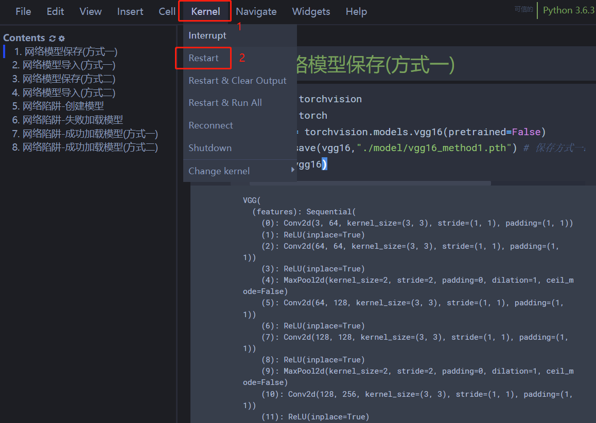
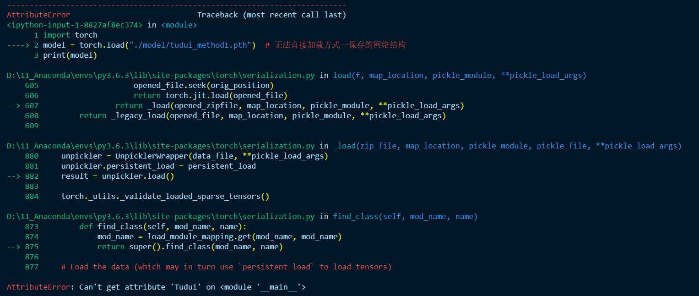

# 第一章 Pytorch快速入门

## 数据处理

PyTorch 有两个处理数据的原语：`torch.utils.data.DataLoader`和`torch.utils.data.Dataset`. `Dataset`存储样本及其对应的标签，并`DataLoader`在`Dataset`. 在 Pytorch 中提供了特定领域的库，如：文本处理库`TorchText`，视觉处理库`TorchVision`，音频处理库`TorchAduio`，所有这些库都包含数据集。

```python
import torch
from torch import nn
from torch.utils.data import DataLoader
from torchvision import datasets
from torchvision.transforms import ToTensor
```

举例： 在`torchvision.datasets`模块包含`Dataset`许多真实世界视觉数据的对象，如 CIFAR、COCO。

使用 FashionMNIST 数据集。每个 TorchVision 都`Dataset`包含两个参数：`transform`和 `target_transform`分别修改样本和标签。 

```python
# 从打开的数据集中下载训练数据。
training_data = datasets.FashionMNIST(
    root="data",
    train=True,
    download=True,
    transform=ToTensor(),
)

# 从打开的数据集中下载测试数据。
test_data = datasets.FashionMNIST(
    root="data",
    train=False, # Flase 代表不下载训练数据，只下载测试数据
    download=True,
    transform=ToTensor(),
)
```

输出数据下载信息：

```python
Downloading http://fashion-mnist.s3-website.eu-central-1.amazonaws.com/train-images-idx3-ubyte.gz
Downloading http://fashion-mnist.s3-website.eu-central-1.amazonaws.com/train-images-idx3-ubyte.gz to data/FashionMNIST/raw/train-images-idx3-ubyte.gz
  0%|          | 0/26421880 [00:00<?, ?it/s]
  0%|          | 32768/26421880 [00:00<01:27, 300898.40it/s]
  0%|          | 65536/26421880 [00:00<01:27, 299595.83it/s]
  0%|          | 131072/26421880 [00:00<01:00, 435531.81it/s]
  1%|          | 196608/26421880 [00:00<00:52, 499423.85it/s]
  1%|1         | 393216/26421880 [00:00<00:26, 965673.48it/s]
  3%|3         | 819200/26421880 [00:00<00:13, 1956489.39it/s]
  6%|6         | 1638400/26421880 [00:00<00:06, 3757889.98it/s]
 12%|#2        | 3244032/26421880 [00:00<00:03, 7221004.49it/s]
 24%|##4       | 6356992/26421880 [00:00<00:01, 13809912.60it/s]
 35%|###5      | 9273344/26421880 [00:01<00:00, 17701906.04it/s]
 47%|####6     | 12386304/26421880 [00:01<00:00, 20951482.13it/s]
 59%|#####8    | 15499264/26421880 [00:01<00:00, 23156761.46it/s]
 69%|######9   | 18317312/26421880 [00:01<00:00, 23869337.98it/s]
 81%|########1 | 21430272/26421880 [00:01<00:00, 25218898.03it/s]
 93%|#########2| 24543232/26421880 [00:01<00:00, 26157951.10it/s]
100%|##########| 26421880/26421880 [00:01<00:00, 15955414.81it/s]
Extracting data/FashionMNIST/raw/train-images-idx3-ubyte.gz to data/FashionMNIST/raw

Downloading http://fashion-mnist.s3-website.eu-central-1.amazonaws.com/train-labels-idx1-ubyte.gz
Downloading http://fashion-mnist.s3-website.eu-central-1.amazonaws.com/train-labels-idx1-ubyte.gz to data/FashionMNIST/raw/train-labels-idx1-ubyte.gz
  0%|          | 0/29515 [00:00<?, ?it/s]
100%|##########| 29515/29515 [00:00<00:00, 273031.98it/s]
100%|##########| 29515/29515 [00:00<00:00, 271536.58it/s]
Extracting data/FashionMNIST/raw/train-labels-idx1-ubyte.gz to data/FashionMNIST/raw

Downloading http://fashion-mnist.s3-website.eu-central-1.amazonaws.com/t10k-images-idx3-ubyte.gz
Downloading http://fashion-mnist.s3-website.eu-central-1.amazonaws.com/t10k-images-idx3-ubyte.gz to data/FashionMNIST/raw/t10k-images-idx3-ubyte.gz

  0%|          | 0/4422102 [00:00<?, ?it/s]
  1%|          | 32768/4422102 [00:00<00:14, 306177.17it/s]
  1%|1         | 65536/4422102 [00:00<00:14, 304609.24it/s]
  3%|2         | 131072/4422102 [00:00<00:09, 442442.72it/s]
  5%|5         | 229376/4422102 [00:00<00:06, 626330.81it/s]
 11%|#1        | 491520/4422102 [00:00<00:03, 1277292.22it/s]
 21%|##1       | 950272/4422102 [00:00<00:01, 2290250.96it/s]
 44%|####3     | 1933312/4422102 [00:00<00:00, 4520281.57it/s]
 87%|########6 | 3833856/4422102 [00:00<00:00, 8687609.16it/s]
100%|##########| 4422102/4422102 [00:00<00:00, 5108511.18it/s]
Extracting data/FashionMNIST/raw/t10k-images-idx3-ubyte.gz to data/FashionMNIST/raw

Downloading http://fashion-mnist.s3-website.eu-central-1.amazonaws.com/t10k-labels-idx1-ubyte.gz
Downloading http://fashion-mnist.s3-website.eu-central-1.amazonaws.com/t10k-labels-idx1-ubyte.gz to data/FashionMNIST/raw/t10k-labels-idx1-ubyte.gz

  0%|          | 0/5148 [00:00<?, ?it/s]
100%|##########| 5148/5148 [00:00<00:00, 23418955.52it/s]
Extracting data/FashionMNIST/raw/t10k-labels-idx1-ubyte.gz to data/FashionMNIST/raw
```

将`Dataset`作为参数传递给`DataLoader`。这对数据集进行了迭代，并支持自动批处理、采样、混洗和多进程数据加载。这里定义了一个64的batch size，即dataloader iterable中的每个元素都会返回一个batch 64个特征和标签。 

```python
# 数据输送批次的大小
batch_size = 64

# 创建训练和测试数据加载器
train_dataloader = DataLoader(training_data, batch_size=batch_size)
test_dataloader = DataLoader(test_data, batch_size=batch_size)

for X, y in test_dataloader:
    print(f"Shape of X [N, C, H, W]: {X.shape}")
    print(f"Shape of y: {y.shape} {y.dtype}")
    break
```

输出相关的数据信息：

```python
Shape of X [N, C, H, W]: torch.Size([64, 1, 28, 28])
Shape of y: torch.Size([64]) torch.int64
```

## 创建模型

在 PyTorch 中定义神经网络，创建了一个继承自nn.Module的类。在函数中定义网络层，并在`__init__`函数中指定数据将如何通过网络`forward`。为了加速神经网络中的操作，将其移至 GPU(如果可用) 

```python
# 创建模型运行的环境，如果cuda可用，则在cuda上运行，否则在cpu
device = "cuda" if torch.cuda.is_available() else "cpu"
print(f"Using {device} device")

# 定义神经网络模型
class NeuralNetwork(nn.Module):
    def __init__(self):
        super(NeuralNetwork, self).__init__()
        self.flatten = nn.Flatten()
        self.linear_relu_stack = nn.Sequential(
            nn.Linear(28*28, 512),
            nn.ReLU(),
            nn.Linear(512, 512),
            nn.ReLU(),
            nn.Linear(512, 10)
        )

    def forward(self, x):
        x = self.flatten(x)
        logits = self.linear_relu_stack(x)
        return logits

model = NeuralNetwork().to(device)
print(model)
```

输出模型信息：

```python
Using cuda device
NeuralNetwork(
  (flatten): Flatten(start_dim=1, end_dim=-1)
  (linear_relu_stack): Sequential(
    (0): Linear(in_features=784, out_features=512, bias=True)
    (1): ReLU()
    (2): Linear(in_features=512, out_features=512, bias=True)
    (3): ReLU()
    (4): Linear(in_features=512, out_features=10, bias=True)
  )
)
```

## 模型优化

训练模型时，需要定义一个损失函数和一个优化器

```python
loss_fn = nn.CrossEntropyLoss() # 损失函数
optimizer = torch.optim.SGD(model.parameters(), lr=1e-3) # 优化器
```

在单个训练循环中，模型对训练数据集进行预测(通过分批输入)，定通过反向传播预测误差，以调整模型的参数

```python
# 模型训练
def train(dataloader, model, loss_fn, optimizer):
    size = len(dataloader.dataset)
    model.train()
    for batch, (X, y) in enumerate(dataloader):
        X, y = X.to(device), y.to(device)

        # 计算并预测误差
        pred = model(X)
        loss = loss_fn(pred, y)

        # 进行反向传播更新
        optimizer.zero_grad()
        loss.backward()
        optimizer.step()

        if batch % 100 == 0:
            loss, current = loss.item(), batch * len(X)
            print(f"loss: {loss:>7f}  [{current:>5d}/{size:>5d}]")
```

根据测试数据集检查模型的性能，确保它处于学习状态

```python
# 测试模型
def test(dataloader, model, loss_fn):
    size = len(dataloader.dataset)
    num_batches = len(dataloader)
    model.eval()
    test_loss, correct = 0, 0
    with torch.no_grad():
        for X, y in dataloader:
            X, y = X.to(device), y.to(device)
            pred = model(X)
            test_loss += loss_fn(pred, y).item()
            correct += (pred.argmax(1) == y).type(torch.float).sum().item()
    test_loss /= num_batches
    correct /= size
    print(f"Test Error: \n Accuracy: {(100*correct):>0.1f}%, Avg loss: {test_loss:>8f} \n")
```

训练过程在多次迭代（*epochs*）中进行。在每个时期，模型都会学习参数以做出更好的预测。在每个时期打印模型的准确性和损失；希望看到每个 epoch 的准确率增加和损失减少。 

```python
epochs = 5
for t in range(epochs):
    print(f"Epoch {t+1}\n-------------------------------")
    train(train_dataloader, model, loss_fn, optimizer)
    test(test_dataloader, model, loss_fn)
print("Done!")
```

输出模型测试信息：

```python
Epoch 1
-------------------------------
loss: 2.314893  [    0/60000]
loss: 2.295206  [ 6400/60000]
loss: 2.278248  [12800/60000]
loss: 2.261804  [19200/60000]
loss: 2.259621  [25600/60000]
loss: 2.220173  [32000/60000]
loss: 2.232810  [38400/60000]
loss: 2.199674  [44800/60000]
loss: 2.190488  [51200/60000]
loss: 2.160208  [57600/60000]
Test Error:
 Accuracy: 34.4%, Avg loss: 2.153365

Epoch 2
-------------------------------
loss: 2.172394  [    0/60000]
loss: 2.158403  [ 6400/60000]
loss: 2.104490  [12800/60000]
loss: 2.118272  [19200/60000]
loss: 2.084654  [25600/60000]
loss: 2.008146  [32000/60000]
loss: 2.046550  [38400/60000]
loss: 1.967219  [44800/60000]
loss: 1.970731  [51200/60000]
loss: 1.904694  [57600/60000]
Test Error:
 Accuracy: 56.2%, Avg loss: 1.898913

Epoch 3
-------------------------------
loss: 1.931435  [    0/60000]
loss: 1.901530  [ 6400/60000]
loss: 1.791456  [12800/60000]
loss: 1.836366  [19200/60000]
loss: 1.731514  [25600/60000]
loss: 1.669595  [32000/60000]
loss: 1.696603  [38400/60000]
loss: 1.593150  [44800/60000]
loss: 1.619061  [51200/60000]
loss: 1.514459  [57600/60000]
Test Error:
 Accuracy: 61.3%, Avg loss: 1.526715

Epoch 4
-------------------------------
loss: 1.593652  [    0/60000]
loss: 1.553579  [ 6400/60000]
loss: 1.409360  [12800/60000]
loss: 1.483904  [19200/60000]
loss: 1.365681  [25600/60000]
loss: 1.352317  [32000/60000]
loss: 1.362342  [38400/60000]
loss: 1.286407  [44800/60000]
loss: 1.323951  [51200/60000]
loss: 1.222849  [57600/60000]
Test Error:
 Accuracy: 63.8%, Avg loss: 1.248915

Epoch 5
-------------------------------
loss: 1.327686  [    0/60000]
loss: 1.306169  [ 6400/60000]
loss: 1.145820  [12800/60000]
loss: 1.253144  [19200/60000]
loss: 1.131874  [25600/60000]
loss: 1.150164  [32000/60000]
loss: 1.162306  [38400/60000]
loss: 1.102028  [44800/60000]
loss: 1.143301  [51200/60000]
loss: 1.062239  [57600/60000]
Test Error:
 Accuracy: 65.4%, Avg loss: 1.083091

Done!
```

## 保存模型

保存模型的常用方法是序列化内部状态字典（包含模型参数） 

```python
torch.save(model.state_dict(), "model.pth")
print("Saved PyTorch Model State to model.pth")
```

输出：

```python
Saved PyTorch Model State to model.pth
```

网络模型① 

1.保存方式1

```python
import torchvision
import torch
vgg16 = torchvision.models.vgg16(pretrained=False)
torch.save(vgg16,"./model/vgg16_method1.pth") # 保存方式一：模型结构 + 模型参数      
print(vgg16)
```

2.导入方式1

```python
import torch
model = torch.load("./model/vgg16_method1.pth") # 保存方式一对应的加载模型    
print(model)
```

网络模型②

1.保存方式2

```python
import torchvision
import torch
vgg16 = torchvision.models.vgg16(pretrained=False)
# 保存方式二：模型参数（官方推荐）,不再保存网络模型结构  
torch.save(vgg16.state_dict(),"./model/vgg16_method2.pth") 
print(vgg16)
```

2.导入方式2

```python
import torch
import torchvision
model = torch.load("./model/vgg16_method2.pth") # 导入模型参数   
print(model)
```

网络模型③

将模型参数导入到模型结构中

```python
import torch
import torchvision
vgg16 = torchvision.models.vgg16(pretrained=False)
print(vgg16)
vgg16.load_state_dict(torch.load("./model/vgg16_method2.pth")) # 将模型参数导入到模型结构中   
print(vgg16)
```

网络模型陷阱④

1.创建模型

```python
import torch
from torch import nn

class Tudui(nn.Module):
    def __init__(self):
        super(Tudui,self).__init__()
        self.conv1 = nn.Conv2d(3,64,kernel_size=3)
        
    def forward(self,x):
        x = self.conv1(x)
        return x

tudui = Tudui()
torch.save(tudui, "./model/tudui_method1.pth")
```

2.加载失败模型：以jupyter notebook为例



在运行下面代码，即下面为第一个代码快运行，无法直接导入网络模型

```python
import torch
model = torch.load("./model/tudui_method1.pth")  # 无法直接加载方式一保存的网络结构    
print(model)
```



## 模型加载

加载模型的过程包括重新创建模型结构并将状态字典加载到其中 

```python
model = NeuralNetwork()
model.load_state_dict(torch.load("model.pth"))
```

输出：

```python
<All keys matched successfully>
```

使用模型进行预测：

```python
classes = [
    "T-shirt/top",
    "Trouser",
    "Pullover",
    "Dress",
    "Coat",
    "Sandal",
    "Shirt",
    "Sneaker",
    "Bag",
    "Ankle boot",
]

model.eval()
x, y = test_data[0][0], test_data[0][1]
with torch.no_grad():
    pred = model(x)
    predicted, actual = classes[pred[0].argmax(0)], classes[y]
    print(f'Predicted: "{predicted}", Actual: "{actual}"')
```

输出信息：

```python
Predicted: "Ankle boot", Actual: "Ankle boot"
```

①：网络陷阱-成功加载模型1

```python
import torch
from torch import nn

# 确保网络模型是我们想要的网络模型,要在加载前还写明网络模型
class Tudui(nn.Module):
    def __init__(self):
        super(Tudui,self).__init__()
        self.conv1 = nn.Conv2d(3,64,kernel_size=3)
        
    def forward(self,x):
        x = self.conv1(x)
        return x
    
#tudui = Tudui # 不需要写这一步，不需要创建网络模型    
model = torch.load("./model/tudui_method1.pth")  # 无法直接加载方式一保存的网络结构    
print(model)
```

②：网络陷阱-成功加载模型2

```python
import torch
import model_save import * # 它就相当于把 model_save.py 里的网络模型定义写到这里了
    
#tudui = Tudui # 不需要写这一步，不需要创建网络模型    

model = torch.load("tudui_method1.pth")
print(model)
```