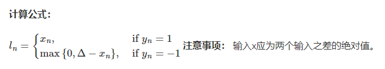

# 第七章 Pytorch损失函数

## 损失函数

在深度学习广为使用的今天，可以在脑海里清晰的知道，一个模型想要达到很好的效果需要学习，也就是常说的训练。一个好的训练离不开优质的负反馈，这里的损失函数就是模型的负反馈。 


在PyTorch中，损失函数必不可少。它是数据输入到模型中，产生的结果于真实标签的评价指标，模型可以按照损失函数的目标做出改进。

### 二分类交叉熵损失函数

```python
torch.nn.BCELoss(weight=None, size_average=None, reduce=None, reduction='mean')
```

功能：计算二分类任务时的交叉熵(Cross Entropy)函数。在二分类中，label是{0, 1}，对于进行交叉熵函数的input为概率分布的形式，一般来说，input为sigmoid激活层的输出，或者softmax的输出。

参数：

weight：每个类别的loss设置权值

size_average：数据为bool，为True时，返回的loss为平均值，为False时，返回的各样本的loss之和

reduce：数据类型为bloo，为True时，loss的返回是标量


```python
# 激活函数
m = nn.Sigmoid()

# 二分类交叉熵损失函数
loss = nn.BCELoss()

# 数据输入
input = torch.randn(3, requires_grad = True)

# 目标或标签数据
target = torch.empty(3).random_(2)

# 通过损失函数输出结果
output = loss(m(input), target)
output.backward()
```

```python
print('BCELoss损失函数的计算结果为',output)
```

```python
BCELoss损失函数的计算结果为 tensor(0.5732, grad_fn=<BinaryCrossEntropyBackward>)
```

### 交叉熵损失函数

```python
torch.nn.CrossEntropyLoss(weight=None, size_average=None, ignore_index=-100, reduce=None, reduction='mean')
```

功能：计算交叉熵函数

参数：

weight：每个类别的loss设置权值

size_average：数据为bool，为True时，返回的loss为平均值，为False时，返回各个样本的loss之和

ignore_index：忽略某个类的损失函数

reduce：数据类型为bool，为True时，loss的返回是标量


```python
# 交叉熵损失函数
loss = nn.CrossEntropyLoss()

# 输入数据
input = torch.randn(3, 5, requires_gead = True)

target = torch.empty(3, dtype = torch.long).random_(5)

output = loss(input, target)
output.backward()
```

```python
print(output)
```

```python
tensor(2.0115, grad_fn=<NllLossBackward>)
```

### L1损失函数

```python
torch.nn.L1Loss(size_average=None, reduce=None, reduction='mean')
```

功能：计算输出y和真实标签target之间的差值的绝对值

reduction参数决定了计算模式，有三种计算模式可选：

none：逐个元素计算

sun：所有元素求和，返回标量

mean：加权平均，返回标量

如果选择none，那么返回的结果是和输出元素相同尺寸的，默认计算方式就是求平均。


```python
# L1损失函数
loss = nn.L1Loss()

# 输入数据
input = torch.randn(3, 5, requires_grad = True)

# 标签
target = torch.randn(3, 5)

# 输出结果
output = loss(input, target)

# 回调函数
output.backward()
```

```python
print('L1损失函数的计算结果为',output)
```

```python
L1损失函数的计算结果为 tensor(1.5729, grad_fn=<L1LossBackward>)
```

### MSE损失函数

```python
torch.nn.MSELoss(size_average=None, reduce=None, reduction='mean')
```

功能：计算输出y和真实标签target之差的平方

与L1Loss一样，MSELoss损失函数中，reduction参数决定了计算模式，有三种计算模式可选：

none：逐个元素计算

sun：所有元素求和，返回标量

mean：加权平均，返回标量

如果选择none，那么返回的结果是和输出元素相同尺寸的，默认计算方式就是求平均。


```python
# MSE损失函数
loss = nn.MSELoss()

# 输入数据
input = torch.randn(3, 5, requires_grad = True)

# 目标数据
target = torch.randn(3, 5)

# 输出数据
output = loss(input, target)

# 回调函数
output.backward()
```

```python
print('MSE损失函数的计算结果为',output)
```

```python
MSE损失函数的计算结果为 tensor(1.6968, grad_fn=<MseLossBackward>)
```

### 平滑L1(Smooth L1)损失函数

```python
torch.nn.SmoothL1Loss(size_average=None, reduce=None, reduction='mean', beta=1.0)
```

功能：L1的平滑输出，其功能就是减轻离群点带来的影响

reduction参数决定了计算模式，有三种计算模式可选：

none：逐个元素进行计算

sum：所有元素进行求和，返回标量。默认计算方式是平均。

提醒：往下的损失函数中，关于reduction这个参数依旧会参在。


```python
# 平滑L1损失函数
loss = nn.SmoothL1Loss()

# 输入数据
input = torch.randn(3, 5, requires_grad = True)

# 标签或检测数据
target = torch.randn(3, 5)

# 将输入数据和标签数据，放入损失函数中进行输出
output = loss(input. target)
output.backward()
```

```python
print('SmoothL1Loss损失函数的计算结果为',output)
```

```python
SmoothL1Loss损失函数的计算结果为 tensor(0.7808, grad_fn=<SmoothL1LossBackward>)
```

**平滑L1与L1的对比**

通过可视化两种损失函数曲线来对比平滑L1和L1两种损失函数的区别 

```python
# 输入数据为等差数据集
inputs = torch.linspace(-10, 10, steps=5000)
target = torch.zeros_like(inputs)

loss_f_smooth = nn.SmoothL1Loss(reduction='none')
loss_smooth = loss_f_smooth(inputs, target)
loss_f_l1 = nn.L1Loss(reduction='none')
loss_l1 = loss_f_l1(inputs,target)

plt.plot(inputs.numpy(), loss_smooth.numpy(), label='Smooth L1 Loss')
plt.plot(inputs.numpy(), loss_l1, label='L1 loss')
plt.xlabel('x_i - y_i')
plt.ylabel('loss value')
plt.legend()
plt.grid()
plt.show()
```

 可以看出，对于`smoothL1`来说，在 0 这个尖端处，过渡更为平滑。 


### 目标泊松分布的负对数似然损失

```python
torch.nn.PoissonNLLLoss(log_input=True, full=False, size_average=None, eps=1e-08, reduce=None, 
                        reduction='mean')
```

功能：播送分布的负对数似然损失

参数：

log_input：输入是否为对数形式，决定计算公式

full：计算所有loss，默认为False

eps：修正项，避免input为0时，log(input)为nan的情况

数学公式：


```python
# 泊松负对数损失函数
loss = nn.PoissonNLLLoss()

# 对数数据
log_input = torch.randn(5, 2, requires_grad = True)

target = torch.randn(5, 2)

output = loss(log_input, target)
output.backward()
```

```python
print('PoissonNLLLoss损失函数的计算结果为',output)
```

```python
PoissonNLLLoss损失函数的计算结果为 tensor(0.7358, grad_fn=<MeanBackward0>)
```

### KL散度

```python
torch.nn.KLDivLoss(size_average=None, reduce=None, reduction='mean', log_target=False)
```

功能：计算KL散度，也就是计算相对熵。用于连续分布的距离度量，并且对离散采样的连续输出空间分布进行回归通过很有效果。

参数：

reduction：计算模式，可为：none/sum/mean/batchmean

```python
none：逐个元素进行计算
sum：所有元素进行求和，返回标量
mean：加权平均，返回标量
batchmean：batchsize 维度求平均值
```


```python
# 输入数据
inputs = torch.tensor([[0.5, 0.3, 0.2], [0.2, 0.3, 0.5]])

# 标签
target = torch.tensor([[0.9, 0.05, 0.05], [0.1, 0.7, 0.2]], dtype=torch.float)

# KL离散
loss = nn.KLDivLoss()
output = loss(inputs,target)

print('KLDivLoss损失函数的计算结果为',output)
```

```python
KLDivLoss损失函数的计算结果为 tensor(-0.3335)
```

### MarginRankingLoss

```python
torch.nn.MarginRankingLoss(margin=0.0, size_average=None, reduce=None, reduction='mean')
```

功能：计算两个向量之间的相似度，用于排序任务。该方法用于计算两组数据之间的差异

参数：

margin：边界值，x1和x2之间的差异值

reduction：计算模式，可为none/sum/mean


```python
# MRL损失函数
loss = nn.MarginRankingLoss()

# 输入数据
input1 = torch.randn(3, requires_grad=True)
input2 = torch.randn(3, requires_grad=True)

# 标签
target = torch.randn(3).sign()

# 输出
output = loss(input1, input2, target)
output.backward()

print('MarginRankingLoss损失函数的计算结果为',output)
```

```python
MarginRankingLoss损失函数的计算结果为 tensor(0.7740, grad_fn=<MeanBackward0>)
```

### 多标签边界损失函数

```python
torch.nn.MultiLabelMarginLoss(size_average=None, reduce=None, reduction='mean')
```

功能：对于多标签分类问题计算损失函数

参数：

reduction：计算损失模式吗，可为none/sum.mean


```python
# 多标签边界损失函数
loss = nn.MultiLabelMarginLoss()

# 浮点型张量输入数据
x = torch.FloatTensor([[0.9, 0.2, 0.4, 0.8]])

# for target y, only consider labels 3 and 0, not after label -1
y = torch.LongTensor([[3, 0, -1, 1]])# 真实的分类是，第3类和第0类
output = loss(x, y)

print('MultiLabelMarginLoss损失函数的计算结果为',output)
```

```python
MultiLabelMarginLoss损失函数的计算结果为 tensor(0.4500)
```

### 二分类损失函数

```python
torch.nn.SoftMarginLoss(size_average=None, reduce=None, reduction='mean')
torch.nn.(size_average=None, reduce=None, reduction='mean')
```

功能：计算二分类的logistic损失

参数：

reduction：计算模式，可为none/mean/sum


```python
# 两个样本，两个神经元
inputs = torch.tensor([[0.3, 0.7], [0.5, 0.5]])  

# 该 loss 为逐个神经元计算，需要为每个神经元单独设置标签
target = torch.tensor([[-1, 1], [1, -1]], dtype=torch.float)  

loss_f = nn.SoftMarginLoss()
output = loss_f(inputs, target)

print('SoftMarginLoss损失函数的计算结果为',output)
```

```python
SoftMarginLoss损失函数的计算结果为 tensor(0.6764)
```

### 多分类的折页损失

```python
torch.nn.MultiMarginLoss(p=1, margin=1.0, weight=None, size_average=None, reduce=None, reduction='mean')
```

功能：计算多分类的折页损失

参数：

reduction：计算模式，可为none/mean/sum

p：可选1或2

weight：各类别的loss设置权值

margin：边界值


```python
inputs = torch.tensor([[0.3, 0.7], [0.5, 0.5]]) 
target = torch.tensor([0, 1], dtype=torch.long) 

# 多分类折页损失函数
loss_f = nn.MultiMarginLoss()
output = loss_f(inputs, target)

print('MultiMarginLoss损失函数的计算结果为',output)
```

```python
MultiMarginLoss损失函数的计算结果为 tensor(0.6000)
```

### 三元组损失

```python
torch.nn.TripletMarginLoss(margin=1.0, p=2.0, eps=1e-06, swap=False, size_average=None, reduce=None, reduction='mean')
```

功能：计算三元组损失

三元组： 这是一种数据的存储或者使用格式。<实体1，关系，实体2>。在项目中，也可以表示为< `anchor`, `positive examples` , `negative examples`> 。 在这个损失函数中，希望去`anchor`的距离更接近`positive examples`，而远离`negative examples` 

参数：

reduction：计算模式，可为none/mean/sum

p：可选1或2

margin：边界值


```python
# 三元组损失函数
triplet_loss = nn.TripletMarginLoss(margin=1.0, p=2)

anchor = torch.randn(100, 128, requires_grad=True)
positive = torch.randn(100, 128, requires_grad=True)
negative = torch.randn(100, 128, requires_grad=True)
output = triplet_loss(anchor, positive, negative)

output.backward()
print('TripletMarginLoss损失函数的计算结果为',output)
```

```python
TripletMarginLoss损失函数的计算结果为 tensor(1.1667, grad_fn=<MeanBackward0>)
```

### HingEmBeddingLoss

```python
torch.nn.HingeEmbeddingLoss(margin=1.0, size_average=None, reduce=None, reduction='mean')
```

功能：对输出的embedding结果做Hing损失计算

参数：

reduction：计算模式，可为none/sum/mean

margin：边界值



让个输出的是正例yn=1,那么loss就是x，如果输出的是负例y=-1，那么输出的loss就是要做一个比较。 

```python
loss_f = nn.HingeEmbeddingLoss()
inputs = torch.tensor([[1., 0.8, 0.5]])
target = torch.tensor([[1, 1, -1]])
output = loss_f(inputs,target)

print('HingEmbeddingLoss损失函数的计算结果为',output)
```

```python
HingEmbeddingLoss损失函数的计算结果为 tensor(0.7667)
```

### 余弦相似度

```python
torch.nn.CosineEmbeddingLoss(margin=0.0, size_average=None, reduce=None, reduction='mean')
```

功能： 对两个向量做余弦相似度 

参数:

reduction：计算模式，可为 none/sum/mean。

margin：可取值[-1,1] ，推荐为[0,0.5] 。


这个损失函数应该是最广为人知的。对于两个向量，做余弦相似度。将余弦相似度作为一个距离的计算方式，如果两个向量的距离近，则损失函数值小，反之亦然。 

```python
loss_f = nn.CosineEmbeddingLoss()
inputs_1 = torch.tensor([[0.3, 0.5, 0.7], [0.3, 0.5, 0.7]])
inputs_2 = torch.tensor([[0.1, 0.3, 0.5], [0.1, 0.3, 0.5]])
target = torch.tensor([[1, -1]], dtype=torch.float)
output = loss_f(inputs_1,inputs_2,target)

print('CosineEmbeddingLoss损失函数的计算结果为',output)
```

```python
CosineEmbeddingLoss损失函数的计算结果为 tensor(0.5000)
```

### CTC损失函数

```python
torch.nn.CTCLoss(blank=0, reduction='mean', zero_infinity=False)
```

功能：用于解决时序类数据的分类

计算连续时间序列和目标序列之间的损失。CTCLoss对输入和目标的可能排列的概率进行求和，产生一个损失值，这个损失值对每个输入节点来说是可分的。输入与目标的对齐方式被假定为 "多对一"，这就限制了目标序列的长度，使其必须是≤输入长度。

参数:

reduction：计算模式，可为 none/sum/mean。

blank：blank label。

zero_infinity：无穷大的值或梯度值为

```python
# Target are to be padded
T = 50      # Input sequence length
C = 20      # Number of classes (including blank)
N = 16      # Batch size
S = 30      # Target sequence length of longest target in batch (padding length)
S_min = 10  # Minimum target length, for demonstration purposes

# Initialize random batch of input vectors, for *size = (T,N,C)
input = torch.randn(T, N, C).log_softmax(2).detach().requires_grad_()

# Initialize random batch of targets (0 = blank, 1:C = classes)
target = torch.randint(low=1, high=C, size=(N, S), dtype=torch.long)

input_lengths = torch.full(size=(N,), fill_value=T, dtype=torch.long)
target_lengths = torch.randint(low=S_min, high=S, size=(N,), dtype=torch.long)
ctc_loss = nn.CTCLoss()
loss = ctc_loss(input, target, input_lengths, target_lengths)
loss.backward()


# Target are to be un-padded
T = 50      # Input sequence length
C = 20      # Number of classes (including blank)
N = 16      # Batch size

# Initialize random batch of input vectors, for *size = (T,N,C)
input = torch.randn(T, N, C).log_softmax(2).detach().requires_grad_()
input_lengths = torch.full(size=(N,), fill_value=T, dtype=torch.long)

# Initialize random batch of targets (0 = blank, 1:C = classes)
target_lengths = torch.randint(low=1, high=T, size=(N,), dtype=torch.long)
target = torch.randint(low=1, high=C, size=(sum(target_lengths),), dtype=torch.long)
ctc_loss = nn.CTCLoss()
loss = ctc_loss(input, target, input_lengths, target_lengths)
loss.backward()

print('CTCLoss损失函数的计算结果为',loss)
```

```python
CTCLoss损失函数的计算结果为 tensor(16.0885, grad_fn=<MeanBackward0>)
```

## 参数解析

损失函数通过torch.nn包实现

基本用法：

```python
criterion = LossCriterion() # 构造损失函数
loss = criterion(x, y) # 调用时，需要传入数据
```

### L1范数损失

L1LOSS：计算output和target之差的绝对值

```python
torch.nn.L1Loss(reduction = 'mean')
```

参数：reduction

-   none：不使用简约
-   mean：返回loss之和的平均值
-   sum：返回loss的和
-   默认：mean

### 交叉损失

CrossEntroyLoss：当训练有C个类别的分类问题时很有效果，可选参数weight必须时一个1维tensor，权重将被分配到各个类别，对于不平衡的训练集非常有效。在多酚类任务种，经常采样softmax激活函数+交叉熵损失函数，因为交叉熵描述了两个概率分布的差异，然而神经网络输出的时向量，不是概率分布的形式。所以需要softmax激活函数将一个向量进行“归一化”成概率分布的形式，再用交叉熵损失函数计算loss

 

```python
torch.nn.CrossEntropyLoss(weight=None, ignore_index=-100, reduction='mean')
```

参数：

-   weight(tensor, optional)：自定义的每个类别的权重，必须是一个长度为C的tensor
-   ignore_index(int, optional)：设置一个目标值，该目标值会被忽略。从而不会影响到输入的梯度
-   reduction
    -   none：不使用简约
    -   mean：返回loss之和的平均值
    -   sum：返回loss的和
    -   默认：mean

### KL离散损失

KLDivLoss：计算input和targe之间的KL离散。KL离散可用于衡量不同的连续分布之间的距离，在连续的输出分布的空间上(离散采样)进行直接回归时很有效

```python
torch.nn.KLDivLoss(reduction='mean')
```

参数：reduction

-   none：不使用简约
-   mean：返回loss之和的平均值
-   sum：返回loss的和
-   默认：mean

### 二进制交叉损失

BCELoss；二分类任务时的交叉熵计算函数。用于策略重构误差，例如自动编码机，注意目标值t[i]的范围为0到1之间

```python
torch.nn.BCELoss(weight=None, reduction='mean')
```

参数：

-   weight(tensor, optional)：自定义的每个batch元素的loss的权重，必须时一个长度为nbatch的tensor
-   pos_weight(tensor, optional)：自定义的每个正样本的loss的权重，必须时一个长度为classes的tensor
-   reduction
    -   none：不使用简约
    -   mean：返回loss之和的平均值
    -   sum：返回loss的和
    -   默认：mean

### BCEWithLogitsLoss 

BCEWithLogitsLoss损失函数：把sigmoid层集成到了BCELoss类中，该版本比用一个简单的Sigmoid层和BCELoss在值上更稳定，因为把者两个操作合并为一个层之后，可以利用log-sum-exp的技巧来实现数值稳定

```python
torch.nn.BCEWithLogitsLoss(weight=None, reduction='mean', pos_weight=None)
```

参数：

-   weight(tensor, optional)：自定义的每个batch元素的loss的权重，必须时一个长度为nbatch的tensor
-   pos_weight(tensor, optional)：自定义的每个正样本的loss的权重，必须时一个长度为classes的tensor
-   reduction
    -   none：不使用简约
    -   mean：返回loss之和的平均值
    -   sum：返回loss的和
    -   默认：mean

### MarginRankingLoss

```python
torch.nn.MarginRankingLoss(margin=0.0, reduction='mean')
```

对于mini-batch(小批量)中每个实例的损失函数如下：

  

参数：

-   margin：默认值为0

### HingeEmbeddingLoss

```python
torch.nn.HingeEmbeddingLoss(margin=1.0, reduction='mean')
```

对于mini-batch(小批量)中每个实例的损失函数如下：

  

参数：

-   margin：默认值为1

### 多标签分类损失

 MultiLabelMarginLoss

```python
torch.nn.MultiLabelMarginLoss(reduction='mean')
```

对于mini-batch(小批量)中的每个样本按如下公式计算损失值：

  

### 平滑损失L1

SmoothL1Loss损失函数：也被称为Huber损失函数

```python
torch.nn.SmoothL1Loss(reduction='mean')
```

  

其中：

  

### 分类的logistric损失

SoftMarginLoss损失函数

```python
torch.nn.SoftMarginLoss(reduction='mean')
```

  

### 多标签损失one_versus-all

MultiLabelSoftMarginLoss损失函数

```python
torch.nn.MultiLabelSoftMarginLoss(weight=None, reduction='mean')
```

  

### cosine损失

CosineEmbeddingLoss损失函数

```python
torch.nn.CosineEmbeddingLoss(margin=0.0, reduction='mean')
```

 参数：

-   margin：默认值为0


### 多类别损失hinge

  MultiMarginLoss损失函数

```python
torch.nn.MultiMarginLoss(p=1, margin=1.0, weight=None, reduction='mean')
```

  

参数：

-   p = 1或 2，默认值为1
-   margin：默认值1

### 三元组损失

 TripletMarginLoss损失函数

```python
torch.nn.TripletMarginLoss(margin=1.0, p=2.0, eps=1e-06, swap=False, reduction='mean')
```

  

其中：

  

### 连接实现分类损失

CTCLoss损失函数：CTC连接时序分类损失，可以对没有对齐的数据进行自动对齐，主要用在没有事先对齐的序列化数据训练上。比如语音识别、ocr识别等等。 

```python
torch.nn.CTCLoss(blank=0, reduction='mean')
```

参数：reduction

-   none：不使用简约
-   mean：返回loss之和的平均值
-   sum：返回loss的和
-   默认：mean

### 负对数似然损失

NLLLoss损失函数：负对数似然损失. 用于训练 C 个类别的分类问题. 

```python
torch.nn.NLLLoss(weight=None, ignore_index=-100, reduction='mean')
```

参数：

-   weight(tensor, optional)：自定义的每个类别的权重，必须是一个长度为C的tensor
-   ignore_index(int, optional)：设置一个目标值，该目标值会被忽略。从而不会影响到输入的梯度

### NLLLoss2d

NLLLoss2d损失函数：对于图片输入的负对数似然损失. 它计算每个像素的负对数似然损失. 

```python
torch.nn.NLLLoss2d(weight=None, ignore_index=-100, reduction='mean')
```

参数：

-   weight(tensor, optional)：自定义的每个类别的权重，必须是一个长度为C的tensor
-   ignore_index(int, optional)：设置一个目标值，该目标值会被忽略。从而不会影响到输入的梯度
-   reduction
    -   none：不使用简约
    -   mean：返回loss之和的平均值
    -   sum：返回loss的和
    -   默认：mean

### PoissonNLLLoss

PoissonNLLLoss损失函数：目标值为泊松分布的负对数似然损失 

```python
torch.nn.PoissonNLLLoss(log_input=True, full=False, eps=1e-08, reduction='mean')
```

参数：

-   log_input (bool, optional)：如果设置为 True , loss 将会按照公式 exp(input) - target * input 来计算, 如果设置为 False , loss 将会按照 input - target * log(input+eps) 计算.
-   full (bool, optional)：是否计算全部的 loss, i. e. 加上 Stirling 近似项 target * log(target) - target + 0.5 * log(2 * pi * target).
-   eps (float, optional)：默认值: 1e-8


