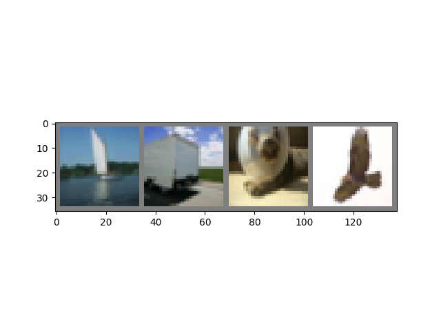
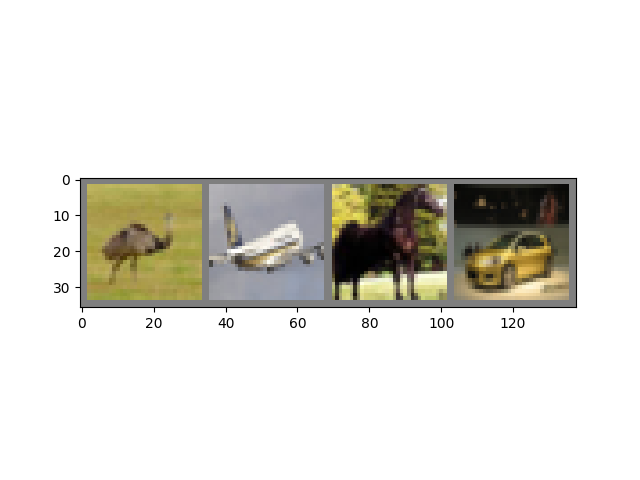

# 第二章 Pytorch简介

PyTorch 是一个 Python 包，它提供了两个高级特性：

-   具有强大 GPU 加速功能的张量计算（如 NumPy）
-   建立在基于磁带的 autograd 系统上的深度神经网络


在粒度级别上，PyTorch 是一个由以下组件组成的库： 

|                          Component                           |                         Description                          |
| :----------------------------------------------------------: | :----------------------------------------------------------: |
|   [**torch**](https://pytorch.org/docs/stable/torch.html)    |          像 NumPy 这样的张量库，具有强大的 GPU 支持          |
| [**torch.autograd**](https://pytorch.org/docs/stable/autograd.html) |  一个基于tape的自动微分库，支持torch中所有可微分的张量运算   |
|  [**torch.jit**](https://pytorch.org/docs/stable/jit.html)   | 用于从 PyTorch 代码创建可序列化和可优化模型的编译堆栈 (TorchScript) |
|   [**torch.nn**](https://pytorch.org/docs/stable/nn.html)    |    与 autograd 深度集成的神经网络库，旨在实现最大的灵活性    |
| [**torch.multiprocessing**](https://pytorch.org/docs/stable/multiprocessing.html) | Python 多处理，但具有跨进程的火炬张量的神奇内存共享。对数据加载和 Hogwild 训练很有用 |
| [**torch.utils**](https://pytorch.org/docs/stable/data.html) |           DataLoader和其他实用程序功能，以方便使用           |

通常，PyTorch 用作：

-   替代 NumPy 以使用 GPU 的强大功能。
-   一个深度学习研究平台，可提供最大的灵活性和速度。

## 基础操作

首先，导入 pytorch 

```python
import torch
```

1、基本的张量操作。首先，只是创建张量的几种方法： 

```python
z = torch.zeros(5, 3)
print(z)
print(z.dtype)
```

输出：

```python
tensor([[0., 0., 0.],
        [0., 0., 0.],
        [0., 0., 0.],
        [0., 0., 0.],
        [0., 0., 0.]])
torch.float32
```

上面，创建了一个用零填充的 5x3 矩阵，并查询其数据类型以找出零是 32 位浮点数，这是默认的 PyTorch。 

2、修改为其他数据类型，覆盖默认值

```python
i = torch.ones((5, 3), dtype=torch.int16)
print(i)
```

输出：

```python
tensor([[1, 1, 1],
        [1, 1, 1],
        [1, 1, 1],
        [1, 1, 1],
        [1, 1, 1]], dtype=torch.int16)
```

更改默认值时，张量会在打印时有用地报告这一点。 

3、随机初始化学习权重，通常使用PENG的热顶种子来重现结果

```python
torch.manual_seed(1729)
r1 = torch.rand(2, 2)
print('A random tensor:')
print(r1)

r2 = torch.rand(2, 2)
print('\nA different random tensor:')
print(r2) # 新值

torch.manual_seed(1729)
r3 = torch.rand(2, 2)
print('\nShould match r1:')
print(r3) # 由于重新播种，重复r1的值
```

输出：

```python
A random tensor:
tensor([[0.3126, 0.3791],
        [0.3087, 0.0736]])

A different random tensor:
tensor([[0.4216, 0.0691],
        [0.2332, 0.4047]])

Should match r1:
tensor([[0.3126, 0.3791],
        [0.3087, 0.0736]])
```

4、算术运算。类似形状的张量可以相加、相乘等。标量操作分布在张量上： 

```python
ones = torch.ones(2, 3)
print(ones)

twos = torch.ones(2, 3) * 2 # 每个元素乘以2
print(twos)

threes = ones + twos       # 允许添加，因为形状相似
print(threes)              # 张量是按元素添加的
print(threes.shape)        # 这与输入张量的尺寸相同

r1 = torch.rand(2, 3)
r2 = torch.rand(3, 2)
# 取消注释此行以获取运行时错误
# r3 = r1 + r2
```

输出：

```python
tensor([[1., 1., 1.],
        [1., 1., 1.]])
tensor([[2., 2., 2.],
        [2., 2., 2.]])
tensor([[3., 3., 3.],
        [3., 3., 3.]])
torch.Size([2, 3])
```

5、数学运算示例

```python
r = (torch.rand(2, 2) - 0.5) * 2 # 值介于-1和1之间
print('A random matrix, r:')
print(r)

# 支持常见的数学运算
print('\nAbsolute value of r:')
print(torch.abs(r))

# 三角函数
print('\nInverse sine of r:')
print(torch.asin(r))

# 线性代数运算，如行列式和奇异值分解
print('\nDeterminant of r:')
print(torch.det(r))
print('\nSingular value decomposition of r:')
print(torch.svd(r))

# 统计和汇总操作
print('\nAverage and standard deviation of r:')
print(torch.std_mean(r))
print('\nMaximum value of r:')
print(torch.max(r))
```

输出：

```python
A random matrix, r:
tensor([[ 0.9956, -0.2232],
        [ 0.3858, -0.6593]])

Absolute value of r:
tensor([[0.9956, 0.2232],
        [0.3858, 0.6593]])

Inverse sine of r:
tensor([[ 1.4775, -0.2251],
        [ 0.3961, -0.7199]])

Determinant of r:
tensor(-0.5703)

Singular value decomposition of r:
torch.return_types.svd(
U=tensor([[-0.8353, -0.5497],
        [-0.5497,  0.8353]]),
S=tensor([1.1793, 0.4836]),
V=tensor([[-0.8851, -0.4654],
        [ 0.4654, -0.8851]]))

Average and standard deviation of r:
(tensor(0.7217), tensor(0.1247))

Maximum value of r:
tensor(0.9956)
```

## Pytorch模型

```python
import torch                     # 为了所有PyTorch
import torch.nn as nn            # 用于火炬编号。模块，PyTorch模型的父对象
import torch.nn.functional as F  # 用于激活功能
```

  

上图是 LeNet-5 的示意图，它是最早的卷积神经网络之一，也是深度学习爆炸式增长的驱动力之一。它旨在读取手写数字的小图像（MNIST 数据集），并正确分类图像中表示的数字。

以下是其工作原理的精简版：

-   C1 层是一个卷积层，这意味着它会扫描输入图像以查找在训练期间学习到的特征。它输出一张地图，说明它在图像中看到的每个学习特征的位置。这个“激活图”在 S2 层被下采样。
-   C3 层是另一个卷积层，这次扫描 C1 的激活图以查找特征*组合*。它还给出了描述这些特征组合的空间位置的激活图，该图在 S4 层中进行了下采样。
-   最后，最后的全连接层 F5、F6 和 OUTPUT 是一个*分类器*，它采用最终的激活图，并将其分类到代表 10 个数字的十个 bin 之一。

模型实现

```python
class LeNet(nn.Module):

    def __init__(self):
        super(LeNet, self).__init__()
        # 1个输入图像通道（黑白），6个输出通道，3x3平方卷积
        # 内核
        self.conv1 = nn.Conv2d(1, 6, 3)
        self.conv2 = nn.Conv2d(6, 16, 3)
        # 仿射运算：y=Wx+b
        self.fc1 = nn.Linear(16 * 6 * 6, 120)  # 图像尺寸6*6
        self.fc2 = nn.Linear(120, 84)
        self.fc3 = nn.Linear(84, 10)

    def forward(self, x):
        # （2，2）窗口上的最大池数
        x = F.max_pool2d(F.relu(self.conv1(x)), (2, 2))
        # 如果尺寸为正方形，则只能指定一个数字
        x = F.max_pool2d(F.relu(self.conv2(x)), 2)
        x = x.view(-1, self.num_flat_features(x))
        x = F.relu(self.fc1(x))
        x = F.relu(self.fc2(x))
        x = self.fc3(x)
        return x

    def num_flat_features(self, x):
        size = x.size()[1:]  # 除批次维度外的所有维度
        num_features = 1
        for s in size:
            num_features *= s
        return num_features
```

上述代码，展现典型 PyTorch 模型的结构：

-   它继承自`torch.nn.Module`——模块可能是嵌套的——事实上，甚至`Conv2d`层`Linear`类也继承自 `torch.nn.Module`.
-   一个模型将有一个`__init__()`函数，它在其中实例化它的层，并加载它可能需要的任何数据工件（例如，一个 NLP 模型可能加载一个词汇表）。
-   模型将具有`forward()`功能。这是实际计算发生的地方：输入通过网络层和各种函数传递以生成输出。
-   除此之外，您可以像任何其他 Python 类一样构建模型类，添加支持模型计算所需的任何属性和方法。


实例化对象进行输入：

```python
net = LeNet()
print(net)                         # 输出模型信息

input = torch.rand(1, 1, 32, 32)   # 32x32黑白图像
print('\nImage batch shape:')
print(input.shape)

output = net(input)                # 不直接调用forward（）
print('\nRaw output:')
print(output)
print(output.shape)
```

输出模型信息：

```python
LeNet(
  (conv1): Conv2d(1, 6, kernel_size=(3, 3), stride=(1, 1))
  (conv2): Conv2d(6, 16, kernel_size=(3, 3), stride=(1, 1))
  (fc1): Linear(in_features=576, out_features=120, bias=True)
  (fc2): Linear(in_features=120, out_features=84, bias=True)
  (fc3): Linear(in_features=84, out_features=10, bias=True)
)

Image batch shape:
torch.Size([1, 1, 32, 32])

Raw output:
tensor([[ 0.0639, -0.0646, -0.0593, -0.0054, -0.0212, -0.0529, -0.1144,  0.0339,
          0.0838,  0.0405]], grad_fn=<AddmmBackward0>)
torch.Size([1, 10])
```

解释：

首先，实例化`LeNet`类，然后打印`net` 对象。的子类`torch.nn.Module`将报告它创建的图层及其形状和参数。如果您想了解模型处理的要点，这可以提供模型的方便概述。

在此之下，创建了一个虚拟输入，表示具有 1 个颜色通道的 32x32 图像。通常，加载图像块并将其转换为这种形状的张量。

张量有一个额外的维度——*批量维度。*PyTorch 模型假设他们正在处理*一批*数据——例如，一批 16 个图像块的形状为 . 由于只使用一个图像，创建了一批 1 的 shape 。`(16, 1, 32, 32)``(1, 1, 32, 32)`

通过像函数一样调用它来请求模型进行推理： `net(input)`。此调用的输出表示模型对输入表示特定数字的置信度.(由于模型的这个实例还没有学到任何东西，不应该期望在输出中看到任何信号)查看的形状`output`，可以看到它还有一个批量维度，其大小应该始终匹配输入批次维度。

如果传入 16 个实例的输入批次，`output`则形状为.`(16, 10)`


## 数据集&加载器

使用 TorchVision 提供的可供下载的开放访问数据集之一，如何转换图像以供模型使用，以及如何使用 DataLoader 将批量数据提供给模型. 

1、 将传入的图像转换为 PyTorch 张量 

```python
import torch
import torchvision
import torchvision.transforms as transforms

transform = transforms.Compose(
    [transforms.ToTensor(),
     transforms.Normalize((0.5, 0.5, 0.5), (0.5, 0.5, 0.5))])
```

 在这里，为输入指定了两个转换： 

-   `ransforms.ToTensor()`将 Pillow 加载的图像转换为 PyTorch 张量。
-   `transforms.Normalize()`调整张量的值，使其平均值为零，标准差为 0.5. 大多数激活函数在 x = 0 附近具有最强的梯度，因此将我们的数据集中在那里可以加快学习速度。

 还有更多可用的变换，包括裁剪、居中、旋转和反射。 

2、 创建 CIFAR10 数据集的一个实例 

这是一组 32x32 彩色图像块，代表 10 类对象：6 种动物(鸟、猫、鹿、狗、青蛙、马) 和 4 种车辆(飞机、汽车、轮船、卡车)

```python
trainset = torchvision.datasets.CIFAR10(root='./data', train=True,
                                        download=True, transform=transform)
```

输出：

```python
Downloading 
https://www.cs.toronto.edu/~kriz/cifar-10-python.tar.gz to ./data/cifar-10-python.tar.gz

  0%|          | 0/170498071 [00:00<?, ?it/s]
  0%|          | 327680/170498071 [00:00<00:52, 3238368.59it/s]
  1%|1         | 2097152/170498071 [00:00<00:14, 11622670.36it/s]
  2%|2         | 4063232/170498071 [00:00<00:10, 15260234.90it/s]
  4%|3         | 6029312/170498071 [00:00<00:09, 16988282.41it/s]
  5%|4         | 7962624/170498071 [00:00<00:09, 17826948.51it/s]
  6%|5         | 9895936/170498071 [00:00<00:08, 18333272.05it/s]
  7%|6         | 11862016/170498071 [00:00<00:08, 18763713.66it/s]
  8%|8         | 13828096/170498071 [00:00<00:08, 19048405.82it/s]
  9%|9         | 15794176/170498071 [00:00<00:08, 19231408.65it/s]
 10%|#         | 17760256/170498071 [00:01<00:07, 19214052.83it/s]
 12%|#1        | 19726336/170498071 [00:01<00:07, 19322346.00it/s]
 13%|#2        | 22052864/170498071 [00:01<00:07, 20356357.90it/s]
 14%|#4        | 24117248/170498071 [00:01<00:07, 20188495.20it/s]
 15%|#5        | 26148864/170498071 [00:01<00:07, 19888030.19it/s]
 17%|#6        | 28147712/170498071 [00:01<00:07, 19840166.55it/s]
 18%|#7        | 30146560/170498071 [00:01<00:07, 19704258.00it/s]
 19%|#8        | 32145408/170498071 [00:01<00:07, 19599347.79it/s]
 20%|##        | 34242560/170498071 [00:01<00:06, 19889666.54it/s]
 21%|##1       | 36601856/170498071 [00:01<00:06, 20971042.25it/s]
 23%|##3       | 39256064/170498071 [00:02<00:05, 22583536.19it/s]
 25%|##4       | 42303488/170498071 [00:02<00:05, 24865759.35it/s]
 27%|##6       | 45350912/170498071 [00:02<00:04, 26410398.94it/s]
 28%|##8       | 48365568/170498071 [00:02<00:04, 27465126.67it/s]
 30%|###       | 51806208/170498071 [00:02<00:04, 29513322.05it/s]
 32%|###2      | 54788096/170498071 [00:02<00:03, 29406437.30it/s]
 34%|###3      | 57737216/170498071 [00:02<00:03, 29408778.38it/s]
 36%|###5      | 60686336/170498071 [00:02<00:03, 29411532.11it/s]
 37%|###7      | 63635456/170498071 [00:02<00:03, 29288031.57it/s]
 39%|###9      | 66584576/170498071 [00:02<00:03, 29297061.69it/s]
 41%|####      | 69533696/170498071 [00:03<00:03, 29328284.63it/s]
 43%|####2     | 72482816/170498071 [00:03<00:03, 29230765.00it/s]
 44%|####4     | 75825152/170498071 [00:03<00:03, 30450129.08it/s]
 48%|####7     | 81297408/170498071 [00:03<00:02, 37602630.93it/s]
 52%|#####1    | 88080384/170498071 [00:03<00:01, 46597428.10it/s]
 56%|#####6    | 95944704/170498071 [00:03<00:01, 56056150.79it/s]
 61%|######    | 103874560/170498071 [00:03<00:01, 62905509.86it/s]
 66%|######5   | 111869952/170498071 [00:03<00:00, 67953626.83it/s]
 70%|#######   | 120193024/170498071 [00:03<00:00, 72520090.43it/s]
 77%|#######6  | 130547712/170498071 [00:03<00:00, 81758827.95it/s]
 82%|########2 | 140181504/170498071 [00:04<00:00, 86102442.72it/s]
 89%|########8 | 151322624/170498071 [00:04<00:00, 93466004.06it/s]
 94%|#########4| 160825344/170498071 [00:04<00:00, 93877189.07it/s]
100%|##########| 170498071/170498071 [00:04<00:00, 39351386.31it/s]
Extracting ./data/cifar-10-python.tar.gz to ./data
```

这是在 PyTorch 中创建数据集对象的示例。可下载的数据集(如上面的 CIFAR-10)是 `torch.utils.data.Dataset`. `Dataset`PyTorch 中的类包括 TorchVision、Torchtext 和 TorchAudio 中的可下载数据集，以及实用程序数据集类，例如`torchvision.datasets.ImageFolder`，它将读取标记图像的文件夹。还可以创建自己的`Dataset`. 

实例化数据集时，需要做的事：

-   数据文件系统路径
-   将数据集分为训练和测试子集
-   是否还下载数据集或更新
-   数据转换

当数据准备好之后，通过`DataLoader`来回进行继续读取加载

```python
trainloader = torch.utils.data.DataLoader(trainset, batch_size=4,
                                          shuffle=True, num_workers=2)
```

`Dataset`类封装了对数据的访问，并专门针对它所服务的数据类型。数据`DataLoader`将指定的参数将由提供的输入张量组织`Dataset`成批次。 

在上面的示例中，要求 a`DataLoader`给批量的 4 张图像`trainset`，随机排列它们的顺序 ( `shuffle=True`)，然后告诉它启动两个 worker 从磁盘加载数据。 

3、 可视化`DataLoader`服务批次

```python
import matplotlib.pyplot as plt
import numpy as np

classes = ('plane', 'car', 'bird', 'cat',
           'deer', 'dog', 'frog', 'horse', 'ship', 'truck')

def imshow(img):
    img = img / 2 + 0.5     # 不使用正则化
    npimg = img.numpy()
    plt.imshow(np.transpose(npimg, (1, 2, 0)))


# 获取有些随机训练图片
dataiter = iter(trainloader)
images, labels = dataiter.next()

# 输出图片
imshow(torchvision.utils.make_grid(images))

# 打印标签
print(' '.join('%5s' % classes[labels[j]] for j in range(4)))
```

  

输出：

```python
ship truck   cat  bird
```

 运行上面的单元格应该会显示四个图像的条带，以及每个图像的正确标签。 

## 训练模型

1、导包

```python
#%matplotlib inline

import torch
import torch.nn as nn
import torch.nn.functional as F
import torch.optim as optim

import torchvision
import torchvision.transforms as transforms

import matplotlib
import matplotlib.pyplot as plt
import numpy as np
```

2、下载并加载训练数据和测试数据

```python
transform = transforms.Compose(
    [transforms.ToTensor(),
     transforms.Normalize((0.5, 0.5, 0.5), (0.5, 0.5, 0.5))])

trainset = torchvision.datasets.CIFAR10(root='./data', train=True,
                                        download=True, transform=transform)
trainloader = torch.utils.data.DataLoader(trainset, batch_size=4,
                                          shuffle=True, num_workers=2)

testset = torchvision.datasets.CIFAR10(root='./data', train=False,
                                       download=True, transform=transform)
testloader = torch.utils.data.DataLoader(testset, batch_size=4,
                                         shuffle=False, num_workers=2)

classes = ('plane', 'car', 'bird', 'cat',
           'deer', 'dog', 'frog', 'horse', 'ship', 'truck')
```

输出：

```python
Files already downloaded and verified
Files already downloaded and verified
```

4、检查DataLoader输出

```python
import matplotlib.pyplot as plt
import numpy as np

# 通过函数来显示图像

def imshow(img):
    img = img / 2 + 0.5     # 不使用正则化
    npimg = img.numpy()
    plt.imshow(np.transpose(npimg, (1, 2, 0)))

# 获取训练图片数据
dataiter = iter(trainloader)
images, labels = dataiter.next()

# 显示图片
imshow(torchvision.utils.make_grid(images))

# 输出标签信息
print(' '.join('%5s' % classes[labels[j]] for j in range(4)))
```

  

输出：

```python
bird plane horse   car
```

5、训练模型，该模型为LeNet的变体

```python
class Net(nn.Module):
    def __init__(self):
        super(Net, self).__init__()
        self.conv1 = nn.Conv2d(3, 6, 5)
        self.pool = nn.MaxPool2d(2, 2)
        self.conv2 = nn.Conv2d(6, 16, 5)
        self.fc1 = nn.Linear(16 * 5 * 5, 120)
        self.fc2 = nn.Linear(120, 84)
        self.fc3 = nn.Linear(84, 10)

    def forward(self, x):
        x = self.pool(F.relu(self.conv1(x)))
        x = self.pool(F.relu(self.conv2(x)))
        x = x.view(-1, 16 * 5 * 5)
        x = F.relu(self.fc1(x))
        x = F.relu(self.fc2(x))
        x = self.fc3(x)
        return x


net = Net()
```

6、定义损失函数和优化器

```python
criterion = nn.CrossEntropyLoss()
optimizer = optim.SGD(net.parameters(), lr=0.001, momentum=0.9)
```

损失函数是衡量模型预测与理想输出相差多远的指标。交叉熵损失是这样的分类模型的典型损失函数。 

**优化器**是推动学习的动力。


在这里，创建了一个实现*随机梯度下降*的优化器，这是一种更直接的优化算法。`lr`除了算法的参数，比如学习率`net.parameters()`，最后，所有这些都被组装到训练循环中。

```python
for epoch in range(2):  # 多次循环数据集

    running_loss = 0.0
    for i, data in enumerate(trainloader, 0):
        # 获取输入
        inputs, labels = data

        # 将参数梯度归零
        optimizer.zero_grad()

        # 向前+向后+优化
        outputs = net(inputs)
        loss = criterion(outputs, labels)
        loss.backward()
        optimizer.step()

        # 打印统计信息
        running_loss += loss.item()
        if i % 2000 == 1999:    # 每2000小批量打印一次
            print('[%d, %5d] loss: %.3f' %
                  (epoch + 1, i + 1, running_loss / 2000))
            running_loss = 0.0

print('Finished Training')
```

输出：

```python
[1,  2000] loss: 2.174
[1,  4000] loss: 1.810
[1,  6000] loss: 1.673
[1,  8000] loss: 1.598
[1, 10000] loss: 1.542
[1, 12000] loss: 1.475
[2,  2000] loss: 1.395
[2,  4000] loss: 1.364
[2,  6000] loss: 1.334
[2,  8000] loss: 1.321
[2, 10000] loss: 1.300
[2, 12000] loss: 1.269
Finished Training
```

在这里，只进行了**2 次训练**（第 1 行）——也就是说，两次通过训练数据集。每个通道都有一个内部循环，用于 **迭代训练数据**（第 4 行），为转换后的输入图像及其正确标签提供批量服务。

**将梯度归零**（第 9 行）是一个重要步骤。梯度在批次上累积；如果不为每批重新设置它们，它们将不断累积，这将提供不正确的梯度值，使学习变得不可能。

在第 12 行，**询问模型对 **这批的预测。`outputs`在下面的第 (13) 行中，计算损失—— （模型预测）和`labels`（正确输出）之间的差异 。

在第 14 行，进行`backward()`传递，并计算指导学习的梯度。

在第 15 行，优化器执行了一个学习步骤——它使用来自调用的梯度`backward()`将学习权重推向它认为会减少损失的方向。

循环的其余部分对 epoch 数、已完成的训练实例数以及在训练循环中收集到的损失进行了一些简单的报告。

 **损失是单调下降的，表明模型正在继续提高其在训练数据集上的性能** 

 *作为最后一步应该检查模型实际上是在进行学习，而不是简单地“记忆”数据集。这称为 **过拟合，** 通常表明数据集太小（没有足够的样本用于一般学习），或者模型的学习参数多于正确建模数据集所需的参数* 

## 测试模型

 测试模型的通用性，要求它对它没有训练过的数据进行预测 

```python
correct = 0
total = 0
with torch.no_grad():
    for data in testloader:
        images, labels = data
        outputs = net(images)
        _, predicted = torch.max(outputs.data, 1)
        total += labels.size(0)
        correct += (predicted == labels).sum().item()

print('Accuracy of the network on the 10000 test images: %d %%' % (100 * correct / total))
```

输出：

```python
Accuracy of the network on the 10000 test images: 55 %
```

该模型此时的准确率大约为 50%。这并不是最先进的，但它比期望的随机输出的 10% 准确度要好得多。这表明模型中确实发生了一些一般性学习 
