# 第八章 Pytorch优化器

## 优化器

torch.optim是实现各种优化算法的包，使用时，必须构造一个优化器对象，该对象将保存当前状态并根据计算的梯度更新参数。

构造一个optim，必须给它一个包含`Variable`要优化的参数（都应该是 s）的可迭代对象。然后，可以指定优化器特定的选项，例如学习率、权重衰减等。 

```python
optimizer = optim.SGD(model.parameters(), lr=0.01, momentum=0.9)
optimizer = optim.Adam([var1, var2], lr=0.0001)
```

## 参数选项

Optimizers 支持指定每个参数的选项。

为此，不要传递`Variable`s 的可迭代对象，而是传递 s 的可迭代对象 dict。它们中的每一个都将定义一个单独的参数组，并且应该包含一个`params`键，其中包含一个属于它的参数列表。其他键应与优化器接受的关键字参数匹配，并将用作该组的优化选项。 

```python
optim.SGD([
            {'params': model.base.parameters()},
            {'params': model.classifier.parameters(), 'lr': 1e-3}
            ], lr=1e-2, momentum=0.9)
```

这意味着`model.base`的参数将使用 的默认学习率`1e-2`， `model.classifier`的参数将使用 的学习率`1e-3`，并且所有参数都使用 的动量 `0.9`。 

## 优化步骤

所有优化器都是先了step()更新参数的方法，可通过两种方式使用，计算梯度，需要调用backward()函数。

1.``optimizer.step()``

2.`optimizer.step(closure)`

```python
for input, target in dataset:
    
    # 梯度置换为0
    optimizer.zero_grad()
    
    # 模型输入数据
    output = model(input)
    
    # 损失函数
    loss = loss_fn(output, target)
    
    # 反向传播
    loss.backward()
    
    # 更新参数
    optimizer.step()
```

 一些优化算法，如 Conjugate Gradient 和 LBFGS 需要多次重新评估函数，因此必须传入一个允许它们重新计算模型的闭包。闭包应该清除梯度，计算损失并返回它。 

```python
for input, target in dataset:
    def closure():
        optimizer.zero_grad()
        output = model(input)
        loss = loss_fn(output, target)
        loss.backward()
        return loss
    optimizer.step(closure)
```

## 基类optim

 `torch.optim.Optimizer`(*params*, *defaults*) 

参数：

-   **params** ( *iterable* ) -- [`torch.Tensor`](https://pytorch.org/docs/stable/tensors.html#torch.Tensor)s 或 [`dict`](https://docs.python.org/3/library/stdtypes.html#dict)s 的可迭代对象。指定应该优化哪些张量。
-   **defaults** - (dict): 一个包含优化选项默认值的字典（当参数组没有指定它们时使用）。

|           参数            |                   解释                    |
| :-----------------------: | :---------------------------------------: |
| Optimizer.add_param_group | 向Optimizers param_groups添加一个参数组。 |
| Optimizer.load_state_dict |             加载优化器状态。              |
|   Optimizer.state_dict    |          将优化器的状态作为dict           |
|      Optimizer.step       |        执行单个优化步骤(参数更新)         |
|    Optimizer.zero_grad    | 将所有优化的 s 的梯度设置torch.Tensor为零 |

## 调整学习率

1.torch.optim.lr_scheduler提供了几种方法来根据 epoch 的数量调整学习率2.torch.optim.lr_scheduler.ReduceLROnPlateau允许基于一些验证测量来降低动态学习率


1、学习率调度应该在优化器更新后应用 

```python
model = [Parameter(torch.randn(2, 2, requires_grad=True))]
optimizer = SGD(model, 0.1)
scheduler = ExponentialLR(optimizer, gamma=0.9)

for epoch in range(20):
    for input, target in dataset:
        optimizer.zero_grad()
        output = model(input)
        loss = loss_fn(output, target)
        loss.backward()
        optimizer.step()
    scheduler.step()
```


2、学习率调度器可以称为背靠背(也称为链式调度器)。结果是每个调度器一个接一个地应用到前一个调度器获得的学习率上。 

```python
model = [Parameter(torch.randn(2, 2, requires_grad=True))]
optimizer = SGD(model, 0.1)
scheduler1 = ExponentialLR(optimizer, gamma=0.9)
scheduler2 = MultiStepLR(optimizer, milestones=[30,80], gamma=0.1)

for epoch in range(20):
    for input, target in dataset:
        optimizer.zero_grad()
        output = model(input)
        loss = loss_fn(output, target)
        loss.backward()
        optimizer.step()
    scheduler1.step()
    scheduler2.step()
```

3、 引用调度程序算法 

```python
scheduler = ...
for epoch in range(100):
    train(...)
    validate(...)
    scheduler.step()
```

在 PyTorch 1.1.0 之前，学习率调度器预计会在优化器更新之前被调用；1.1.0 以破坏 BC 的方式改变了这种行为。如果`scheduler.step()`在优化器更新（调用）之前使用学习率调度程序（调用`optimizer.step()`），这将跳过学习率调度的第一个值。如果升级到 PyTorch 1.1.0 后无法重现结果，请检查您是否`scheduler.step()`在错误的时间调用。 

|                  调度器                  |                             解释                             |
| :--------------------------------------: | :----------------------------------------------------------: |
|          lr_scheduler.LambdaLR           |       将每个参数组的学习率设置为初始 lr 乘以给定函数。       |
|      lr_scheduler.MultiplicativeLR       |        将每个参数组的学习率乘以指定函数中给出的因子。        |
|           lr_scheduler.StepLR            |         每 step_size epochs 衰减每个参数组的学习率。         |
|         lr_scheduler.MultiStepLR         | 一旦 epoch 的数量达到里程碑之一，通过 gamma 衰减每个参数组的学习率。 |
|         lr_scheduler.ConstantLR          | 将每个参数组的学习率衰减一个小的常数因子，直到 epoch 的数量达到预定义的里程碑：total_iters。 |
|          lr_scheduler.LinearLR           | 通过线性改变小的乘法因子来衰减每个参数组的学习率，直到 epoch 的数量达到预定义的里程碑：total_iters。 |
|        lr_scheduler.ExponentialLR        |             每个 epoch 衰减每个参数组的学习率。              |
|      lr_scheduler.CosineAnnealingLR      |            使用余弦退火计划设置每个参数组的学习率            |
|      lr_scheduler.ChainedScheduler       |                     学习率调度器的链表。                     |
|        lr_scheduler.SequentialLR         | 接收预计在优化过程中按顺序调用的调度程序列表和提供准确间隔以反映在给定时期应该调用哪个调度程序的里程碑点。 |
|      lr_scheduler.ReduceLROnPlateau      |                 当指标停止改进时降低学习率。                 |
|          lr_scheduler.CyclicLR           |      根据循环学习率策略 (CLR) 设置每个参数组的学习率。       |
|         lr_scheduler.OneCycleLR          |   根据 cycle learning rate policy 设置每个参数组的学习率。   |
| lr_scheduler.CosineAnnealingWarmRestarts |            使用余弦退火计划设置每个参数组的学习率            |


## 随机平均权重

torch.optim.swa_utils实现随机权重平均 (SWA)。

1.torch.optim.swa_utils.AveragedModel类实现了 SWA 模型

2.torch.optim.swa_utils.SWALR实现了 SWA 学习率调度程序

3.torch.optim.swa_utils.update_bn()是用于在训练结束时更新 SWA 批量标准化统计信息的实用函数

### 构建平均模型

AveragedModel类用于计算 SWA 模型的权重。可以通过运行创建平均模型： 

```python
swa_model = AveragedModel(model)
```

这里模型`model`可以是任意torch.nn.Module对象。`swa_model` 将跟踪`model`. 更新这些平均值，使用以下`update_parameters()`函数： 

```python
swa_model.update_parameters(model)
```

### SWA学习率

通常，在 SWA 中，学习率设置为较高的常数值。`SWALR`是一个学习率调度器，它将学习率退火到一个固定值，然后保持不变。例如，以下代码创建了一个调度程序，该调度程序在每个参数组内的 5 个 epoch 内将学习率从其初始值线性退火到 0.05： 

```python
swa_scheduler = torch.optim.swa_utils.SWALR(optimizer, 
        anneal_strategy="linear", anneal_epochs=5, swa_lr=0.05)
```

还可以通过设置使用余弦退火到固定值而不是线性退火 `anneal_strategy="cos"`

### 批量标准化

 `update_bn()`是一个实用函数，允许在训练结束时在给定数据加载器上计算 SWA 模型的 batchnorm 统计信息`loader`： 

```python
torch.optim.swa_utils.update_bn(loader, swa_model)
```

 `update_bn()`将应用于`swa_model`数据加载器中的每个元素，并计算模型中每个批量标准化层的激活统计信息。 

注意：

 `update_bn()`假设数据加载器中的每个批次`loader`都是张量或张量列表，其中第一个元素是`swa_model`应应用网络的张量。如果数据加载器具有不同的结构，可通过对数据集的每个元素`swa_model`执行前向传递来更新的批量标准化统计信息。

## 平均策略

默认情况下，`torch.optim.swa_utils.AveragedModel`计算提供的参数的运行均值，但也可以对参数使用自定义平均函数 `avg_fn`。在以下示例`ema_model`中计算指数移动平均线。 

```python
ema_avg = lambda averaged_model_parameter, model_parameter, num_averaged:
        0.1 * averaged_model_parameter + 0.9 * model_parameter
    
ema_model = torch.optim.swa_utils.AveragedModel(model, avg_fn=ema_avg)
```

案例， 在下面的示例中，`swa_model`是累积权重平均值的 SWA 模型。对模型进行了总共 300 个 epoch 的训练，然后切换到 SWA 学习率计划并开始在 epoch 160 收集 SWA 参数的平均值： 

```python
loader, optimizer, model, loss_fn = ...
swa_model = torch.optim.swa_utils.AveragedModel(model)
scheduler = torch.optim.lr_scheduler.CosineAnnealingLR(optimizer, T_max=300)
swa_start = 160
swa_scheduler = SWALR(optimizer, swa_lr=0.05)
for epoch in range(300):
      for input, target in loader:
          optimizer.zero_grad()
          loss_fn(model(input), target).backward()
          optimizer.step()
      if epoch > swa_start:
          swa_model.update_parameters(model)
          swa_scheduler.step()
      else:
          scheduler.step()
# 最后更新swa_model的bn统计数据
torch.optim.swa_utils.update_bn(loader, swa_model)

# 使用swa_model对测试数据进行预测
preds = swa_model(test_input)
```

## optim算法

### Adadelta

```python
torch.optim.Adadelta(params, lr=1.0, rho=0.9, eps=1e-06, weight_decay=0, \
                     foreach=None, *, maximize=False)
```

参数：

-   **params** ( *iterable* ) -- 可迭代的参数以优化或定义参数组
-   **rho** ( [*float*](https://docs.python.org/3/library/functions.html#float) *,* *optional* ) -- 用于计算平方梯度的运行平均值的系数（默认值：0.9）
-   **eps** ( [*float*](https://docs.python.org/3/library/functions.html#float) *,* *optional* ) – 添加到分母以提高数值稳定性的项（默认值：1e-6）
-   **lr** ( [*float*](https://docs.python.org/3/library/functions.html#float) *,* *optional* ) – 在应用于参数之前缩放 delta 的系数（默认值：1.0）
-   **weight_decay** ( [*float*](https://docs.python.org/3/library/functions.html#float) *,* *optional* ) – 权重衰减（L2 惩罚）（默认值：0）
-   **foreach** ( [*bool*](https://docs.python.org/3/library/functions.html#bool) *,* *optional* ) -- 是否使用优化器的 foreach 实现（默认值：无）
-   **最大化**( [*bool*](https://docs.python.org/3/library/functions.html#bool) *,* *optional* ) – 根据目标最大化参数，而不是最小化（默认值：False）


#### 公式

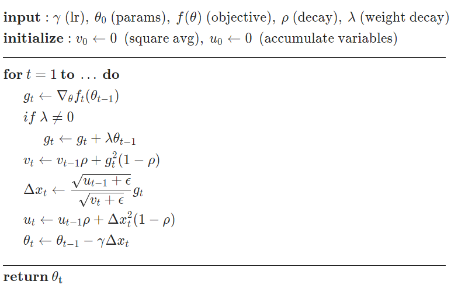

### Adagrad

```python
torch.optim.Adagrad(params, lr=0.01, lr_decay=0, weight_decay=0, 
                    initial_accumulator_value=0, eps=1e-10, foreach=None, 
                    *, maximize=False)
```

参数：

-   **params** ( *iterable* ) -- 可迭代的参数以优化或定义参数组
-   **lr** ( [*float*](https://docs.python.org/3/library/functions.html#float) *,* *optional* ) – 学习率（默认值：1e-2）
-   **lr_decay** ( [*float*](https://docs.python.org/3/library/functions.html#float) *,* *optional* ) – 学习率衰减（默认值：0）
-   **weight_decay** ( [*float*](https://docs.python.org/3/library/functions.html#float) *,* *optional* ) – 权重衰减（L2 惩罚）（默认值：0）
-   **eps** ( [*float*](https://docs.python.org/3/library/functions.html#float) *,* *optional* ) – 添加到分母以提高数值稳定性的项（默认值：1e-10）
-   **foreach** ( [*bool*](https://docs.python.org/3/library/functions.html#bool) *,* *optional* ) -- 是否使用优化器的 foreach 实现（默认值：无）
-   **最大化**( [*bool*](https://docs.python.org/3/library/functions.html#bool) *,* *optional* ) – 根据目标最大化参数，而不是最小化（默认值：False）

#### 公式

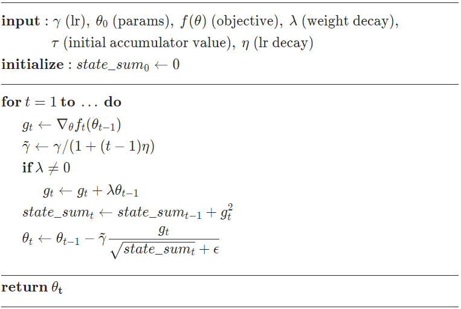

### Adam

```python
torch.optim.Adam(params, lr=0.001, betas=(0.9, 0.999), eps=1e-08, 
                 weight_decay=0, amsgrad=False, *, foreach=None, 
                 maximize=False, capturable=False)
```

参数：

-   **params** ( *iterable* ) -- 可迭代的参数以优化或定义参数组
-   **lr** ( [*float*](https://docs.python.org/3/library/functions.html#float) *,* *optional* ) – 学习率（默认值：1e-3）
-   **betas** ( *Tuple* *[* [*float*](https://docs.python.org/3/library/functions.html#float) *,* [*float*](https://docs.python.org/3/library/functions.html#float) *]* *,* *optional* ) - 用于计算梯度及其平方的运行平均值的系数（默认值：(0.9, 0.999)）
-   **eps** ( [*float*](https://docs.python.org/3/library/functions.html#float) *,* *optional* ) – 添加到分母以提高数值稳定性的项（默认值：1e-8）
-   **weight_decay** ( [*float*](https://docs.python.org/3/library/functions.html#float) *,* *optional* ) – 权重衰减（L2 惩罚）（默认值：0）
-   **amsgrad** ( *boolean* *,* *optional* ) – 是否使用论文[On the Convergence of Adam and Beyond](https://openreview.net/forum?id=ryQu7f-RZ)中该算法的 AMSGrad 变体 （默认值：False）
-   **foreach** ( [*bool*](https://docs.python.org/3/library/functions.html#bool) *,* *optional* ) -- 是否使用优化器的 foreach 实现（默认值：无）
-   **最大化**( [*bool*](https://docs.python.org/3/library/functions.html#bool) *,* *optional* ) – 根据目标最大化参数，而不是最小化（默认值：False）
-   **capturable** ( [*bool*](https://docs.python.org/3/library/functions.html#bool) *,* *optional* ) – 此实例是否可以安全地在 CUDA 图中捕获。传递 True 可能会影响未绘制的性能，因此如果您不打算以图形方式捕获此实例，请将其保留为 False（默认值：False）

#### 公式

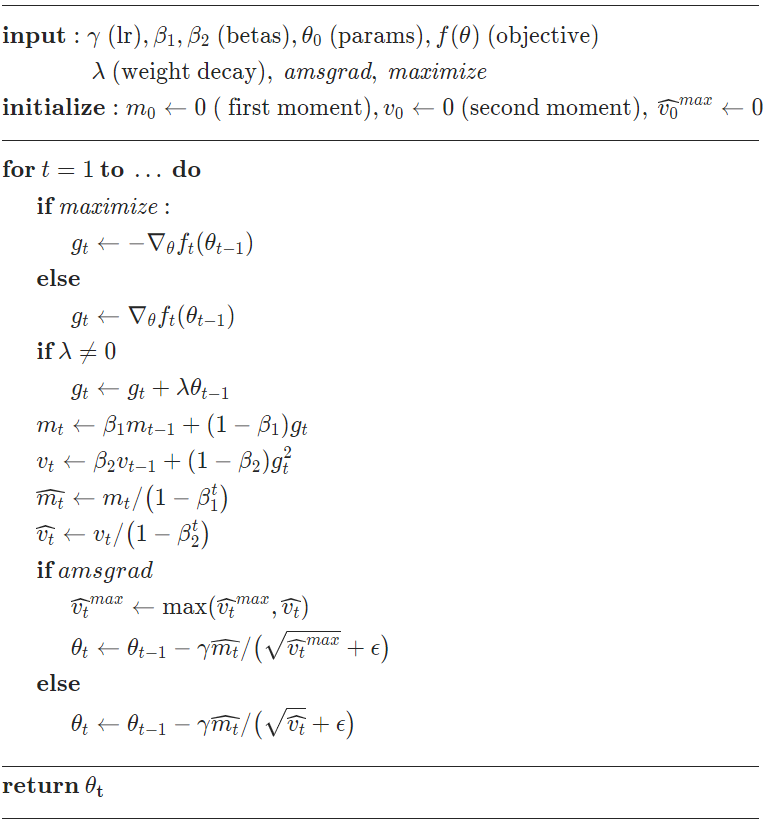

### Adamw

```python
torch.optim.AdamW(params, lr=0.001, betas=(0.9, 0.999), eps=1e-08, weight_decay=0.01,
                  amsgrad=False, *, maximize=False, foreach=None, capturable=False)
```

参数：

-   **params** ( *iterable* ) -- 可迭代的参数以优化或定义参数组
-   **lr** ( [*float*](https://docs.python.org/3/library/functions.html#float) *,* *optional* ) – 学习率（默认值：1e-3）
-   **betas** ( *Tuple* *[* [*float*](https://docs.python.org/3/library/functions.html#float) *,* [*float*](https://docs.python.org/3/library/functions.html#float) *]* *,* *optional* ) - 用于计算梯度及其平方的运行平均值的系数（默认值：(0.9, 0.999)）
-   **eps** ( [*float*](https://docs.python.org/3/library/functions.html#float) *,* *optional* ) – 添加到分母以提高数值稳定性的项（默认值：1e-8）
-   **weight_decay** ( [*float*](https://docs.python.org/3/library/functions.html#float) *,* *optional* ) – 权重衰减系数（默认值：1e-2）
-   **amsgrad** ( *boolean* *,* *optional* ) – 是否使用论文[On the Convergence of Adam and Beyond](https://openreview.net/forum?id=ryQu7f-RZ)中该算法的 AMSGrad 变体 （默认值：False）
-   **最大化**( [*bool*](https://docs.python.org/3/library/functions.html#bool) *,* *optional* ) – 根据目标最大化参数，而不是最小化（默认值：False）
-   **foreach** ( [*bool*](https://docs.python.org/3/library/functions.html#bool) *,* *optional* ) -- 是否使用优化器的 foreach 实现（默认值：无）
-   **capturable** ( [*bool*](https://docs.python.org/3/library/functions.html#bool) *,* *optional* ) – 此实例是否可以安全地在 CUDA 图中捕获。传递 True 可能会影响未绘制的性能，因此如果您不打算以图形方式捕获此实例，请将其保留为 False（默认值：False）

#### 公式

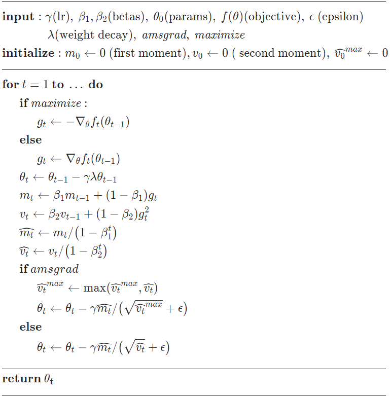

### Sparseadam

```python
torch.optim.SparseAdam(params, lr=0.001, betas=(0.9, 0.999), eps=1e-08)
```

实现适用于稀疏张量的 Adam 算法的惰性版本。在这个变体中，只有出现在梯度中的时刻才会被更新，并且只有梯度的那些部分会被应用到参数上。

参数：

-   **params** ( *iterable* ) -- 可迭代的参数以优化或定义参数组
-   **lr** ( [*float*](https://docs.python.org/3/library/functions.html#float) *,* *optional* ) – 学习率（默认值：1e-3）
-   **betas** ( *Tuple* *[* [*float*](https://docs.python.org/3/library/functions.html#float) *,* [*float*](https://docs.python.org/3/library/functions.html#float) *]* *,* *optional* ) - 用于计算梯度及其平方的运行平均值的系数（默认值：(0.9, 0.999)）
-   **eps** ( [*float*](https://docs.python.org/3/library/functions.html#float) *,* *optional* ) – 添加到分母以提高数值稳定性的项（默认值：1e-8）

### Adamax

```python
torch.optim.Adamax(params, lr=0.002, betas=(0.9, 0.999), eps=1e-08,
                   weight_decay=0, foreach=None, *, maximize=False)
```

 实现 Adamax 算法（基于无穷范数的 Adam 变体） 

参数：

-   **params** ( *iterable* ) -- 可迭代的参数以优化或定义参数组
-   **lr** ( [*float*](https://docs.python.org/3/library/functions.html#float) *,* *optional* ) – 学习率（默认值：2e-3）
-   **betas** ( *Tuple* *[* [*float*](https://docs.python.org/3/library/functions.html#float) *,* [*float*](https://docs.python.org/3/library/functions.html#float) *]* *,* *optional* ) – 用于计算梯度及其平方的运行平均值的系数
-   **eps** ( [*float*](https://docs.python.org/3/library/functions.html#float) *,* *optional* ) – 添加到分母以提高数值稳定性的项（默认值：1e-8）
-   **weight_decay** ( [*float*](https://docs.python.org/3/library/functions.html#float) *,* *optional* ) – 权重衰减（L2 惩罚）（默认值：0）
-   **foreach** ( [*bool*](https://docs.python.org/3/library/functions.html#bool) *,* *optional* ) -- 是否使用优化器的 foreach 实现（默认值：无）
-   **最大化**( [*bool*](https://docs.python.org/3/library/functions.html#bool) *,* *optional* ) – 根据目标最大化参数，而不是最小化（默认值：False）

#### 公式

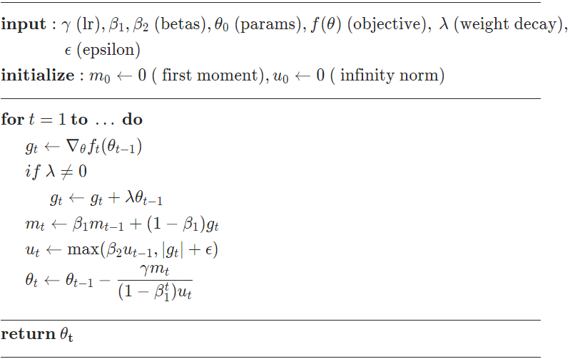

### ASGD

```python
torch.optim.ASGD(params, lr=0.01, lambd=0.0001, alpha=0.75, t0=1000000.0, 
                 weight_decay=0, foreach=None)
```

实现平均随机梯度下降。 

参数：

-   **params** ( *iterable* ) -- 可迭代的参数以优化或定义参数组
-   **lr** ( [*float*](https://docs.python.org/3/library/functions.html#float) *,* *optional* ) – 学习率（默认值：1e-2）
-   **lambd** ( [*float*](https://docs.python.org/3/library/functions.html#float) *,* *optional* ) – 衰减项（默认值：1e-4）
-   **alpha** ( [*float*](https://docs.python.org/3/library/functions.html#float) *,* *optional* ) – eta 更新的功率（默认值：0.75）
-   **t0** ( [*float*](https://docs.python.org/3/library/functions.html#float) *,* *optional* ) – 开始平均的点（默认值：1e6）
-   **weight_decay** ( [*float*](https://docs.python.org/3/library/functions.html#float) *,* *optional* ) – 权重衰减（L2 惩罚）（默认值：0）
-   **foreach** ( [*bool*](https://docs.python.org/3/library/functions.html#bool) *,* *optional* ) -- 是否使用优化器的 foreach 实现（默认值：无）

### LBfcs

```python
torch.optim.LBFGS(params, lr=1, max_iter=20, max_eval=None, tolerance_grad=1e-07,
                  tolerance_change=1e-09, history_size=100, line_search_fn=None)
```

 实现 L-BFGS 算法，深受[minFunc](https://www.cs.ubc.ca/~schmidtm/Software/minFunc.html)启发。 此优化器不支持每个参数选项和参数组(只能有一个)， 这是一个非常占用内存的优化器（它需要额外的 字节）。如果它不适合内存，请尝试减少历史记录大小，或使用不同的算法。`param_bytes * (history_size + 1)`  

参数：

-   **lr** ( [*float*](https://docs.python.org/3/library/functions.html#float) ) – 学习率（默认值：1）
-   **max_iter** ( [*int*](https://docs.python.org/3/library/functions.html#int) ) – 每个优化步骤的最大迭代次数（默认值：20）
-   **max_eval** ( [*int*](https://docs.python.org/3/library/functions.html#int) ) – 每个优化步骤的最大函数评估次数（默认值：max_iter * 1.25）。
-   **tolerance_grad** ( [*float*](https://docs.python.org/3/library/functions.html#float) ) -- 一阶最优性的终止容差（默认值：1e-5）。
-   **tolerance_change** ( [*float*](https://docs.python.org/3/library/functions.html#float) ) -- 函数值/参数更改的终止容差（默认值：1e-9）。
-   **history_size** ( [*int*](https://docs.python.org/3/library/functions.html#int) ) – 更新历史大小（默认值：100）。
-   **line_search_fn** ( [*str*](https://docs.python.org/3/library/stdtypes.html#str) ) -- 'strong_wolfe' 或无（默认值：无）。

### NAdam

```python
torch.optim.NAdam(params, lr=0.002, betas=(0.9, 0.999), eps=1e-08, weight_decay=0, 
                  momentum_decay=0.004, foreach=None)
```

参数：

-   **params** ( *iterable* ) -- 可迭代的参数以优化或定义参数组
-   **lr** ( [*float*](https://docs.python.org/3/library/functions.html#float) *,* *optional* ) – 学习率（默认值：2e-3）
-   **betas** ( *Tuple* *[* [*float*](https://docs.python.org/3/library/functions.html#float) *,* [*float*](https://docs.python.org/3/library/functions.html#float) *]* *,* *optional* ) - 用于计算梯度及其平方的运行平均值的系数（默认值：(0.9, 0.999)）
-   **eps** ( [*float*](https://docs.python.org/3/library/functions.html#float) *,* *optional* ) – 添加到分母以提高数值稳定性的项（默认值：1e-8）
-   **weight_decay** ( [*float*](https://docs.python.org/3/library/functions.html#float) *,* *optional* ) – 权重衰减（L2 惩罚）（默认值：0）
-   **动量衰减**（[*浮动*](https://docs.python.org/3/library/functions.html#float)*，**可选*）–动量动量衰减（默认值：4e-3）
-   **foreach** ( [*bool*](https://docs.python.org/3/library/functions.html#bool) *,* *optional* ) -- 是否使用优化器的 foreach 实现（默认值：无）

#### 公式

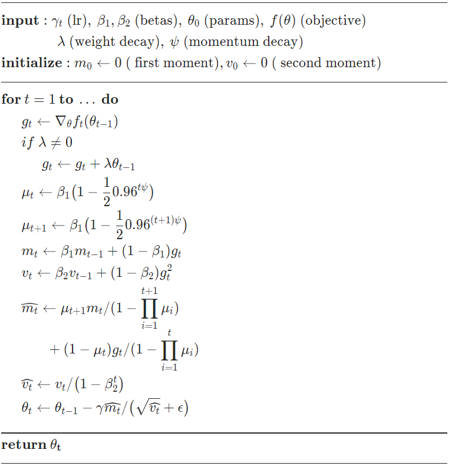

### RAdam

```python
torch.optim.RAdam(params, lr=0.001, betas=(0.9, 0.999), eps=1e-08, weight_decay=0,
                  foreach=None)
```

参数：

-   **params** ( *iterable* ) -- 可迭代的参数以优化或定义参数组
-   **lr** ( [*float*](https://docs.python.org/3/library/functions.html#float) *,* *optional* ) – 学习率（默认值：1e-3）
-   **betas** ( *Tuple* *[* [*float*](https://docs.python.org/3/library/functions.html#float) *,* [*float*](https://docs.python.org/3/library/functions.html#float) *]* *,* *optional* ) - 用于计算梯度及其平方的运行平均值的系数（默认值：(0.9, 0.999)）
-   **eps** ( [*float*](https://docs.python.org/3/library/functions.html#float) *,* *optional* ) – 添加到分母以提高数值稳定性的项（默认值：1e-8）
-   **weight_decay** ( [*float*](https://docs.python.org/3/library/functions.html#float) *,* *optional* ) – 权重衰减（L2 惩罚）（默认值：0）
-   **foreach** ( [*bool*](https://docs.python.org/3/library/functions.html#bool) *,* *optional* ) -- 是否使用优化器的 foreach 实现（默认值：无）

#### 公式

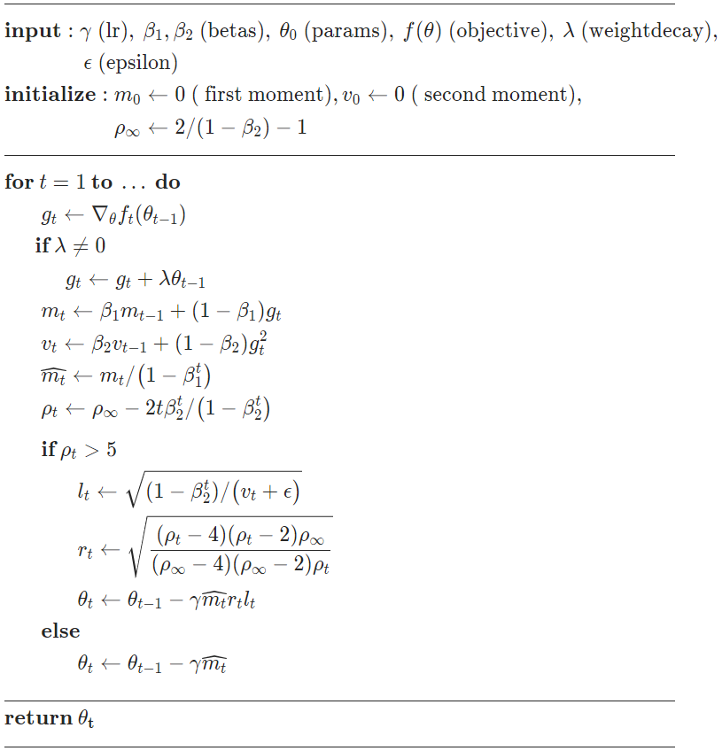

### RMSprop

```python
torch.optim.RMSprop(params, lr=0.01, alpha=0.99, eps=1e-08, weight_decay=0, 
                    momentum=0, centered=False, foreach=None)
```

参数：

-   **params** ( *iterable* ) -- 可迭代的参数以优化或定义参数组
-   **lr** ( [*float*](https://docs.python.org/3/library/functions.html#float) *,* *optional* ) – 学习率（默认值：1e-2）
-   **动量**（[*浮动*](https://docs.python.org/3/library/functions.html#float)*，**可选*）–动量因子（默认值：0）
-   **alpha** ( [*float*](https://docs.python.org/3/library/functions.html#float) *,* *optional* ) – 平滑常数（默认值：0.99）
-   **eps** ( [*float*](https://docs.python.org/3/library/functions.html#float) *,* *optional* ) – 添加到分母以提高数值稳定性的项（默认值：1e-8）
-   **centered** ( [*bool*](https://docs.python.org/3/library/functions.html#bool) *,* *optional* ) – 如果`True`计算居中的 RMSProp，则梯度通过对其方差的估计进行归一化
-   **weight_decay** ( [*float*](https://docs.python.org/3/library/functions.html#float) *,* *optional* ) – 权重衰减（L2 惩罚）（默认值：0）
-   **foreach** ( [*bool*](https://docs.python.org/3/library/functions.html#bool) *,* *optional* ) -- 是否使用优化器的 foreach 实现（默认值：无）

#### 公式

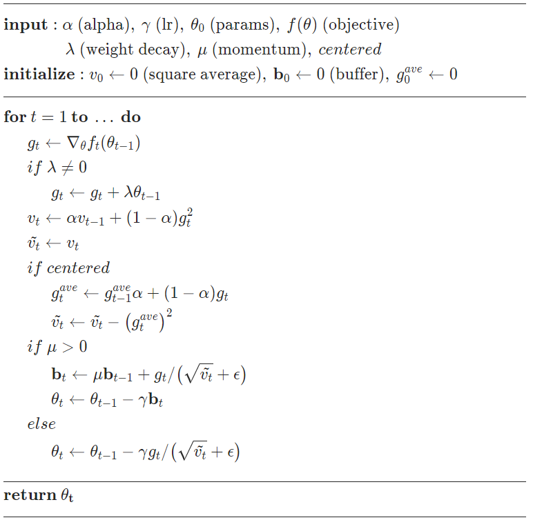

这里的实现在添加 epsilon 之前取梯度平均值的平方根（注意 TensorFlow 交换了这两个操作）。因此有效学习率是 *γ*/(*v*+*ϵ*) 是预定的学习率和平方梯度的加权移动平均值。 

### RPROP

```python
torch.optim.Rprop(params, lr=0.01, etas=(0.5, 1.2), step_sizes=(1e-06, 50), foreach=None)
```

参数：

-   **params** ( *iterable* ) -- 可迭代的参数以优化或定义参数组
-   **lr** ( [*float*](https://docs.python.org/3/library/functions.html#float) *,* *optional* ) – 学习率（默认值：1e-2）
-   **etas** ( *Tuple* *[* [*float*](https://docs.python.org/3/library/functions.html#float) *,* [*float*](https://docs.python.org/3/library/functions.html#float) *]* *,* *optional* ) – 一对 (etaminus, etaplis)，它们是乘法增加和减少因子（默认值：(0.5, 1.2)）
-   **step_sizes** ( *Tuple* *[* [*float*](https://docs.python.org/3/library/functions.html#float) *,* [*float*](https://docs.python.org/3/library/functions.html#float) *]* *,* *optional* ) – 一对允许的最小和最大步长（默认值：(1e-6, 50)）
-   **foreach** ( [*bool*](https://docs.python.org/3/library/functions.html#bool) *,* *optional* ) -- 是否使用优化器的 foreach 实现（默认值：无）

### 公式

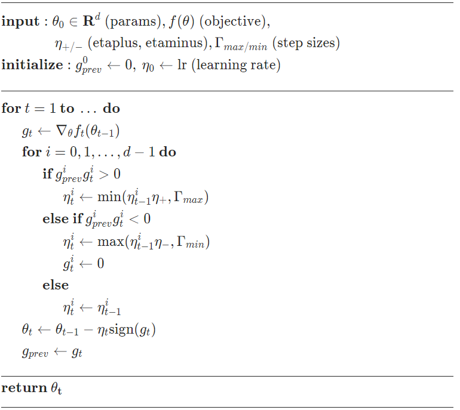

### SGD

```python
torch.optim.SGD(params, lr=<required parameter>, momentum=0, dampening=0, 
                weight_decay=0, nesterov=False, *, maximize=False, foreach=None)
```

参数：

-   **params** ( *iterable* ) -- 可迭代的参数以优化或定义参数组
-   **lr** ( [*float*](https://docs.python.org/3/library/functions.html#float) ) – 学习率
-   **动量**（[*浮动*](https://docs.python.org/3/library/functions.html#float)*，**可选*）–动量因子（默认值：0）
-   **weight_decay** ( [*float*](https://docs.python.org/3/library/functions.html#float) *,* *optional* ) – 权重衰减（L2 惩罚）（默认值：0）
-   **阻尼**（[*浮动*](https://docs.python.org/3/library/functions.html#float)*，**可选*）–动量阻尼（默认值：0）
-   **nesterov** ( [*bool*](https://docs.python.org/3/library/functions.html#bool) *,* *optional* ) – 启用 Nesterov 动量 (默认: False)
-   **最大化**( [*bool*](https://docs.python.org/3/library/functions.html#bool) *,* *optional* ) – 根据目标最大化参数，而不是最小化（默认值：False）
-   **foreach** ( [*bool*](https://docs.python.org/3/library/functions.html#bool) *,* *optional* ) -- 是否使用优化器的 foreach 实现（默认值：无）

#### 公式

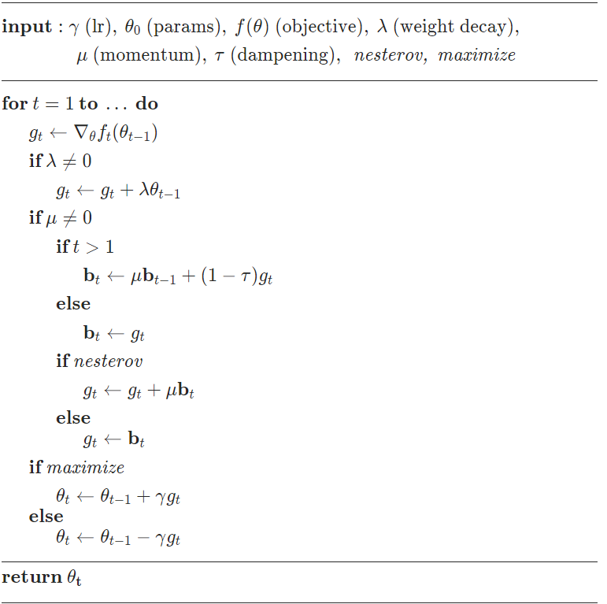


|                             算法                             |                             作用                             |
| :----------------------------------------------------------: | :----------------------------------------------------------: |
| [`Adadelta`](https://pytorch.org/docs/stable/generated/torch.optim.Adadelta.html#torch.optim.Adadelta) |                     实现 Adadelta 算法。                     |
| [`Adagrad`](https://pytorch.org/docs/stable/generated/torch.optim.Adagrad.html#torch.optim.Adagrad) |                     实现 Adagrad 算法。                      |
| [`Adam`](https://pytorch.org/docs/stable/generated/torch.optim.Adam.html#torch.optim.Adam) |                        实现亚当算法。                        |
| [`AdamW`](https://pytorch.org/docs/stable/generated/torch.optim.AdamW.html#torch.optim.AdamW) |                      实现 AdamW 算法。                       |
| [`SparseAdam`](https://pytorch.org/docs/stable/generated/torch.optim.SparseAdam.html#torch.optim.SparseAdam) |          实现适用于稀疏张量的 Adam 算法的惰性版本。          |
| [`Adamax`](https://pytorch.org/docs/stable/generated/torch.optim.Adamax.html#torch.optim.Adamax) |        实现 Adamax 算法（基于无穷范数的 Adam 变体）。        |
| [`ASGD`](https://pytorch.org/docs/stable/generated/torch.optim.ASGD.html#torch.optim.ASGD) |                    实现平均随机梯度下降。                    |
| [`LBFGS`](https://pytorch.org/docs/stable/generated/torch.optim.LBFGS.html#torch.optim.LBFGS) | 实现 L-BFGS 算法，深受[minFunc](https://www.cs.ubc.ca/~schmidtm/Software/minFunc.html)启发。 |
| [`NAdam`](https://pytorch.org/docs/stable/generated/torch.optim.NAdam.html#torch.optim.NAdam) |                      实现 NAdam 算法。                       |
| [`RAdam`](https://pytorch.org/docs/stable/generated/torch.optim.RAdam.html#torch.optim.RAdam) |                      实现 RAdam 算法。                       |
| [`RMSprop`](https://pytorch.org/docs/stable/generated/torch.optim.RMSprop.html#torch.optim.RMSprop) |                     实现 RMSprop 算法。                      |
| [`Rprop`](https://pytorch.org/docs/stable/generated/torch.optim.Rprop.html#torch.optim.Rprop) |                    实现弹性反向传播算法。                    |
| [`SGD`](https://pytorch.org/docs/stable/generated/torch.optim.SGD.html#torch.optim.SGD) |               实现随机梯度下降（可选用动量）。               |

 不同优化器的比较：

 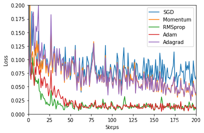

第一张图是损失函数的等高线：

等高线特征：

1、位于同一等高线上的地面点，海拔高度相同。但海拔高度相同的点不一定位于同一条等高线上。

2、在同一幅图内，除了陡崖以外，不同高程的等高线不能相交。

3、在图廓内相邻等高线的高差一般是相同的，因此地面坡度与等高线之间的等高线平距成反比，等高线平距愈小，等高线排列越密，说明地面坡度越大；等高线平距愈大，等高线排列越稀，则说明地面坡度愈小。

4、等高线是一条闭合的曲线，如果不能在同一幅内闭合，则必在相邻或者其他图幅内闭合。

5、等高线经过山脊或山谷时改变方向，因此，山脊线或者山谷线应垂直于等高线转折点处的切线，即等高线与山脊线或者山谷线正交。

 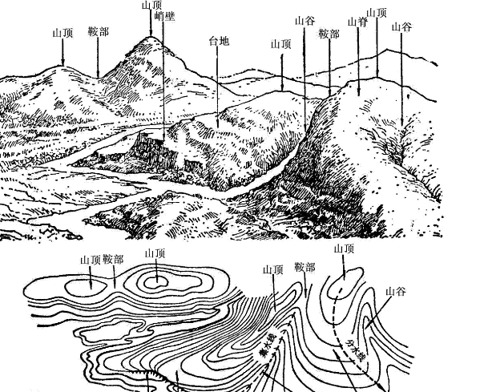 

( 大比例尺的地图，缩小的程度小，地貌表示详尽，等高距等高线间距可以很小；而在小比例尺地图上，地貌表示粗略，等高距等高线间距必须加大。另一方面，地图的比例尺虽然相同，等高距的大小又可因地图所表示的内容和地形的起伏情况而定不同的标准)


第二张图是在鞍点处的学习情况，注意SGD很难突破对称性，一直卡在顶部。而RMSProp之类的方法能够看到马鞍方向有很低的梯度。因为在RMSProp更新方法中的分母项，算法提高了在该方向的有效学习率，使得RMSProp能够继续前进： 

鞍点：鞍点(Saddle point)在[微分方程](https://baike.baidu.com/item/微分方程/4763?fromModule=lemma_inlink)中，沿着某一方向是稳定的，另一条方向是不稳定的奇点，叫做鞍点。在[泛函](https://baike.baidu.com/item/泛函/9410786?fromModule=lemma_inlink)中，既不是极大值点也不是极小值点的临界点，叫做鞍点。在[矩阵](https://baike.baidu.com/item/矩阵/18069?fromModule=lemma_inlink)中，一个数在所在行中是[最大值](https://baike.baidu.com/item/最大值/774514?fromModule=lemma_inlink)，在所在列中是[最小值](https://baike.baidu.com/item/最小值/774537?fromModule=lemma_inlink)，则被称为鞍点。在物理上要广泛一些，指在一个方向是极大值，另一个方向是极小值的点。 

