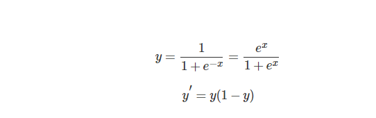
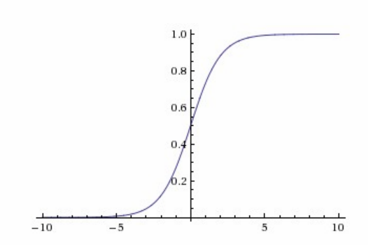
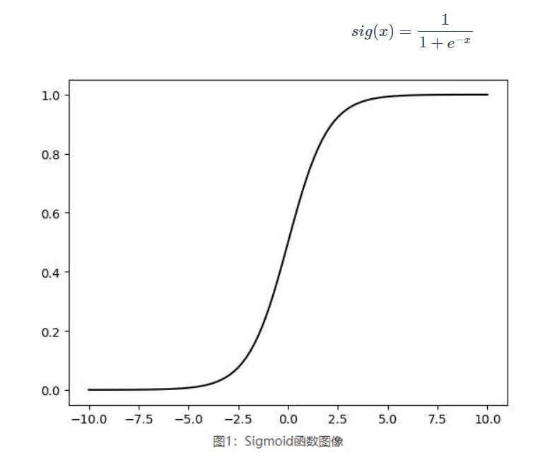
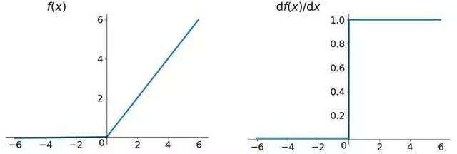
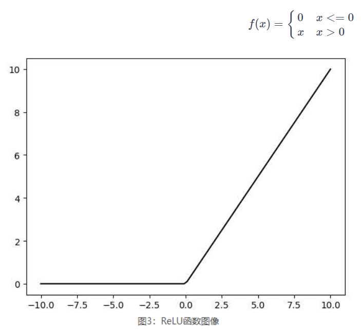
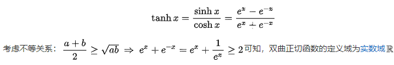
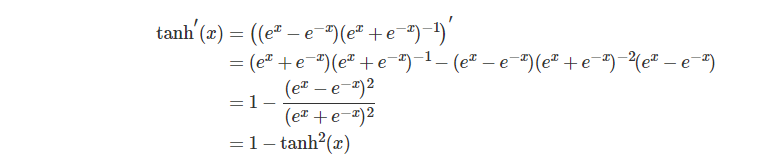
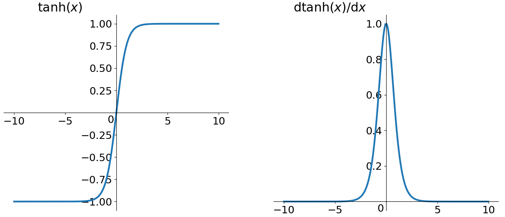
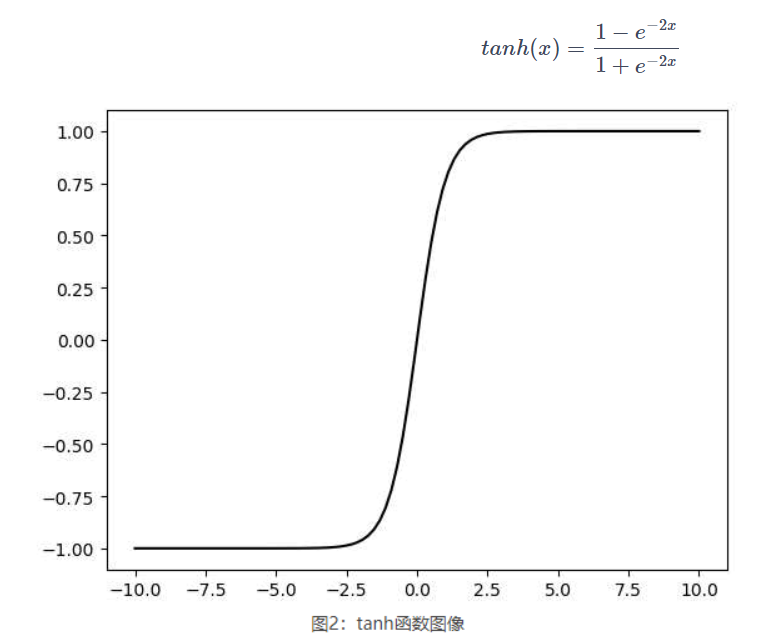

# 激活函数

## 1.Sigmoid函数

Sigmoid激活函数是应用最广泛的 **非线性激活函数之一**，它可以将值转换为 **0到1之间**， 如果原来的的输出具有这样的特点：值越大，归为某类的可能性越大，那么经过Sigmoid函数处理的输出就可以代表归属某一类的概率。

数学表达式：



 

```python
import torch

S = torch.bb.Sigmoid() # Sigmoid类实例化
x = torch.randn(2)

y = S(x) # 元素层操作
print(y)
```

```python
tensor([0.8241, 0.3312])
```

从数学上来看，非线性的 Sigmoid 函数对中央区的信号增益较大，对两侧区的信号增益小，在信号的特征空间映射上，有很好的效果。从神经科学上来看，中央区酷似神经元的兴奋态，两侧区酷似神经元的抑制态，因而在神经网络学习方面，可以将重点特征推向中央区，将非重点特征推向两侧区。无论是哪种解释，看起来都比早期的线性激活函数, 阶跃激活函数高明了不少。




## 2.Relu函数

Relu激活函数是分段线性函数，把所有的负值都变为0， 这种操作称为单侧抑制。Relu 函数定义很简单： 


其函数图像和导数图像分别为：

  

使用这个函数作为激活有如下几个特点：

1、**更加符生物学特性： ** 相关大脑方法的研究表明生物神经元的信息编码通常是比较分散及稀疏的。通常情况下，大脑中在同意时间大概只有1%-4%的神经元处于活跃状态，也就是说，根本用不到全部的神经元。这个函数由于小于 0 部分为 0，大于 0 部分才有值，意味着输入不同的样本将会激活不同的神经元，每次训练只会涉及到部分权重，不需要更新整个网络参数，一定程度也避免了过拟合。

2、当数值过大或者过小，sigmoid 函数的导数接近于 0，而它的导数又是链式求导的一部分，因而可能导致梯度趋于 0，而 relu 是非饱和激活函数，不存在这种现象，避免了梯度消失问题。

3、导数很好求，加快反向传播的过程

```python
import torch

m = torch.nn.ReLU()
input = torch.randn(2)
output = m(input)
print(output)
```

```python
tensor([0., 0.])
```




## 3.Tanh函数

tanh是一个双曲函数中的一个，tanh()为双曲正切。 双曲正切函数（tanh）是[双曲正弦函数](https://baike.baidu.com/item/双曲正弦函数?fromModule=lemma_inlink)（sinh）与[双曲余弦函数](https://baike.baidu.com/item/双曲余弦函数?fromModule=lemma_inlink)（cosh）的比值，其解析形式为： 



导数：




其函数图像和导数分别为：

  

使用这个函数作为激活函数有如下几个特点：

1、tanh 类似于幅度增大 sigmoid，将输入值转换为 -1 至 1 之间。tanh 的导数取值范围在 0 至 1 之间，优于 sigmoid 的 0 至 1/4，在一定程度上，减轻了梯度消失的问题。

2、tanh 是 0 均值的，在实际应用中 tanh 会比 sigmoid 更好。 

```python
import torch
 
m = torch.nn.Tanh()
input = torch.randn(2)
output = m(input)
print(output)
```

```python
tensor([-0.2696, -0.2531])
```



