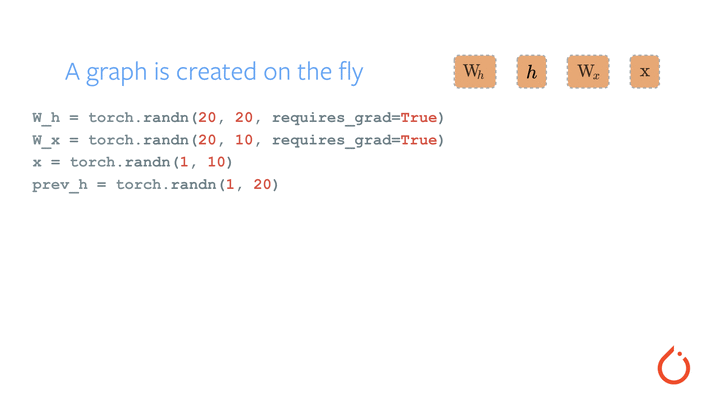

# 第十一章 Pytorch TorchScript

## TorchScript简介

TorchScript 是 PyTorch 模型(的子类)的中间表示形式，然后可以在高性能环境(如 C++)中运行。 

1、查看Pytorch版本信息

```python
import torch  # 
print(torch.__version__)
```

输出：

```python
D:\Server\anaconda\python.exe D:/LR/Project/demo.py
1.12.1+cu102
```

2、Pytorch模型基础知识

1.  一个构造函数，用于准备模块以进行调用
2.  一组 和 子。它们由构造函数初始化，并且可以在调用期间由模块使用。`Parameters``Modules`
3.  函数。这是在调用模块时运行的代码。`forward`

案例：

```python
class MyCell(torch.nn.Module):
    def __init__(self):
        super(MyCell, self).__init__()

    def forward(self, x, h):
        new_h = torch.tanh(x + h)
        return new_h, new_h

my_cell = MyCell()
x = torch.rand(3, 4)
h = torch.rand(3, 4)
print(my_cell(x, h))
```

输出：

```python
(tensor([[0.9260, 0.5828, 0.8999, 0.6134],
        [0.6798, 0.9337, 0.4516, 0.6975],
        [0.8714, 0.6758, 0.4238, 0.7654]]), tensor([[0.9260, 0.5828, 0.8999, 0.6134],
        [0.6798, 0.9337, 0.4516, 0.6975],
        [0.8714, 0.6758, 0.4238, 0.7654]]))
```

解释：

1.  已创建子类的类。`torch.nn.Module`
2.  定义了构造函数。构造函数不执行太多操作，只是调用的构造函数。`super`
3.  定义了一个函数，该函数接受两个输入并返回两个输出。函数的实际内容并不重要，但它有点像一个假的[RNN单元格](https://colah.github.io/posts/2015-08-Understanding-LSTMs/) ， 也就是说 ，它是一个应用于循环的函数。`forward`

实例化了模块，并制作了 和 ，它们只是随机值的 3x4 矩阵。然后，调用了单元格。这反过来又调用了函数。

`x` `h` `my_cell(x, h)` `forward`

```python
class MyCell(torch.nn.Module):
    def __init__(self):
        super(MyCell, self).__init__()
        self.linear = torch.nn.Linear(4, 4)

    def forward(self, x, h):
        new_h = torch.tanh(self.linear(x) + h)
        return new_h, new_h

my_cell = MyCell()
print(my_cell)
print(my_cell(x, h))
```

输出：

```python
MyCell(
  (linear): Linear(in_features=4, out_features=4, bias=True)
)
(tensor([[-0.0826, -0.6485,  0.6980,  0.2393],
        [ 0.3291,  0.2436,  0.0826,  0.5810],
        [-0.3945, -0.1687,  0.3281,  0.2459]], grad_fn=<TanhBackward0>), 
 tensor([[-0.0826, -0.6485,  0.6980,  0.2393],
        [ 0.3291,  0.2436,  0.0826,  0.5810],
        [-0.3945, -0.1687,  0.3281,  0.2459]], grad_fn=<TanhBackward0>))
```

重新定义了模块，并添加了一个属性，并在 forward 函数中调用。

这里到底发生了什么？ 

来自Pytorch标准库的，可以使用调用语法来调用。正在建立一个层次结构。print在 a 上给出了子类层次结构的可视表示。在示例中，可以看到我们的子类及其参数。 通过以这种方式编写 s，可以简洁易读地创作具有可重用组件的模型。输出。是PyTorch的自动微分方法的一个细节，称为[自动分级](https://pytorch.org/tutorials/beginner/blitz/autograd_tutorial.html)。简而言之，这个系统允许通过潜在的复杂程序来计算导数。该设计为模型创作提供了极大的灵活性。

灵活性：

```python
class MyDecisionGate(torch.nn.Module):
    def forward(self, x):
        if x.sum() > 0:
            return x
        else:
            return -x

class MyCell(torch.nn.Module):
    def __init__(self):
        super(MyCell, self).__init__()
        self.dg = MyDecisionGate()
        self.linear = torch.nn.Linear(4, 4)

    def forward(self, x, h):
        new_h = torch.tanh(self.dg(self.linear(x)) + h)
        return new_h, new_h

my_cell = MyCell()
print(my_cell)
print(my_cell(x, h))
```

输出：

```python
MyCell(
  (dg): MyDecisionGate()
  (linear): Linear(in_features=4, out_features=4, bias=True)
)
(tensor([[ 0.8694, -0.1767,  0.3185,  0.8235],
        [ 0.7361,  0.7241,  0.0667,  0.9242],
        [ 0.7906,  0.0013, -0.3272,  0.7514]], grad_fn=<TanhBackward0>), 
 tensor([[ 0.8694, -0.1767,  0.3185,  0.8235],
        [ 0.7361,  0.7241,  0.0667,  0.9242],
        [ 0.7906,  0.0013, -0.3272,  0.7514]], grad_fn=<TanhBackward0>))
```

再次重新定义了 MyCell 类，但在这里定义了该模块利用**控制流**。控制流由循环和语句等内容组成。 许多框架采用在给定完整程序表示的情况下计算符号导数的方法。但是，在PyTorch中，使用渐变磁带。在操作发生时记录操作，并在计算导数时向后重放它们。通过这种方式，框架不必为语言中的所有构造显式定义导数。  自动刻度的工作原理如下：

  

3、TorchScript基础知识

简而言之，TorchScript 提供了捕获模型定义的工具，即使考虑到 PyTorch 的灵活性和动态性。检查所说的**跟踪**。 

**Tracing Module**：描图模块

```python
class MyCell(torch.nn.Module):
    def __init__(self):
        super(MyCell, self).__init__()
        self.linear = torch.nn.Linear(4, 4)

    def forward(self, x, h):
        new_h = torch.tanh(self.linear(x) + h)
        return new_h, new_h

my_cell = MyCell()
x, h = torch.rand(3, 4), torch.rand(3, 4)
traced_cell = torch.jit.trace(my_cell, (x, h))
print(traced_cell)
traced_cell(x, h)
```

输出：

```python
MyCell(
  original_name=MyCell
  (linear): Linear(original_name=Linear)
)

(tensor([[0.6356, 0.0445, 0.0800, 0.6886],
        [0.5298, 0.6278, 0.7576, 0.7632],
        [0.8429, 0.0039, 0.5648, 0.6636]], grad_fn=<TanhBackward0>), 
 tensor([[0.6356, 0.0445, 0.0800, 0.6886],
        [0.5298, 0.6278, 0.7576, 0.7632],
        [0.8429, 0.0039, 0.5648, 0.6636]], grad_fn=<TanhBackward0>))
```

解释：在调用时，记录了运行时发生的操作，并创建了一个实例(其中是一个实例)，TorchScript将其定义记录在中间表示(IR)中，通常在深度学习中称为图形，可以检查具有以下属性的图形：.graph

```python
print(traced_cell.graph)
```

输出：

```python
MyCell(
  original_name=MyCell
  (linear): Linear(original_name=Linear)
)

(tensor([[0.6356, 0.0445, 0.0800, 0.6886],
        [0.5298, 0.6278, 0.7576, 0.7632],
        [0.8429, 0.0039, 0.5648, 0.6636]], grad_fn=<TanhBackward0>), 
 tensor([[0.6356, 0.0445, 0.0800, 0.6886],
        [0.5298, 0.6278, 0.7576, 0.7632],
        [0.8429, 0.0039, 0.5648, 0.6636]], grad_fn=<TanhBackward0>))
```

这是一个比较低级的表示形式，图形中包含大多数信息最最终用户没有用处，相反可使用属性来给出代码解释：.code

```python
print(traced_cell.code)
```

输出：

```python
def forward(self,
    x: Tensor,
    h: Tensor) -> Tuple[Tensor, Tensor]:
  linear = self.linear
  _0 = torch.tanh(torch.add((linear).forward(x, ), h))
  return (_0, _0)
```

解释这样做的原因：

1.  火炬脚本代码可以在自己的解释器中调用，这基本上是一个受限制的Python解释器。此解释器不获取全局解释器锁，因此可以在同一实例上同时处理许多请求。
2.  这种格式允许将整个模型保存到磁盘并将其加载到另一个环境中，例如在用Python以外的语言编写的服务器中
3.  TorchScript提供了一个表示形式，可以在其中对代码进行编译器优化，以提供更有效的执行
4.  TorchScript允许与许多后端/设备运行时进行交互，这些运行时需要比单个操作员更广泛的程序视图。

可以看到调用产生与Python模块相同的结果：`traced_cell`

```python
print(my_cell(x, h))
print(traced_cell(x, h))
```

输出：

```python
(tensor([[0.6356, 0.0445, 0.0800, 0.6886],
        [0.5298, 0.6278, 0.7576, 0.7632],
        [0.8429, 0.0039, 0.5648, 0.6636]], grad_fn=<TanhBackward0>), 
 tensor([[0.6356, 0.0445, 0.0800, 0.6886],
        [0.5298, 0.6278, 0.7576, 0.7632],
        [0.8429, 0.0039, 0.5648, 0.6636]], grad_fn=<TanhBackward0>))
(tensor([[0.6356, 0.0445, 0.0800, 0.6886],
        [0.5298, 0.6278, 0.7576, 0.7632],
        [0.8429, 0.0039, 0.5648, 0.6636]],
       grad_fn=<DifferentiableGraphBackward>), 
 tensor([[0.6356, 0.0445, 0.0800, 0.6886],
        [0.5298, 0.6278, 0.7576, 0.7632],
        [0.8429, 0.0039, 0.5648, 0.6636]],
       grad_fn=<DifferentiableGraphBackward>))
```

4、通过TorchScript转换模块

使用模块的第二个脚本，而不是带有控制子模块的版本，其中有一定的原因：

```python
class MyDecisionGate(torch.nn.Module):
    def forward(self, x):
        if x.sum() > 0:
            return x
        else:
            return -x

class MyCell(torch.nn.Module):
    def __init__(self, dg):
        super(MyCell, self).__init__()
        self.dg = dg
        self.linear = torch.nn.Linear(4, 4)

    def forward(self, x, h):
        new_h = torch.tanh(self.dg(self.linear(x)) + h)
        return new_h, new_h

my_cell = MyCell(MyDecisionGate())
traced_cell = torch.jit.trace(my_cell, (x, h))

print(traced_cell.dg.code)
print(traced_cell.code)
```

输出：

```python
/var/lib/jenkins/workspace/beginner_source/Intro_to_TorchScript_tutorial.py:260: TracerWarning:

Converting a tensor to a Python boolean might cause the trace to be incorrect. 
We can't record the data flow of Python values, so this value will be treated as a constant in the future. 
This means that the trace might not generalize to other inputs!

def forward(self,
    argument_1: Tensor) -> Tensor:
  return torch.neg(argument_1)

def forward(self,
    x: Tensor,
    h: Tensor) -> Tuple[Tensor, Tensor]:
  dg = self.dg
  linear = self.linear
  _0 = torch.add((dg).forward((linear).forward(x, ), ), h)
  _1 = torch.tanh(_0)
  return (_1, _1)
```

查看输出，可看到不存在任何分支，跟踪完全按照逻辑去做：运行代码，记录操作，并构建一个完整做到这一点的脚本模块，但现实，像控制流这样的东西完全被删除：`code-if-else`

如果想在TorchScript中表示该模块，需要使用体力的脚本编译器，它会直接分析Python源代码，并将其转换为TorchScript脚本：

`torch.jit.script()`

```python
scripted_gate = torch.jit.script(MyDecisionGate())

my_cell = MyCell(scripted_gate)
scripted_cell = torch.jit.script(my_cell)

print(scripted_gate.code)
print(scripted_cell.code)
```

输出：

```python
def forward(self,
    x: Tensor) -> Tensor:
  if bool(torch.gt(torch.sum(x), 0)):
    _0 = x
  else:
    _0 = torch.neg(x)
  return _0

def forward(self,
    x: Tensor,
    h: Tensor) -> Tuple[Tensor, Tensor]:
  dg = self.dg
  linear = self.linear
  _0 = torch.add((dg).forward((linear).forward(x, ), ), h)
  new_h = torch.tanh(_0)
  return (new_h, new_h)
```

查看输出，显示已经成功的捕捉到了TorchScript脚本程序的行为。

```python
# 新的输入点
x, h = torch.rand(3, 4), torch.rand(3, 4)
traced_cell(x, h)
```

输出：

```python
(tensor([[ 0.4637,  0.7727,  0.7521,  0.5108],
        [-0.3476,  0.2235,  0.8067,  0.3769],
        [ 0.0652,  0.2589,  0.8408,  0.3873]], grad_fn=<TanhBackward0>), 
 tensor([[ 0.4637,  0.7727,  0.7521,  0.5108],
        [-0.3476,  0.2235,  0.8067,  0.3769],
        [ 0.0652,  0.2589,  0.8408,  0.3873]], grad_fn=<TanhBackward0>))
```

5、混合编写脚本和追踪

有些情况需要使用跟踪而不是脚本(例如，模块有许多基于常量Python值做出的架构决策，希望这些值不会出现在TorchScript中)。在这种情况下，脚本可以与跟踪组成：将内联跟踪模块的代码，跟踪将内联脚本化模块的代码。`torch.jit.script` 

①：第一种情况示例

```python
class MyRNNLoop(torch.nn.Module):
    def __init__(self):
        super(MyRNNLoop, self).__init__()
        self.cell = torch.jit.trace(MyCell(scripted_gate), (x, h))

    def forward(self, xs):
        h, y = torch.zeros(3, 4), torch.zeros(3, 4)
        for i in range(xs.size(0)):
            y, h = self.cell(xs[i], h)
        return y, h

rnn_loop = torch.jit.script(MyRNNLoop())
print(rnn_loop.code)
```

输出：

```python
def forward(self,
    xs: Tensor) -> Tuple[Tensor, Tensor]:
  h = torch.zeros([3, 4])
  y = torch.zeros([3, 4])
  y0 = y
  h0 = h
  for i in range(torch.size(xs, 0)):
    cell = self.cell
    _0 = (cell).forward(torch.select(xs, 0, i), h0, )
    y1, h1, = _0
    y0, h0 = y1, h1
  return (y0, h0)
```

②：第二种情况示例

```python
class WrapRNN(torch.nn.Module):
    def __init__(self):
        super(WrapRNN, self).__init__()
        self.loop = torch.jit.script(MyRNNLoop())

    def forward(self, xs):
        y, h = self.loop(xs)
        return torch.relu(y)

traced = torch.jit.trace(WrapRNN(), (torch.rand(10, 3, 4)))
print(traced.code)
```

输出：

```python
def forward(self,
    xs: Tensor) -> Tensor:
  loop = self.loop
  _0, y, = (loop).forward(xs, )
  return torch.relu(y)
```

当脚本和追踪需要一起使用时。

6、保存和加载模型

提供 API，以存档格式将 TorchScript 模块保存和加载到磁盘/从磁盘加载。此格式包括代码、参数、属性和调试信息，这意味着存档是模型的独立表示形式，可以在完全独立的进程中加载。保存并加载包装的 RNN 模块： 

```python
traced.save('wrapped_rnn.pt')

loaded = torch.jit.load('wrapped_rnn.pt')

print(loaded)
print(loaded.code)
```

输出：

```python
RecursiveScriptModule(
  original_name=WrapRNN
  (loop): RecursiveScriptModule(
    original_name=MyRNNLoop
    (cell): RecursiveScriptModule(
      original_name=MyCell
      (dg): RecursiveScriptModule(original_name=MyDecisionGate)
      (linear): RecursiveScriptModule(original_name=Linear)
    )
  )
)
def forward(self,
    xs: Tensor) -> Tensor:
  loop = self.loop
  _0, y, = (loop).forward(xs, )
  return torch.relu(y)
```

解释：序列化保留了模块层次结构和一直在检查的代码。例如，该模型还可以加载[到C++中](https://pytorch.org/tutorials/advanced/cpp_export.html)，以实现无 python 的执行。


## TorchScript

TorchScript是一种Pytorch代码创建可序列化和可优化的方法，任何TorchScript脚本程序都可以从Python进程中保存，并加载到没有Python依赖项的进程中。在提供的工具中，可以逐步将模型从纯Python程序转换为可以独立于Python运行的TorchScript程序。

例如：

在独立的C++程序中。这使得使用Python中熟悉的工具在PyTorch中训练模型成为可能，然后通过TorchScript将模型导出到生产环境中，其中Python程序可能由于性能和多线程原因而处于不利地位。 

### 创建TorchScript脚本代码

| [`script`](https://pytorch.org/docs/stable/generated/torch.jit.script.html#torch.jit.script) | 编写函数脚本或将检查源代码，使用 TorchScript 编译器将其编译为火炬脚本代码，并返回  [`ScriptModule`](https://pytorch.org/docs/stable/generated/torch.jit.ScriptModule.html#torch.jit.ScriptModule) or [`ScriptFunction`](https://pytorch.org/docs/stable/generated/torch.jit.ScriptFunction.html#torch.jit.ScriptFunction).`nn.Module` |
| :----------------------------------------------------------: | :----------------------------------------------------------: |
| [`trace`](https://pytorch.org/docs/stable/generated/torch.jit.trace.html#torch.jit.trace) | 跟踪函数并返回将使用实时编译进行优化的可执行文件或 [`ScriptFunction`](https://pytorch.org/docs/stable/generated/torch.jit.ScriptFunction.html#torch.jit.ScriptFunction) |
| [`script_if_tracing`](https://pytorch.org/docs/stable/generated/torch.jit.script_if_tracing.html#torch.jit.script_if_tracing) |                在跟踪期间首次调用它时进行编译                |
| [`trace_module`](https://pytorch.org/docs/stable/generated/torch.jit.trace_module.html#torch.jit.trace_module) | 跟踪模块并返回将使用实时编译进行优化的可执行[`ScriptModule`](https://pytorch.org/docs/stable/generated/torch.jit.ScriptModule.html#torch.jit.ScriptModule) |
| [`fork`](https://pytorch.org/docs/stable/generated/torch.jit.fork.html#torch.jit.fork) |       创建执行 func 的异步任务以及对此执行结果值的引用       |
| [`wait`](https://pytorch.org/docs/stable/generated/torch.jit.wait.html#torch.jit.wait) | 强制完成 torch.jit.Future[T] asynchronous task, 返回任务结果 |
| [`ScriptModule`](https://pytorch.org/docs/stable/generated/torch.jit.ScriptModule.html#torch.jit.ScriptModule) |          围绕C++的包装器 C++ .`torch::jit::Module`           |
| [`ScriptFunction`](https://pytorch.org/docs/stable/generated/torch.jit.ScriptFunction.html#torch.jit.ScriptFunction) | 在功能上等效于[`ScriptModule`](https://pytorch.org/docs/stable/generated/torch.jit.ScriptModule.html#torch.jit.ScriptModule)，但表示单个函数，并且没有任何属性或参数 |
| [`freeze`](https://pytorch.org/docs/stable/generated/torch.jit.freeze.html#torch.jit.freeze) | 冻结[`ScriptModule`](https://pytorch.org/docs/stable/generated/torch.jit.ScriptModule.html#torch.jit.ScriptModule)将克隆它，并尝试将克隆模块的子模块、参数和属性作为常量内联到 TorchScript IR 图中 |
| [`optimize_for_inference`](https://pytorch.org/docs/stable/generated/torch.jit.optimize_for_inference.html#torch.jit.optimize_for_inference) |             执行一组优化阶段以优化模型以进行推理             |
| [`enable_onednn_fusion`](https://pytorch.org/docs/stable/generated/torch.jit.enable_onednn_fusion.html#torch.jit.enable_onednn_fusion) |           根据启用的参数启用或禁用 onednn JIT 融合           |
| [`onednn_fusion_enabled`](https://pytorch.org/docs/stable/generated/torch.jit.onednn_fusion_enabled.html#torch.jit.onednn_fusion_enabled) |                返回是否启用了 onednn JIT 融合                |
| [`set_fusion_strategy`](https://pytorch.org/docs/stable/generated/torch.jit.set_fusion_strategy.html#torch.jit.set_fusion_strategy) |            设置融合过程中可能发生的特化类型和数量            |
| [`strict_fusion`](https://pytorch.org/docs/stable/generated/torch.jit.strict_fusion.html#torch.jit.strict_fusion) | 如果不是所有节点都已在推理中融合，或在训练中以符号方式区分，则为此类错误 |
| [`save`](https://pytorch.org/docs/stable/generated/torch.jit.save.html#torch.jit.save) |         保存此模块的脱机版本，以便在单独的进程中使用         |
| [`load`](https://pytorch.org/docs/stable/generated/torch.jit.load.html#torch.jit.load) | 加载模型[`ScriptModule`](https://pytorch.org/docs/stable/generated/torch.jit.ScriptModule.html#torch.jit.ScriptModule) or [`ScriptFunction`](https://pytorch.org/docs/stable/generated/torch.jit.ScriptFunction.html#torch.jit.ScriptFunction) 保存以前[`torch.jit.save`](https://pytorch.org/docs/stable/generated/torch.jit.save.html#torch.jit.save) |
| [`ignore`](https://pytorch.org/docs/stable/generated/torch.jit.ignore.html#torch.jit.ignore) | 此修饰符向编译器指示应忽略函数或方法并将其保留为 Python 函数 |
| [`unused`](https://pytorch.org/docs/stable/generated/torch.jit.unused.html#torch.jit.unused) |  此修饰符向编译器指示应忽略函数或方法，并将其替换为引发异常  |
| [`isinstance`](https://pytorch.org/docs/stable/generated/torch.jit.isinstance.html#torch.jit.isinstance) |             此函数在火炬脚本中提供一致性类型优化             |
| [`Attribute`](https://pytorch.org/docs/stable/generated/torch.jit.Attribute.html#torch.jit.Attribute) | 此方法是返回值的传递函数，主要用于向 TorchScript 编译器指示左侧表达式是类型为 类型的类实例属性 |
| [`annotate`](https://pytorch.org/docs/stable/generated/torch.jit.annotate.html#torch.jit.annotate) | 此方法是返回the_value传递函数，用于提示 TorchScript 编译器the_value的类型. |

#### TORCH.JIT.SCRIPT

编写函数脚本或将检查源代码，使用 TorchScript 编译器将其编译为火炬脚本代码，并返回 [`ScriptModule`](https://pytorch.org/docs/stable/generated/torch.jit.ScriptModule.html#torch.jit.ScriptModule) or [`ScriptFunction`](https://pytorch.org/docs/stable/generated/torch.jit.ScriptFunction.html#torch.jit.ScriptFunction) 。TorchScript本身是Python语言的一个子集，因此Python中并非所有功能都可以工作，但是我们提供了足够的功能来计算张量并执行依赖于控制的操作.

编写字典或列表脚本会将其中的数据复制到 TorchScript 实例中，然后可以通过 Python 和 TorchScript 之间的引用传递该实例，并且复制开销为零.

```python
torch.jit.script(obj, optimize=None, _frames_up=0, _rcb=None, example_inputs=None)
```

`torch.jit.script`可用作模块、函数、字典和列表的函数，并作为 [TorchScript Classes](https://pytorch.org/docs/stable/jit_language_reference.html#id2) 和函数的装饰器

参数：

-   **obj**(可调用、类或)：要编译的 、函数、类类型、字典或列表。
-   **example_inputs**(*联合**[**列表**[**元组**]**、**字典**[**可调用**、**列表**[**元组**]、*[*无*](https://docs.python.org/3/library/constants.html#None)*]*)：提供示例输入来注释函数或 .

返回：


