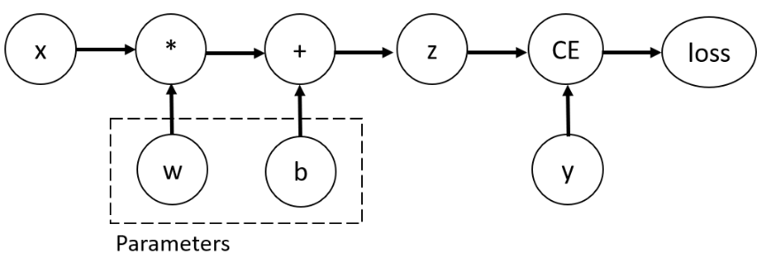
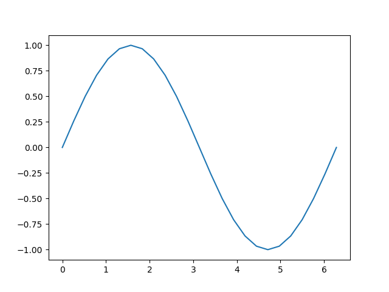
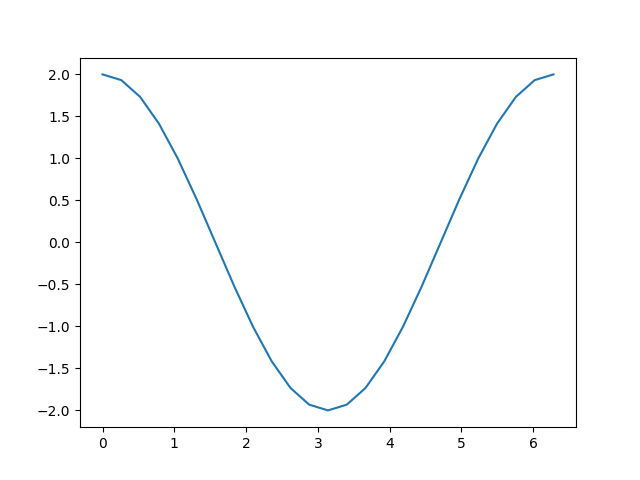

# 第四章 Pytorch自动微分

## 自动微分(autograd)

```python
标量是只有大小没有方向的量简单来说就是数字1,2,3,4,5，

在Python中，常用的标量类型包含字符串、数值、bool 

向量就是有大小有方向的值例如（1,2）

矩阵就是好几个向量简单来说就是[[1,2,3],[4,5,6],[7,8,9],[10,11,12]]

张量就是任何量，标量，向量，矩阵就是0、1、2阶的张量
```


torch.autograd提供实现任意标量值函数的自动微分的类和函数。声明Tensor时，使用 requires_grad = True 关键字来对梯度进行计算。 截至目前，仅支持浮点`Tensor`类型（half、float、double 和 bfloat16）和复杂`Tensor`类型（cfloat、cdouble）的 autograd。 

### backward

```python
torch.autograd.backward((tensors, 
                         grad_tensors=None, 
                         retain_graph=None, 
                         create_graph=False,
                         grad_variables=None, 
                         inputs=None)
```

计算给定张量相对于图叶的梯度总和，改图使用链式法则进行区分。如果其中任何一个tensors时非标量(即它们的数据具有多个元素)，并且需要梯度， 则将计算雅可比向量积，在这种情况下，该函数还需要指定`grad_tensors`. 它应该是一个匹配长度的序列，包含雅可比向量积中的“向量”，通常是对应张量的微分函数的梯度(`None`对于不需要梯度张量的所有张量都是可接受的值)。 


此函数在叶子中累积渐变需要在调用它之前将`.grad`属性归零或将它们设置为`None` ，当`inputs`提供并且给定的输入不是叶子时，当前的实现将调用它的 grad_fn(即使不是严格需要它来获得这个梯度)。 

参数：

-   **张量**（*序列* *[*[*张量*](https://pytorch.org/docs/stable/tensors.html#torch.Tensor)*]或*[*张量*](https://pytorch.org/docs/stable/tensors.html#torch.Tensor)）–将计算其导数的张量。
-   **grad_tensors** ( *Sequence* *[* [*Tensor*](https://pytorch.org/docs/stable/tensors.html#torch.Tensor) *or* [*None*](https://docs.python.org/3/library/constants.html#None) *] or* [*Tensor*](https://pytorch.org/docs/stable/tensors.html#torch.Tensor) *,* *optional* ) -- 雅可比向量积中的“向量”，通常是对应张量的每个元素的梯度。不能为标量张量或不需要 grad 的张量指定任何值。如果所有 grad_tensor 都可以接受 None 值，则此参数是可选的。
-   **retain_graph** ( [*bool*](https://docs.python.org/3/library/functions.html#bool) *,* *optional* ) -- 如果`False`是，用于计算 grad 的图将被释放。请注意，几乎在所有情况下`True` 都不需要将此选项设置为，并且通常可以以更有效的方式解决。默认为 的值`create_graph`。
-   **create_graph** ( [*bool*](https://docs.python.org/3/library/functions.html#bool) *,* *optional* ) -- 如果`True`是，将构造导数图，允许计算高阶导数产品。默认为`False`.
-   **输入**（*Sequence* *[* [*Tensor*](https://pytorch.org/docs/stable/tensors.html#torch.Tensor) *] 或*[*Tensor*](https://pytorch.org/docs/stable/tensors.html#torch.Tensor)*，**可选*）– 梯度将累积到的输入 wrt `.grad`。所有其他张量将被忽略。如果未提供，则梯度会累积到用于计算 attr::tensors 的所有叶张量中。

### grad 

```python
torch.autograd.grad(outputs, inputs, 
                    grad_outputs=None, 
                    retain_graph=None, 
                    create_graph=False,
                    only_inputs=True, 
                    allow_unused=False, 
                    is_grads_batched=False)
```

计算并返回输出相对于输入的梯度总和。`grad_outputs`应该是`output` 包含向量-雅可比乘积中的“向量”的长度匹配序列，通常是每个输出的预计算梯度。如果输出不需要_grad，则梯度可以是`None`)。

 `only_inputs`参数已弃用，现在被忽略（默认为`True`）。要为图形的其他部分累积梯度，请使用 `torch.autograd.backward`. 

参数：

-   **输出**（*张量序列*）——微分函数的输出。
-   **输入**（*张量序列*）——梯度将被返回（而不是累积到`.grad`）的输入。
-   **grad_outputs**（*张量序列*）——向量-雅可比积中的“向量”。通常每个输出都有梯度。不能为标量张量或不需要 grad 的张量指定任何值。如果所有 grad_tensor 都可以接受 None 值，则此参数是可选的。默认值：无。
-   **retain_graph** ( [*bool*](https://docs.python.org/3/library/functions.html#bool) *,* *optional* ) -- 如果`False`是，用于计算 grad 的图将被释放。请注意，几乎在所有情况下`True` 都不需要将此选项设置为，并且通常可以以更有效的方式解决。默认为 的值`create_graph`。
-   **create_graph** ( [*bool*](https://docs.python.org/3/library/functions.html#bool) *,* *optional* ) -- 如果`True`是，将构造导数图，允许计算高阶导数产品。默认值：`False`.
-   **allow_unused** ( [*bool*](https://docs.python.org/3/library/functions.html#bool) *,* *optional* ) – 如果`False`指定计算输出时未使用的输入（因此它们的 grad 始终为零）是错误的。默认为`False`.
-   **is_grads_batched** ( [*bool*](https://docs.python.org/3/library/functions.html#bool) *,* *optional* ) -- 如果`True`，每个张量的第一个维度`grad_outputs`将被解释为批处理维度。我们不是计算单个向量-雅可比积，而是为批次中的每个“向量”计算一批向量-雅可比积。我们使用 vmap 原型功能作为后端来向量化对 autograd 引擎的调用，以便可以在单个调用中执行此计算。与手动循环和多次向后执行相比，这应该会提高性能。请注意，由于此功能是实验性的，因此可能存在性能悬崖。如果您的用例存在警告，请用于`torch._C._debug_only_display_vmap_fallback_warnings(True)` 显示任何性能警告并在 github 上提交问题。默认为`False`.


| [`backward`](https://pytorch.org/docs/stable/generated/torch.autograd.backward.html#torch.autograd.backward) |  计算给定张量相对于图叶的梯度总和。  |
| :----------------------------------------------------------: | :----------------------------------: |
| [`grad`](https://pytorch.org/docs/stable/generated/torch.autograd.grad.html#torch.autograd.grad) | 计算并返回输出相对于输入的梯度总和。 |


## 梯度计算

局部禁用梯度计算

1、torch.autograd.no_grad

禁用梯度计算的上下文管理器。当确定不会调用`Tensor.backward()`. 它将减少原本需要 requires_grad=True的计算的内存消耗。

在这种模式下，每次计算的结果都会有 requires_grad=False，即使输入有requires_grad=True。这个上下文管理器是线程本地的；它不会影响其他线程中的计算。也起到装饰器的作用。（确保用括号实例化。）

```python
>>> x = torch.tensor([1.], requires_grad=True)
>>> with torch.no_grad():
...   y = x * 2

>>> y.requires_grad
False

>>> @torch.no_grad()
... def doubler(x):
...     return x * 2

>>> z = doubler(x)
>>> z.requires_grad
False
```


2、torch.autograd_enable_grad

支持梯度计算的上下文管理器。如果已通过[`no_grad`](https://pytorch.org/docs/stable/generated/torch.autograd.no_grad.html#torch.autograd.no_grad) 或禁用梯度计算，则启用梯度计算[`set_grad_enabled`](https://pytorch.org/docs/stable/generated/torch.autograd.set_grad_enabled.html#torch.autograd.set_grad_enabled)。

这个上下文管理器是线程本地的；它不会影响其他线程中的计算。也起到装饰器的作用。（确保用括号实例化。）

```python
>>> x = torch.tensor([1.], requires_grad=True)
>>> with torch.no_grad():
...   with torch.enable_grad():
...     y = x * 2

>>> y.requires_grad
True

>>> y.backward()
>>> x.grad
>>> @torch.enable_grad()
... def doubler(x):
...     return x * 2

>>> with torch.no_grad():
...     z = doubler(x)

>>> z.requires_grad
True
```


3、torch.autograd_set_grad_enabled

将梯度计算设置为打开或关闭的上下文管理器。`set_grad_enabled`将根据其参数启用或禁用 grads `mode`。它可以用作上下文管理器或函数。这个上下文管理器是线程本地的；它不会影响其他线程中的计算。


参数

-   **mode** ( [*bool*](https://docs.python.org/3/library/functions.html#bool) ) -- 标记是启用 grad ( `True`) 还是禁用 ( `False`)。这可用于有条件地启用渐变

```python
>>> x = torch.tensor([1.], requires_grad=True)
>>> is_train = False
>>> with torch.set_grad_enabled(is_train):
...   y = x * 2

>>> y.requires_grad
False

>>> torch.set_grad_enabled(True)
>>> y = x * 2
>>> y.requires_grad
True

>>> torch.set_grad_enabled(False)
>>> y = x * 2
>>> y.requires_grad
False
```


4、torch.autograd.inference_mode(mode = True)

启用或禁用推理模式的上下文管理器，InferenceMode 是一种新的上下文管理器，类似于[`no_grad`](https://pytorch.org/docs/stable/generated/torch.autograd.no_grad.html#torch.autograd.no_grad) 在您确定您的操作不会与 autograd 交互（例如模型训练）时使用。通过禁用视图跟踪和版本计数器碰撞，在此模式下运行的代码可以获得更好的性能。请注意，与其他一些在本地启用或禁用 grad 的机制不同，输入 inference_mode 也会禁用[前向模式 AD](https://pytorch.org/docs/stable/autograd.html#forward-mode-ad)。

这个上下文管理器是线程本地的；它不会影响其他线程中的计算。也起到装饰器的作用。（确保用括号实例化。）


参数

-   **mode** ( [*bool*](https://docs.python.org/3/library/functions.html#bool) ) -- 标记是启用还是禁用推理模式

```python
>>> import torch
>>> x = torch.ones(1, 2, 3, requires_grad=True)
>>> with torch.inference_mode():
...   y = x * x

>>> y.requires_grad
False

>>> y._version
Traceback (most recent call last):
File "<stdin>", line 1, in <module>
RuntimeError: Inference tensors do not track version counter.
    
>>> @torch.inference_mode()
... def func(x):
...   return x * x

>>> out = func(x)
>>> out.requires_grad
False
```

| [`no_grad`](https://pytorch.org/docs/stable/generated/torch.autograd.no_grad.html#torch.autograd.no_grad) |        禁用梯度计算的上下文管理器。        |
| :----------------------------------------------------------: | :----------------------------------------: |
| [`enable_grad`](https://pytorch.org/docs/stable/generated/torch.autograd.enable_grad.html#torch.autograd.enable_grad) |        支持梯度计算的上下文管理器。        |
| [`set_grad_enabled`](https://pytorch.org/docs/stable/generated/torch.autograd.set_grad_enabled.html#torch.autograd.set_grad_enabled) | 将梯度计算设置为打开或关闭的上下文管理器。 |
| [`inference_mode`](https://pytorch.org/docs/stable/generated/torch.autograd.inference_mode.html#torch.autograd.inference_mode) |      启用或禁用推理模式的上下文管理器      |


## autograd函数

1、 torch.autograd.Function( ** args* , *** kwargs* ) 

创建自定义autograd.Function的基类，要创建自定义autograd.Function，请对此类进行子类化并实现[`forward()`](https://pytorch.org/docs/stable/generated/torch.autograd.Function.forward.html#torch.autograd.Function.forward)和[`backward()`](https://pytorch.org/docs/stable/generated/torch.autograd.backward.html#torch.autograd.backward)静态方法。然后，要在前向传递中使用您的自定义操作，请调用类方法`apply`。

不要直接调用[`forward()`](https://pytorch.org/docs/stable/generated/torch.autograd.Function.forward.html#torch.autograd.Function.forward)。

为确保正确性和最佳性能，请确保您调用正确的方法`ctx`并使用 [`torch.autograd.gradcheck()`](https://pytorch.org/docs/stable/generated/torch.autograd.gradcheck.html#torch.autograd.gradcheck).

|          `torch.Tensor.grad`          | 这个属性是`None`默认的，并且在第一次调用[`backward()`](https://pytorch.org/docs/stable/generated/torch.autograd.backward.html#torch.autograd.backward)计算梯度时成为一个张量`self`。 |
| :-----------------------------------: | :----------------------------------------------------------: |
|     `torch.Tensor.requires_grad`      |        是否`True`需要为此张量计算梯度，`False`否则。         |
|        `torch.Tensor.is_leaf`         | 按照惯例，所有具有`requires_grad`is 的张量都`False`将是叶张量。 |
| `torch.Tensor.backward`（[坡度， …]） |                   计算当前张量 wrt 的梯度                    |
|         `torch.Tensor.detach`         |              返回一个新的张量，与当前图表分离。              |
|        `torch.Tensor.detach_`         |            从创建它的图中分离张量，使其成为叶子。            |
|  `torch.Tensor.register_hook`（钩）   |                      注册一个后向钩子。                      |
|     `torch.Tensor.retain_grad`()      | 使此张量能够[`grad`](https://pytorch.org/docs/stable/generated/torch.autograd.grad.html#torch.autograd.grad)在[`backward()`](https://pytorch.org/docs/stable/generated/torch.autograd.backward.html#torch.autograd.backward). |

```python
>>> class Exp(Function):
>>>     @staticmethod
>>>     def forward(ctx, i):
>>>         result = i.exp()
>>>         ctx.save_for_backward(result)
>>>         return result
>>>
>>>     @staticmethod
>>>     def backward(ctx, grad_output):
>>>         result, = ctx.saved_tensors
>>>         return grad_output * result
>>>
>>> # 通过调用apply方法使用它：
>>> output = Exp.apply(input)
```


2、 Function.forward( *ctx* , ** args* , *** kwargs* )  

执行操作。此函数将被所有子类覆盖。

它必须接受上下文 ctx 作为第一个参数，后跟任意数量的参数（张量或其他类型）。

上下文可用于存储任意数据，然后可以在反向传递期间检索这些数据。张量不应该直接存储在ctx上（尽管目前为了向后兼容还没有强制执行）。`ctx.save_for_backward()`相反，如果张量打算用于 `backward`（等价于`vjp`）或`ctx.save_for_forward()` 打算用于 in ，则应保存张量 `jvp`。


3、 Function.backward( *ctx* , ** grad_outputs* )  

定义一个公式，用于使用后向模式自动微分（vjp 函数的别名）对运算进行微分。

此函数将被所有子类覆盖。它必须接受一个上下文`ctx`作为第一个参数，然后是与[`forward()`](https://pytorch.org/docs/stable/generated/torch.autograd.Function.forward.html#torch.autograd.Function.forward)返回一样多的输出（对于 forward 函数的非张量输出，不会传入任何输出），并且它应该返回与 的输入一样多的张量 [`forward()`](https://pytorch.org/docs/stable/generated/torch.autograd.Function.forward.html#torch.autograd.Function.forward)。每个参数都是给定输出的梯度，每个返回值应该是对应输入的梯度。如果输入不是张量或者是不需要梯度的张量，则可以将 None 作为该输入的梯度传递。

上下文可用于检索前向传递期间保存的张量。它还有一个属性`ctx.needs_input_grad`作为布尔元组，表示每个输入是否需要梯度。例如， 如果第一个输入需要对输出进行梯度计算，[`backward()`](https://pytorch.org/docs/stable/generated/torch.autograd.backward.html#torch.autograd.backward)则将具有。`ctx.needs_input_grad[0] = True`[`forward()`](https://pytorch.org/docs/stable/generated/torch.autograd.Function.forward.html#torch.autograd.Function.forward)


4、 Function.jvp( *ctx* , ** grad_inputs* )  

定义使用正向模式自动微分对运算进行微分的公式。

此函数将被所有子类覆盖。它必须接受一个上下文`ctx`作为第一个参数，然后是与得到的一样多的输入[`forward()`](https://pytorch.org/docs/stable/generated/torch.autograd.Function.forward.html#torch.autograd.Function.forward)（对于 forward 函数的非张量输入，不会传入任何输入），并且它应该返回与输出一样多的张量 [`forward()`](https://pytorch.org/docs/stable/generated/torch.autograd.Function.forward.html#torch.autograd.Function.forward)。每个参数都是给定输入的梯度，每个返回值应该是对应输出的梯度。如果输出不是张量或函数相对于该输出不可微分，则可以将 None 作为该输入的梯度传递。

您可以使用该`ctx`对象将任何值从转发传递给此函数。

PyTorch的自动升级功能是使PyTorch在构建机器学习项目时灵活快速的部分原因。它允许在复杂的计算中快速轻松地计算多个偏导数(也称为梯度)，此操作是基于反向传播的神经网络学习的核心. 

`autograd` 的强大功能来自于它在运行时动态跟踪计算的事实，这意味着如果模型具有决策分支或循环，其长度在运行时之前未知，则计算仍将被正确跟踪，并且将获得正确的梯度以推动学习。与依赖于对结构更严格的模型进行静态分析来计算梯度的框架相比，它提供了更大的灵活性. 

## 自动区分

`TORCH.AUTOGRAD`， 在训练神经网络时，最常用的算法是 **反向传播**，此算法种，参数(模型权重) 根据损失函数相对于给定的梯度进行调整，为了计算梯度，Pytorch中内置微分引擎(torch.autograd)，它支持自动计算任何图形的梯度.

通过以下方式在Pytorch中定义：

```python
import torch

x = torch.ones(5)  # 输入张量
y = torch.zeros(3)  # 预期输出
w = torch.randn(5, 3, requires_grad=True)
b = torch.randn(3, requires_grad=True)
z = torch.matmul(x, w)+b
loss = torch.nn.functional.binary_cross_entropy_with_logits(z, y)
```

上述代码定义了以下的 **计算图**：

 

在这个网络中，需要优化参数Paramters(w，b)，因此需要计算损失函数相对于这些变量的梯度.在创建张量时，设置值为True,梯度过程将会被追踪(x.requires_grad_(True))，应用于张量以构造计算图的函数实际上是类的对象。此对象知道如何在正向方向上计算函数，以及如何在向后传播步骤中计算其导数。对向后传播函数的引用存储在张量的属性中。 

```python
print(f"Gradient function for z = {z.grad_fn}")
print(f"Gradient function for loss = {loss.grad_fn}")
```

输出：

```python
Gradient function for z = <AddBackward0 object at 0x7f0b0156d8d0>
Gradient function for loss = <BinaryCrossEntropyWithLogitsBackward0 object at 0x7f0b014a76d0>
```

## 计算梯度

为了优化神经网络中参数的权重，需要计算损失函数相对于参数的导数 $$\frac{\\∂loss}{\\∂w}和\frac{\\∂loss}{\\∂b}$$ 的一些固定值：

```python
loss.backward()
print(w.grad)
print(b.grad)
```

输出：

```python
tensor([[0.2397, 0.3227, 0.0753],
        [0.2397, 0.3227, 0.0753],
        [0.2397, 0.3227, 0.0753],
        [0.2397, 0.3227, 0.0753],
        [0.2397, 0.3227, 0.0753]])
tensor([0.2397, 0.3227, 0.0753])
```

①：当requires.grad设置为True时，将会获取计算图的节点属性，

②：当requires.grad没有设置时，将不会追踪计算图的节点属性

③：处于性能的原因，只能给定的图形上使用一次并执行梯度计算，如果要在同一个计算图上进行多次调用，则需要设置为retain_graph = True

## 禁止追踪

默认情况下，所有张量都具有跟踪其计算历史记录并支持梯度计算。但是，在某些情况下，不需要这样做，例如，当训练了模型并且只想将其应用于某些输入数据时，即只想通过网络进行正向计算。可以通过将计算代码与块包围来停止跟踪计算：   `requires_grad=True` ：开启追踪计算图，`torch.no_grad()`：不需要计算图追踪

```python
z = torch.matmul(x, w)+b
print(z.requires_grad)

with torch.no_grad():
    z = torch.matmul(x, w)+b
print(z.requires_grad)
```

输出：

```python
True
False
```

获得相同结果的另一种方法是在张量上使用该方法：`detach()` 

```python
z = torch.matmul(x, w)+b
z_det = z.detach()
print(z_det.requires_grad)
```

输出：

```python
False
```

**禁用渐变追踪的原因:**

-   将神经网络中的某些参数标记为**冻结参数**。这是[微调预训练网络的一](https://pytorch.org/tutorials/beginner/finetuning_torchvision_models_tutorial.html)个非常常见的方案
-    当只执行正向传递时，为了**加快计算速度**，因为对不跟踪梯度的张量进行计算会更有效 

## 计算图

从概念上讲，autograd 在由 [Function](https://pytorch.org/docs/stable/autograd.html#torch.autograd.Function) 对象组成的有向无环图 (DAG) 中保留数据（张量）和所有已执行操作（以及生成的新张量）的记录。在此 DAG 中，叶子是输入张量，根是输出张量。通过从根到叶跟踪此图，可以使用链式规则自动计算梯度。 

1、 在正向传递中，自动升级同时执行两项操作： 

-   运行请求的操作以计算生成的张量
-   在 DAG 中维护操作的梯度函数

2、反向传递在 DAG 根目录上调用时启动：`.backward()` `autograd`

-   计算每个的梯度`.grad_fn`
-   将它们累积在相应张量的属性中`.grad`
-   使用链规则，一直传播到叶张量。

**DAG 在 PyTorch 中是动态的注意点:  图形是从头开始重新创建的，每次调用后，自动升级开始填充新图形。这正是允许在模型中使用控制流语句的原因。如果需要，可以在每次迭代中更改形状，大小和操作。`.backward()` **

$$J= ⎝ ⎛  ∂x 1  ∂y 1   ⋮ ∂x 1  ∂y m    ⋯ ⋱ ⋯  ∂x n  ∂y 1   ⋮ ∂x n  ∂y m    ⎠ ⎞ $$


$$\vec{y}=f（\vec{x}） y  =f( x )\vec{x}=\langle x_1，\dots，x_n\rangle x =⟨x 1  ，...，x n  ⟩和\vec{y}=\langle y_1，\dots，y_m\rangle y  =⟨y 1  ，...，y m  ⟩$$

## 张量梯度

在许多情况下，我们有一个标量损失函数，需要计算相对于某些参数的梯度。但是，在某些情况下，输出函数是任意张量。在这种情况下，PyTorch 允许计算所谓的**雅可比积**，而不是实际的梯度。 

对于向量函数：$$\vec{y}=f（\vec{x}）$$ $$\vec{x}=\langle x_1，\dots，x_n\rangle x =⟨x 1  ，...，x n  ⟩和\vec{y}=\langle y_1，\dots，y_m\rangle y  =⟨y 1  ，...，y m  ⟩$$

 梯度$$\vec{y}$$关于$$\vec{x}$$由**雅可比矩阵**:


PyTorch不是计算雅可比矩阵本身，而是允许您计算**雅可比积** $$ v^T$$⋅*J*对于给定的输入向量$$ v=（v_1 ..... v_m）$$这是通过调用来实现的`backward`*v*作为参数。大小*v*应与原始张量的大小相同，要计算乘积： 

```python
inp = torch.eye(5, requires_grad=True)
out = (inp+1).pow(2)
out.backward(torch.ones_like(inp), retain_graph=True)
print(f"First call\n{inp.grad}")

out.backward(torch.ones_like(inp), retain_graph=True)
print(f"\nSecond call\n{inp.grad}")

inp.grad.zero_()
out.backward(torch.ones_like(inp), retain_graph=True)
print(f"\nCall after zeroing gradients\n{inp.grad}")
```

输出：

```python
First call
tensor([[4., 2., 2., 2., 2.],
        [2., 4., 2., 2., 2.],
        [2., 2., 4., 2., 2.],
        [2., 2., 2., 4., 2.],
        [2., 2., 2., 2., 4.]])

Second call
tensor([[8., 4., 4., 4., 4.],
        [4., 8., 4., 4., 4.],
        [4., 4., 8., 4., 4.],
        [4., 4., 4., 8., 4.],
        [4., 4., 4., 4., 8.]])

Call after zeroing gradients
tensor([[4., 2., 2., 2., 2.],
        [2., 4., 2., 2., 2.],
        [2., 2., 4., 2., 2.],
        [2., 2., 2., 4., 2.],
        [2., 2., 2., 2., 4.]])
```

注意，当使用相同的参数第二次调用时，梯度的值是不同的。发生这种情况是因为在进行传播时，PyTorch**会累积梯度**，即计算出的梯度值被添加到计算图的所有叶节点的属性中。如果要计算正确的梯度，则需要先将属性清零。在现实生活中的训练中，*优化器*可以做到这一点.

## 自动刻度

自动刻度过程分析：

机器学习模型是一个函数，具有输入和输出：

1、讨论：将输入 a 视为 *i* 维向量$$\vec{x}$$，包含元素$$x_{i}$$然后，可以将模型 *M* 表示为输入的向量值函数：$$\vec{y} = \vec{M}（\vec{x}）$$*y*=*M*(*x*).将 M 的输出值视为向量，因为模型可以具有任意数量的输出.

2、输出将是模型的损失。*损失函数* $$L（\vec{y}） = L（\vec{M}(\vec{x}））$$ 是模型输出的单值标量函数。此函数表示模型的预测与特定输入*的理想*输出的距离。

3、在训练模型时，希望将损失降至最低。在完美模型的理想化情况下，这意味着调整其学习权重：即函数的可调参数，使得所有输入的损失为零。在现实世界中，这意味着一个迭代过程：即推动学习权重，直到看到得到了各种各样的输入的可容忍的损失。 

4、如何决定将权重推到多远和哪个方向？希望将损失*最小化*，这意味着使其相对于输入的一阶导数等于 0：$$\frac{\\∂L}{\\∂x}= 0 $$.  损失不是直接*来自输入，而是模型输出的函数（直接输入的函数）$$\frac{\\∂L}{\\∂x}=\frac{\\∂L(\vec y)}{\\∂x}$$.

根据微分微积分的链式规则，有$$\frac{\\∂L}{\\∂x}=\frac{\\∂L(\vec y)}{\\∂x}$$ $$\frac{\\∂L}{\\∂x}$$

$$\frac{\\∂L}{\\∂x}$$是直接影响因素。如果再次使用链规则扩展表达式，模型输出相对于其输入的偏导数将涉及模型中每个乘法学习权重，每个激活函数和所有其他数学变换的许多局部偏导数。每个这样的偏导数的完整表达式是通过计算图的每个可能路径的局部梯度的乘积之和，该图以试图测量其梯度的变量结束

特别是，学习权重上的梯度：它们告诉改变每个权重的方向以使损失函数更接近于零。

由于此类局部导数的数量(每个导数对应于通过模型计算图的单独路径)将随着神经网络的深度呈指数级增长，因此计算它们的复杂性也是如此。这就是自动分级的用武之地：它跟踪每个计算的历史。PyTorch 模型中的每个计算张量都带有其输入张量和用于创建它的函数的历史记录。再加上旨在作用于张量的PyTorch函数每个函数都有一个用于计算自己的导数的内置实现，这大大加快了学习所需的局部导数的计算速度。

### 实践

首先，执行一些导入，以便绘制结果的图表： 

```python
# %matplotlib inline

import torch

import matplotlib.pyplot as plt
import matplotlib.ticker as ticker
import math
```

接下来，创建一个充满区间上均匀间隔值的输入张量$$[0， 2{\pi}$$]，然后指定与大多数创建张量的函数一样，接受可选选项。设置此标志意味着在随后的每次计算中，autograd 将在该计算的输出张量中累积计算历史记录。`requires_grad=True` `torch.linspace()` `requires_grad` 

```python
a = torch.linspace(0., 2. * math.pi, steps=25, requires_grad=True)
print(a)
```

输出：

```python
tensor([0.0000, 0.2618, 0.5236, 0.7854, 1.0472, 1.3090, 1.5708, 1.8326, 2.0944,
        2.3562, 2.6180, 2.8798, 3.1416, 3.4034, 3.6652, 3.9270, 4.1888, 4.4506,
        4.7124, 4.9742, 5.2360, 5.4978, 5.7596, 6.0214, 6.2832],
       requires_grad=True)
```

执行计算，并根据其输入绘制其输出： 

```python
b = torch.sin(a)
plt.plot(a.detach(), b.detach())
```

  

输出：

```python
[<matplotlib.lines.Line2D object at 0x7f6291c6b390>]
```

查看张量 ，当打印它时，看到一个指标，它正在跟踪其计算历史：`b` 

```python
print(b)
```

```python
tensor([ 0.0000e+00,  2.5882e-01,  5.0000e-01,  7.0711e-01,  8.6603e-01,
         9.6593e-01,  1.0000e+00,  9.6593e-01,  8.6603e-01,  7.0711e-01,
         5.0000e-01,  2.5882e-01, -8.7423e-08, -2.5882e-01, -5.0000e-01,
        -7.0711e-01, -8.6603e-01, -9.6593e-01, -1.0000e+00, -9.6593e-01,
        -8.6603e-01, -7.0711e-01, -5.0000e-01, -2.5882e-01,  1.7485e-07],
       grad_fn=<SinBackward0>)
```

这给了一个提示，当执行反向传播步骤和计算梯度时，需要计算`grad_fn` $$（x）$$ 对于所有这些张量的输入，再执行一些计算：

```python
c = 2 * b
print(c)

d = c + 1
print(d)
```

输出：

```python
tensor([ 0.0000e+00,  5.1764e-01,  1.0000e+00,  1.4142e+00,  1.7321e+00,
         1.9319e+00,  2.0000e+00,  1.9319e+00,  1.7321e+00,  1.4142e+00,
         1.0000e+00,  5.1764e-01, -1.7485e-07, -5.1764e-01, -1.0000e+00,
        -1.4142e+00, -1.7321e+00, -1.9319e+00, -2.0000e+00, -1.9319e+00,
        -1.7321e+00, -1.4142e+00, -1.0000e+00, -5.1764e-01,  3.4969e-07],
       grad_fn=<MulBackward0>)
tensor([ 1.0000e+00,  1.5176e+00,  2.0000e+00,  2.4142e+00,  2.7321e+00,
         2.9319e+00,  3.0000e+00,  2.9319e+00,  2.7321e+00,  2.4142e+00,
         2.0000e+00,  1.5176e+00,  1.0000e+00,  4.8236e-01, -3.5763e-07,
        -4.1421e-01, -7.3205e-01, -9.3185e-01, -1.0000e+00, -9.3185e-01,
        -7.3205e-01, -4.1421e-01,  4.7684e-07,  4.8236e-01,  1.0000e+00],
       grad_fn=<AddBackward0>)
```

最后，计算一个单元素输出。当调用没有参数的张量时，它期望调用张量仅包含单个元素，就像计算损失函数时的情况一样。`.backward()` 

```python
out = d.sum()
print(out)
```

输出：

```python
tensor(25., grad_fn=<SumBackward0>)
```

每个都与张量一起存储，允许将计算一直引导回其属性的输入。可以在下面看到，向下钻取这个属性显示了所有先前张量的梯度函数。这表示这是函数的输入，没有自己的历史记录。`grad_fn` `next_functions` `d` `a.grad_fn``None` 

```python
d:
<AddBackward0 object at 0x7f6291cd5d50>
((<MulBackward0 object at 0x7f6291cd58d0>, 0), (None, 0))
((<SinBackward0 object at 0x7f6291cd58d0>, 0), (None, 0))
((<AccumulateGrad object at 0x7f6291cd5110>, 0),)
()

c:
<MulBackward0 object at 0x7f6291cd5590>

b:
<SinBackward0 object at 0x7f6291cd58d0>

a:
None
```

有了所有这些机制，如何将衍生品拿出来？在输出上调用该方法，并检查输入的属性以检查渐变：`backward()` `grad` 

  

输出：

```python
tensor([ 2.0000e+00,  1.9319e+00,  1.7321e+00,  1.4142e+00,  1.0000e+00,
         5.1764e-01, -8.7423e-08, -5.1764e-01, -1.0000e+00, -1.4142e+00,
        -1.7321e+00, -1.9319e+00, -2.0000e+00, -1.9319e+00, -1.7321e+00,
        -1.4142e+00, -1.0000e+00, -5.1764e-01,  2.3850e-08,  5.1764e-01,
         1.0000e+00,  1.4142e+00,  1.7321e+00,  1.9319e+00,  2.0000e+00])

[<matplotlib.lines.Line2D object at 0x7f6290e0e6d0>]
```

采取过的计算步骤：

```python
a = torch.linspace(0., 2. * math.pi, steps=25, requires_grad=True)
b = torch.sin(a)
c = 2 * b
d = c + 1
out = d.sum()
```

添加一个常量，就像计算一样，不会改变导数。那留下`d`c = 2 * b = 2 * 在（a）*c*=2∗*b*=2∗*在*（*a*)，其导数应为2 * cos（a）2∗*cos*（*a*).看看上面的图表，这就是所看到的 

请注意的是，只有计算的叶节点才会计算其梯度。例如，如果尝试过，则会返回。在这个简单的示例中，只有输入是叶节点，因此只有它计算了梯度。`print(c.grad)` `None` 

## 自动降级

定义一个小模型，并检查它在单个训练批次后如何变化。首先，定义一些常量、模型以及输入和输出：

```python
BATCH_SIZE = 16
DIM_IN = 1000
HIDDEN_SIZE = 100
DIM_OUT = 10

class TinyModel(torch.nn.Module):

    def __init__(self):
        super(TinyModel, self).__init__()

        self.layer1 = torch.nn.Linear(1000, 100)
        self.relu = torch.nn.ReLU()
        self.layer2 = torch.nn.Linear(100, 10)

    def forward(self, x):
        x = self.layer1(x)
        x = self.relu(x)
        x = self.layer2(x)
        return x

some_input = torch.randn(BATCH_SIZE, DIM_IN, requires_grad=False)
ideal_output = torch.randn(BATCH_SIZE, DIM_OUT, requires_grad=False)

model = TinyModel()
```

不指定模型的层，在子类中，假设想要跟踪图层权重上的梯度以进行学习。`requires_grad=True` `torch.nn.Module`

如果查看模型的层，可以检查权重的值，并验证尚未计算出梯度：

```python
print(model.layer2.weight[0][0:10]) # 切片
print(model.layer2.weight.grad)
```

输出：

```python
tensor([-0.0587,  0.0621, -0.0318, -0.0649, -0.0334, -0.0053,  0.0794,  0.0523,
        -0.0532, -0.0393], grad_fn=<SliceBackward0>)
None
```

当运行一个训练批次时，这种情况是如何变化的。对于损失函数，只使用欧几里得距离的平方，将使用一个基本的随机梯度下降优化器.

```python
optimizer = torch.optim.SGD(model.parameters(), lr=0.001)

prediction = model(some_input)

loss = (ideal_output - prediction).pow(2).sum()
print(loss)
```

输出：

```python
tensor(151.6438, grad_fn=<SumBackward0>)
```

调用并查看会发生什么：`loss.backward()` 

```python
loss.backward()
print(model.layer2.weight[0][0:10])
print(model.layer2.weight.grad[0][0:10])
```

输出：

```python
tensor([-0.0587,  0.0621, -0.0318, -0.0649, -0.0334, -0.0053,  0.0794,  0.0523,
        -0.0532, -0.0393], grad_fn=<SliceBackward0>)
tensor([ 6.5515,  3.1655, -2.0966,  1.2618, -1.1805,  4.0281, -0.8114,  0.6809,
        -2.2763,  2.2602])
```

可以看到，已经为每个学习权重计算了梯度，但权重保持不变，因为尚未运行优化器。优化程序负责根据计算的梯度更新模型权重.

```python
optimizer.step()
print(model.layer2.weight[0][0:10])
print(model.layer2.weight.grad[0][0:10])
```

输出：

```python
tensor([-0.0653,  0.0589, -0.0297, -0.0662, -0.0322, -0.0093,  0.0802,  0.0517,
        -0.0510, -0.0416], grad_fn=<SliceBackward0>)
tensor([ 6.5515,  3.1655, -2.0966,  1.2618, -1.1805,  4.0281, -0.8114,  0.6809,
        -2.2763,  2.2602])
```

 layer2权重已经改变. 调用后，否则每次运行时，学习权重上的梯度都会累积：`optimizer.step()` `optimizer.zero_grad()` `loss.backward()` 

```python
print(model.layer2.weight.grad[0][0:10])

for i in range(0, 5):
    prediction = model(some_input)
    loss = (ideal_output - prediction).pow(2).sum()
    loss.backward()

print(model.layer2.weight.grad[0][0:10])

optimizer.zero_grad()

print(model.layer2.weight.grad[0][0:10])
```

输出：

```python
tensor([ 6.5515,  3.1655, -2.0966,  1.2618, -1.1805,  4.0281, -0.8114,  0.6809,
        -2.2763,  2.2602])
tensor([ 30.8026,  16.2615, -10.2112,  10.8270, -11.2397,  16.2089,  -8.4943,
         -9.6266, -16.9751,  -1.1449])
tensor([0., 0., 0., 0., 0., 0., 0., 0., 0., 0.])
```

运行上面的单元格后，可看到，在多次运行后，大多数梯度的量级将大得多。如果在运行下一个训练批次之前未能将梯度归零，将导致梯度以这种方式爆炸，从而导致不正确和不可预测的学习结果. 

## 打开刻度

在某些情况下，需要对是否启用自动分级进行细粒度控制。有多种方法可以做到这一点，具体取决于具体情况。最简单的方法是直接更改张量上的标志：

```python
a = torch.ones(2, 3, requires_grad=True)
print(a)

b1 = 2 * a
print(b1)

a.requires_grad = False
b2 = 2 * a
print(b2)
```

输出：

```python
tensor([[1., 1., 1.],
        [1., 1., 1.]], requires_grad=True)
tensor([[2., 2., 2.],
        [2., 2., 2.]], grad_fn=<MulBackward0>)
tensor([[2., 2., 2.],
        [2., 2., 2.]])
```

在上面的单元格中，看到它有一个（即跟踪的计算历史），这是所期望的，因为它是从张量派生的已经打开了autograd。当显式关闭 自动升级 时，将不再跟踪计算历史记录，就像在计算时看到的. 

如果只需要暂时关闭自动分级，更好的方法是使用：`torch.no_grad()` 

```python
a = torch.ones(2, 3, requires_grad=True) * 2
b = torch.ones(2, 3, requires_grad=True) * 3

c1 = a + b
print(c1)

with torch.no_grad():
    c2 = a + b

print(c2)

c3 = a * b
print(c3)
```

输出：

```python
tensor([[5., 5., 5.],
        [5., 5., 5.]], grad_fn=<AddBackward0>)
tensor([[5., 5., 5.],
        [5., 5., 5.]])
tensor([[6., 6., 6.],
        [6., 6., 6.]], grad_fn=<MulBackward0>)
```

`torch.no_grad()`也可以用作函数或方法装饰器：
```python
def add_tensors1(x, y):
    return x + y

@torch.no_grad()
def add_tensors2(x, y):
    return x + y


a = torch.ones(2, 3, requires_grad=True) * 2
b = torch.ones(2, 3, requires_grad=True) * 3

c1 = add_tensors1(a, b)
print(c1)

c2 = add_tensors2(a, b)
print(c2)
```

输出：

```python
tensor([[5., 5., 5.],
        [5., 5., 5.]], grad_fn=<AddBackward0>)
tensor([[5., 5., 5.],
        [5., 5., 5.]])
```

有一个相应的上下文管理器，用于在尚未打开自动刻度时将其打开。它也可以用作装饰器。`torch.enable_grad()` 最后，可能有一个需要梯度跟踪的张量，但需要一个不需要的副本。为此，有对象的方法，它创建从计算历史记录*中分离的*张量的副本：`Tensor` `detach()`

```python
x = torch.rand(5, requires_grad=True)
y = x.detach()

print(x)
print(y)
```

输出：

```python
tensor([0.1062, 0.9442, 0.1957, 0.9032, 0.6612], requires_grad=True)
tensor([0.1062, 0.9442, 0.1957, 0.9032, 0.6612])
```

## 刻度探查器

自动分级详细跟踪计算的每个步骤。这样的计算历史，结合计时信息，将形成一个方便的刻画器，Autograd具有该功能。下面是一个快速用法示例： 

```python
device = torch.device('cpu')
run_on_gpu = False
if torch.cuda.is_available():
    device = torch.device('cuda')
    run_on_gpu = True

x = torch.randn(2, 3, requires_grad=True)
y = torch.rand(2, 3, requires_grad=True)
z = torch.ones(2, 3, requires_grad=True)

with torch.autograd.profiler.profile(use_cuda=run_on_gpu) as prf:
    for _ in range(1000):
        z = (z / x) * y

print(prf.key_averages().table(sort_by='self_cpu_time_total'))
```

输出：

```python
---------------------------  ------------  ------------  ------------  ------------  ------------  ------------  ------------  ------------  ------------  ------------
                       Name    Self CPU %      Self CPU   CPU total %     CPU total  CPU time avg     Self CUDA   Self CUDA %    CUDA total  CUDA time avg    # of Calls
---------------------------  ------------  ------------  ------------  ------------  ------------  ------------  ------------  ------------  ------------  ------------
                  aten::div        48.63%       3.512ms        48.63%       3.512ms       3.512us       6.845ms        50.35%       6.845ms       6.845us          1000
                  aten::mul        47.77%       3.450ms        47.77%       3.450ms       3.450us       6.751ms        49.65%       6.751ms       6.751us          1000
    cudaGetDeviceProperties         3.24%     234.000us         3.24%     234.000us     234.000us       0.000us         0.00%       0.000us       0.000us             1
      cudaDeviceSynchronize         0.36%      26.000us         0.36%      26.000us      26.000us       0.000us         0.00%       0.000us       0.000us             1
         cudaGetDeviceCount         0.00%       0.000us         0.00%       0.000us       0.000us       0.000us         0.00%       0.000us       0.000us             1
---------------------------  ------------  ------------  ------------  ------------  ------------  ------------  ------------  ------------  ------------  ------------
Self CPU time total: 7.222ms
Self CUDA time total: 13.596ms
```

探查器还可以标记各个代码子块，按输入张量形状分解数据，以及将数据导出为 Chrome 跟踪工具文件

如果有一个具有 n 维输入和 m 维输出的函数，$$\vec{y}=f（\vec{x}）$$ 完全梯度是每个输出相对于每个输入的导数的矩阵，称为*雅可比矩阵：* 


