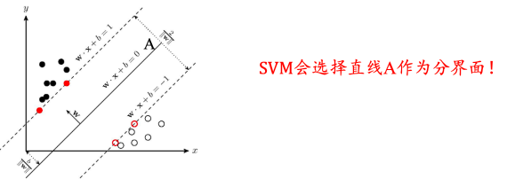
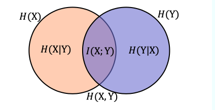

# 第零章 前言·术语库

## 术语库

1、人工智能

利用数学计算机或者数字计算机控制的机器模拟，延申和扩展人的智能。感知环境，获取知识并使用知识获得最佳结果的理论、方法、技术及应用系统。

2、强人工智能

认为有可能制造出真正竜推理和解决问题的智能机器，这样的机器被认为是有自主意识的

3、弱人工智能

认为不可能制造出能真正进行推理和解决问题提的智能机器，这些机器只不过看起来像智能，但是并不是真正的用于智能，也不具有自主意识

4、超级人工智能

机器的智能彻底超过了人类，“奇点” 2050年到来？

5、人工智能三次浪潮

6、机器学习(Machine Learning )

指让计算机具有像人一样的学习和思考能力的技术的总称。具体来说是从已知数据中获取规律，并利用规律来对位置数据进行预测的技术。

也是计算机科学和统计学的交叉学科，基本目标是学习一个x->y的函数（映射），来做分类或者回归的工作。之所以经常和数据挖掘合在一起讲是因为现在好多数据挖掘的工作是通过机器学习提供的算法工具实现的，例如广告的ctr预估，PB级别的点击日志在通过典型的机器学习流程可以得到一个预估模型，从而提高互联网广告的点击率和回报率；个性化推荐，还是通过机器学习的一些算法分析平台上的各种购买，浏览和收藏日志，得到一个推荐模型，来预测你喜欢的商品。

7、深度学习(Deep Learning)

深度学习是机器学习的一个分支领域：它是从数据中学习表示的一种新方法，强调从连续的层(layer)中进行学习，这些层对应于越来越有意义的表示

深度：指一系列连续的表示层，数据模型中包含多少层。

8、数据挖掘(Data mining)

指从大量的数据中通过算法搜索隐藏于其中信息的过程。

9、监督学习(Supervised Learning)

给定一组样本(通常由人工标注)，它可以学会将输入数据映射到已知目标[也叫标注(annotation)]。 

10、无监督学习(Unsupervised Learning)

指在没有目标的情况下寻找输入数据的有趣变换，其目的在于数据可视化、 数据压缩、数据去噪或更好地理解数据中的相关性， 降维(dimensionality  reduction)和聚类(clustering)都是众所周知的无监督学习方法 

11、自监督学习(Self-Supervised Learning)

自监督学习是监督学习的一个特例，它与众不同，值得单独归为一类。自监督学习是没有 人工标注的标签的监督学习，可以将它看作没有人类参与的监督学习。标签仍然存在(因为总要有什么东西来监督学习过程)，但它们是从输入数据中生成的，通常是使用启发式算法生成的

自编码器(autoencoder)是有名的自监督学习的例子，其生成的目标就是未经修改的输入 

12、强化学习(Reinforcement Learning)

在强化学习中，智能体(agent)接收有关其环境的信息，并学会选择使某种奖励最大化的行动。 例如，神经网络会“观察”视频游戏的屏幕并输出游戏操作，目的是尽可能得高分，这种神经网络可以通过强化学习来训练 

13、机器学习可以做如下两种分类

-   有监督学习：代表任务“分类”和“回归”
-   无监督学习：代表任务“聚类”和“降维”

14、序列生成(sequence generation)

给定一张图像，预测描述图像的文字

15、语法树预测(syntax tree prediction)

给定一个句子，预测其分解生成的语法树 

16、目标检测(object detection)

给定一张图像，在图中特定目标的周围画一个边界框

17、图像分割(image segmentation)

给定一张图像，在特定物体上画一个像素级的掩模(mask) 

**分类&回归术语**

18、样本(sample)或输入(input)

进入模型的数据点

19、预测(prediction)或输出(output)

从模型出来的结果

20、目标(target)：

真实值。对于外部数据源，理想情况下，模型应该能够预测出目标

21、预测误差(prediction error)或损失值(loss value)

模型预测与目标之间的距离

22、类别(class)

分类问题中供选择的一组标签。例如，对猫狗图像进行分类时，“狗” 和“猫”就是两个类别

23、标签(label)

分类问题中类别标注的具体例子。比如，如果 1234 号图像被标注为 包含类别“狗”，那么“狗”就是 1234 号图像的标签 

24、真值(ground-truth)或标注(annotation)

数据集的所有目标，通常由人工收集

25、二分类(binary classification)

一种分类任务，每个输入样本都应被划分到两个互斥的类别中

26、多分类(multiclass classification)

一种分类任务，每个输入样本都应被划分到两个以上的类别中，比如手写数字分类。 

27、多标签分类(multilabel classification)

一种分类任务，每个输入样本都可以分配多 个标签。举个例子，如果一幅图像里可能既有猫又有狗，那么应该同时标注“猫” 标签和“狗”标签。每幅图像的标签个数通常是可变的

28、标量回归(scalar regression)

目标是连续标量值的任务。预测房价就是一个很好的例子，不同的目标价格形成一个连续的空间。 

29、向量回归(vector regression)

目标是一组连续值(比如一个连续向量)的任务。如 果对多个值(比如图像边界框的坐标)进行回归，那就是向量回归

30、小批量(mini-batch)或批量(batch)

模型同时处理的一小部分样本(样本数通常 为 8~128)。样本数通常取 2 的幂，这样便于 GPU 上的内存分配。训练时，小批量 用来为模型权重计算一次梯度下降更新。 

31、数据集

观测样本的集合。具体地，$𝐷={𝑥_1,𝑥_2,⋯,𝑥_𝑛}$ 表示一个包含*n*个样本的数据集，其中 $𝑥_𝑖$ 是一个向量，表示数据集的第𝑖个样本，其维度𝑑称为样本空间的维度 

向量 $𝑥_𝑖$ 的元素称为样本的特征，其取值可以是连续的，也可以是离散的。从数据集中学出模型的过程，便称为“学习”或“训练”。 

32、 训练集(Trainingset）

用于模型拟合的数据样本 

33、验证集(Validation set)

是模型训练过程中单独留出的样本集，它可以用于调整模型的超参数和用于对模型的能力进行初步评估 

34、测试集(Testset)

用来评估模最终模型的泛化能力。但不能作为调参、选择特征等算法相关的选择的依据 

**误差分析**

35、 误差

指算法实际预测输出与样本真实输出之间的差异 

-   模型在训练集上的误差称为“训练误差”
-   模型在总体样本上的误差称为“泛化误差”
-   模型在测试集上的误差称为“测试误差”

36、过拟合

指模型能很好地拟合训练样本，而无法很好地拟合测试样本的现象，从而导致泛化性能下降。为防止“过拟合”，可以选择减少参数、降低模型复杂度、正则化等 

37、欠拟合

指模型还没有很好地训练出数据的一般规律，模型拟合程度不高的现象。为防止“欠拟合”，可以选择调整参数、增加迭代深度、换用更加复杂的模型等 

**泛化误差分析**

假设数据集上需要预测的样本为Y，特征为X，潜在模型为 $Y=f(X)+ε$，其中$ε \sim N(0,σ*ε)$是噪声，估计的模型为$\hat{f}(X)$. $$ \begin{array}{l}\operatorname{Err}(\hat{f})=\mathrm{E}\left[(Y-\hat{f}(\mathrm{X}))^{2}\right] \ \operatorname{Err}(\hat{f})=\mathrm{E}\left[(f(X)+\varepsilon-\hat{f}(\mathrm{X}))^{2}\right] \ \operatorname{Err}(\hat{f})=\mathrm{E}\left[(f(X)-\hat{f}(\mathrm{X}))^{2}+2 \varepsilon(f(X)-\hat{f}(\mathrm{X}))+\varepsilon^{2}\right] \ \operatorname{Err}(\hat{f})=\mathrm{E}\left[(E(\hat{f}(\mathrm{X}))-f(X)+\hat{f}(\mathrm{X})-E(\hat{f}(\mathrm{X})))^{2}\right]+\sigma*{\varepsilon}^{2} \ \operatorname{Err}(\hat{f})=\mathrm{E}[(E(\hat{f}(\mathrm{X}))-f(X))]^{2}+\mathrm{E}\left[(\hat{f}(\mathrm{X})-E(\hat{f}(\mathrm{X})))^{2}\right]+\sigma_{\varepsilon}^{2} \ \operatorname{Err}(\hat{f})=\operatorname{Bias}^{2}(\hat{f})+\operatorname{Var}(\hat{f})+\sigma_{\varepsilon}^{2}\end{array} $$ 

38、偏差(bias)

反映了模型在 样本上的期望输出与真实 标记之间的差距，即模型本身的精准度，反映的是模型本身的拟合能力。 

39、 方差(variance)

反映了模型在不同训练数据集下学得的函数的输出与期望输出之间的误差，即模型的稳定性，反应的是模型的波动情况 

40、欠拟合：高偏差低方差

-   寻找更好的特征，提升对数据的刻画能力
-   增加特征数量
-   重新选择更加复杂的模型

41、过拟合：低偏差高方差

-   增加训练样本数量
-   减少特征维数，高维空间密度小
-   加入正则化项，使得模型更加平滑

42、交叉验证

基本思路：将训练集划分为K份，每次采用其中K-1份作为训练集， 另外一份作为验证集，在训练集上学得函数后，然后在验证集上计 算误差---K折交叉验证

-   K折重复多次，每次重复中产生不同的分割
-   留一交叉验证(Leave-One-Out)

**有监督学习**

43、有监督学习

-   数据集有标记(答案)
-   数据集通常扩展为$(𝑥_𝑖,𝑦_𝑖)$，其中$𝑦_𝑖∈Y$是 $𝑥_𝑖$ 的标记，$Y$ 是所有标记的集合，称为“标记空间”或“输出空间”
-   监督学习的任务是训练出一个模型用于预测 $𝑦$ 的取值，根据 $𝐷={(𝑥_1,𝑦_1 ),(𝑥_2,𝑦_2),⋯, (𝑥_𝑛,𝑦_𝑛)}$，训练出函数𝑓，使得$𝑓(𝑥)≅𝑦$
-   若预测的值是离散值，如年龄，此类学习任务称为“分类”
-   若预测的值是连续值，如房价，此类学习任务称为“回归”

44、线性回归

线性回归是在样本属性和标签中找到一个线性关系的方法，根据训练数据找到一个线性模型，使得模型产生的预测值与样本标 签的差距最小。

若用 $𝑥*𝑖^𝑘$ 表示第𝑘个样本的第𝑖个属性，则线性模型一般形式为： $$ f(x^k) = w_1x_1^k+w_2x_2^k+\cdots+w_mx_m^k+b = \sum*{i=1}^m w_ix_i^k+b $$ 线性回归学习的对象就是权重向量𝑤和偏置向量𝑏。

如果用最小均方 误差来衡量预测值与样本标签的差距，

那么线性回归学习的目标可以表示为： $$ (w^*,b^*) = argmin_{(w,b)}\sum_{k = 1}^n(f(x^k)-y^k)^2 = argmin_{(w,b)}\sum_{k = 1}^n(w^Tx^k+b-y^k)^2 $$

45、逻辑回归

逻辑回归是利用𝑠𝑖𝑔𝑚𝑜𝑖𝑑函数，将线性回归产生的预测值压缩到0和1之间。此时将𝑦视作样本为正例的可能性，

注意，逻辑回归本质上属于分类算法，sigmoid函数的具体表达形式为：$$ g(x) = \frac{1}{1+e^{-x}} $$. 

46、支持向量机

支持向量机是有监督学习中最具有影响力的方法之一，是基于线性判别函数的一种模型。

SVM基本思想：对于线性可分的数据，能将训练样本划分开的超平 面有很多，于是我们寻找“位于两类训练样本正中心的超平面”， 即margin最大化。从直观上看，这种划分对训练样本局部扰动的承 受性最好。事实上，这种划分的性能也表现较好

以**线性分类**为例：二类可分数据集 $𝐷 ={ (𝑥_1 ,𝑦_1) ,(𝑥_2 ,𝑦_2 ),⋯,(𝑥_n ,𝑦_n )}$ , 其中 $y=1$ 和 $y= -1$ 分别表示两类样本，定义分类的超平面 $f(x)=w^Tx+b$（决策边界 decision boundary) ， “最合适”的分类标准就是使得超平面距离两边数据的间隔最大。

记 $\gamma$ 为样本 x 到超平面的距离，那么有 $$ x = x_0 + \gamma \frac{w}{|w|} \ \gamma = \frac{w^Tx + b}{|w|} = \frac{f(x)}{w} $$ 目标函数： $$ \arg \max_{w,b} \arg \min_{x_i \in D} \frac{|w^Tx_i+b|}{\sqrt{\sum_{i = 1}^dw_i^2}} \s.t. \forall x_i \in D,y_i(w^Tx_i+b)\geq 0 $$ 通常为方便优化，我们选择加强约束条件：$\forall x_i \in D,|w^Tx_i+b| \geq 1$.

那么，原问题可以近似为： $$ \arg \min_{w,b} \frac{1}{2}\sum_{i = 1}^d w_i^2\s.t. \forall x_i \in D,|w^Tx_i+b| \geq 1 $$ 对于线性不可分的数据集，我们可以做下面的操作

-   特征空间存在超曲面(hypersurface)将正类和负类分开
-   核函数(kernelfunction)
    -   使用非线性函数将非线性可分问题从原始的特征空间映射至更高维
    -   决策边界的超平面表示为 $w^T \phi(x)+b = 0$.
    -   定义映射函数的内积为核函数 $K(X_i,x_j) = \phi(x_i)^T \phi(x_j)$.

47、决策树

决策树是一种基于树结构进行决策的机器学习方法，这恰是人类面临决策 时一种很自然的处理机制。

-   在这些树的结构里，叶子节点给出类标而内部节点代表某个属性；
-   例如，银行在面对是否借贷给客户的问题时，通常会进行一系列的决 策。银行会首先判断:客户的信贷声誉是否良好?良好的话，再判断 客户是否有稳定的工作? 不良好的话，可能直接拒绝，也可能判断客户是否有可抵押物?......这种思考过程便是决策树的生成过程。

决策树的生成过程中，最重要的因素便是根节点的选择，即选择哪种特征作为决策因素：ID3算法使用信息增益作为准则

48、随机森林

-   集成学习(Ensemblelearning)
    -   组合多个弱监督模型以期得到一个更好更全面的强监督模型，集成学 习潜在的思想是即便某一个弱分类器得到了错误的预测，其他的弱分 类器也可以将错误纠正回来。
-   随机森林用随机的方式建立起一棵棵决策树，然后由这些决策树组成 一个森林，其中每棵决策树之间没有关联，当有一个新的样本输入 时，就让每棵树独立的做出判断，按照多数原则决定该样本的分类 结果。

**随机森林构建的基本步骤**

-   随机有放回地从训练集中的抽取*m*个训练样本,训练集 $D_t$.
-   从 $D_t$ 对应的特征属性中随机选择部分特征，构建决策树
-   重复上述步骤构建多个决策树

**预测步骤**

-   向建立好的随机森林中输入一个新样本
-   随机森林中的每棵决策树都独立的做出判断
-   将得到票数最多的分类结果作为该样本最终的类别

**无监督学习**

49、[无监督学习](https://datawhalechina.github.io/unusual-deep-learning/#/03.机器学习基础?id=无监督学习)

-   数据集没有标记信息(自学)
-   聚类：我们可以使用无监督学习来预测各样本之间的关联度，把关 联度大的样本划为同一类，关联度小的样本划为不同类，这便是 “聚类”
-   降维：我们也可以使用无监督学习处理数据，把维度较高、计算复 杂的数据，转化为维度低、易处理、且蕴含的信息不丢失或较少丢 失的数据，这便是“降维”

50、聚类

聚类的目的是将数据分成多个类别，在同一个类内，对象(实体)之间具 有较高的相似性，在不同类内，对象之间具有较大的差异。

对一批没有类别标签的样本集，按照样本之间的相似程度分类，相似的归为一类，不相似的归为其它类。这种分类称为聚类分析，也 称为无监督分类

常见方法有K-Means聚类、均值漂移聚类、基于密度的聚类等

**K-means**聚类是一个反复迭代的过程，算法分为四个步骤：

1.  选取数据空间中的K个对象作为初始中心，每个对象代表一个聚 类中心；
2.  对于样本中的数据对象，根据它们与这些聚类中心的欧氏距离， 按距离最近的准则将它们分到距离它们最近的聚类中心(最相似) 所对应的类；
3.  更新聚类中心:将每个类别中所有对象所对应的均值作为该类别 的聚类中心，计算目标函数的值；
4.  判断聚类中心和目标函数的值是否发生改变，若不变，则输出结 果，若改变，则返回2)。

51、降维

降维的目的就是将原始样本数据的维度𝑑降低到一个更小的数𝑚，且尽量使得样本蕴含信息量损失最小，或还原数据时产生的误差最小。比如主成分分析法...

降维的优势：

-   数据在低维下更容易处理、更容易使用；
-   相关特征，特别是重要特征更能在数据中明确的显示出来；
-   如果只有二维或者三维的话，能够进行可视化展示；
-   去除数据噪声，降低算法开销等。

**数学基础**

52、矩阵(matrix)

是一个二维数组，其中的每一个元素一般由两个索引来确定一般用大写变量表示，m行n列的实数矩阵，记做$A \in R_{m \times n}$. 

53、张量(Tensor)：

是矢量概念的推广，可用来表示在一些矢量、标量和其他张量之间的线性关系的多线性函数。标量是0阶张量，矢量是一阶张量，矩阵是二阶张量，三维及以上数组一般称为张量 

54、矩阵的秩(rank)

矩阵列向量中的极大线性无关组的数目，记作矩阵的列秩，同样可以定义行秩。行秩=列秩=矩阵的秩，通常记作rank(A) 

55、矩阵的逆

-   若矩阵A为方阵，当 $rank(A_{n×n})<n$时，称A为奇异矩阵或不可逆矩阵
-   若矩阵A为方阵，当 $rank(A_{n×n})=n$时，称A为非奇异矩阵或可逆矩阵

其逆矩阵 $A^{-1}$ 满足以下条件，则称 $A^{-1}$ 为矩阵A的逆矩阵： $$ AA^{-1} = A^{-1}A = I_n $$ 其中 $I_n$ 是 $n×n$ 的单位阵

56、矩阵的广义逆矩阵

-   如果矩阵不为方阵或者是奇异矩阵，不存在逆矩阵，但是可以计算其广义逆矩阵或者伪逆矩阵
-   对于矩阵A，如果存在矩阵 $B$ 使得 $ABA=A$，则称 $B$ 为 $A$ 的广义逆矩阵

57、矩阵分解

矩阵分解有特征分解和奇异值分解。

先提一下矩阵的特征值和特征向量的定义

-   若矩阵 $A$ 为方阵，则存在非零向量 $x$ 和常数 $\lambda$ 满足 $Ax=\lambda x$，则称 $ \lambda$ 为矩阵 $ A$ 的一个特征值，$x$ 为矩阵 $A$ 关于 $\lambda$ 的特征向量。
-   $A_{n \times n}$ 的矩阵具有 $n$ 个特征值，$λ_1 ≤ λ_2 ≤ ⋯ ≤ λ_n$ 其对应的*n*个特征向量为 $𝒖_1，𝒖_2， ⋯ ，𝒖_𝑛$
-   矩阵的迹(trace)和行列式(determinant)的值分别为

$$ \operatorname{tr}(\mathrm{A})=\sum_{i=1}^{n} \lambda_{i} \quad|\mathrm{~A}|=\prod_{i=1}^{n} \lambda_{i} $$

**矩阵特征分解**：$A_{n \times n}$ 的矩阵具有 $n$ 个不同的特征值，那么矩阵A可以分解为 $A = U\Sigma U^{T}$.

其中 $\Sigma=\left[\begin{array}{cccc}\lambda_{1} & 0 & \cdots & 0 \ 0 & \lambda_{2} & \cdots & 0 \ 0 & 0 & \ddots & \vdots \ 0 & 0 & \cdots & \lambda_{n}\end{array}\right] \quad \mathrm{U}=\left[\boldsymbol{u}*{1}, \boldsymbol{u}*{2}, \cdots, \boldsymbol{u}*{n}\right] \quad \left|\boldsymbol{u}*{i}\right|_{2}=1$ .

**奇异值分解**：对于任意矩阵 $A_{m \times n}$，存在正交矩阵 $U_{m \times m}$ 和 $V_{n \times n}$，使其满足 $A = U \Sigma V^{T} \quad U^T U = V^T V = I$，则称上式为矩阵 $A$ 的特征分解

58、随机变量(Random variable)

是随机事件的数量表现，随机事件数量化的好处是可以用数学分析的方法来研究随机现象 

随机变量可以是离散的或者连续的，离散随机变量是指拥有有限个或者可列无限多个状态的随机变量，连续随机变量是指变量值不可随机列举出来的随机变量，一般取实数值。

随机变量通常 **用概率分布来指定它的每个状态的可能性** 。

举例：

1.  投掷一枚硬币为正面是离散型随机事件X，发生概率P(X=1)=0.5
2.  每次射箭距离靶心的距离X可以认为连续型随机变量，距离靶心小 于1cm的概率P(X<1cm)

59、伯努利分布

-   伯努利试验：只可能有两种结果的单次随机实验
-   又称0-1分布，单个二值型离散随机变量的分布
-   其概率分布：$P*(*X=1)=p,P(X=0)=1-p$.

60、二项分布

-   二项分布即重复*n*次伯努利试验，各试验之间都相互独立
-   如果每次试验时，事件发生的概率为*p*，不发生的概率为1-p，则*n*次重复独立试验中事件发生*k*次的概率为

$$ P(X = k) = C_n^kp^k(1-p)^{n-k} $$

61、均匀分布

均匀分布，又称矩形分布，在给定长度间隔[*a*,*b*]内的分布概率是等可能的，均匀分布由参数*a*，*b*定义，

概率密度函数为： $$ p(x) = \frac{1}{b-a}, \quad a < x <b $$ 

62、高斯分布

高斯分布，又称正态分布(normal)，是实数中最常用的分布，由均值*μ*和标准差*σ*决定其分布

概率密度函数为： $$ p(x) = \frac{1}{\sqrt{2 \pi}\sigma}e^{-\frac{(x-\mu)^2}{2 \sigma^2}} $$ 

63、指数分布

常用来表示独立随机事件发生的时间间隔，参数为λ>0的指数

分布概率密度函数为：$p(x) = \lambda e^{-\lambda x} \quad x \geq 0$. 

指数分布重要特征是无记忆性

64、条件概率(Conditional probability)

事件X在事件Y发生的条件下发生的概率，P(X|Y)

65、联合概率Joint probability

表示两个事件X和Y共同发生的概率，P(X,Y)

条件概率和联合概率的性质：$P(Y|X) = \frac{P(Y,X)}{P(X)} \quad P(X ) > 0$.

推广到 n 个事件，条件概率的链式法则： $$ \begin{aligned} P\left(X_{1}, X_{2}, \ldots, X_{n}\right) &=P\left(X_{1} \mid X_{2}, \ldots, X_{n}\right) P\left(X_{2} \mid X_{3}, X_{4}, \ldots, X_{n}\right) \ldots P\left(X_{n-1} \mid X_{n}\right) P\left(X_{n}\right) \ &=P\left(X_{n}\right) \prod_{i=1}^{n-1} P\left(X_{i} \mid X_{i+1}, \ldots, X_{n}\right) \end{aligned} $$

66、先验概率(Prior probability)

根据以往经验和分析得到的概率，在事件发生前已知，它往往作为“由因求果”问题中的“因”出现。

67、 后验概率**(Posterior probability

指得到“结果”的信息后重新修正的概率，是“执果寻因”问题中 的“因”，后验概率是基于新的信息，修正后来的先验概率所获得 的更接近实际情况的概率估计 

举例说明：一口袋里有3只红球、2只白球，采用不放回方式摸取，求: (1) 第一次摸到红球(记作A)的概率; (2) 第二次摸到红球(记作B)的概率; (3) 已知第二次摸到了红球，求第一次摸到的是红球的概率?

解：

(1) $P(A=1) = 3/5$， 这就是先验概率; 

(2) $P(B=1) = P(A=1) P(B=1|A=1)+ P(A=0)P(B=1|A=0)=\frac{3}{5}\frac{2}{4}+\frac{2}{5}\frac{3}{4} = \frac{3}{5}$ (3) $P(A=1|B=1) = \frac{P(A = 1)P(B = 1|A = 1)}{P(B = 1)} = \frac{1}{2}$， 这就是后验概率

68、全概率公式

设事件${A_i}$是样本空间 $Ω$ 的一个划分，且$P(A_i)>0(i=1,2,...,n)$，那么：$P(B) = \sum_{i = 1}^nP(A_i)P(B|A_i)$.

69、贝叶斯公式：

全概率公式给提供了计算后验概率的途径，即贝叶斯公式 $$ P\left(\mathrm{~~A}_{i} \mid \mathrm{B}\right)=\frac{P\left(\mathrm{~~B} \mid \mathrm{A}*{i}\right) P\left(\mathrm{~A}*{i}\right)}{P(\mathrm{~~B})}=\frac{P\left(\mathrm{~~B} \mid \mathrm{A}*{i}\right) P\left(\mathrm{~A}*{i}\right)}{\sum_{j=1}^{n} P\left(\mathrm{~~A}_{j}\right) P\left(\mathrm{~~B} \mid \mathrm{A}_{j}\right)} $$

70、方差

 用来衡量随机变量与数学期望之间的偏离程度。统计中的方差则为样本方差，是各个样本数据分别与其平均数之差 的平方和的平均数，

计算过程为：

衡量这组数据的波动大小，并把它叫做这组数据的方差。方差越小就越稳定

71、协方差

衡量两个随机变量X和Y直接的总体误差，计算过程为：

72、熵(Entropy)

信息熵，可以看作是样本集合纯度一种指标，也可以认为是样本集合包含的平均信息量。

假定当前样本集合X中第*i*类样本 $𝑥_𝑖$ 所占的比例为$P(𝑥*𝑖)(i=1,2,...,n)$，

则X的信息熵定义为： H(X)的值越小，则X的纯度越高，蕴含的不确定性越少

73、联合熵

两个随机变量X和Y的联合分布可以形成联合熵，度量二维随机变量XY的不确定性： $$ H(X, Y) = -\sum_{i = 1}^n \sum_{j = 1}^n P(x_i,y_j)\log_2 P(x_i,y_j) $$

74、条件熵

在随机变量X发生的前提下，随机变量Y发生带来的熵，定义为Y的条件熵，用H(Y|X)表示，

定义为： 

$$ H(Y|X) = \sum_{i = 1}^n P(x_i)H(Y|X = x_i) = -\sum_{i = 1}^n P(x_i) \sum_{j = 1}^n P(y_j|x_i)\log_2 P(y_j|x_i)= -\sum_{i = 1}^n \sum_{j = 1}^n P(x_i,y_j) \log_2 P(y_j|x_i) $$

条件熵用来衡量在已知随机变量X的条件下，随机变量Y的不确定。 熵、联合熵和条件熵之间的关系：

$H(Y|X) = H(X,Y)-H(X)$.

75、互信息

 $$ I(X;Y) = H(X)+H(Y)-H(X,Y) $$ 

76、相对熵

相对熵又称KL散度，是描述两个概率分布P和Q差异的一种方法，记做D(P||Q)。在信息论中，D(P||Q)表示用概率分布Q来拟合真实分布P时，产生的信息表达的损耗，其中P表示信源的真实分布，Q表示P的近似分布。

-   离散形式：$D(P||Q) = \sum P(x)\log \frac{P(x)}{Q(x)}$.
-   连续形式：$D(P||Q) = \int P(x)\log \frac{P(x)}{Q(x)}$.

77、交叉熵

一般用来求目标与预测值之间的差距，深度学习中经常用到的一类损失函数度量，

比如在对抗生成网络( GAN )中 $$ D(P||Q) = \sum P(x)\log \frac{P(x)}{Q(x)} = \sum P(x)\log P(x) - \sum P(x)\log Q(x) =-H(P(x)) -\sum P(x)\log Q(x) $$ 

交叉熵：$H(P,Q) = -\sum P(x)\log Q(x)$.

78、最小二乘估计

最小二乘估计又称最小平方法，是一种数学优化方法。它通过最小化误差的平方和寻找数据的最佳函数匹配。

最小二乘法经常应用于回归问题，可以方便地求得未知参数，比如曲线拟合、最小化能量或者最大化熵等问题

**神经网络**

79、神经元(MP)

在M-P模型中，神经元接受其他n个神经元的输入信号(0或1)，这些输入信号经过权重加权并求和，将求和结果与阈值(threshold) *θ* 比较，然后经过激活函数处理，得到神经元的输出。 $$ y=f\left(\sum_{i=1}^{n} \omega_{i j} x_{i}-\theta\right) $$ M-P 模型可以表示多种逻辑运算，如取反运算、逻辑或、逻辑与 

-   取反运算可以用单输入单输出模型表示，即如果输入为0则输出1，如果输入为1则输出0。
-   由M-P模型的运算规则可得 $w = -2， θ = -1$.

-   逻辑或与逻辑与运算可以用双输入单输出模型表示。以逻辑与运算为例， $w_1=1，w_2=1, θ =1.5$ 

80、网络结构

人工神经网络由神经元模型构成，这种由许多神经元组成的信息处理网络具有并行分布结构 

  

其中圆形节点表示一个神经元，方形节点表示一组神经元。 

81、单层感知器

1958 年，罗森布拉特( Roseblatt )提出了感知器，与 M-P 模型需 要人为确定参数不同，感知器能够通过训练自动确定参数。训练方式为有监督学习，即需要设定训练样本和期望输出，然后调整实际输出和期望输出之差的方式(误差修正学习)。 $$ \begin{aligned} w_{i} & \leftarrow w_{i}+\alpha(r-y) x \ \theta & \leftarrow \theta-\alpha(r-y) \end{aligned} $$ 其中，$\alpha$ 是学习率，$r$ 和 $y$ 分别是期望输出和实际输出。

感知器权重调整的基本思路：

-   实际输出 y 与期望输出 r 相等时，w 和 θ 不变
-   实际输出 y 与期望输出 r 不相等时，调整 w 和 θ 的值

$$ \begin{aligned} w_{i} & \leftarrow w_{i}+\alpha(r-y) x \ \theta & \leftarrow \theta-\alpha(r-y) \end{aligned} $$

  

感知器模型的训练过程 

  

82、多层感知器

单层感知器只能解决线性可分问题，而不能解决线性不可分问题；为了解决线性不可分问题，需要使用多层感知器 

  

多层感知器指的是由多层结构的感知器递阶组成的输入值向前传播的网络，也被称为前馈网络或正向传播网络。

以三层结构的多层感知器为例，它由输入层、中间层及输出层组成

-   与M-P模型相同，中间层的感知器通过权重与输入层的各单元相连接，通过阈值函数计算中间层各单元的输出值
-   中间层与输出层之间同样是通过权重相连接

  

83、BP算法

多层感知器的训练使用误差反向传播算法(Error Back Propagation)，即BP算法。BP算法最早有沃博斯于1974年提出，鲁梅尔哈特等人进一步发展了该理论 

基本过程：

-   前向传播计算：由输入层经过隐含层向输出层的计算网络输出
-   误差反向逐层传递:网络的期望输出与实际输出之差的误差信号由输出层经过隐含层逐层向输入层传递
-   由“前向传播计算”与“误差反向逐层传递”的反复进行的网络训练 过程

BP算法就是通过比较实际输出和期望输出得到误差信号，把误差信 号从输出层逐层向前传播得到各层的误差信号，再通过调整各层的连接权重以减小误差。权重的调整主要使用梯度下降法： $$ \Delta w = -\alpha \frac{\partial E}{\partial w} $$

84、激活函数

通过误差反向传播算法调整多层感知器的连接权重时

-   M-P 模型中使用阶跃函数作为激活函数，只能输出 0或 1，不连续所以 不可导
-   为了使误差能够传播，鲁梅尔哈特等人提出使用可导函数Sigmoid作为激活函数

  

 Sigmoid函数的导数：$\frac{df(u)}{du} = f(u)(1-f(u))$ 

  

 ReLU (Rectified Linear Unit，修正线性单元) 和tanh

  

BP算法案例

以包含一个中间层和一个输出单元 $y$ 的多层感知器为例：$w_{1ij}$ 表示输 入层与中间层之间的连接权重，$w_{2j1}$ 表示中间层与输出层之间的连接权重， $i$ 表示输入层单元，$j$ 表示中间层单元 

  

-   首先调整中间层与输出层之间的连接权重，其中 $y=f(u)$， $f$ 是激活函数，$u_{21} = \sum_{j = 1}^{m}w_{2j1}z_j$，把误差函数 E 对连接权重$w_{2j1}$ 的求导展开成复合函数求导：

$$ \begin{array}{c}\frac{\partial E}{\partial w_{2 j 1}} =\frac{\partial E}{\partial y} \frac{\partial y}{\partial u_{21}} \frac{\partial u_{21}}{\partial w_{2 j 1}} \ =-(r-y) y(1-y) z_{j}\end{array} $$

这里 $z_j$ 表示的是中间层的值。

-   第二，中间层到输出层的连接权重调整值如下所示：

$$ \Delta w_{2 j 1}=\alpha(r-y) y(1-y) z_{j} $$

-   第三，调整输入层与中间层之间的连接权重

$$ \begin{aligned} \frac{\partial E}{\partial w_{1 i j}} &=\frac{\partial E}{\partial y} \frac{\partial y}{\partial u_{21}} \frac{\partial u_{21}}{\partial w_{1 i j}} \ &=-(r-y) y(1-y) \frac{\partial u_{21}}{\partial w_{1 i j}} \end{aligned} $$

**中间层到输出层**

  

 **输入层到中间层** 

  

优化问题：

**难点**

-   参数过多，影响训练
-   非凸优化问题：即存在局部最优而非全局最优解，影响迭代
-   梯度消失问题，下层参数比较难调
-   参数解释起来比较困难

**需求**

-   计算资源要大
-   数据要多
-   算法效率要好：即收敛快

84、 非凸优化问题

  

85、梯度消失问题

  

86、K折验证

K 折验证（K-fold validation）将数据划分为大小相同的 K 个分区。对于每个分区 i，在剩 余的 K-1 个分区上训练模型，然后在分区 i 上评估模型。最终分数等于 K 个分数的平均值。对 于不同的训练集 - 测试集划分，如果模型性能的变化很大，那么这种方法很有用。与留出验证 一样，这种方法也需要独立的验证集进行模型校正。 

87、特征工程(Feature Engineering)

指将数据输入模型之前，利用自己关于数据和机器学习算法(这里指神经网络)的知识对数据进行硬编码的变换(不是模型学到的)，以改善模型的 效果。多数情况下，一个机器学习模型无法从完全任意的数据中进行学习。呈现给模型的数据应该便于模型进行学习。 

88、 优化(optimization)

指调节模型以在训 练数据上得到最佳性能(即机器学习中的学习)

89、 泛化(generalization)

指训练好的模型在 前所未见的数据上的性能好坏 

优化和泛化是相关的：训练数据上的损失越小，测试数据上的损失也越小 

90、 奥卡姆剃刀(Occam’s razor)原理

如果一件事情有两种解释，那么最可能正确的解释就是最简单的那个，即假设更少的那个。这个原理也适用于神经网络学到的模型：给定一些训练数据和一种网络架构，很多组权重值(即很多模型)都可以解释这些数据。简单模型比复杂模型更不容易过拟合。  

91、特征提取

使用之前网络学到的表示来从新样本中提取出有趣的特征。然后将这些特征输入一个新的分类器，从头开始训练。 

92、标记(token)

将文本分解而成的单元(单词、字符或 n-gram)

93、分词(tokenization)

将文本分解成标记的过程

94、n-gram

从一个句子中提取的 N 个(或更少)连续单词的集合 

95、one-hot编码

one-hot 编码是将标记转换为向量的最常用、最基本的方法。 它将每个单词与一个唯一的整数索引相关联， 然后将这个整数索引 i 转换为长度为 N 的二进制向量（N 是词表大小），这个向量只有第 i 个元 素是 1，其余元素都为 0。 

96、SimpleRNN层

 一种是返回每 个时间步连续输出的完整序列，即形状为 (batch_size, timesteps, output_features) 的三维张量；另一种是只返回每个输入序列的最终输出，即形状为 (batch_size, output_ features) 的二维张量。这两种模式由 return_sequences 这个构造函数参数来控制。我们 来看一个使用 SimpleRNN 的例子，它只返回最后一个时间步的输出。 

97、LSTM层

LSTM 层是 SimpleRNN 层的一种变体，它增加了一种携带信息跨越多个时间步的方法。假 设有一条传送带，其运行方向平行于你所处理的序列。序列中的信息可以在任意位置跳上传送带， 然后被传送到更晚的时间步，并在需要时原封不动地跳回来。这实际上就是 LSTM 的原理：它 保存信息以便后面使用，从而防止较早期的信号在处理过程中逐渐消失。 

98、循环 dropout(recurrent dropout)

这是一种特殊的内置方法，在循环层中使用 dropout 来降低过拟合

99、堆叠循环层(stacking recurrent layers)

这会提高网络的表示能力(代价是更高的计算负荷)

100、双向循环层(bidirectional recurrent layer)

将相同的信息以不同的方式呈现给循环网络， 可以提高精度并缓解遗忘问题 

101、droput

即将某一层的输入单元随机设为 0，其目的是打破该层训练数据中的偶然相关性。 增加网络容量的通常做法是增加每层单元数或增加层数。循环层堆叠(recurrent layer  stacking)是构建更加强大的循环网络的经典方法 

102、 损失函数(loss function)

能够量化⽬标的实际值与预测值之间的差距。通常会选择⾮负数作为损失，且数值越⼩表⽰损失越⼩， 完美预测时的损失为0。 